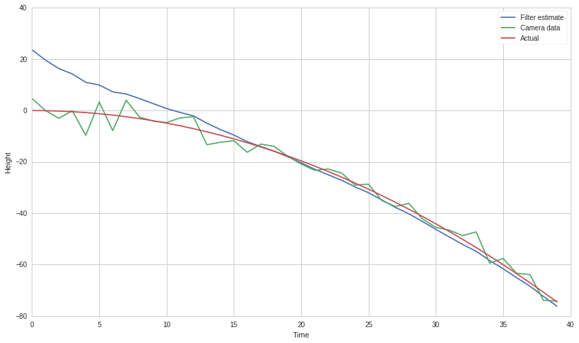
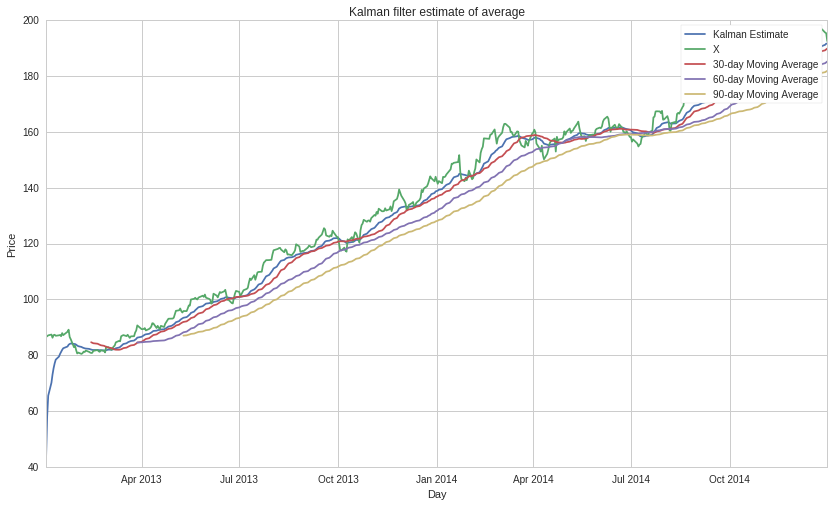
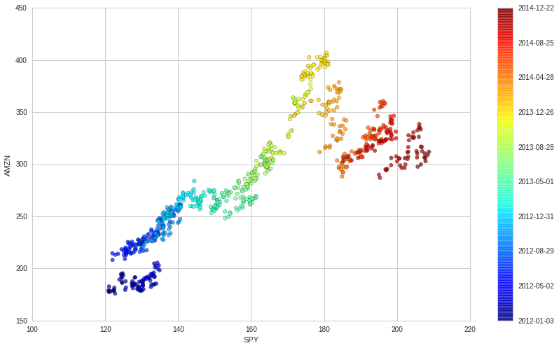
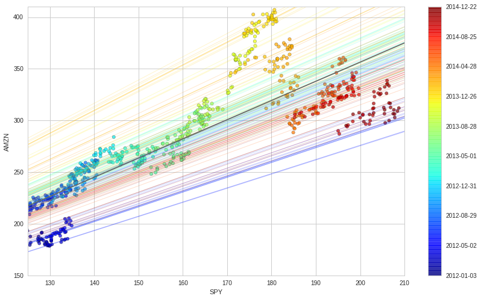

#Kalman Filters

By Evgenia “Jenny” Nitishinskaya, Dr. Aidan O’Mahony, and Delaney
Granizo-Mackenzie. Algorithms by David Edwards.

Kalman Filter Beta Estimation Example from `Dr. Aidan O’Mahony’s
blog. <http://www.thealgoengineer.com/2014/online_linear_regression_kalman_filter/>`__

Part of the Quantopian Lecture Series:

-  `www.quantopian.com/lectures <https://www.quantopian.com/lectures>`__
-  `github.com/quantopian/research_public <https://github.com/quantopian/research_public>`__

--------------

##What is a Kalman Filter?

The Kalman filter is an algorithm that uses noisy observations of a
system over time to estimate the parameters of the system (some of which
are unobservable) and predict future observations. At each time step, it
makes a prediction, takes in a measurement, and updates itself based on
how the prediction and measurement compare.

The algorithm is as follows: 1. Take as input a mathematical model of
the system, i.e. \* the transition matrix, which tells us how the system
evolves from one state to another. For instance, if we are modeling the
movement of a car, then the next values of position and velocity can be
computed from the previous ones using kinematic equations.
Alternatively, if we have a system which is fairly stable, we might
model its evolution as a random walk. If you want to read up on Kalman
filters, note that this matrix is usually called :math:`A`. \* the
observation matrix, which tells us the next measurement we should expect
given the predicted next state. If we are measuring the position of the
car, we just extract the position values stored in the state. For a more
complex example, consider estimating a linear regression model for the
data. Then our state is the coefficients of the model, and we can
predict the next measurement from the linear equation. This is denoted
:math:`H`. \* any control factors that affect the state transitions but
are not part of the measurements. For instance, if our car were falling,
gravity would be a control factor. If the noise does not have mean 0, it
should be shifted over and the offset put into the control factors. The
control factors are summarized in a matrix :math:`B` with time-varying
control vector :math:`u_t`, which give the offset :math:`Bu_t`. \*
covariance matrices of the transition noise (i.e. noise in the evolution
of the system) and measurement noise, denoted :math:`Q` and :math:`R`,
respectively. 2. Take as input an initial estimate of the state of the
system and the error of the estimate, :math:`\mu_0` and
:math:`\sigma_0`. 3. At each timestep: \* estimate the current state of
the system :math:`x_t` using the transition matrix \* take as input new
measurements :math:`z_t` \* use the conditional probability of the
measurements given the state, taking into account the uncertainties of
the measurement and the state estimate, to update the estimated current
state of the system :math:`x_t` and the covariance matrix of the
estimate :math:`P_t`

`This
graphic <https://upload.wikimedia.org/wikipedia/commons/a/a5/Basic_concept_of_Kalman_filtering.svg>`__
illustrates the procedure followed by the algorithm.

It’s very important for the algorithm to keep track of the covariances
of its estimates. This way, it can give us a more nuanced result than
simply a point value when we ask for it, and it can use its confidence
to decide how much to be influenced by new measurements during the
update process. The more certain it is of its estimate of the state, the
more skeptical it will be of measurements that disagree with the state.

By default, the errors are assumed to be normally distributed, and this
assumption allows the algorithm to calculate precise confidence
intervals. It can, however, be implemented for non-normal errors.

.. code:: ipython2

    # Import a Kalman filter and other useful libraries
    from pykalman import KalmanFilter
    import numpy as np
    import pandas as pd
    import matplotlib.pyplot as plt
    from scipy import poly1d

Toy example: falling ball
=========================

Imagine we have a falling ball whose motion we are tracking with a
camera. The state of the ball consists of its position and velocity. We
know that we have the relationship
:math:`x_t = x_{t-1} + v_{t-1}\tau - \frac{1}{2} g \tau^2`, where
:math:`\tau` is the time (in seconds) elapsed between :math:`t-1` and
:math:`t` and :math:`g` is gravitational acceleration. Meanwhile, our
camera can tell us the position of the ball every second, but we know
from the manufacturer that the camera accuracy, translated into the
position of the ball, implies variance in the position estimate of about
3 meters.

In order to use a Kalman filter, we need to give it transition and
observation matrices, transition and observation covariance matrices,
and the initial state. The state of the system is (position, velocity),
so it follows the transition matrix

.. math::

    \left( \begin{array}{cc}
   1 & \tau \\
   0 & 1 \end{array} \right) 

with offset :math:`(-\tau^2 \cdot g/2, -\tau\cdot g)`. The observation
matrix just extracts the position coordinate, (1 0), since we are
measuring position. We know that the observation variance is 1, and
transition covariance is 0 since we will be simulating the data the same
way we specified our model. For the inital state, let’s feed our model
something bogus like (30, 10) and see how our system evolves.

.. code:: ipython2

    tau = 0.1
    
    # Set up the filter
    kf = KalmanFilter(n_dim_obs=1, n_dim_state=2, # position is 1-dimensional, (x,v) is 2-dimensional
                      initial_state_mean=[30,10],
                      initial_state_covariance=np.eye(2),
                      transition_matrices=[[1,tau], [0,1]],
                      observation_matrices=[[1,0]],
                      observation_covariance=3,
                      transition_covariance=np.zeros((2,2)),
                      transition_offsets=[-4.9*tau**2, -9.8*tau])

.. code:: ipython2

    # Create a simulation of a ball falling for 40 units of time (each of length tau)
    times = np.arange(40)
    actual = -4.9*tau**2*times**2
    
    # Simulate the noisy camera data
    sim = actual + 3*np.random.randn(40)
    
    # Run filter on camera data
    state_means, state_covs = kf.filter(sim)

.. code:: ipython2

    plt.plot(times, state_means[:,0])
    plt.plot(times, sim)
    plt.plot(times, actual)
    plt.legend(['Filter estimate', 'Camera data', 'Actual'])
    plt.xlabel('Time')
    plt.ylabel('Height');

At each point in time we plot the state estimate after accounting for
the most recent measurement, which is why we are not at position 30 at
time 0. The filter’s attentiveness to the measurements allows it to
correct for the initial bogus state we gave it. Then, by weighing its
model and knowledge of the physical laws against new measurements, it is
able to filter out much of the noise in the camera data. Meanwhile the
confidence in the estimate increases with time, as shown by the graph
below:

.. code:: ipython2

    # Plot variances of x and v, extracting the appropriate values from the covariance matrix
    plt.plot(times, state_covs[:,0,0])
    plt.plot(times, state_covs[:,1,1])
    plt.legend(['Var(x)', 'Var(v)'])
    plt.ylabel('Variance')
    plt.xlabel('Time');

.. image:: notebook_files/notebook_8_0.png

The Kalman filter can also do smoothing, which takes in all of the input
data at once and then constructs its best guess for the state of the
system in each period post factum. That is, it does not provide online,
running estimates, but instead uses all of the data to estimate the
historical state, which is useful if we only want to use the data after
we have collected all of it.

.. code:: ipython2

    # Use smoothing to estimate what the state of the system has been
    smoothed_state_means, _ = kf.smooth(sim)
    
    # Plot results
    plt.plot(times, smoothed_state_means[:,0])
    plt.plot(times, sim)
    plt.plot(times, actual)
    plt.legend(['Smoothed estimate', 'Camera data', 'Actual'])
    plt.xlabel('Time')
    plt.ylabel('Height');

.. image:: notebook_files/notebook_10_0.png

Example: moving average
=======================

Because the Kalman filter updates its estimates at every time step and
tends to weigh recent observations more than older ones, a particularly
useful application is estimation of rolling parameters of the data. When
using a Kalman filter, there’s no window length that we need to specify.
This is useful for computing the moving average if that’s what we are
interested in, or for smoothing out estimates of other quantities. For
instance, if we have already computed the moving Sharpe ratio, we can
smooth it using a Kalman filter.

Below, we’ll use both a Kalman filter and an n-day moving average to
estimate the rolling mean of a dataset. We hope that the mean describes
our observations well, so it shouldn’t change too much when we add an
observation; therefore, we assume that it evolves as a random walk with
a small error term. The mean is the model’s guess for the mean of the
distribution from which measurements are drawn, so our prediction of the
next value is simply equal to our estimate of the mean. We assume that
the observations have variance 1 around the rolling mean, for lack of a
better estimate. Our initial guess for the mean is 0, but the filter
quickly realizes that that is incorrect and adjusts.

.. code:: ipython2

    # Load pricing data for a security
    start = '2013-01-01'
    end = '2015-01-01'
    x = get_pricing('LMT', fields='price', start_date=start, end_date=end)
    
    # Construct a Kalman filter
    kf = KalmanFilter(transition_matrices = [1],
                      observation_matrices = [1],
                      initial_state_mean = 0,
                      initial_state_covariance = 1,
                      observation_covariance=1,
                      transition_covariance=.01)
    
    # Use the observed values of the price to get a rolling mean
    state_means, _ = kf.filter(x.values)
    state_means = pd.Series(state_means.flatten(), index=x.index)
    
    # Compute the rolling mean with various lookback windows
    mean30 = x.rolling(window = 30).mean()
    mean60 = x.rolling(window = 60).mean()
    mean90 = x.rolling(window = 90).mean()
    
    # Plot original data and estimated mean
    plt.plot(state_means)
    plt.plot(x)
    plt.plot(mean30)
    plt.plot(mean60)
    plt.plot(mean90)
    plt.title('Kalman filter estimate of average')
    plt.legend(['Kalman Estimate', 'X', '30-day Moving Average', '60-day Moving Average','90-day Moving Average'])
    plt.xlabel('Day')
    plt.ylabel('Price');

This is a little hard to see, so we’ll plot a subsection of the graph.

.. code:: ipython2

    plt.plot(state_means[-200:])
    plt.plot(x[-200:])
    plt.plot(mean30[-200:])
    plt.plot(mean60[-200:])
    plt.plot(mean90[-200:])
    plt.title('Kalman filter estimate of average')
    plt.legend(['Kalman Estimate', 'X', '30-day Moving Average', '60-day Moving Average','90-day Moving Average'])
    plt.xlabel('Day')
    plt.ylabel('Price');

.. image:: notebook_files/notebook_14_0.png

The advantage of the Kalman filter is that we don’t need to select a
window length, so we run less risk of overfitting. We do open ourselves
up to overfitting with some of the initialization parameters for the
filter, but those are slightly easier to objectively define. There’s no
free lunch and we can’t eliminate overfitting, but a Kalman Filter is
more rigorous than a moving average and generally better.

Example: linear regression
==========================

Let’s try using a Kalman filter to find linear regression lines for a
dataset. We’ll be comparing a stock price with the S&P 500, so the
result will be a sort of rolling alpha and beta for the stock, where
:math:`\alpha` and :math:`\beta` are the parameters of the linear
regression equation

.. math::  y_t \approx \alpha + \beta x_t 

Below we use colors to indicate the dates that the data points
:math:`(x_t, y_t)` correspond to.

.. code:: ipython2

    # Load pricing data
    start = '2012-01-01'
    end = '2015-01-01'
    y = get_pricing('AMZN', fields='price', start_date=start, end_date=end)
    x = get_pricing('SPY', fields='price', start_date=start, end_date=end)

.. code:: ipython2

    # Plot data and use colormap to indicate the date each point corresponds to
    cm = plt.get_cmap('jet')
    colors = np.linspace(0.1, 1, len(x))
    sc = plt.scatter(x, y, s=30, c=colors, cmap=cm, edgecolor='k', alpha=0.7)
    cb = plt.colorbar(sc)
    cb.ax.set_yticklabels([str(p.date()) for p in x[::len(x)//9].index])
    plt.xlabel('SPY')
    plt.ylabel('AMZN');

Let’s figure out the inputs to our Kalman filter. We’ll say that the
state of our system is the line that the observations are following,
with parameters :math:`\alpha` and :math:`\beta`. Our inital guesses for
these parameters is (0,0), with a covariance matrix (which describes the
error of our guess) of all ones. As in the example of the rolling mean,
we assume that our parameters follow a random walk (transition matrix is
the identity) with a small error term (transition covariance is a small
number times the identity).

To get from the state of our system to an observation, we dot the state
:math:`(\beta, \alpha)` with :math:`(x_i, 1)` to get
:math:`\beta x_i + \alpha \approx y_i`, so our observation matrix is
just a column of 1s glued to :math:`x`. We assume that the variance of
our observations :math:`y` is 2. Now we are ready to use our
observations of :math:`y` to evolve our estimates of the parameters
:math:`\alpha` and :math:`\beta`.

.. code:: ipython2

    delta = 1e-3
    trans_cov = delta / (1 - delta) * np.eye(2) # How much random walk wiggles
    obs_mat = np.expand_dims(np.vstack([[x], [np.ones(len(x))]]).T, axis=1)
    
    kf = KalmanFilter(n_dim_obs=1, n_dim_state=2, # y is 1-dimensional, (alpha, beta) is 2-dimensional
                      initial_state_mean=[0,0],
                      initial_state_covariance=np.ones((2, 2)),
                      transition_matrices=np.eye(2),
                      observation_matrices=obs_mat,
                      observation_covariance=2,
                      transition_covariance=trans_cov)

.. code:: ipython2

    # Use the observations y to get running estimates and errors for the state parameters
    state_means, state_covs = kf.filter(y.values)

Below we plot the means - that is, our best estimates - of
:math:`\alpha` and :math:`\beta` over time.

.. code:: ipython2

    _, axarr = plt.subplots(2, sharex=True)
    axarr[0].plot(x.index, state_means[:,0], label='slope')
    axarr[0].legend()
    axarr[1].plot(x.index, state_means[:,1], label='intercept')
    axarr[1].legend()
    plt.tight_layout();

.. image:: notebook_files/notebook_23_0.png

Notice how much the parameters fluctuate over long periods of time. If
we are basing a trading algorithm on this, such as something that
involves beta hedging, it’s important to have the best and most current
estimate of the beta. To visualize how the system evolves through time,
we plot every fifth state (linear model) below. For comparison, in black
we have the line returned by using ordinary least-squares regression on
the full dataset, which is very different.

.. code:: ipython2

    # Plot data points using colormap
    sc = plt.scatter(x, y, s=30, c=colors, cmap=cm, edgecolor='k', alpha=0.7)
    cb = plt.colorbar(sc)
    cb.ax.set_yticklabels([str(p.date()) for p in x[::len(x)//9].index])
    
    # Plot every fifth line
    step = 5
    xi = np.linspace(x.min()-5, x.max()+5, 2)
    colors_l = np.linspace(0.1, 1, len(state_means[::step]))
    for i, beta in enumerate(state_means[::step]):
        plt.plot(xi, beta[0] * xi + beta[1], alpha=.2, lw=1, c=cm(colors_l[i]))
        
    # Plot the OLS regression line
    plt.plot(xi, poly1d(np.polyfit(x, y, 1))(xi), '0.4')
    
    # Adjust axes for visibility
    plt.axis([125, 210, 150, 410])
    
    # Label axes
    plt.xlabel('SPY')
    plt.ylabel('AMZN');

Notice that although all of the state estimates take into account all
previous observations, they fit the more recent data better than the
older data. This allows the filter to adapt to structural changes in the
data over time.

Now, most of the time we care about correlation in returns more than
correlation in prices, so let’s quickly use the same linear regression
structure on the returns data:

.. code:: ipython2

    # Get returns from pricing data
    x_r = x.pct_change()[1:]
    y_r = y.pct_change()[1:]
    
    # Run Kalman filter on returns data
    delta_r = 1e-2
    trans_cov_r = delta_r / (1 - delta_r) * np.eye(2) # How much random walk wiggles
    obs_mat_r = np.expand_dims(np.vstack([[x_r], [np.ones(len(x_r))]]).T, axis=1)
    kf_r = KalmanFilter(n_dim_obs=1, n_dim_state=2, # y_r is 1-dimensional, (alpha, beta) is 2-dimensional
                      initial_state_mean=[0,0],
                      initial_state_covariance=np.ones((2, 2)),
                      transition_matrices=np.eye(2),
                      observation_matrices=obs_mat_r,
                      observation_covariance=.01,
                      transition_covariance=trans_cov_r)
    state_means_r, _ = kf_r.filter(y_r.values)
    
    # Plot data points using colormap
    colors_r = np.linspace(0.1, 1, len(x_r))
    sc = plt.scatter(x_r, y_r, s=30, c=colors_r, cmap=cm, edgecolor='k', alpha=0.7)
    cb = plt.colorbar(sc)
    cb.ax.set_yticklabels([str(p.date()) for p in x_r[::len(x_r)//9].index])
    
    # Plot every fifth line
    step = 5
    xi = np.linspace(x_r.min()-4, x_r.max()+4, 2)
    colors_l = np.linspace(0.1, 1, len(state_means_r[::step]))
    for i, beta in enumerate(state_means_r[::step]):
        plt.plot(xi, beta[0] * xi + beta[1], alpha=.2, lw=1, c=cm(colors_l[i]))
    
    # Plot the OLS regression line
    plt.plot(xi, poly1d(np.polyfit(x_r, y_r, 1))(xi), '0.4')
    
    # Adjust axes for visibility
    plt.axis([-0.03,0.03,-0.11, 0.11])
    
    # Label axes
    plt.xlabel('SPY returns')
    plt.ylabel('AMZN returns');

.. image:: notebook_files/notebook_27_0.png

Although the raw data is much more jumbled here, we can see the
regression line evolving, even swinging past the OLS regression line.

Generalizations
===============

We can use a Kalman filter to model non-linear transition and
observation functions, as well. For this purpose there exist extended
and unscented Kalman filters, the latter of which is included in
``pykalman``. These can even model situations where noise is not
additive (for example, where noise is proportional to the size of the
measurement). We can also specify non-Gaussian errors; this is useful in
financial data, which tends to have heavy-tailed distributions.

There are also algorithms for inferring some of the input parameters,
such as the covariance matrices and initial state, from an initial set
of data. This can be done with the ``pykalman.em()`` method.

*This presentation is for informational purposes only and does not
constitute an offer to sell, a solicitation to buy, or a recommendation
for any security; nor does it constitute an offer to provide investment
advisory or other services by Quantopian, Inc. (“Quantopian”). Nothing
contained herein constitutes investment advice or offers any opinion
with respect to the suitability of any security, and any views expressed
herein should not be taken as advice to buy, sell, or hold any security
or as an endorsement of any security or company. In preparing the
information contained herein, Quantopian, Inc. has not taken into
account the investment needs, objectives, and financial circumstances of
any particular investor. Any views expressed and data illustrated herein
were prepared based upon information, believed to be reliable, available
to Quantopian, Inc. at the time of publication. Quantopian makes no
guarantees as to their accuracy or completeness. All information is
subject to change and may quickly become unreliable for various reasons,
including changes in market conditions or economic circumstances.*
