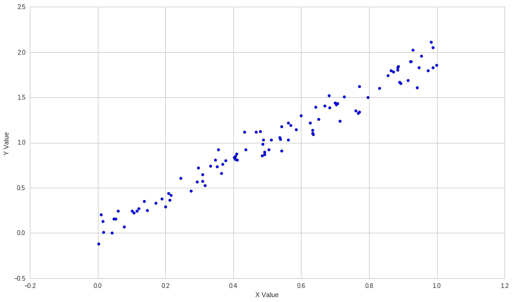
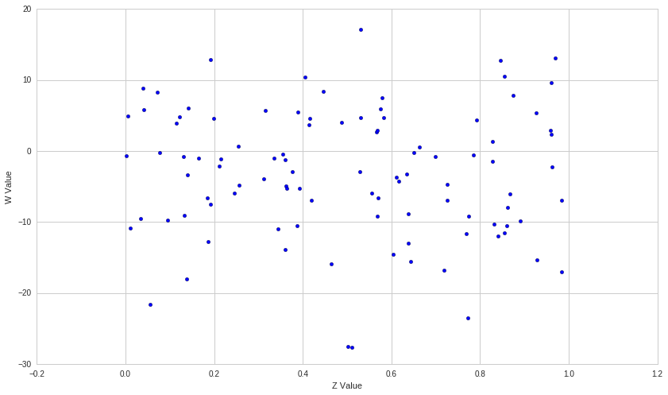

Exercises: Linear Correlation Analysis - Answer Key
===================================================

Lecture Link :
--------------

https://www.quantopian.com/lectures/linear-correlation-analysis

###IMPORTANT NOTE: This lecture corresponds to the Linear Correlation
Analysis lecture, which is part of the Quantopian lecture series. This
homework expects you to rely heavily on the code presented in the
corresponding lecture. Please copy and paste regularly from that lecture
when starting to work on the problems, as trying to do them from scratch
will likely be too difficult.

Part of the Quantopian Lecture Series:

-  `www.quantopian.com/lectures <https://www.quantopian.com/lectures>`__
-  `github.com/quantopian/research_public <https://github.com/quantopian/research_public>`__

--------------

Key Concepts
------------

.. code:: ipython2

    # Useful Functions
    def find_most_correlated(data):
        n = data.shape[1]
        keys = data.keys()
        pair = []
        max_value = 0
        for i in range(n):
            for j in range(i+1, n):
                S1 = data[keys[i]]
                S2 = data[keys[j]]
                result = np.corrcoef(S1, S2)[0,1]
                if result > max_value:
                    pair = (keys[i], keys[j])
                    max_value = result
        return pair, max_value

.. code:: ipython2

    # Useful Libraries
    import numpy as np
    import pandas as pd
    import matplotlib.pyplot as plt

--------------

Exercise 1: Dependence of Artificial Variables
==============================================

a. Finding Variance, Covariance, and Correlation I
--------------------------------------------------

By reading the matrix output from the ``np.cov()`` and ``np.corrcoef()``
functions, find the variance of the variables :math:`A` and :math:`B`
and the covariance and correlation of their relationship.

.. code:: ipython2

    A = np.random.rand(100)
    B = -3 * A + np.random.exponential(0.05, 100)
    
    #Your code goes here
    
    covm = np.cov(A, B)
    corrm = np.corrcoef(A, B)
    
    print 'Covariance matrix: \n' + str(covm) + '\n'
    print 'Correlation matrix: \n' + str(corrm) + '\n'
    
    print 'Variance of A: ' + str(covm[0,0])
    print 'Variance of B: ' + str(covm[1,1]) + '\n'
    
    print 'Covariance of A and B: ' + str(covm[1,0])
    print 'Correlation of A and B: ' + str(corrm[1,0])

.. parsed-literal::

    Covariance matrix: 
    [[ 0.08237163 -0.24773898]
     [-0.24773898  0.74865838]]
    
    Correlation matrix: 
    [[ 1.         -0.99761661]
     [-0.99761661  1.        ]]
    
    Variance of A: 0.0823716314393
    Variance of B: 0.748658383296
    
    Covariance of A and B: -0.247738983929
    Correlation of A and B: -0.997616611853

b. Finding Variance, Covariance, and Correlation II
---------------------------------------------------

By reading the matrix output from the ``np.cov()`` and ``np.corrcoef()``
functions, find the variance of the variables :math:`C` and :math:`D`
and the covariance and correlation of their relationship.

.. code:: ipython2

    C = np.random.rand(100)
    D = np.random.normal(0, 0.5, 100)
    
    #Your code goes here
    
    covm = np.cov(C, D)
    corrm = np.corrcoef(C, D)
    
    print 'Covariance matrix: \n' + str(covm) + '\n'
    print 'Correlation matrix: \n' + str(corrm) + '\n'
    
    print 'Variance of C: ' + str(covm[0,0])
    print 'Variance of D: ' + str(covm[1,1]) + '\n'
    
    print 'Covariance of C and D: ' + str(covm[1,0])
    print 'Correlation of C and D: ' + str(corrm[1,0])

.. parsed-literal::

    Covariance matrix: 
    [[ 0.09119246  0.00740988]
     [ 0.00740988  0.24265135]]
    
    Correlation matrix: 
    [[ 1.          0.04981272]
     [ 0.04981272  1.        ]]
    
    Variance of C: 0.0911924610123
    Variance of D: 0.242651347657
    
    Covariance of C and D: 0.00740987878297
    Correlation of C and D: 0.0498127228365

--------------

Exercise 2: Constructing Example Relationships
==============================================

a. Positive Correlation Example
-------------------------------

Construct a variable :math:`Y` which has a strong, but not perfect,
positive correlation with :math:`X` :math:`(0.9 < Corr(X,Y) < 1)`, and
plot their relationship.

.. code:: ipython2

    X = np.random.rand(100)
    
    #Your code goes here
    
    Y = 2*X + np.random.normal(0, 0.1, 100)
    
    plt.scatter(X,Y)
    plt.xlabel('X Value')
    plt.ylabel('Y Value')
    
    print 'Correlation of X and Y: ' + str(np.corrcoef(X, Y)[0,1])

.. parsed-literal::

    Correlation of X and Y: 0.984086064122

b. Negative Correlation Example
-------------------------------

Construct a variable :math:`W` which has a weak, negative correlation
with :math:`Z` :math:`(-0.3 < Corr(Z,W) < 0)`, and plot their
relationship.

.. code:: ipython2

    Z = np.random.rand(100)
    
    #Your code goes here
    
    W = -4*Z + np.random.normal(0, 10, 100)
    
    plt.scatter(Z,W)
    plt.xlabel('Z Value')
    plt.ylabel('W Value')
    
    print 'Correlation of Z and W: ' + str(np.corrcoef(Z, W)[0,1])

.. parsed-literal::

    Correlation of Z and W: -0.0498600763248

--------------

Exercise 3: Correlation of Real Assets
======================================

a. Finding Correlation of Real Assets
-------------------------------------

Find the correlation between the stocks OKE and LAKE. Also check how
they correlate with the provided benchmark.

.. code:: ipython2

    OKE = get_pricing('OKE', fields='price', start_date='2013-01-01', end_date='2015-01-01')
    LAKE = get_pricing('LAKE', fields='price', start_date='2013-01-01', end_date='2015-01-01')
    benchmark = get_pricing('SPY', fields='price', start_date='2013-01-01', end_date='2015-01-01')
    
    #Your code goes here
    
    print "Correlation coefficient of OKE and LAKE: ", np.corrcoef(OKE, LAKE)[0,1]
    print "Correlation coefficient of OKE and benchmark: ", np.corrcoef(OKE, benchmark)[0,1]
    print "Correlation coefficient of LAKE and benchmark: ", np.corrcoef(LAKE, benchmark)[0,1]

.. parsed-literal::

    Correlation coefficient of OKE and LAKE:  0.446484870844
    Correlation coefficient of OKE and benchmark:  0.853638499475
    Correlation coefficient of LAKE and benchmark:  0.625923407419

b. Finding Correlated Pairs
---------------------------

Find the most correlated pair of stocks in the following portfolio using
2015 pricing data and the ``find_most_correlated`` function defined in
the Helper Functions section above.

.. code:: ipython2

    symbol_list = ['GSK', 'SNOW', 'FB', 'AZO', 'XEC', 'AMZN']
    data = get_pricing(symbol_list, fields=['price']
                                   , start_date='2015-01-01', end_date='2016-01-01')['price']
    data.columns = symbol_list
    
    #Your code goes here
    
    find_most_correlated(data)

.. parsed-literal::

    (('FB', 'AMZN'), 0.95751089566007552)

--------------

Exercise 4: Limitations of Correlation
======================================

a. Out of Sample Tests
----------------------

Using pricing data from the first half of 2016, find the correlation
coefficient between FB and AMZN and compare it to the strong positive
relationship predicted from the 2015 correlation coefficient to see if
that result holds.

.. code:: ipython2

    FB_15 = get_pricing('FB', fields='price', start_date='2015-01-01', end_date='2016-01-01')
    AMZN_15 = get_pricing('AMZN', fields='price', start_date='2015-01-01', end_date='2016-01-01')
    FB_16 = get_pricing('FB', fields='price', start_date='2016-01-01', end_date='2016-07-01')
    AMZN_16 = get_pricing('AMZN', fields='price', start_date='2016-01-01', end_date='2016-07-01')
    
    #Your code goes here
    
    print "2015 correlation coefficient: ", np.corrcoef(FB_15, AMZN_15)[0,1]
    print "2016 correlation coefficient: ", np.corrcoef(FB_16, AMZN_16)[0,1]
    print "The strong correlation from 2015 did not hold outside of the 2015 pricing sample."

.. parsed-literal::

    2015 correlation coefficient:  0.95751089566
    2016 correlation coefficient:  0.651288727673
    The strong correlation from 2015 did not hold outside of the 2015 pricing sample.

b. Rolling Correlation
----------------------

Plot the 60-day rolling correlation coefficient between FB and AMZN to
make a conclusion about the stability of their relationship.

.. code:: ipython2

    FB = get_pricing('FB', fields='price', start_date='2015-01-01', end_date='2017-01-01')
    AMZN = get_pricing('AMZN', fields='price', start_date='2015-01-01', end_date='2017-01-01')
    
    #Your code goes here
    
    rolling_correlation = FB.rolling(window=60).corr(AMZN)
    plt.plot(rolling_correlation)
    plt.xlabel('Day')
    plt.ylabel('60-day Rolling Correlation')
    print "Upon further investigation, FB and AMZN do not consistently have the strong correlation suggested by our result from question 3b."

.. parsed-literal::

    Upon further investigation, FB and AMZN do not consistently have the strong correlation suggested by our result from question 3b.

.. image:: notebook_files/notebook_23_1.png

Congratulations on completing the Linear Correlation Analysis exercises!

As you learn more about writing trading models and the Quantopian
platform, enter a daily `Quantopian
Contest <https://www.quantopian.com/contest>`__. Your strategy will be
evaluated for a cash prize every day.

Start by going through the `Writing a Contest
Algorithm <https://www.quantopian.com/tutorials/contest>`__ tutorial.

*This presentation is for informational purposes only and does not
constitute an offer to sell, a solicitation to buy, or a recommendation
for any security; nor does it constitute an offer to provide investment
advisory or other services by Quantopian, Inc. (“Quantopian”). Nothing
contained herein constitutes investment advice or offers any opinion
with respect to the suitability of any security, and any views expressed
herein should not be taken as advice to buy, sell, or hold any security
or as an endorsement of any security or company. In preparing the
information contained herein, Quantopian, Inc. has not taken into
account the investment needs, objectives, and financial circumstances of
any particular investor. Any views expressed and data illustrated herein
were prepared based upon information, believed to be reliable, available
to Quantopian, Inc. at the time of publication. Quantopian makes no
guarantees as to their accuracy or completeness. All information is
subject to change and may quickly become unreliable for various reasons,
including changes in market conditions or economic circumstances.*
