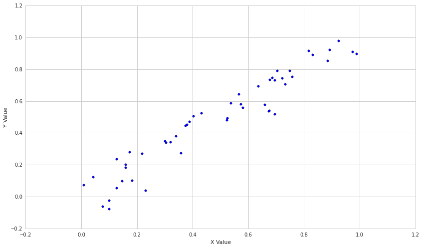
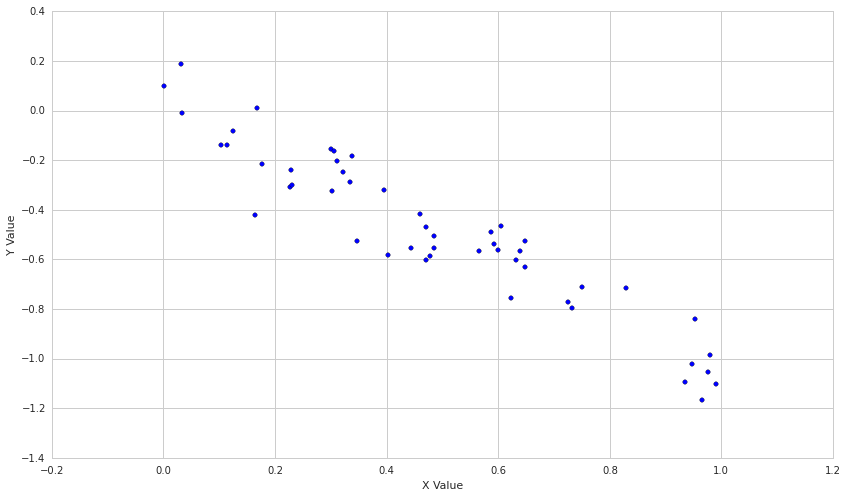
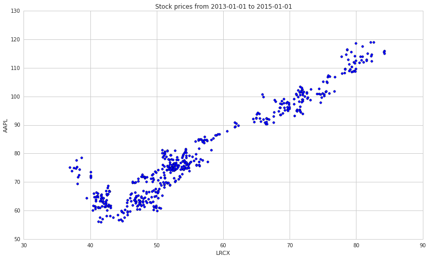
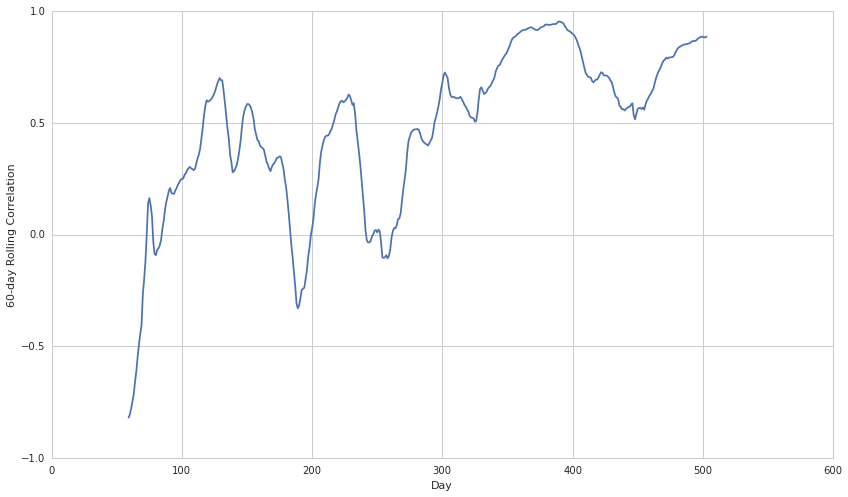
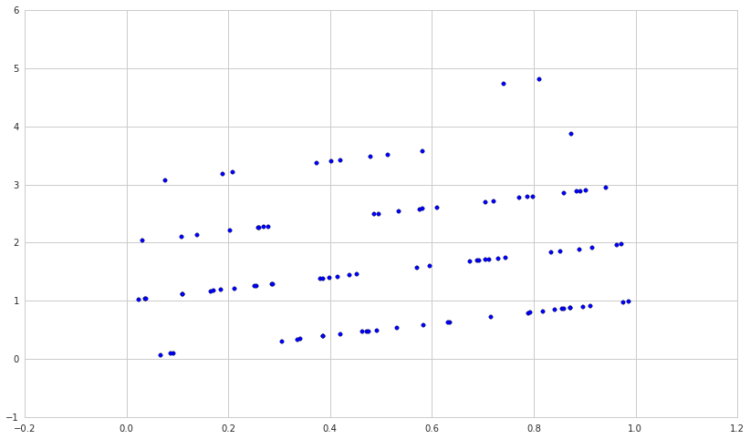

The Correlation Coefficient
===========================

By Evgenia “Jenny” Nitishinskaya and Delaney Granizo-Mackenzie with
example algorithms by David Edwards

Part of the Quantopian Lecture Series:

-  `www.quantopian.com/lectures <https://www.quantopian.com/lectures>`__
-  `github.com/quantopian/research_public <https://github.com/quantopian/research_public>`__

--------------

The correlation coefficient measures the extent to which the
relationship between two variables is linear. Its value is always
between -1 and 1. A positive coefficient indicates that the variables
are directly related, i.e. when one increases the other one also
increases. A negative coefficient indicates that the variables are
inversely related, so that when one increases the other decreases. The
closer to 0 the correlation coefficient is, the weaker the relationship
between the variables.

The correlation coefficient of two series :math:`X` and :math:`Y` is
defined as

.. math:: r = \frac{Cov(X,Y)}{std(X)std(Y)}

where :math:`Cov` is the covariance and :math:`std` is the standard
deviation.

Two random sets of data will have a correlation coefficient close to 0:

##Correlation vs. Covariance

Correlation is simply a normalized form of covariance. They are
otherwise the same and are often used semi-interchangeably in everyday
conversation. It is obviously important to be precise with language when
discussing the two, but conceptually they are almost identical.

###Covariance isn’t that meaningful by itself

Let’s say we have two variables :math:`X` and :math:`Y` and we take the
covariance of the two.

.. code:: ipython2

    import numpy as np
    import pandas as pd
    import matplotlib.pyplot as plt

.. code:: ipython2

    X = np.random.rand(50)
    Y = 2 * X + np.random.normal(0, 0.1, 50)
    
    np.cov(X, Y)[0, 1]

.. parsed-literal::

    0.14975887489776102

So now what? What does this mean? Correlation uses information about the
variance of X and Y to normalize this metric. Once we’ve normalized the
metric to the -1 to 1 scale, we can make meaningful statements and
compare correlations.

To see how this is done consider the formula.

.. math:: \frac{Cov(X, Y)}{std(X)std(Y)}

.. math:: = \frac{Cov(X, Y)}{\sqrt{var(X)}\sqrt{var(Y)}}

.. math:: = \frac{Cov(X, Y)}{\sqrt{Cov(X, X)}\sqrt{Cov(Y, Y)}}

To demonstrate this let’s compare the correlation and covariance of two
series.

.. code:: ipython2

    X = np.random.rand(50)
    Y = 2 * X + 4
    
    print 'Covariance of X and Y: \n' + str(np.cov(X, Y))
    print 'Correlation of X and Y: \n' + str(np.corrcoef(X, Y))

.. parsed-literal::

    Covariance of X and Y: 
    [[ 0.07228077  0.14456154]
     [ 0.14456154  0.28912309]]
    Correlation of X and Y: 
    [[ 1.  1.]
     [ 1.  1.]]

Why do both ``np.cov`` and ``np.corrcoef`` return matrices?
-----------------------------------------------------------

The covariance matrix is an important concept in statistics. Often
people will refer to the covariance of two variables :math:`X` and
:math:`Y`, but in reality that is just one entry in the covariance
matrix of :math:`X` and :math:`Y`. For each input variable we have one
row and one column. The diagonal is just the variance of that variable,
or :math:`Cov(X, X)`, entries off the diagonal are covariances between
different variables. The matrix is symmetric across the diagonal. Let’s
check that this is true.

.. code:: ipython2

    cov_matrix = np.cov(X, Y)
    
    # We need to manually set the degrees of freedom on X to 1, as numpy defaults to 0 for variance
    # This is usually fine, but will result in a slight mismatch as np.cov defaults to 1
    error = cov_matrix[0, 0] - X.var(ddof=1)
    
    print 'error: ' + str(error)

.. parsed-literal::

    error: 1.38777878078e-17

.. code:: ipython2

    X = np.random.rand(50)
    Y = np.random.rand(50)
    
    plt.scatter(X,Y)
    plt.xlabel('X Value')
    plt.ylabel('Y Value')
    
    # taking the relevant value from the matrix returned by np.cov
    print 'Correlation: ' + str(np.cov(X,Y)[0,1]/(np.std(X)*np.std(Y)))
    # Let's also use the builtin correlation function
    print 'Built-in Correlation: ' + str(np.corrcoef(X, Y)[0, 1])

.. parsed-literal::

    Correlation: 0.0612685087304
    Built-in Correlation: 0.0600431385558

.. image:: notebook_files/notebook_9_1.png

Now let’s see what two correlated sets of data look like.

.. code:: ipython2

    X = np.random.rand(50)
    Y = X + np.random.normal(0, 0.1, 50)
    
    plt.scatter(X,Y)
    plt.xlabel('X Value')
    plt.ylabel('Y Value')
    
    print 'Correlation: ' + str(np.corrcoef(X, Y)[0, 1])

.. parsed-literal::

    Correlation: 0.958613485688

Let’s dial down the relationship by introducing more noise.

.. code:: ipython2

    X = np.random.rand(50)
    Y = X + np.random.normal(0, .2, 50)
    
    plt.scatter(X,Y)
    plt.xlabel('X Value')
    plt.ylabel('Y Value')
    
    print 'Correlation: ' + str(np.corrcoef(X, Y)[0, 1])

.. parsed-literal::

    Correlation: 0.879590392019

.. image:: notebook_files/notebook_13_1.png

Finally, let’s see what an inverse relationship looks like.

.. code:: ipython2

    X = np.random.rand(50)
    Y = -X + np.random.normal(0, .1, 50)
    
    plt.scatter(X,Y)
    plt.xlabel('X Value')
    plt.ylabel('Y Value')
    
    print 'Correlation: ' + str(np.corrcoef(X, Y)[0, 1])

.. parsed-literal::

    Correlation: -0.944604531847

We see a little bit of rounding error, but they are clearly the same
value.

How is this useful in finance?
------------------------------

Determining related assets
~~~~~~~~~~~~~~~~~~~~~~~~~~

Once we’ve established that two series are probably related, we can use
that in an effort to predict future values of the series. For example,
let’s look at the price of Apple and a semiconductor equipment
manufacturer, Lam Research Corporation.

.. code:: ipython2

    # Pull the pricing data for our two stocks and S&P 500
    start = '2013-01-01'
    end = '2015-01-01'
    bench = get_pricing('SPY', fields='price', start_date=start, end_date=end)
    a1 = get_pricing('LRCX', fields='price', start_date=start, end_date=end)
    a2 = get_pricing('AAPL', fields='price', start_date=start, end_date=end)
    
    plt.scatter(a1,a2)
    plt.xlabel('LRCX')
    plt.ylabel('AAPL')
    plt.title('Stock prices from ' + start + ' to ' + end)
    print "Correlation coefficients"
    print "LRCX and AAPL: ", np.corrcoef(a1,a2)[0,1]
    print "LRCX and SPY: ", np.corrcoef(a1,bench)[0,1]
    print "AAPL and SPY: ", np.corrcoef(bench,a2)[0,1]

.. parsed-literal::

    Correlation coefficients
    LRCX and AAPL:  0.954684674528
    LRCX and SPY:  0.935191172334
    AAPL and SPY:  0.89214568707

Constructing a portfolio of uncorrelated assets
~~~~~~~~~~~~~~~~~~~~~~~~~~~~~~~~~~~~~~~~~~~~~~~

Another reason that correlation is useful in finance is that
uncorrelated assets produce the best portfolios. The intuition for this
is that if the assets are uncorrelated, a drawdown in one will not
correspond with a drawdown in another. This leads to a very stable
return stream when many uncorrelated assets are combined.

Limitations
===========

Significance
------------

It’s hard to rigorously determine whether or not a correlation is
significant, especially when, as here, the variables are not normally
distributed. Their correlation coefficient is close to 1, so it’s pretty
safe to say that the two stock prices are correlated over the time
period we use, but is this indicative of future correlation? If we
examine the correlation of each of them with the S&P 500, we see that it
is also quite high. So, AAPL and LRCX are slightly more correlated with
each other than with the average stock.

One fundamental problem is that it is easy to datamine correlations by
picking the right time period. To avoid this, one should compute the
correlation of two quantities over many historical time periods and
examine the distibution of the correlation coefficient. More details on
why single point estimates are bad will be covered in future notebooks.

As an example, remember that the correlation of AAPL and LRCX from
2013-1-1 to 2015-1-1 was 0.95. Let’s take the rolling 60 day correlation
between the two to see how that varies.

.. code:: ipython2

    rolling_correlation = pd.rolling_corr(a1, a2, 60)
    plt.plot(rolling_correlation)
    plt.xlabel('Day')
    plt.ylabel('60-day Rolling Correlation')

.. parsed-literal::

    <matplotlib.text.Text at 0x7fe83920c610>

Non-Linear Relationships
------------------------

The correlation coefficient can be useful for examining the strength of
the relationship between two variables. However, it’s important to
remember that two variables may be associated in different, predictable
ways which this analysis would not pick up. For instance, one variable
might precisely follow the behavior of a second, but with a delay. There
are techniques for dealing with this lagged correlation. Alternatively,
a variable may be related to the rate of change of another. Neither of
these relationships are linear, but can be very useful if detected.

Additionally, the correlation coefficient can be very sensitive to
outliers. This means that including or excluding even a couple of data
points can alter your result, and it is not always clear whether these
points contain information or are simply noise.

As an example, let’s make the noise distribution poisson rather than
normal and see what happens.

.. code:: ipython2

    X = np.random.rand(100)
    Y = X + np.random.poisson(size=100)
    
    plt.scatter(X, Y)
    
    np.corrcoef(X, Y)[0, 1]

.. parsed-literal::

    0.18485889539744632

In conclusion, correlation is a powerful technique, but as always in
statistics, one should be careful not to interpret results where there
are none.

*This presentation is for informational purposes only and does not
constitute an offer to sell, a solicitation to buy, or a recommendation
for any security; nor does it constitute an offer to provide investment
advisory or other services by Quantopian, Inc. (“Quantopian”). Nothing
contained herein constitutes investment advice or offers any opinion
with respect to the suitability of any security, and any views expressed
herein should not be taken as advice to buy, sell, or hold any security
or as an endorsement of any security or company. In preparing the
information contained herein, Quantopian, Inc. has not taken into
account the investment needs, objectives, and financial circumstances of
any particular investor. Any views expressed and data illustrated herein
were prepared based upon information, believed to be reliable, available
to Quantopian, Inc. at the time of publication. Quantopian makes no
guarantees as to their accuracy or completeness. All information is
subject to change and may quickly become unreliable for various reasons,
including changes in market conditions or economic circumstances.*
