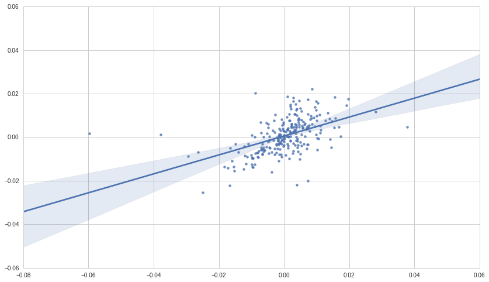
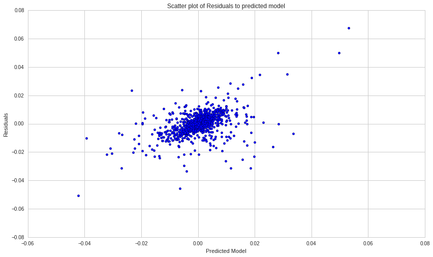

Exercises: Linear Regression - Answer Key
=========================================

By Christopher van Hoecke, Max Margenot, and Delaney Mackenzie

Lecture Link :
--------------

https://www.quantopian.com/lectures/linear-regression

IMPORTANT NOTE:
~~~~~~~~~~~~~~~

This lecture corresponds to the Linear Regression lecture, which is part
of the Quantopian lecture series. This homework expects you to rely
heavily on the code presented in the corresponding lecture. Please copy
and paste regularly from that lecture when starting to work on the
problems, as trying to do them from scratch will likely be too
difficult.

Part of the Quantopian Lecture Series:

-  `www.quantopian.com/lectures <https://www.quantopian.com/lectures>`__
-  `github.com/quantopian/research_public <https://github.com/quantopian/research_public>`__

Notebook released under the Creative Commons Attribution 4.0 License.

--------------

Key Concepts
------------

.. code:: ipython3

    # Useful Functions
    def linreg(X,Y):
        # Running the linear regression
        X = sm.add_constant(X)
        model = regression.linear_model.OLS(Y, X).fit()
        a = model.params[0]
        b = model.params[1]
        X = X[:, 1]
    
        # Return summary of the regression and plot results
        X2 = np.linspace(X.min(), X.max(), 100)
        Y_hat = X2 * b + a
        plt.scatter(X, Y, alpha=0.3) # Plot the raw data
        plt.plot(X2, Y_hat, 'r', alpha=0.9);  # Add the regression line, colored in red
        plt.xlabel('X Value')
        plt.ylabel('Y Value')
        return model.summary()

.. code:: ipython3

    # Useful Libraries
    import math
    import numpy as np
    import matplotlib.pyplot as plt
    
    from statsmodels import regression
    from statsmodels.stats import diagnostic
    import statsmodels.regression as smr
    import statsmodels.api as sm
    from statsmodels.stats.diagnostic import het_breushpagan
    
    import scipy as sp
    import scipy.stats
    import seaborn

--------------

Exercise 1: Temperatures
========================

Given this set of Fahrenheit and Celsius values, find a model that
expresses the relationship between the two temperature scales.

.. code:: ipython3

    fahrenheit = [-868, -778, -688, -598, -508, -418, -328, -238, -144, -58, 32, 122, 212, 302, 392, 482, 
                  572, 662, 752, 842, 932]
    celsius    = [-500, -450, -400, -350, -300, -250, -200, -150, -100, -50, 0, 50, 100, 150, 200, 250, 
                  300, 350, 400, 450, 500]
    
    ## Your code goes here
    linreg(celsius, fahrenheit)

.. raw:: html

    <table class="simpletable">
    <caption>OLS Regression Results</caption>
    <tr>
      <th>Dep. Variable:</th>            <td>y</td>        <th>  R-squared:         </th> <td>   1.000</td> 
    </tr>
    <tr>
      <th>Model:</th>                   <td>OLS</td>       <th>  Adj. R-squared:    </th> <td>   1.000</td> 
    </tr>
    <tr>
      <th>Method:</th>             <td>Least Squares</td>  <th>  F-statistic:       </th> <td>7.818e+06</td>
    </tr>
    <tr>
      <th>Date:</th>             <td>Tue, 19 Jun 2018</td> <th>  Prob (F-statistic):</th> <td>8.33e-55</td> 
    </tr>
    <tr>
      <th>Time:</th>                 <td>18:08:12</td>     <th>  Log-Likelihood:    </th> <td> -26.373</td> 
    </tr>
    <tr>
      <th>No. Observations:</th>      <td>    21</td>      <th>  AIC:               </th> <td>   56.75</td> 
    </tr>
    <tr>
      <th>Df Residuals:</th>          <td>    19</td>      <th>  BIC:               </th> <td>   58.83</td> 
    </tr>
    <tr>
      <th>Df Model:</th>              <td>     1</td>      <th>                     </th>     <td> </td>    
    </tr>
    <tr>
      <th>Covariance Type:</th>      <td>nonrobust</td>    <th>                     </th>     <td> </td>    
    </tr>
    </table>
    <table class="simpletable">
    <tr>
        <td></td>       <th>coef</th>     <th>std err</th>      <th>t</th>      <th>P>|t|</th> <th>[95.0% Conf. Int.]</th> 
    </tr>
    <tr>
      <th>const</th> <td>   32.1905</td> <td>    0.195</td> <td>  165.172</td> <td> 0.000</td> <td>   31.783    32.598</td>
    </tr>
    <tr>
      <th>x1</th>    <td>    1.7998</td> <td>    0.001</td> <td> 2795.998</td> <td> 0.000</td> <td>    1.798     1.801</td>
    </tr>
    </table>
    <table class="simpletable">
    <tr>
      <th>Omnibus:</th>       <td>53.344</td> <th>  Durbin-Watson:     </th> <td>   2.112</td>
    </tr>
    <tr>
      <th>Prob(Omnibus):</th> <td> 0.000</td> <th>  Jarque-Bera (JB):  </th> <td> 281.704</td>
    </tr>
    <tr>
      <th>Skew:</th>          <td> 4.210</td> <th>  Prob(JB):          </th> <td>6.74e-62</td>
    </tr>
    <tr>
      <th>Kurtosis:</th>      <td>18.844</td> <th>  Cond. No.          </th> <td>    303.</td>
    </tr>
    </table>

.. image:: notebook_files/notebook_6_1.png

.. raw:: html

   

*We can clearly see from the table (and the graph) that
:math:`f = 1.8c + 32`*

.. raw:: html

   

--------------

Exercise 2 : Confidence Intervals
=================================

a. Visualizing Confidence Intervals
-----------------------------------

Using the lecture series and the seaborn library, plot the regression
line between the parameters and the :math:`95\%` confidence interval.

.. code:: ipython3

    start = '2014-01-01'
    end = '2015-01-01'
    asset = get_pricing('KO', fields='price', start_date=start, end_date=end)
    benchmark = get_pricing('PEP', fields='price', start_date=start, end_date=end)
    
    returns1 = asset.pct_change()[1:]
    returns2 = benchmark.pct_change()[1:]
    
    ## Your code goes here
    seaborn.regplot(returns1.values, returns2.values, ci=95);

b. Calculating Confidence Levels of Parameters.
-----------------------------------------------

Let’s directly calculate the :math:`95\%` confidence intervals of our
parameters. The formula for a given parameter is:

.. math::  CI = \left(\beta - z \cdot \frac{s}{\sqrt{n}}, \beta + z \cdot \frac{s}{\sqrt{n}}\right) 

Where, :math:`\beta` is the coefficient, :math:`z` is the critical
value\ *(t-statistic required to obtain a probability less than the
alpha significance level)*, and :math:`SE_{i,i}` is the Standard Error
Matrix.

.. code:: ipython3

    start = '2014-01-01'
    end = '2015-01-01'
    asset = get_pricing('KO', fields='price', start_date=start, end_date=end)
    benchmark = get_pricing('PEP', fields='price', start_date=start, end_date=end)
    
    X = asset.pct_change()[1:]
    Y = benchmark.pct_change()[1:]
    
    result = sm.OLS(Y,X).fit()
    
    # Convert X to Matrix (adding columns of one)
    X = np.vstack((X, np.ones( X.size ) ))
    X = np.matrix( X )
    
    # Matrix Multiplication and inverse calculation
    C = np.linalg.inv( X * X.T )
    C *= result.mse_resid
    SE = np.sqrt(C) # Calucaltion of Standard Error. 
    
    # Critical Values of the t-statistic
    N = result.nobs
    P = result.df_model
    dof = N - P - 1
    z = scipy.stats.t(dof).ppf(0.975)
    
    i = 0
    ## Your code goes here
    
    # Fetch values of Beta and parameters of SE from the matrix
    beta = result.params[i]
    c = SE[i,i]
    
    print beta - z * c, beta + z * c

.. parsed-literal::

    0.343562222943 0.530358115519

--------------

Exercise 3 : :math:`R^2` Value
==============================

:math:`R^2` is the measure of how closely your data points are to the
regression line, and is defined as

.. math::  R^2 = 1 - \frac{\Sigma((y_{predicted} - (y_{actual}))^2)}{\Sigma( y_{predicited} - \frac{\Sigma y_{actual}}{len(y_{actual}})^2} 

Given the information from exercise 1, calculate the value of
:math:`R^2` manually. You can start by expressing f as a function of c
from the data obtained from Exercise 1 (these are the predicted values
of y).

.. code:: ipython3

    # Creat an empty numpy array (float values). 
    # Find the predicted value of f for every c in celsius (given by f = 32 + 1.8c)
    fpred = np.array([])
    f = [32 + 1.8*a for a in celsius] ## Your code goes here (fill in the values of Beta, and X1)
    ypredicted = np.append(f, fpred)

Using the values of :math:`y_{predicted}` and :math:`y_{actual}`,
calculate the squared element by element difference of the two lists,
and sum them.

.. code:: ipython3

    # Calucate the difference between the predicted values of y and the actual values of y, 
    # Find the square of the difference
    # Sum the Squares
    
    ypred_yact = [a - b for a, b in zip(ypredicted, fahrenheit)] ## your code goes here (a - b)
    diff1squared = [a**2 for a in ypred_yact] ## Your code goes here (a**2)
    sumsquares1 = sum(diff1squared) ## Your code goes here 

Using the values of :math:`y_{predicted}` and mean, calculate the mean
of the predicted values, along with the difference between
:math:`y_{predicted} - mean`. Square the values in the list obtained
from the difference and sum them.

.. code:: ipython3

    # Calucate the difference between the predicted values of y and mean of y. 
    # Find the square of the difference
    # Sum the Squares
    
    mean = sum(fahrenheit)/len(fahrenheit) ## Your code goes here
    ypred_mean = [x - mean for x in ypredicted] ## Your code goes here (x-mean)
    ypred_meansquared = [a**2 for a in ypred_mean] ## Your code goes here (a**2)
    sumsquares2 = sum(ypred_meansquared) ## Your code goes here

We can now calculate the R-Squared by subtracting one to the ratio of
the two sums.

.. code:: ipython3

    ## Your code goes here
    r = 1 - sumsquares1/sumsquares2
    
    print 'R-squared = ', r

.. parsed-literal::

    R-squared =  0.999997434664

--------------

Exercise 4 : Residuals
======================

**Defintion : In statistics, the residuals are differences between the
predicted values and the actual values**:

.. math:: e = y - ŷ

a. Residual Analysis I
----------------------

-  Model the data given bellow as a linear regression.
-  Calculate and plot the residual of the data sets *(remember to use
   the coefficient and the value of x1 to find the predicted values of
   y)*
-  Print the sum of the residuals.
-  Discuss the choice of regression model.

.. code:: ipython3

    asset1 = get_pricing('SPY', fields='price', start_date='2005-01-01', end_date='2010-01-01')
    asset2 = get_pricing('GS', fields='price', start_date='2005-01-01', end_date='2010-01-01')
    
    returns1 = asset1.pct_change()[1:]
    returns2 = asset2.pct_change()[1:]
    
    ## Your code goes here
    results = smr.linear_model.OLS(returns1.values, sm.add_constant(returns2.values)).fit()

Run the Breush-Pagan test to check for heteroskedasticity in the
residuals. Note that the residuals of the model should have constant
variance, presence of heteroskedasticity would indicate our choice of
model is not optimal.

.. code:: ipython3

    lm, p_lm, fv, p_fv = het_breushpagan(results.resid, results.model.exog)
    print 'p-value for f-statistic of the breush-pagan test:', p_fv
    print '===='  
    print "Since the p-value obtained is greater than alpha (0.05), \
    we can't reject the null hypothesis of the breush-pagan test, and state that there is \
    no presence of heteroskedasticity"

.. parsed-literal::

    p-value for f-statistic of the breush-pagan test: 0.664407993179
    ====
    Since the p-value obtained is greater than alpha (0.05), we can't reject the null hypothesis of the breush-pagan test, and state that there is no presence of heteroskedasticity

.. code:: ipython3

    # Predicted values of asset1
    y = results.params[0] + results.params[1]*returns1.values
    
    plt.scatter(y, results.resid)
    plt.title('Scatter plot of Residuals to predicted model')
    plt.xlabel('Predicted Model')
    plt.ylabel('Residuals');

.. image:: notebook_files/notebook_27_0.png

Here we can clearly see the plot of the residuals obeys a random
pattern, which would indicate that the choice of model was good. This is
further accentuated by the near 0 value of the sum of residuals.

b. Residual Analysis II
-----------------------

-  Run the linear regression function for x and y
-  Find and plot the residual of the two data points.
-  Discuss the choice in model.

.. code:: ipython3

    p1 = get_pricing('SPY', start_date = '2005-01-01', 
                     end_date = '2010-01-01', 
                     fields = 'price').pct_change()[1:]
    p2 = get_pricing('XLF', start_date = '2005-01-01', 
                     end_date = '2010-01-01', 
                     fields = 'price').pct_change()[1:]
    
    ## Your code goes here
    results2 = smr.linear_model.OLS(p1, sm.add_constant(p2)).fit()
    
    y = results2.params[0] + results2.params[1]*p1

.. code:: ipython3

    res = results2.resid
    
    plt.scatter(y, res)
    plt.title('Scatter plot of Residuals to predicted model')
    plt.xlabel('Predicted Model')
    plt.ylabel('Residuals')
    
    lm, p_lm, fv, p_fv = het_breushpagan(results2.resid, results2.model.exog)
    print 'p-value for f-statistic of the breush-pagan test:', p_fv
    print '===='  
    print "Since the p-value obtained is less than alpha (0.05), \
    we reject the null hypothesis of the breush-pagan test, and state that there is \
    presence of heteroskedasticity"

.. parsed-literal::

    p-value for f-statistic of the breush-pagan test: 5.66764037947e-08
    ====
    Since the p-value obtained is less than alpha (0.05), we reject the null hypothesis of the breush-pagan test, and state that there is presence of heteroskedasticity

Here, we can clearly see that the choice of model was not adapt for our
data as the plot of the residuals gives us an exponential looking
function (not random) and the sum of the residuals is much greater than
0.

| While checking for residual is a good way of checking the accuracy of
  our model choice, we must also check fot heteroscedasticity (checking
  if there are sub-populations that have different variabilities from
  others).
| An assumption of the linear regression model is that there is no
  heteroscedasticity, OLS estimators are no longer the Best Linear
  Unbiased Estimators if this assumption is broken.
| Read more about heteroscedasticity here
  https://en.wikipedia.org/wiki/Heteroscedasticity#Consequences

--------------

Congratulations on completing the Linear Regression exercise!

As you learn more about writing trading algorithms and the Quantopian
platform, be sure to check out the `Quantopian Daily
Contest <https://www.quantopian.com/contest>`__, in which you can
compete for a cash prize every day.

Start by going through the `Writing a Contest
Algorithm <https://www.quantopian.com/tutorials/contest>`__ Tutorial.

*This presentation is for informational purposes only and does not
constitute an offer to sell, a solicitation to buy, or a recommendation
for any security; nor does it constitute an offer to provide investment
advisory or other services by Quantopian, Inc. (“Quantopian”). Nothing
contained herein constitutes investment advice or offers any opinion
with respect to the suitability of any security, and any views expressed
herein should not be taken as advice to buy, sell, or hold any security
or as an endorsement of any security or company. In preparing the
information contained herein, Quantopian, Inc. has not taken into
account the investment needs, objectives, and financial circumstances of
any particular investor. Any views expressed and data illustrated herein
were prepared based upon information, believed to be reliable, available
to Quantopian, Inc. at the time of publication. Quantopian makes no
guarantees as to their accuracy or completeness. All information is
subject to change and may quickly become unreliable for various reasons,
including changes in market conditions or economic circumstances.*
