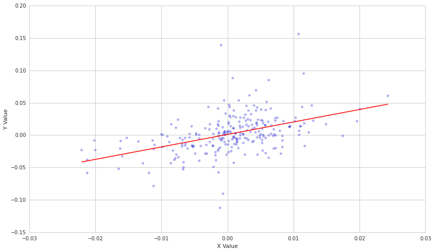
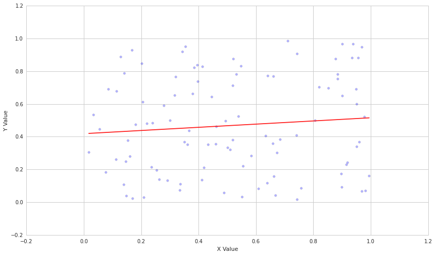
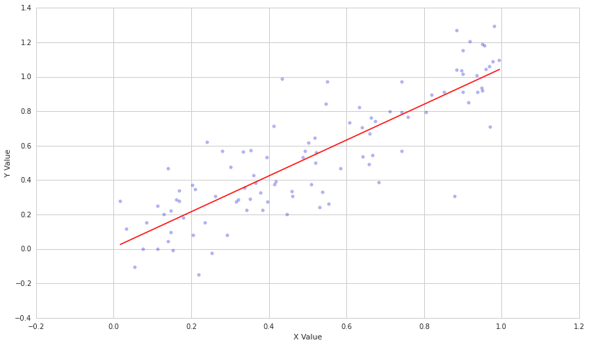
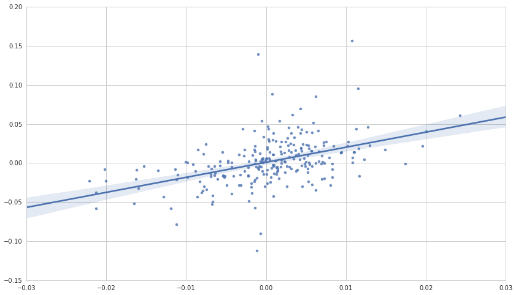

#Linear Regression By Evgenia “Jenny” Nitishinskaya and Delaney
Granizo-Mackenzie with example algorithms by David Edwards

Part of the Quantopian Lecture Series:

-  `www.quantopian.com/lectures <https://www.quantopian.com/lectures>`__
-  `github.com/quantopian/research_public <https://github.com/quantopian/research_public>`__

--------------

Linear regression is a technique that measures the relationship between
two variables. If we have an independent variable :math:`X`, and a
dependent outcome variable :math:`Y`, linear regression allows us to
determine which linear model :math:`Y = \alpha + \beta X` best explains
the data. As an example, let’s consider TSLA and SPY. We would like to
know how TSLA varies as a function of how SPY varies, so we will take
the daily returns of each and regress them against each other.

Python’s ``statsmodels`` library has a built-in linear fit function.
Note that this will give a line of best fit; whether or not the
relationship it shows is significant is for you to determine. The output
will also have some statistics about the model, such as R-squared and
the F value, which may help you quantify how good the fit actually is.

.. code:: ipython2

    # Import libraries
    import numpy as np
    from statsmodels import regression
    import statsmodels.api as sm
    import matplotlib.pyplot as plt
    import math

First we’ll define a function that performs linear regression and plots
the results.

.. code:: ipython2

    def linreg(X,Y):
        # Running the linear regression
        X = sm.add_constant(X)
        model = regression.linear_model.OLS(Y, X).fit()
        a = model.params[0]
        b = model.params[1]
        X = X[:, 1]
    
        # Return summary of the regression and plot results
        X2 = np.linspace(X.min(), X.max(), 100)
        Y_hat = X2 * b + a
        plt.scatter(X, Y, alpha=0.3) # Plot the raw data
        plt.plot(X2, Y_hat, 'r', alpha=0.9);  # Add the regression line, colored in red
        plt.xlabel('X Value')
        plt.ylabel('Y Value')
        return model.summary()

Now we’ll get pricing data on TSLA and SPY and perform a regression.

.. code:: ipython2

    start = '2014-01-01'
    end = '2015-01-01'
    asset = get_pricing('TSLA', fields='price', start_date=start, end_date=end)
    benchmark = get_pricing('SPY', fields='price', start_date=start, end_date=end)
    
    # We have to take the percent changes to get to returns
    # Get rid of the first (0th) element because it is NAN
    r_a = asset.pct_change()[1:]
    r_b = benchmark.pct_change()[1:]
    
    linreg(r_b.values, r_a.values)

.. raw:: html

    <table class="simpletable">
    <caption>OLS Regression Results</caption>
    <tr>
      <th>Dep. Variable:</th>            <td>y</td>        <th>  R-squared:         </th> <td>   0.202</td>
    </tr>
    <tr>
      <th>Model:</th>                   <td>OLS</td>       <th>  Adj. R-squared:    </th> <td>   0.199</td>
    </tr>
    <tr>
      <th>Method:</th>             <td>Least Squares</td>  <th>  F-statistic:       </th> <td>   63.14</td>
    </tr>
    <tr>
      <th>Date:</th>             <td>Thu, 17 Sep 2015</td> <th>  Prob (F-statistic):</th> <td>6.66e-14</td>
    </tr>
    <tr>
      <th>Time:</th>                 <td>20:55:12</td>     <th>  Log-Likelihood:    </th> <td>  548.81</td>
    </tr>
    <tr>
      <th>No. Observations:</th>      <td>   251</td>      <th>  AIC:               </th> <td>  -1094.</td>
    </tr>
    <tr>
      <th>Df Residuals:</th>          <td>   249</td>      <th>  BIC:               </th> <td>  -1087.</td>
    </tr>
    <tr>
      <th>Df Model:</th>              <td>     1</td>      <th>                     </th>     <td> </td>   
    </tr>
    <tr>
      <th>Covariance Type:</th>      <td>nonrobust</td>    <th>                     </th>     <td> </td>   
    </tr>
    </table>
    <table class="simpletable">
    <tr>
        <td></td>       <th>coef</th>     <th>std err</th>      <th>t</th>      <th>P>|t|</th> <th>[95.0% Conf. Int.]</th> 
    </tr>
    <tr>
      <th>const</th> <td>    0.0011</td> <td>    0.002</td> <td>    0.626</td> <td> 0.532</td> <td>   -0.002     0.004</td>
    </tr>
    <tr>
      <th>x1</th>    <td>    1.9271</td> <td>    0.243</td> <td>    7.946</td> <td> 0.000</td> <td>    1.449     2.405</td>
    </tr>
    </table>
    <table class="simpletable">
    <tr>
      <th>Omnibus:</th>       <td>63.947</td> <th>  Durbin-Watson:     </th> <td>   2.006</td>
    </tr>
    <tr>
      <th>Prob(Omnibus):</th> <td> 0.000</td> <th>  Jarque-Bera (JB):  </th> <td> 371.184</td>
    </tr>
    <tr>
      <th>Skew:</th>          <td> 0.850</td> <th>  Prob(JB):          </th> <td>2.50e-81</td>
    </tr>
    <tr>
      <th>Kurtosis:</th>      <td> 8.710</td> <th>  Cond. No.          </th> <td>    141.</td>
    </tr>
    </table>

Each point on the above graph represents a day, with the x-coordinate
being the return of SPY, and the y-coordinate being the return of TSLA.
As we can see, the line of best fit tells us that for every 1% increased
return we see from the SPY, we should see an extra 1.92% from TSLA. This
is expressed by the parameter :math:`\beta`, which is 1.9271 as
estimated. Of course, for decresed return we will also see about double
the loss in TSLA, so we haven’t gained anything, we are just more
volatile.

##Linear Regression vs. Correlation

-  Linear regression gives us a specific linear model, but is limited to
   cases of linear dependence.
-  Correlation is general to linear and non-linear dependencies, but
   doesn’t give us an actual model.
-  Both are measures of covariance.
-  Linear regression can give us relationship between Y and many
   independent variables by making X multidimensional.

##Knowing Parameters vs. Estimates

It is very important to keep in mind that all :math:`\alpha` and
:math:`\beta` parameters estimated by linear regression are just that -
estimates. You can never know the underlying true parameters unless you
know the physical process producing the data. The parameters you
estimate today may not be the same analysis done including tomorrow’s
data, and the underlying true parameters may be moving. As such it is
very important when doing actual analysis to pay attention to the
standard error of the parameter estimates. More material on the standard
error will be presented in a later lecture. One way to get a sense of
how stable your parameter estimates are is to estimate them using a
rolling window of data and see how much variance there is in the
estimates.

##Example case Now let’s see what happens if we regress two purely
random variables.

.. code:: ipython2

    X = np.random.rand(100)
    Y = np.random.rand(100)
    linreg(X, Y)

.. raw:: html

    <table class="simpletable">
    <caption>OLS Regression Results</caption>
    <tr>
      <th>Dep. Variable:</th>            <td>y</td>        <th>  R-squared:         </th> <td>   0.009</td>
    </tr>
    <tr>
      <th>Model:</th>                   <td>OLS</td>       <th>  Adj. R-squared:    </th> <td>  -0.001</td>
    </tr>
    <tr>
      <th>Method:</th>             <td>Least Squares</td>  <th>  F-statistic:       </th> <td>  0.9024</td>
    </tr>
    <tr>
      <th>Date:</th>             <td>Thu, 17 Sep 2015</td> <th>  Prob (F-statistic):</th>  <td> 0.344</td> 
    </tr>
    <tr>
      <th>Time:</th>                 <td>20:55:13</td>     <th>  Log-Likelihood:    </th> <td> -19.046</td>
    </tr>
    <tr>
      <th>No. Observations:</th>      <td>   100</td>      <th>  AIC:               </th> <td>   42.09</td>
    </tr>
    <tr>
      <th>Df Residuals:</th>          <td>    98</td>      <th>  BIC:               </th> <td>   47.30</td>
    </tr>
    <tr>
      <th>Df Model:</th>              <td>     1</td>      <th>                     </th>     <td> </td>   
    </tr>
    <tr>
      <th>Covariance Type:</th>      <td>nonrobust</td>    <th>                     </th>     <td> </td>   
    </tr>
    </table>
    <table class="simpletable">
    <tr>
        <td></td>       <th>coef</th>     <th>std err</th>      <th>t</th>      <th>P>|t|</th> <th>[95.0% Conf. Int.]</th> 
    </tr>
    <tr>
      <th>const</th> <td>    0.4187</td> <td>    0.061</td> <td>    6.914</td> <td> 0.000</td> <td>    0.299     0.539</td>
    </tr>
    <tr>
      <th>x1</th>    <td>    0.0972</td> <td>    0.102</td> <td>    0.950</td> <td> 0.344</td> <td>   -0.106     0.300</td>
    </tr>
    </table>
    <table class="simpletable">
    <tr>
      <th>Omnibus:</th>       <td>48.699</td> <th>  Durbin-Watson:     </th> <td>   2.054</td>
    </tr>
    <tr>
      <th>Prob(Omnibus):</th> <td> 0.000</td> <th>  Jarque-Bera (JB):  </th> <td>   6.924</td>
    </tr>
    <tr>
      <th>Skew:</th>          <td> 0.091</td> <th>  Prob(JB):          </th> <td>  0.0314</td>
    </tr>
    <tr>
      <th>Kurtosis:</th>      <td> 1.724</td> <th>  Cond. No.          </th> <td>    4.45</td>
    </tr>
    </table>

The above shows a fairly uniform cloud of points. It is important to
note that even with 100 samples, the line has a visible slope due to
random chance. This is why it is crucial that you use statistical tests
and not visualizations to verify your results.

Now let’s make Y dependent on X plus some random noise.

.. code:: ipython2

    # Generate ys correlated with xs by adding normally-destributed errors
    Y = X + 0.2*np.random.randn(100)
    
    linreg(X,Y)

.. raw:: html

    <table class="simpletable">
    <caption>OLS Regression Results</caption>
    <tr>
      <th>Dep. Variable:</th>            <td>y</td>        <th>  R-squared:         </th> <td>   0.727</td>
    </tr>
    <tr>
      <th>Model:</th>                   <td>OLS</td>       <th>  Adj. R-squared:    </th> <td>   0.724</td>
    </tr>
    <tr>
      <th>Method:</th>             <td>Least Squares</td>  <th>  F-statistic:       </th> <td>   261.2</td>
    </tr>
    <tr>
      <th>Date:</th>             <td>Thu, 17 Sep 2015</td> <th>  Prob (F-statistic):</th> <td>2.14e-29</td>
    </tr>
    <tr>
      <th>Time:</th>                 <td>20:55:13</td>     <th>  Log-Likelihood:    </th> <td>  27.312</td>
    </tr>
    <tr>
      <th>No. Observations:</th>      <td>   100</td>      <th>  AIC:               </th> <td>  -50.62</td>
    </tr>
    <tr>
      <th>Df Residuals:</th>          <td>    98</td>      <th>  BIC:               </th> <td>  -45.41</td>
    </tr>
    <tr>
      <th>Df Model:</th>              <td>     1</td>      <th>                     </th>     <td> </td>   
    </tr>
    <tr>
      <th>Covariance Type:</th>      <td>nonrobust</td>    <th>                     </th>     <td> </td>   
    </tr>
    </table>
    <table class="simpletable">
    <tr>
        <td></td>       <th>coef</th>     <th>std err</th>      <th>t</th>      <th>P>|t|</th> <th>[95.0% Conf. Int.]</th> 
    </tr>
    <tr>
      <th>const</th> <td>    0.0081</td> <td>    0.038</td> <td>    0.213</td> <td> 0.832</td> <td>   -0.067     0.084</td>
    </tr>
    <tr>
      <th>x1</th>    <td>    1.0405</td> <td>    0.064</td> <td>   16.162</td> <td> 0.000</td> <td>    0.913     1.168</td>
    </tr>
    </table>
    <table class="simpletable">
    <tr>
      <th>Omnibus:</th>       <td> 2.687</td> <th>  Durbin-Watson:     </th> <td>   1.645</td>
    </tr>
    <tr>
      <th>Prob(Omnibus):</th> <td> 0.261</td> <th>  Jarque-Bera (JB):  </th> <td>   2.341</td>
    </tr>
    <tr>
      <th>Skew:</th>          <td>-0.138</td> <th>  Prob(JB):          </th> <td>   0.310</td>
    </tr>
    <tr>
      <th>Kurtosis:</th>      <td> 3.697</td> <th>  Cond. No.          </th> <td>    4.45</td>
    </tr>
    </table>

In a situation like the above, the line of best fit does indeed model
the dependent variable Y quite well (with a high :math:`R^2` value).

Evaluating and reporting results
================================

The regression model relies on several assumptions: \* The independent
variable is not random. \* The variance of the error term is constant
across observations. This is important for evaluating the goodness of
the fit. \* The errors are not autocorrelated. The Durbin-Watson
statistic detects this; if it is close to 2, there is no
autocorrelation. \* The errors are normally distributed. If this does
not hold, we cannot use some of the statistics, such as the F-test.

If we confirm that the necessary assumptions of the regression model are
satisfied, we can safely use the statistics reported to analyze the fit.
For example, the :math:`R^2` value tells us the fraction of the total
variation of :math:`Y` that is explained by the model.

When making a prediction based on the model, it’s useful to report not
only a single value but a confidence interval. The linear regression
reports 95% confidence intervals for the regression parameters, and we
can visualize what this means using the ``seaborn`` library, which plots
the regression line and highlights the 95% (by default) confidence
interval for the regression line:

.. code:: ipython2

    import seaborn
    
    start = '2014-01-01'
    end = '2015-01-01'
    asset = get_pricing('TSLA', fields='price', start_date=start, end_date=end)
    benchmark = get_pricing('SPY', fields='price', start_date=start, end_date=end)
    
    # We have to take the percent changes to get to returns
    # Get rid of the first (0th) element because it is NAN
    r_a = asset.pct_change()[1:]
    r_b = benchmark.pct_change()[1:]
    
    seaborn.regplot(r_b.values, r_a.values);

Mathematical Background
-----------------------

This is a very brief overview of linear regression. For more, please
see: https://en.wikipedia.org/wiki/Linear_regression

##Ordinary Least Squares

Regression works by optimizing the placement of the line of best fit (or
plane in higher dimensions). It does so by defining how bad the fit is
using an objective function. In ordinary least squares regression (OLS),
what we use here, the objective function is:

.. math:: \sum_{i=1}^n (Y_i - a - bX_i)^2

We use :math:`a` and :math:`b` to represent the potential candidates for
:math:`\alpha` and :math:`\beta`. What this objective function means is
that for each point on the line of best fit we compare it with the real
point and take the square of the difference. This function will decrease
as we get better parameter estimates. Regression is a simple case of
numerical optimization that has a closed form solution and does not need
any optimizer. We just find the results that minimize the objective
function.

We will denote the eventual model that results from minimizing our
objective function as:

.. math::  \hat{Y} = \hat{\alpha} + \hat{\beta}X 

With :math:`\hat{\alpha}` and :math:`\hat{\beta}` being the chosen
estimates for the parameters that we use for prediction and
:math:`\hat{Y}` being the predicted values of :math:`Y` given the
estimates.

Standard Error
--------------

We can also find the standard error of estimate, which measures the
standard deviation of the error term :math:`\epsilon`, by getting the
``scale`` parameter of the model returned by the regression and taking
its square root. The formula for standard error of estimate is

.. math::  s = \left( \frac{\sum_{i=1}^n \epsilon_i^2}{n-2} \right)^{1/2} 

If :math:`\hat{\alpha}` and :math:`\hat{\beta}` were the true parameters
(:math:`\hat{\alpha} = \alpha` and :math:`\hat{\beta} = \beta`), we
could represent the error for a particular predicted value of :math:`Y`
as :math:`s^2` for all values of :math:`X_i`. We could simply square the
difference :math:`(Y - \hat{Y})` to get the variance because
:math:`\hat{Y}` incorporates no error in the parameter estimates
themselves. Because :math:`\hat{\alpha}` and :math:`\hat{\beta}` are
merely estimates in our construction of the model of :math:`Y`, any
predicted values , :math:`\hat{Y}`, will have their own standard error
based on the distribution of the :math:`X` terms that we plug into the
model. This forecast error is represented by the following:

.. math::  s_f^2 = s^2 \left( 1 + \frac{1}{n} + \frac{(X - \mu_X)^2}{(n-1)\sigma_X^2} \right) 

where :math:`\mu_X` is the mean of our observations of :math:`X` and
:math:`\sigma_X` is the standard deviation of :math:`X`. This adjustment
to :math:`s^2` incorporates the uncertainty in our parameter estimates.
Then the 95% confidence interval for the prediction is
:math:`\hat{Y} \pm t_cs_f`, where :math:`t_c` is the critical value of
the t-statistic for :math:`n` samples and a desired 95% confidence.

*This presentation is for informational purposes only and does not
constitute an offer to sell, a solicitation to buy, or a recommendation
for any security; nor does it constitute an offer to provide investment
advisory or other services by Quantopian, Inc. (“Quantopian”). Nothing
contained herein constitutes investment advice or offers any opinion
with respect to the suitability of any security, and any views expressed
herein should not be taken as advice to buy, sell, or hold any security
or as an endorsement of any security or company. In preparing the
information contained herein, Quantopian, Inc. has not taken into
account the investment needs, objectives, and financial circumstances of
any particular investor. Any views expressed and data illustrated herein
were prepared based upon information, believed to be reliable, available
to Quantopian, Inc. at the time of publication. Quantopian makes no
guarantees as to their accuracy or completeness. All information is
subject to change and may quickly become unreliable for various reasons,
including changes in market conditions or economic circumstances.*
