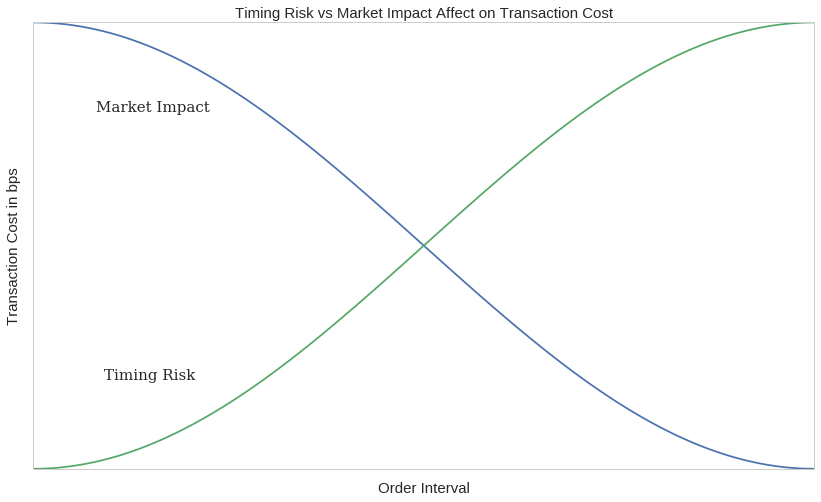
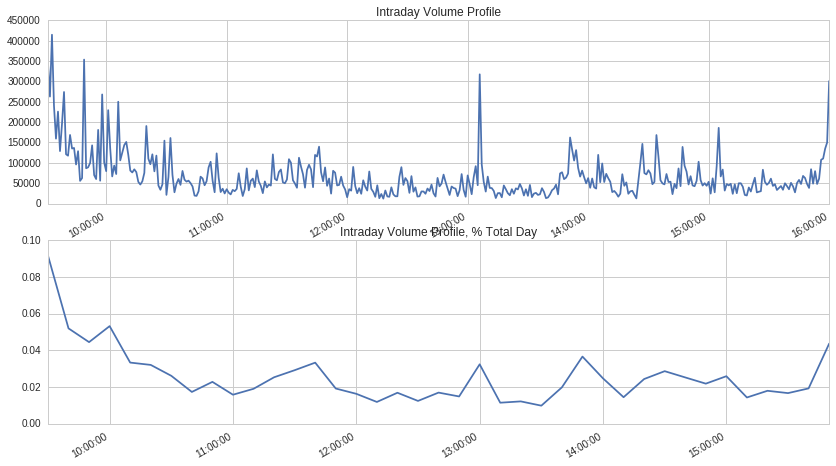
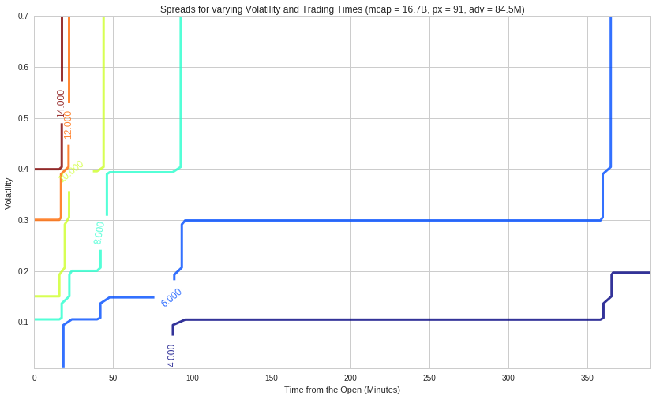
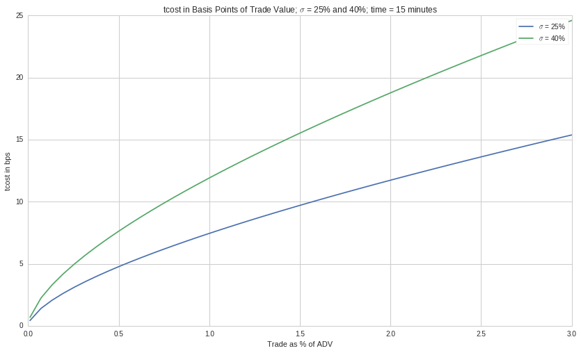
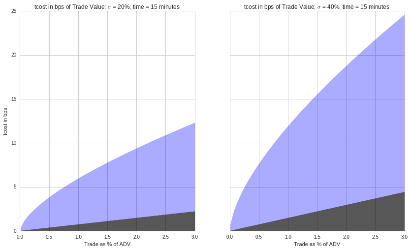
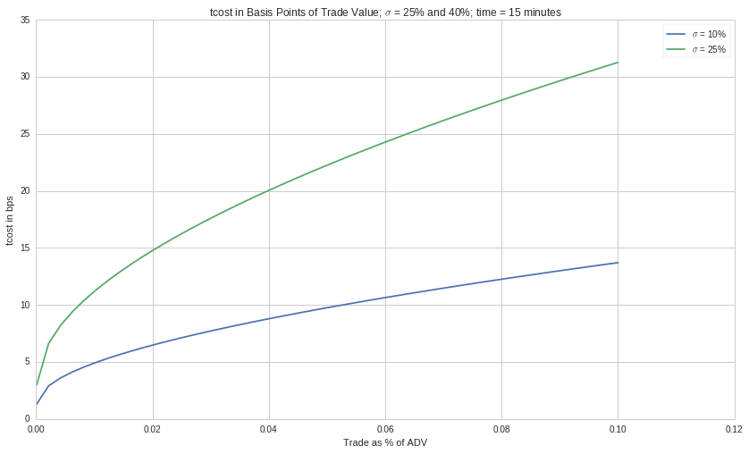

Market Impact Models
====================

By Dr. Michele Goe

Part of the Quantopian Lecture Series: \*
https://www.quantopian.com/lectures \*
https://github.com/quantopian/research_public —

In this lecture we seek to clarify transaction costs and how they impact
algorithm performance. By the end of this lecture you should be able to:
1. Understand the attributes that influence transaction costs based on
published market impact model research and our own experience 2.
Understand the impact of turnover rate, transaction costs, and leverage
on your strategy performance 3. Become familiar with how institutional
quant trading teams think about and measure transaction cost.

.. code:: ipython2

    import numpy as np
    import matplotlib.pyplot as plt
    import pandas as pd
    import time

Intro to Transaction Costs
--------------------------

Transaction costs fall into two categories \* Direct (commissions and
fees): explicit, easily measured, and in institutional trading,
relatively “small” \* Indirect (market impact and spread costs): **the
purpose of this lecture**

Slippage is when the price ‘slips’ before the trade is fully executed,
leading to the fill price being different from the price at the time of
the order. The attributes of a trade that our research shows have the
most influence on slippage are: 1. **Volatility** 2. **Liquidity** 3.
**Relative order size** 4. **Bid - ask spread**

Transaction Cost Impact on Portfolio Performance
------------------------------------------------

Let’s consider a hypothetical mid-frequency statistical arbitrage\*
portfolio :

============================== ===
Algo Attribute                 Qty
============================== ===
Holding Period (weeks)         1
Leverage                       2
AUM (million)                  100
Trading Days per year          252
Fraction of AUM traded per day 0.4
============================== ===

This means we trade in and out of a new portfolio roughly 50 times a
year. At 2 times leverage, on 100 million in AUM, we trade 20 billion
dollars per year.

**Q: For this level of churn what is the impact of 1 bps of execution
cost to the fund’s returns?**

This means for every basis point (:math:`0.01\%`) of transaction cost we
lose :math:`2\%` off algo performance.

\* To clarify, a mid-freqency strategy refers roughly to a daily
turnover between :math:`0.05` - :math:`0.67`. This represents a holding
period between a day and a week. Statistical arbitrage refers to the use
computational algorithms to simultaneously buy and sell stocks according
to a statistical model.

.. code:: ipython2

    def perf_impact(leverage, turnover , trading_days, txn_cost_bps):
        p = leverage *  turnover * trading_days * txn_cost_bps/10000.
        return p

.. code:: ipython2

    print perf_impact(leverage=2, turnover=0.4, trading_days=252, txn_cost_bps=1)

.. parsed-literal::

    0.02016

How do institutional quant trading teams evaluate transaction cost ?
--------------------------------------------------------------------

Quantitiative institutional trading teams typically utilize execution
tactics that aim to complete parent orders fully, while minimizing the
cost of execution. To achieve this goal, parent orders are often split
into a number of child orders, which are routed to different execution
venues, with the goal to capture all the available liquidity and
minimize the bid-ask spread. The parent-level execution price can be
expressed as the volume-weighted average price of all child orders.

**Q: What benchmark(s) should we compare our execution price to ?**

*Quantopian Trading Team Benchmarks :* \* **Arrival Price** - the
“decision” price of the algo, defined as the mid-quote at the time the
algo placed the parent order (mid is the half-way point between the best
bid and ask quotes) \* **Interval VWAP** - volume-weighted average price
during the life of the order \* **T + 10 min** - reversion benchmark,
price 10 min after the last fill vs execution price \* **T + 30 min** -
reversion benchmark, price 30 min after the last fill vs execution price
\* **Close** - reversion benchmark, price at close vs the execution
price \* **Open** - momentum benchmark, price at open vs the execution
price \* **Previous close** - momentum benchmark, price at previous
close vs execution price \*Other metrics and definitions

.. math::  Metric  = \frac{Side * (Benchmark - Execution\thinspace Price )* 100 * 100}{ Benchmark }

*Key Ideas* \* **Execution Price** - volume-weighted average price of
all fills or child orders \* **Cost vs Arrival Price** - difference
between the arrival price and the execution price, expressed in basis
points. The idea with this benchmark is to compare the execution price
against the decision price of the strategy. This cost is sometimes
called “slippage” or “implementation shortfall.”

The reversion metrics give us an indication of our temporary impact
after the order has been executed. Generally, we’d expect the stock
price to revert a bit, upon our order completion, as our contribution to
the buy-sell imbalance is reflected in the market. The momentum metrics
give us an indication of the direction of price drift prior to
execution. Often, trading with significant momentum can affect our
ability to minimize the bid-ask spread costs.

When executing an order, one of the primary tradeoffs to consider is
timing risk vs. market impact: \* **Timing Risk** - risk of price drift
and information leakage as interval between arrival mid quote and last
fill increases. \* **Market Impact** - (high urgency) risk of moving the
market by shortening the interval between arrival mid quote and last
fill.

Within this framework, neutral urgency of execution occurs at the
intersection of market risk and market impact - in this case, each
contributes the same to execution costs.

.. code:: ipython2

    x = np.linspace(0,1,101)
    risk = np.cos(x*np.pi)
    impact = np.cos(x* np.pi+ np.pi)
    
    fig,ax = plt.subplots(1)
    # Make your plot, set your axes labels
    ax.plot(x,risk)
    ax.plot(x,impact)
    ax.set_ylabel('Transaction Cost in bps', fontsize=15)
    ax.set_xlabel('Order Interval', fontsize=15)
    ax.set_yticklabels([])
    ax.set_xticklabels([])
    ax.grid(False)
    ax.text(0.09, -0.6, 'Timing Risk', fontsize=15, fontname="serif")
    ax.text(0.08, 0.6, 'Market Impact', fontsize=15, fontname="serif")
    plt.title('Timing Risk vs Market Impact Affect on Transaction Cost', fontsize=15)
    plt.show()

**Liquidity**
-------------

Liquidity can be viewed through several lenses. Within the context of
execution management, we can think of it as activity, measured in shares
and USD traded, as well as frequency and size of trades executed in the
market. “Good” liquidity is also achieved through a diverse number of
market participants on both sides of the market.

Assess Liquidity by: \* intraday volume curve \* percent of day’s volume
\* percent of average daily dollar volume in an interval \* cummulative
intraday volume curve \* relative order size

In general, liquidity is highest as we approach the close, and second
highest at the open. Mid day has the lowest liquidity. Liquidity should
also be viewed relative to your order size and other securities in the
same sector and class.

.. code:: ipython2

    tickers = symbols(['FB']) # Facebook ticker
    num_stocks = len(tickers)
    
    # %%timeit -n1 -r1 magic is not allowed in Q
    start = time.time()
    data = get_pricing(tickers,
                       fields='volume',
                       frequency='minute',
                       start_date='2016-1-1',
                       end_date='2016-7-1')
    end = time.time()
    print "Time: %0.2f seconds." % (end - start)
    data = data.tz_convert('US/Eastern') # Q data comes in as UTC
    
    dat = data[symbols('FB')]
    plt.subplot(211)
    dat['2016-04-14'].plot(title='Intraday Volume Profile') # intraday volume profile plot 
    plt.subplot(212)
    (dat['2016-04-14'].resample('10t', closed='right').sum()/\
         dat['2016-04-14'].sum()).plot(); # percent volume plot
    plt.title('Intraday Volume Profile, % Total Day');

.. parsed-literal::

    Time: 0.31 seconds.

.. code:: ipython2

    df = pd.DataFrame(dat) # Facebook minutely volume data
    
    df.columns = ['interval_vlm'] 
    
    df_daysum = df.resample('d').sum() # take sum of each day 
    df_daysum.columns = ['day_vlm']
    df_daysum['day'] = df_daysum.index.date # add date index as column
    
    df['min_of_day']=(df.index.hour-9)*60 + (df.index.minute-30) # calculate minutes from open
    df['time']=df.index.time # add time index as column
    
    conversion = {'interval_vlm':'sum', 'min_of_day':'last', 'time':'last'}
    df = df.resample('10t', closed='right').apply(conversion) # apply conversions to columns at 10 min intervals
    df['day'] = df.index.date
    
    df = df.merge(df_daysum, how='left', on='day') # merge df and df_daysum dataframes
    df['interval_pct'] = df['interval_vlm'] / df['day_vlm'] # calculate percent of days volume for each row
    df.head()

.. raw:: html

    

    <table border="1" class="dataframe">
      <thead>
        <tr style="text-align: right;">
          <th></th>
          <th>interval_vlm</th>
          <th>time</th>
          <th>min_of_day</th>
          <th>day</th>
          <th>day_vlm</th>
          <th>interval_pct</th>
        </tr>
      </thead>
      <tbody>
        <tr>
          <th>0</th>
          <td>2553931.0</td>
          <td>09:40:00</td>
          <td>10.0</td>
          <td>2016-01-04</td>
          <td>31872469.0</td>
          <td>0.080130</td>
        </tr>
        <tr>
          <th>1</th>
          <td>2246748.0</td>
          <td>09:50:00</td>
          <td>20.0</td>
          <td>2016-01-04</td>
          <td>31872469.0</td>
          <td>0.070492</td>
        </tr>
        <tr>
          <th>2</th>
          <td>1518230.0</td>
          <td>10:00:00</td>
          <td>30.0</td>
          <td>2016-01-04</td>
          <td>31872469.0</td>
          <td>0.047635</td>
        </tr>
        <tr>
          <th>3</th>
          <td>1599570.0</td>
          <td>10:10:00</td>
          <td>40.0</td>
          <td>2016-01-04</td>
          <td>31872469.0</td>
          <td>0.050187</td>
        </tr>
        <tr>
          <th>4</th>
          <td>1909115.0</td>
          <td>10:20:00</td>
          <td>50.0</td>
          <td>2016-01-04</td>
          <td>31872469.0</td>
          <td>0.059899</td>
        </tr>
      </tbody>
    </table>
    

.. code:: ipython2

    plt.scatter(df.min_of_day, df.interval_pct)
    plt.xlim(0,400)
    plt.xlabel('Time from the Open (minutes)')
    plt.ylabel('Percent Days Volume')

.. parsed-literal::

    <matplotlib.text.Text at 0x7f9698127210>

.. image:: notebook_files/notebook_11_1.png

.. code:: ipython2

    grouped = df.groupby(df.min_of_day)
    grouped = df.groupby(df.time) # group by 10 minute interval times
    m = grouped.median()  # get median values of groupby
    x = m.index
    y = m['interval_pct']
    
    fig, ax1 = plt.subplots();
    ax1.bar(x, 100*y, -60*10 ,alpha=0.75); # plot percent daily volume grouped by 10 minute interval times
    ax1.set_ylim(0,10);
    ax2 = ax1.twinx();
    ax2.plot(x,(100*y).cumsum()); # plot cummulative distribution of median daily volume
    ax2.set_ylim(0,100);
    plt.title('Intraday Volume Profile');
    ax1.set_ylabel('% of Day\'s Volume in Bucket');
    ax2.set_ylabel('Cumulative % of Day\'s Volume');

.. image:: notebook_files/notebook_12_0.png

Relative Order Size
-------------------

As we increase relative order size at a specified participation rate,
the time to complete the order increases. Let’s assume we execute an
order using VWAP, a scheduling strategy, which executes orders over a
pre-specified time window, according to the projections of volume
distribution throughout that time window: At 3% participation rate for
VWAP execution, we require the entire day to trade if our order
represents 3% of average daily volume.

If we expect our algo to have high relative order sizes then we may want
to switch to liquidity management execution strategy when trading to
ensure order completion by the end of the day. Liquidity management
execution strategies have specific constraints for the urgency of
execution, choice of execution venues and spread capture with the
objective of order completion. Going back to our risk curves, we expect
higher transaction costs the longer we trade. Therefore, the higher
percent ADV of an order the more expensive to trade.

.. code:: ipython2

    
    dat = get_pricing(symbols(['FB']), fields='volume', frequency='minute', start_date='2016-1-1', end_date='2018-1-2')
    dat = dat.tz_convert('US/Eastern') # Q data comes in as UTC
    
    
    def relative_order_size(participation_rate, pct_ADV):
        fill_start = dat['2017-10-02'].index[0] # start order at 9:31
        ADV20 = int(dat.resample("1d").sum()[-20:].mean()) # calculate 20 day ADV
        order_size = int(pct_ADV * ADV20)
        #print 'order size:', order_size, 'daily volume:', dat['2016-07-01'].sum()/(1.0*10**6), 'M shares'
        try :
            ftime = dat['2017-10-02'][(order_size * 1.0 / participation_rate)<=dat['2017-10-02'].cumsum().values].index[0]
        except: 
            ftime = dat['2017-10-02'].index[-1] # set fill time to 4p 
        fill_time = max(1,int((ftime - fill_start).total_seconds()/60.0))
        #print 'order fill time' ,fill_time,  'minutes'
        return fill_time
    
    def create_plots(participation_rate, ax):
        df_pr = pd.DataFrame(data=np.linspace(0.0,0.1,100), columns = ['adv'] ) # create dataframe with intervals of ADV
        df_pr['pr'] = participation_rate # add participation rate column
    
        df_pr['fill_time'] = df_pr.apply(lambda row: relative_order_size(row['pr'],row['adv']), axis = 1) # get fill time
    
        ax.plot(df_pr['adv'],df_pr['fill_time'], label=participation_rate) # generate plot line with ADV and fill time
    
    fig, ax = plt.subplots() 
    for i in [0.01,0.02,0.03,0.04,0.05,0.06,0.07]: # for participation rate values
        create_plots(i,ax) # generate plot line
        
    plt.ylabel('Time from Open (minutes)')
    plt.xlabel('Percent Average Daily Volume')
    plt.title('Trade Completion Time as Function of Relative Order Size and Participation Rate')
    plt.xlim(0.,0.04)
    ax.legend()

.. parsed-literal::

    <matplotlib.legend.Legend at 0x7f968ca6c550>

.. image:: notebook_files/notebook_14_1.png

Volatility
----------

Volatilty is a statistical measure of dispersion of returns for a
security. Calculated as the standard deviation of returns. The
volatility of any given stock typically peaks at the open and therafter
decreases until mid-day.The higher the volatility the more uncertainty
in the returns. This uncertainty is an artifact of larger bid-ask
spreads during the price discovery process at the start of the trading
day. In contrast to liquidity, where we would prefer to trade at the
open to take advantage of high volumes, to take advantage of low
volatility we would trade at the close.

We use two methods to calculate volatility for demonstration purposes,
OHLC and, the most common, close-to-close. OHLC uses the Garman-Klass
Yang-Zhang volatilty estimate that employs open, high, low, and close
data.

OHLC VOLATILITY ESTIMATION METHOD

.. math:: \sigma^2 = \frac{Z}{n} \sum \left[\left(\ln \frac{O_i}{C_{i-1}} \right)^2  +  \frac{1}{2} \left( \ln \frac{H_i}{L_i} \right)^2 - (2 \ln 2 -1) \left( \ln \frac{C_i}{O_i} \right)^2 \right]

CLOSE TO CLOSE HISTORICAL VOLATILITY ESTIMATION METHOD

Volatility is calculated as the annualised standard deviation of log
returns as detailed in the equation below.

.. math::  Log \thinspace return = x_1 = \ln (\frac{c_i + d_i}{c_i-1} ) 

where d_i = ordinary(not adjusted) dividend and ci is close price

.. math::  Volatilty =  \sigma_x \sqrt{ \frac{1}{N} \sum_{i=1}^{N} (x_i - \bar{x})^2 }

See end of notebook for references

.. code:: ipython2

    tickers = symbols(['FB'])
    start = time.time()
    data = get_pricing(tickers, frequency='minute', start_date='2016-1-1', end_date='2016-7-1')
    end = time.time()
    print "Time: %0.2f seconds." % (end - start)
    
    data.items
    data.describe
    data['price']
    df = data.to_frame().unstack()
    df.columns = df.columns.droplevel(1) # drop the ticker
    df.index.name = None 
    df = df.tz_convert('US/Eastern') # Q data comes in as UTC, convert to EST
    df.head()

.. parsed-literal::

    Time: 0.15 seconds.

.. raw:: html

    

    <table border="1" class="dataframe">
      <thead>
        <tr style="text-align: right;">
          <th></th>
          <th>open_price</th>
          <th>high</th>
          <th>low</th>
          <th>close_price</th>
          <th>volume</th>
          <th>price</th>
        </tr>
      </thead>
      <tbody>
        <tr>
          <th>2016-01-04 09:31:00-05:00</th>
          <td>101.950</td>
          <td>102.07</td>
          <td>101.72</td>
          <td>101.830</td>
          <td>804756.0</td>
          <td>101.830</td>
        </tr>
        <tr>
          <th>2016-01-04 09:32:00-05:00</th>
          <td>101.810</td>
          <td>101.94</td>
          <td>101.60</td>
          <td>101.864</td>
          <td>231895.0</td>
          <td>101.864</td>
        </tr>
        <tr>
          <th>2016-01-04 09:33:00-05:00</th>
          <td>101.865</td>
          <td>102.24</td>
          <td>101.84</td>
          <td>102.160</td>
          <td>222334.0</td>
          <td>102.160</td>
        </tr>
        <tr>
          <th>2016-01-04 09:34:00-05:00</th>
          <td>102.160</td>
          <td>102.23</td>
          <td>101.96</td>
          <td>102.180</td>
          <td>161446.0</td>
          <td>102.180</td>
        </tr>
        <tr>
          <th>2016-01-04 09:35:00-05:00</th>
          <td>102.160</td>
          <td>102.19</td>
          <td>101.94</td>
          <td>101.960</td>
          <td>210727.0</td>
          <td>101.960</td>
        </tr>
      </tbody>
    </table>
    

.. code:: ipython2

    def gkyz_var(open, high, low, close, close_tm1): # Garman Klass Yang Zhang extension OHLC volatility estimate
        return np.log(open/close_tm1)**2 + 0.5*(np.log(high/low)**2) \
            - (2*np.log(2)-1)*(np.log(close/open)**2)
        
    def historical_vol(close_ret, mean_ret): # close to close volatility estimate
        return np.sqrt(np.sum((close_ret-mean_ret)**2)/390)

.. code:: ipython2

    df['min_of_day'] = (df.index.hour-9)*60 + (df.index.minute-30) # calculate minute from the open
    df['time'] = df.index.time # add column time index
    df['day'] = df.index.date # add column date index
    df.head()

.. raw:: html

    

    <table border="1" class="dataframe">
      <thead>
        <tr style="text-align: right;">
          <th></th>
          <th>open_price</th>
          <th>high</th>
          <th>low</th>
          <th>close_price</th>
          <th>volume</th>
          <th>price</th>
          <th>min_of_day</th>
          <th>time</th>
          <th>day</th>
        </tr>
      </thead>
      <tbody>
        <tr>
          <th>2016-01-04 09:31:00-05:00</th>
          <td>101.950</td>
          <td>102.07</td>
          <td>101.72</td>
          <td>101.830</td>
          <td>804756.0</td>
          <td>101.830</td>
          <td>1</td>
          <td>09:31:00</td>
          <td>2016-01-04</td>
        </tr>
        <tr>
          <th>2016-01-04 09:32:00-05:00</th>
          <td>101.810</td>
          <td>101.94</td>
          <td>101.60</td>
          <td>101.864</td>
          <td>231895.0</td>
          <td>101.864</td>
          <td>2</td>
          <td>09:32:00</td>
          <td>2016-01-04</td>
        </tr>
        <tr>
          <th>2016-01-04 09:33:00-05:00</th>
          <td>101.865</td>
          <td>102.24</td>
          <td>101.84</td>
          <td>102.160</td>
          <td>222334.0</td>
          <td>102.160</td>
          <td>3</td>
          <td>09:33:00</td>
          <td>2016-01-04</td>
        </tr>
        <tr>
          <th>2016-01-04 09:34:00-05:00</th>
          <td>102.160</td>
          <td>102.23</td>
          <td>101.96</td>
          <td>102.180</td>
          <td>161446.0</td>
          <td>102.180</td>
          <td>4</td>
          <td>09:34:00</td>
          <td>2016-01-04</td>
        </tr>
        <tr>
          <th>2016-01-04 09:35:00-05:00</th>
          <td>102.160</td>
          <td>102.19</td>
          <td>101.94</td>
          <td>101.960</td>
          <td>210727.0</td>
          <td>101.960</td>
          <td>5</td>
          <td>09:35:00</td>
          <td>2016-01-04</td>
        </tr>
      </tbody>
    </table>
    

.. code:: ipython2

    df['close_tm1'] = df.groupby('day')['close_price'].shift(1)  # shift close value down one row
    df.close_tm1 = df.close_tm1.fillna(df.open_price)
    df['min_close_ret'] = np.log( df['close_price'] /df['close_tm1']) # log of close to close
    close_returns = df.groupby('day')['min_close_ret'].mean() # daily mean of log of close to close
    new_df = df.merge(pd.DataFrame(close_returns), left_on ='day', right_index = True)
    # handle when index goes from 16:00 to 9:31:
    
    new_df['variance'] = new_df.apply(
        lambda row: historical_vol(row.min_close_ret_x, row.min_close_ret_y),
        axis=1)
    #df['variance'] = df.apply(
    #    lambda row: gkyz_var(row.open_price, row.high, row.low,
    #                         row.close_price, row.close_tm1),
    #    axis=1)
    
    new_df.head()

.. raw:: html

    

    <table border="1" class="dataframe">
      <thead>
        <tr style="text-align: right;">
          <th></th>
          <th>open_price</th>
          <th>high</th>
          <th>low</th>
          <th>close_price</th>
          <th>volume</th>
          <th>price</th>
          <th>min_of_day</th>
          <th>time</th>
          <th>day</th>
          <th>close_tm1</th>
          <th>min_close_ret_x</th>
          <th>min_close_ret_y</th>
          <th>variance</th>
        </tr>
      </thead>
      <tbody>
        <tr>
          <th>2016-01-04 09:31:00-05:00</th>
          <td>101.950</td>
          <td>102.07</td>
          <td>101.72</td>
          <td>101.830</td>
          <td>804756.0</td>
          <td>101.830</td>
          <td>1</td>
          <td>09:31:00</td>
          <td>2016-01-04</td>
          <td>101.950</td>
          <td>-0.001178</td>
          <td>0.000006</td>
          <td>0.000060</td>
        </tr>
        <tr>
          <th>2016-01-04 09:32:00-05:00</th>
          <td>101.810</td>
          <td>101.94</td>
          <td>101.60</td>
          <td>101.864</td>
          <td>231895.0</td>
          <td>101.864</td>
          <td>2</td>
          <td>09:32:00</td>
          <td>2016-01-04</td>
          <td>101.830</td>
          <td>0.000334</td>
          <td>0.000006</td>
          <td>0.000017</td>
        </tr>
        <tr>
          <th>2016-01-04 09:33:00-05:00</th>
          <td>101.865</td>
          <td>102.24</td>
          <td>101.84</td>
          <td>102.160</td>
          <td>222334.0</td>
          <td>102.160</td>
          <td>3</td>
          <td>09:33:00</td>
          <td>2016-01-04</td>
          <td>101.864</td>
          <td>0.002902</td>
          <td>0.000006</td>
          <td>0.000147</td>
        </tr>
        <tr>
          <th>2016-01-04 09:34:00-05:00</th>
          <td>102.160</td>
          <td>102.23</td>
          <td>101.96</td>
          <td>102.180</td>
          <td>161446.0</td>
          <td>102.180</td>
          <td>4</td>
          <td>09:34:00</td>
          <td>2016-01-04</td>
          <td>102.160</td>
          <td>0.000196</td>
          <td>0.000006</td>
          <td>0.000010</td>
        </tr>
        <tr>
          <th>2016-01-04 09:35:00-05:00</th>
          <td>102.160</td>
          <td>102.19</td>
          <td>101.94</td>
          <td>101.960</td>
          <td>210727.0</td>
          <td>101.960</td>
          <td>5</td>
          <td>09:35:00</td>
          <td>2016-01-04</td>
          <td>102.180</td>
          <td>-0.002155</td>
          <td>0.000006</td>
          <td>0.000109</td>
        </tr>
      </tbody>
    </table>
    

.. code:: ipython2

    df_daysum = pd.DataFrame(new_df['variance'].resample('d').sum()) # get sum of intraday variances daily
    df_daysum.columns = ['day_variance']
    df_daysum['day'] = df_daysum.index.date
    df_daysum.head()

.. raw:: html

    

    <table border="1" class="dataframe">
      <thead>
        <tr style="text-align: right;">
          <th></th>
          <th>day_variance</th>
          <th>day</th>
        </tr>
      </thead>
      <tbody>
        <tr>
          <th>2016-01-04 00:00:00-05:00</th>
          <td>0.013261</td>
          <td>2016-01-04</td>
        </tr>
        <tr>
          <th>2016-01-05 00:00:00-05:00</th>
          <td>0.011726</td>
          <td>2016-01-05</td>
        </tr>
        <tr>
          <th>2016-01-06 00:00:00-05:00</th>
          <td>0.013465</td>
          <td>2016-01-06</td>
        </tr>
        <tr>
          <th>2016-01-07 00:00:00-05:00</th>
          <td>0.019523</td>
          <td>2016-01-07</td>
        </tr>
        <tr>
          <th>2016-01-08 00:00:00-05:00</th>
          <td>0.015441</td>
          <td>2016-01-08</td>
        </tr>
      </tbody>
    </table>
    

.. code:: ipython2

    
    conversion = {'variance':'sum', 'min_of_day':'last', 'time':'last'}
    df = new_df.resample('10t', closed='right').apply(conversion)
    df['day'] = df.index.date
    df['time'] = df.index.time
    df.head()

.. raw:: html

    

    <table border="1" class="dataframe">
      <thead>
        <tr style="text-align: right;">
          <th></th>
          <th>variance</th>
          <th>time</th>
          <th>min_of_day</th>
          <th>day</th>
        </tr>
      </thead>
      <tbody>
        <tr>
          <th>2016-01-04 09:30:00-05:00</th>
          <td>0.000691</td>
          <td>09:30:00</td>
          <td>10.0</td>
          <td>2016-01-04</td>
        </tr>
        <tr>
          <th>2016-01-04 09:40:00-05:00</th>
          <td>0.000875</td>
          <td>09:40:00</td>
          <td>20.0</td>
          <td>2016-01-04</td>
        </tr>
        <tr>
          <th>2016-01-04 09:50:00-05:00</th>
          <td>0.000740</td>
          <td>09:50:00</td>
          <td>30.0</td>
          <td>2016-01-04</td>
        </tr>
        <tr>
          <th>2016-01-04 10:00:00-05:00</th>
          <td>0.000489</td>
          <td>10:00:00</td>
          <td>40.0</td>
          <td>2016-01-04</td>
        </tr>
        <tr>
          <th>2016-01-04 10:10:00-05:00</th>
          <td>0.000654</td>
          <td>10:10:00</td>
          <td>50.0</td>
          <td>2016-01-04</td>
        </tr>
      </tbody>
    </table>
    

.. code:: ipython2

    df = df.merge(df_daysum, how='left', on='day') # merge daily and intraday volatilty dataframes
    df['interval_pct'] = df['variance'] / df['day_variance'] # calculate percent of days volatility for each row
    df.head()

.. raw:: html

    

    <table border="1" class="dataframe">
      <thead>
        <tr style="text-align: right;">
          <th></th>
          <th>variance</th>
          <th>time</th>
          <th>min_of_day</th>
          <th>day</th>
          <th>day_variance</th>
          <th>interval_pct</th>
        </tr>
      </thead>
      <tbody>
        <tr>
          <th>0</th>
          <td>0.000691</td>
          <td>09:30:00</td>
          <td>10.0</td>
          <td>2016-01-04</td>
          <td>0.013261</td>
          <td>0.052138</td>
        </tr>
        <tr>
          <th>1</th>
          <td>0.000875</td>
          <td>09:40:00</td>
          <td>20.0</td>
          <td>2016-01-04</td>
          <td>0.013261</td>
          <td>0.065999</td>
        </tr>
        <tr>
          <th>2</th>
          <td>0.000740</td>
          <td>09:50:00</td>
          <td>30.0</td>
          <td>2016-01-04</td>
          <td>0.013261</td>
          <td>0.055801</td>
        </tr>
        <tr>
          <th>3</th>
          <td>0.000489</td>
          <td>10:00:00</td>
          <td>40.0</td>
          <td>2016-01-04</td>
          <td>0.013261</td>
          <td>0.036899</td>
        </tr>
        <tr>
          <th>4</th>
          <td>0.000654</td>
          <td>10:10:00</td>
          <td>50.0</td>
          <td>2016-01-04</td>
          <td>0.013261</td>
          <td>0.049305</td>
        </tr>
      </tbody>
    </table>
    

.. code:: ipython2

    plt.scatter(df.min_of_day, df.interval_pct)
    plt.xlim(0,400)
    plt.ylim(0,)
    plt.xlabel('Time from Open (minutes)')
    plt.ylabel('Interval Contribution of Daily Volatility')
    plt.title('Probabilty Distribution of Daily Volatility ')

.. parsed-literal::

    <matplotlib.text.Text at 0x7f96876ac690>

.. image:: notebook_files/notebook_23_1.png

.. code:: ipython2

    grouped = df.groupby(df.min_of_day)
    grouped = df.groupby(df.time) # groupby time
    m = grouped.median() # get median
    x = m.index
    y = m['interval_pct']
    
    fig, ax1 = plt.subplots()
    ax1.bar(x, 100*y, 60*10 ,alpha=0.75);# plot interval percent of median daily volatility 
    ax2 = ax1.twinx()
    ax2.plot(x, (100*y).cumsum()) # plot cummulative distribution of median daily volatility
    ax2.set_ylim(0,100);
    plt.title('Intraday Volatility Profile')
    ax1.set_ylabel('% of Day\'s Variance in Bucket');
    ax2.set_ylabel('Cumulative % of Day\'s Variance');
    #cut off graph at 4pm

.. image:: notebook_files/notebook_24_0.png

Bid-Ask Spread
--------------

The following relationships between bid-ask spread and order attributes
are seen in our live trading data:

-  As **market cap** increases we expect spreads to decrease. Larger
   companies tend to exhibit lower bid-ask spreads.

-  As **volatility** increases we expect spreads to increase. Greater
   price uncertainty results in wider bid-ask spreads.

-  As **average daily dollar volume** increases, we expect spreads to
   decrease. Liquidity tends to be inversely proportional to spreads,
   due to larger number of participants and more frequent updates to
   quotes.

-  As **price** increases, we expect spreads to decrease (similar to
   market cap), although this relationship is not as strong.

-  As **time of day** progresses we expect spreads to decrease. During
   early stages of a trading day, price discovery takes place. in
   contrast, at market close order completion is the priority of most
   participants and activity is led by liquidity management, rather than
   price discovery.

The Trading Team developed a log-linear model fit to our live data that
predicts the spread for a security with which we have the above listed
attributes.

.. code:: ipython2

    def model_spread(time, vol, mcap = 1.67 * 10 ** 10, adv = 84.5, px = 91.0159):
        time_bins = np.array([0.0, 960.0, 2760.0, 5460.0, 21660.0]) #seconds from market open
        time_coefs = pd.Series([0.0, -0.289, -0.487, -0.685, -0.952])
        
        vol_bins = np.array([0.0, .1, .15, .2, .3, .4])
        vol_coefs = pd.Series([0.0, 0.251, 0.426, 0.542, 0.642, 0.812])
        
        mcap_bins = np.array([0.0, 2.0, 5.0, 10.0, 25.0, 50.0]) * 10 ** 9
        mcap_coefs = pd.Series([0.291, 0.305, 0.0, -0.161, -0.287, -0.499])
        
        adv_bins = np.array([0.0, 50.0, 100.0, 150.0, 250.0, 500.0]) * 10 ** 6
        adv_coefs = pd.Series([0.303, 0.0, -0.054, -0.109, -0.242, -0.454])
        
        px_bins = np.array([0.0, 28.0, 45.0, 62.0, 82.0, 132.0])
        px_coefs = pd.Series([-0.077, -0.187, -0.272, -0.186, 0.0, 0.380])
        
        return np.exp(1.736 +\
                      time_coefs[np.digitize(time, time_bins) - 1] +\
                      vol_coefs[np.digitize(vol, vol_bins) - 1] +\
                      mcap_coefs[np.digitize(mcap, mcap_bins) - 1] +\
                      adv_coefs[np.digitize(adv, adv_bins) - 1] +\
                      px_coefs[np.digitize(px, px_bins) - 1])
    
    

Predict the spread for the following order :
~~~~~~~~~~~~~~~~~~~~~~~~~~~~~~~~~~~~~~~~~~~~

-  Stock: DPS
-  Qty: 425 shares
-  Time of day : 9:41 am July 19, 2017, 600 seconds from open
-  Market Cap : 1.67e10
-  Volatility: 18.8%
-  ADV : 929k shares ; 84.5M dollars
-  Avg Price : 91.0159

.. code:: ipython2

    t = 10 * 60
    vlty = 0.188
    mcap = 1.67 * 10 ** 10
    adv = 84.5 *10
    price = 91.0159 
    print model_spread(t, vlty, mcap, adv, price), 'bps'

.. parsed-literal::

    10.0141590846 bps

.. code:: ipython2

    x = np.linspace(0,390*60) # seconds from open shape (50,)
    y = np.linspace(.01,.7) # volatility shape(50,)
    mcap = 1.67 * 10 ** 10
    adv = 84.5
    px = 91.0159
    
    
    vlty_coefs = pd.Series([0.0, 0.251, 0.426, 0.542, 0.642, 0.812])
    vlty_bins = np.array([0.0, .1, .15, .2, .3, .4])
    time_bins = np.array([0.0, 960.0, 2760.0, 5460.0, 21660.0]) #seconds from market open
    time_coefs = pd.Series([0.0, -0.289, -0.487, -0.685, -0.952])
    mcap_bins = np.array([0.0, 2.0, 5.0, 10.0, 25.0, 50.0]) * 10 ** 9
    mcap_coefs = pd.Series([0.291, 0.305, 0.0, -0.161, -0.287, -0.499])
    adv_bins = np.array([0.0, 50.0, 100.0, 150.0, 250.0, 500.0]) * 10 ** 6
    adv_coefs = pd.Series([0.303, 0.0, -0.054, -0.109, -0.242, -0.454])
    px_bins = np.array([0.0, 28.0, 45.0, 62.0, 82.0, 132.0])
    px_coefs = pd.Series([-0.077, -0.187, -0.272, -0.186, 0.0, 0.380])
    # shape (1, 50)
    time_contrib = np.take(time_coefs, np.digitize(x, time_bins) - 1).reshape((1, len(x)))
    # shape (50, 1)
    vlty_contrib = np.take(vlty_coefs, np.digitize(y, vlty_bins) - 1).reshape((len(y), 1))
    # scalar
    mcap_contrib = mcap_coefs[np.digitize((mcap,), mcap_bins)[0] - 1]
    # scalar
    adv_contrib = adv_coefs[np.digitize((adv,), adv_bins)[0] - 1]
    # scalar
    px_contrib = px_coefs[np.digitize((px,), px_bins)[0] - 1]
    
    z_scalar_contrib = 1.736 + mcap_contrib + adv_contrib + px_contrib
    
    
    Z = np.exp(z_scalar_contrib + time_contrib + vlty_contrib)
    
    cmap=plt.get_cmap('jet')
    X, Y = np.meshgrid(x,y)
    CS = plt.contour(X/60,Y,Z, linewidths=3, cmap=cmap, alpha=0.8);
    plt.clabel(CS)
    plt.xlabel('Time from the Open (Minutes)')
    plt.ylabel('Volatility')
    plt.title('Spreads for varying Volatility and Trading Times (mcap = 16.7B, px = 91, adv = 84.5M)')
    plt.show()

**Quantifying Market Impact**
-----------------------------

Theoritical Market Impact models attempt to estimate transaction costs
of trading by utilizing order attributes. There are many published
market impact models. Here are some examples:

1. Quantopian Volume Slippage Model
2. Almgren et al 2005
3. Kissell et al. 2004
4. J.P. Morgan Model 2010

The models have a few commonalities such as the inclusion of relative
order size, volatility as well as custom parameters calculated from
observed trades.There are also notable differences in the models such as
(1) JPM explictly calls out spread impact, (2) Almgren considers
fraction of outstanding shares traded daily, (3) Q Slipplage Model does
not consider volatility , and (4) Kissel explicit parameter to
proportion temporary and permenant impact, to name a few.

The academic models have notions of temporary and permanant impact.
**Temporary Impact** captures the impact on transaction costs due to
urgency or aggressiveness of the trade. While **Permenant Impact**
estimates with respect to information or short term alpha in a trade.

Almgren et al. model (2005)
~~~~~~~~~~~~~~~~~~~~~~~~~~~

This model assumes the initial order, X, is completed at a uniform rate
of trading over a volume time interval T. That is, the trade rate in
volume units is v = X/T, and is held constant until the trade is
completed. Constant rate in these units is equivalent to VWAP execution
during the time of execution.

Almgren et al. model these two terms as

.. math:: \text{tcost} = 0.5 \overbrace{\gamma \sigma  \frac{X}{V}\left(\frac{\Theta}{V}\right)^{1/4}}^{\text{permanent}} + \overbrace{\eta \sigma \left| \frac{X}{VT} \right|^{3/5}}^{\text{temporary}} 

where :math:`\gamma` and :math:`\eta` are the “universal coefficients of
market impact” and estimated by the authors using a large sample of
institutional trades; :math:`\sigma` is the daily volatility of the
stock; :math:`\Theta` is the total shares outstanding of the stock;
:math:`X` is the number of shares you would like to trade (unsigned);
:math:`T` is the time width in % of trading time over which you slice
the trade; and :math:`V` is the average daily volume (“ADV”) in shares
of the stock. The interpretation of :math:`\frac{\Theta}{V}` is the
inverse of daily “turnover”, the fraction of the company’s value traded
each day.

For reference, FB has 2.3B shares outstanding, its average daily volume
over 20 days is 18.8M therefore its inverse turnover is approximately
122, put another way, it trades less than 4% of outstanding shares
daily.

Potential Limitations
~~~~~~~~~~~~~~~~~~~~~

Note that the Almgren et al (2005) and Kissell, Glantz and Malamut
(2004) papers were released prior to the adoption and phased
implementation of `Reg
NMS <https://www.sec.gov/rules/final/34-51808.pdf>`__, prior to the
“quant meltdown” of August 2007, prior to the financial crisis hitting
markets in Q4 2008, and other numerous developments in market
microstructure.

.. code:: ipython2

    def perm_impact(pct_adv, annual_vol_pct = 0.25, inv_turnover = 200):
        gamma = 0.314
        return 10000 * gamma * (annual_vol_pct / 16) * pct_adv * (inv_turnover)**0.25
    
    def temp_impact(pct_adv, minutes, annual_vol_pct = 0.25, minutes_in_day = 60*6.5):
        eta = 0.142
        day_frac = minutes / minutes_in_day
        return 10000 * eta * (annual_vol_pct / 16) * abs(pct_adv/day_frac)**0.6
    
    def tc_bps(pct_adv, minutes, annual_vol_pct = 0.25, inv_turnover = 200, minutes_in_day = 60*6.5):
        perm = perm_impact(pct_adv, annual_vol_pct=annual_vol_pct, inv_turnover=inv_turnover)
        temp = temp_impact(pct_adv, minutes, annual_vol_pct=annual_vol_pct, minutes_in_day=minutes_in_day)
        return 0.5 * perm + temp

So if we are trading 10% of ADV of a stock with a daily vol of 1.57% and
we plan to do this over half the day, we would expect 8bps of TC (which
is the Almgren estimate of temporary impact cost in this scenario). From
the paper, this is a sliver of the output at various trading speeds:

=================================== =====
Variable                            IBM
=================================== =====
Inverse turnover (:math:`\Theta/V`) 263
Daily vol (:math:`\sigma`)          1.57%
Trade % ADV (X/V)                   10%
=================================== =====

=============================== ==== ====== ====
Item                            Fast Medium Slow
=============================== ==== ====== ====
Permanent Impact (bps)          20   20     20
Trade duration (day fraction %) 10%  20%    50%
Temporary Impact (bps)          22   15     8
Total Impact (bps)              32   25     18
=============================== ==== ====== ====

.. code:: ipython2

    print 'Cost to trade Fast (First 40 mins):', round(tc_bps(pct_adv=0.1, annual_vol_pct=16*0.0157, inv_turnover=263, minutes=0.1*60*6.5),2), 'bps'
    print 'Cost to trade Medium (First 90 mins):', round(tc_bps(pct_adv=0.1, annual_vol_pct=16*0.0157, inv_turnover=263, minutes=0.2*60*6.5),2), 'bps' 
    print 'Cost to trade Slow by Noon:', round(tc_bps(pct_adv=0.1, annual_vol_pct=16*0.0157, inv_turnover=263, minutes=0.5*60*6.5),2), 'bps'

.. parsed-literal::

    Cost to trade Fast (First 40 mins): 32.22 bps
    Cost to trade Medium (First 90 mins): 24.63 bps
    Cost to trade Slow by Noon: 18.41 bps

Trading 0.50% of ADV of a stock with a daily vol of 1.57% and we plan to
do this over 30 minutes…

.. code:: ipython2

    print round(tc_bps(pct_adv=0.005, minutes=30, annual_vol_pct=16*0.0157),2)

.. parsed-literal::

    4.79

Let’s say we wanted to trade $2M notional of Facebook, and we are going
to send the trade to an execution algo (e.g., VWAP) to be sliced over 15
minutes.

.. code:: ipython2

    trade_notional = 2000000 # 2M notional
    stock_price = 110.89 # dollars per share
    shares_to_trade = trade_notional/stock_price
    stock_adv_shares = 30e6 # 30 M
    stock_shares_outstanding = 275e9/110.89
    
    expected_tc = tc_bps(shares_to_trade/stock_adv_shares, minutes=15, annual_vol_pct=0.22)
    print "Expected tc in bps: %0.2f" % expected_tc
    print "Expected tc in $ per share: %0.2f" % (expected_tc*stock_price / 10000)

.. parsed-literal::

    Expected tc in bps: 1.66
    Expected tc in $ per share: 0.02

And to motivate some intuition, at the total expected cost varies as a
function of how much % ADV we want to trade in 30 minutes.

.. code:: ipython2

    x = np.linspace(0.0001,0.03)
    plt.plot(x*100,tc_bps(x,30,0.25), label="$\sigma$ = 25%");
    plt.plot(x*100,tc_bps(x,30,0.40), label="$\sigma$ = 40%");
    plt.ylabel('tcost in bps')
    plt.xlabel('Trade as % of ADV')
    plt.title('tcost in Basis Points of Trade Value; $\sigma$ = 25% and 40%; time = 15 minutes');
    plt.legend();

And let’s look a tcost as a function of trading time and % ADV.

.. code:: ipython2

    x = np.linspace(0.001,0.03)
    y = np.linspace(5,30)
    X, Y = np.meshgrid(x,y)
    Z = tc_bps(X,Y,0.20)
    levels = np.linspace(0.0, 60, 30)
    cmap=plt.get_cmap('Reds')
    cmap=plt.get_cmap('hot')
    cmap=plt.get_cmap('jet')
    
    plt.subplot(1,2,1);
    CS = plt.contour(X*100, Y, Z, levels, linewidths=3, cmap=cmap, alpha=0.55);
    plt.clabel(CS);
    plt.ylabel('Trading Time in Minutes');
    plt.xlabel('Trade as % of ADV');
    plt.title('tcost in Basis Points of Trade Value; $\sigma$ = 20%');
    
    plt.subplot(1,2,2);
    Z = tc_bps(X,Y,0.40)
    CS = plt.contour(X*100, Y, Z, levels, linewidths=3, cmap=cmap, alpha=0.55);
    plt.clabel(CS);
    plt.ylabel('Trading Time in Minutes');
    plt.xlabel('Trade as % of ADV');
    plt.title('tcost in Basis Points of Trade Value; $\sigma$ = 40%');

.. image:: notebook_files/notebook_41_0.png

Alternatively, we might want to get some intuition as to if we wanted to
limit our cost, how does the trading time vary versus % of ADV.

.. code:: ipython2

    x = np.linspace(0.001,0.03) # % ADV
    y = np.linspace(1,60*6.5)   # time to trade
    X, Y = np.meshgrid(x, y)
    
    levels = np.linspace(0.0, 390, 20)
    cmap=plt.get_cmap('Reds')
    cmap=plt.get_cmap('hot')
    cmap=plt.get_cmap('jet')
    
    plt.subplot(1,2,1);
    
    Z = tc_bps(X,Y,0.20)
    plt.contourf(X*100, Z, Y, levels, cmap=cmap, alpha=0.55);
    plt.title('Trading Time in Minutes; $\sigma$ = 20%');
    plt.xlabel('Trade as % of ADV');
    plt.ylabel('tcost in Basis Points of Trade Value');
    plt.ylim(5,20)
    plt.colorbar();
    
    plt.subplot(1,2,2);
    Z = tc_bps(X,Y,0.40)
    plt.contourf(X*100, Z, Y, levels, cmap=cmap, alpha=0.55);
    plt.title('Trading Time in Minutes; $\sigma$ = 40%');
    plt.xlabel('Trade as % of ADV');
    plt.ylabel('tcost in Basis Points of Trade Value');
    plt.ylim(5,20);
    plt.colorbar();
    

.. image:: notebook_files/notebook_43_0.png

The Breakdown: Permanent and Temporary
~~~~~~~~~~~~~~~~~~~~~~~~~~~~~~~~~~~~~~

For a typical stock, let’s see how the tcost is broken down into
permanent and temporary.

.. code:: ipython2

    minutes = 30
    
    x = np.linspace(0.0001,0.03)
    
    f, (ax1, ax2) = plt.subplots(ncols=2, sharex=True, sharey=True)
    f.subplots_adjust(hspace=0.15)
        
    p = 0.5*perm_impact(x,0.20)
    t = tc_bps(x,minutes,0.20)
    ax1.fill_between(x*100, p, t, color='b', alpha=0.33);
    ax1.fill_between(x*100, 0, p, color='k', alpha=0.66);
    ax1.set_ylabel('tcost in bps')
    ax1.set_xlabel('Trade as % of ADV')
    ax1.set_title('tcost in bps of Trade Value; $\sigma$ = 20%; time = 15 minutes');
    
    p = 0.5*perm_impact(x, 0.40)
    t = tc_bps(x,minutes, 0.40)
    ax2.fill_between(x*100, p, t, color='b', alpha=0.33);
    ax2.fill_between(x*100, 0, p, color='k', alpha=0.66);
    
    plt.xlabel('Trade as % of ADV')
    plt.title('tcost in bps of Trade Value; $\sigma$ = 40%; time = 15 minutes');

Kissell et al Model (2004)
~~~~~~~~~~~~~~~~~~~~~~~~~~

This model assumes there is a theoretical instaenous impact cost
:math:`I^*` incurred by the investor if all shares :math:`Q` were
released to the market.

.. math::  MI_{bp} = b_1 I^* POV^{a_4} + (1-b_1)I^*

.. math::  I^*  = a_1 (\frac{Q}{ADV})^{a_2} \sigma^{a_3}

.. math:: POV = \frac{Q}{Q+V}

-  :math:`I^*` is instanteous impact
-  :math:`POV` is percentage of volume trading rate
-  :math:`V` is the expected volume in the interval of trading
-  :math:`b_1` is the temporary impact parameter
-  :math:`ADV` is 30 day average daily volume
-  :math:`Q` is order size

   =========== =============
   Parameter   Fitted Values
   =========== =============
   :math:`b_1` 0.80
   :math:`a_1` 750
   :math:`a_2` 0.50
   :math:`a_3` 0.75
   :math:`a_4` 0.50
   =========== =============

.. code:: ipython2

    def kissell(adv, annual_vol, interval_vol, order_size):
        b1, a1, a2, a3, a4 = 0.9, 750., 0.2, 0.9, 0.5
        i_star = a1 * ((order_size/adv)**a2) * annual_vol**a3
        PoV = order_size/(order_size + adv)
        return b1 * i_star * PoV**a4 + (1 - b1) * i_star

.. code:: ipython2

    print kissell(adv = 5*10**6, annual_vol = 0.2, interval_vol = adv * 0.06, order_size = 0.01 * adv ), 'bps'

.. parsed-literal::

    0.781932862915 bps

.. code:: ipython2

    x = np.linspace(0.0001,0.1)
    plt.plot(x,kissell(5*10**6,0.1, 2000*10**3, x*2000*10**3), label="$\sigma$ = 10%");
    plt.plot(x,kissell(5*10**6,0.25, 2000*10**3, x*2000*10**3), label="$\sigma$ = 25%");
    #plt.plot(x,kissell(5*10**6,0.40, 2000*10**3, x*2000*10**3), label="$\sigma$ = 40%");
    plt.ylabel('tcost in bps')
    plt.xlabel('Trade as % of ADV')
    plt.title('tcost in Basis Points of Trade Value; $\sigma$ = 25% and 40%; time = 15 minutes');
    plt.legend();

The J.P. Morgan Market Impact Model
-----------------------------------

.. math:: MI(bps) = I \times \omega \times \frac{2 \times PoV}{1 + PoV} + (1-\omega) \times I + S_c

Where

.. math:: I = \alpha \times PoV^\beta \times Volatility^\gamma

-  :math:`\omega` is the fraction of temporary impact (liquidity cost)
-  :math:`\alpha` is a scaling parameter
-  :math:`PoV` is relative order size as fraction of average daily
   volume
-  :math:`S_c` is the spread ( basis point difference between the bid
   and ask )

For US equities, the fitted parameters as of June 2016 are

=================== ============
Parameter           Fitted Value
=================== ============
b (:math:`\omega`)  0.931
a1 (:math:`\alpha`) 168.5
a2 (:math:`\beta`)  0.1064
a3 (:math:`\gamma`) 0.9233
=================== ============

.. code:: ipython2

    from __future__ import division
    
    def jpm_mi(size_shrs, adv, day_frac=1.0, spd=5,
               spd_frac=0.5, ann_vol=0.25, omega=0.92,
               alpha=350, beta=0.370, gamma=1.05):
    
        PoV = (size_shrs/(adv*day_frac))
        I = alpha*(PoV**beta)*(ann_vol**gamma)
        MI = I*omega*(2*PoV)/(1+PoV) + (1-omega)*I + spd*spd_frac
        return MI
    
    def jpm_mi_pct(pct_adv, **kwargs):
        return jpm_mi(pct_adv, 1.0, **kwargs)

Let’s assume the following order: \* Buy 100,000 XYZ, trading at 10% of
the volume \* XYZ’s ADV = 1,000,000 shares \* XYZ Annualized Volatility
= 25% \* XYZ’s Average Spread = 5 bps

.. code:: ipython2

    spy_adv = 85603411.55
    print round(jpm_mi(size_shrs = 10000, adv = 1e6),2), 'bps' # 1% pct ADV order
    print round(jpm_mi(size_shrs = 0.05*spy_adv, adv = spy_adv, spd = 5, day_frac = 1.0),2), 'bps' # 5% pct ADV of SPY order

.. parsed-literal::

    3.96 bps
    7.02 bps

Quantopian Volume Share Slippage
--------------------------------

The `Q ``VolumeShareSlippage``
model <https://www.quantopian.com/help#ide-slippage>`__ expressed in the
style of the equation below

.. math:: \text{tcost} = 0.1 \left| \frac{X}{VT} \right|^2 

where :math:`X` is the number of shares you would like to trade;
:math:`T` is the time width of the bar in % of a day; :math:`V` is the
ADV of the stock.

For more information on the Quantopian Slippage Model see :
https://www.quantopian.com/help#ide-slippage

.. code:: ipython2

    def tc_Q_vss_bps(pct_adv, minutes=1.0, minutes_in_day=60*6.5):
        day_frac = minutes / minutes_in_day
        tc_pct = 0.1 * abs(pct_adv/day_frac)**2
        return tc_pct*10000

To reproduce the given Q examples, we trade over a bar

.. code:: ipython2

    print tc_Q_vss_bps(pct_adv=0.1/390, minutes=1)
    print tc_Q_vss_bps(pct_adv=0.25/390, minutes=1)

.. parsed-literal::

    10.0
    62.5

As this model is convex, it gives very high estimates for large trades.

.. code:: ipython2

    print tc_Q_vss_bps(pct_adv=0.1, minutes=0.1*60*6.5)
    print tc_Q_vss_bps(pct_adv=0.1, minutes=0.2*60*6.5)
    print tc_Q_vss_bps(pct_adv=0.1, minutes=0.5*60*6.5)

.. parsed-literal::

    1000.0
    250.0
    40.0

Though for small trades, the results are comparable.

.. code:: ipython2

    print tc_bps(pct_adv=0.005, minutes=30, annual_vol_pct=0.2)
    print tc_Q_vss_bps(pct_adv=0.005, minutes=30)

.. parsed-literal::

    3.81208329371
    4.225

.. code:: ipython2

    x = np.linspace(0.0001, 0.01)
    plt.plot(x*100,tc_bps(x, 30, 0.20), label="Almgren $\sigma$ = 20%");
    plt.plot(x*100,tc_bps(x, 30, 0.40), label="Almgren $\sigma$ = 40%");
    plt.plot(x*100,tc_Q_vss_bps(x, minutes=30),label="Q VSS");
    plt.plot(x*100,jpm_mi_pct(x, ann_vol=0.2), label="JPM MI1 $\sigma$ = 20%");
    plt.plot(x*100,jpm_mi_pct(x, ann_vol=0.4), label="JPM MI1 $\sigma$ = 40%");
    plt.plot(x*100,kissell(5*10**6,0.20, 2000*10**3, x*2000*10**3), label="Kissell $\sigma$ = 20%");
    plt.plot(x*100,kissell(5*10**6,0.40, 2000*10**3, x*2000*10**3), label="Kissell $\sigma$ = 40%", color='black');
    
    plt.ylabel('tcost in bps')
    plt.xlabel('Trade as % of ADV')
    plt.title('tcost in Basis Points of Trade Value; time = 30 minutes');
    plt.legend();

.. image:: notebook_files/notebook_63_0.png

Conclusions
-----------

The following order atttributes leads to higher market impact:
~~~~~~~~~~~~~~~~~~~~~~~~~~~~~~~~~~~~~~~~~~~~~~~~~~~~~~~~~~~~~~

-  Higher relative order size
-  Trading illquid names
-  Trading names with lower daily turnover (in terms of shares
   outstanding)
-  Shorter trade duration
-  Higher volatility names
-  More urgency or higher POV
-  Short term alpha
-  Trading earlier in the day
-  Trading names with wider spreads
-  Trading lower ADV names or on days when market volume is down

References:
-----------

-  Almgren, R., Thum, C., Hauptmann, E., & Li, H. (2005). Direct
   estimation of equity market impact. Risk, 18(7), 5862.

-  Bennett, C. and Gil, M.A. (2012, Februrary) Measuring Historic
   Volatility, Santander Equity Derivatives Europe Retreived from:
   (http://www.todaysgroep.nl/media/236846/measuring_historic_volatility.pdf)

-  Garman, M. B., & Klass, M. J. (1980). On the estimation of security
   price volatilities from historical data. Journal of business, 67-78.

-  Kissell, R., Glantz, M., & Malamut, R. (2004). A practical framework
   for estimating transaction costs and developing optimal trading
   strategies to achieve best execution. Finance Research Letters, 1(1),
   35-46.

-  Quantopian Slippage Model see :
   https://www.quantopian.com/help#ide-slippage

*The material on this website is provided for informational purposes
only and does not constitute an offer to sell, a solicitation to buy, or
a recommendation or endorsement for any security or strategy, nor does
it constitute an offer to provide investment advisory services by
Quantopian. In addition, the material offers no opinion with respect to
the suitability of any security or specific investment. No information
contained herein should be regarded as a suggestion to engage in or
refrain from any investment-related course of action as none of
Quantopian nor any of its affiliates is undertaking to provide
investment advice, act as an adviser to any plan or entity subject to
the Employee Retirement Income Security Act of 1974, as amended,
individual retirement account or individual retirement annuity, or give
advice in a fiduciary capacity with respect to the materials presented
herein. If you are an individual retirement or other investor, contact
your financial advisor or other fiduciary unrelated to Quantopian about
whether any given investment idea, strategy, product or service
described herein may be appropriate for your circumstances. All
investments involve risk, including loss of principal. Quantopian makes
no guarantees as to the accuracy or completeness of the views expressed
in the website. The views are subject to change, and may have become
unreliable for various reasons, including changes in market conditions
or economic circumstances.*
