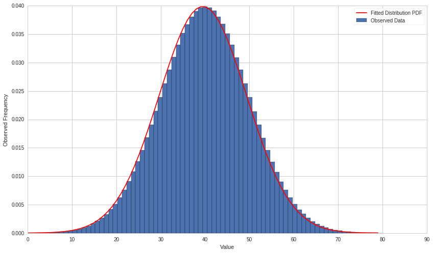
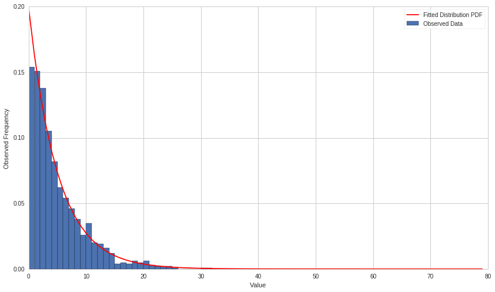
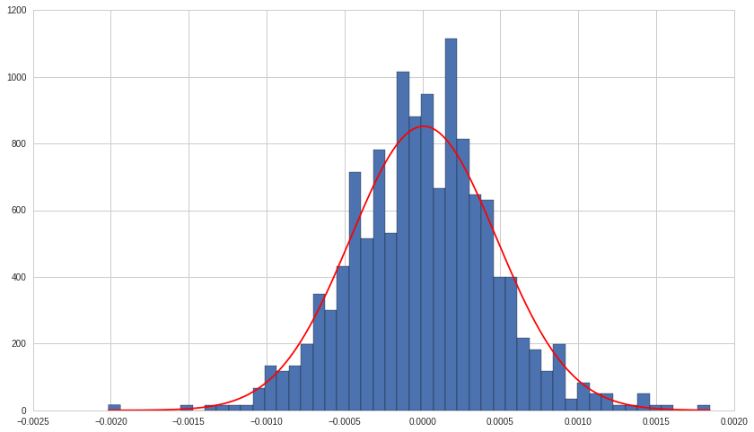

Exercises: Maximum Likelihood Estimation - Answer Key
=====================================================

By Christopher van Hoecke, Max Margenot, and Delaney Mackenzie

Lecture Link :
--------------

https://www.quantopian.com/lectures/maximum-likelihood-estimation

IMPORTANT NOTE:
~~~~~~~~~~~~~~~

This lecture corresponds to the Maximum Likelihood Estimation lecture,
which is part of the Quantopian lecture series. This homework expects
you to rely heavily on the code presented in the corresponding lecture.
Please copy and paste regularly from that lecture when starting to work
on the problems, as trying to do them from scratch will likely be too
difficult.

Part of the Quantopian Lecture Series:

-  `www.quantopian.com/lectures <https://www.quantopian.com/lectures>`__
-  `github.com/quantopian/research_public <https://github.com/quantopian/research_public>`__

Notebook released under the Creative Commons Attribution 4.0 License.

--------------

Key Concepts
------------

Normal Distribution MLE Estimators:

.. math::

   \hat\mu = \frac{1}{T}\sum_{t=1}^{T} x_t \\\qquad \hat\sigma = \sqrt{\frac{1}{T}\sum_{t=1}^{T}{(x_t - \hat\mu)^2}}

Exponential Distribution MLE Estimators:

.. math:: \hat\lambda = \frac{\sum_{t=1}^{T} x_t}{T}

.. code:: ipython2

    # Useful Libraries
    import pandas as pd
    import math
    import matplotlib.pyplot as plt
    import numpy as np
    import scipy
    import scipy.stats as stats

--------------

Exercise 1: Normal Distribution
===============================

-  Given the equations above, write down functions to calculate the MLE
   estimators :math:`\hat{\mu}` and :math:`\hat{\sigma}` of the normal
   distribution.
-  Given the sample normally distributed set, find the maximum
   likelihood :math:`\hat{\mu}` and :math:`\hat{\sigma}`.
-  Fit the data to a normal distribution using SciPy. Compare SciPy’s
   calculated parameters with your calculated values of
   :math:`\hat{\mu}` and :math:`\hat{\sigma}`.
-  Plot a normal distribution PDF with your estimated parameters

.. code:: ipython2

    # Normal mean and standard deviation MLE estimators
    def normal_mu(X):
        # Get the number of observations
        T = len(X)
        # Sum the observations
        s = sum(X)
        return 1.0/T * s
    
    def normal_sigma(X):
        T = len(X)
        # Get the mu MLE
        mu = normal_mu(X)
        # Sum the square of the differences
        s = sum( np.power((X - mu), 2) )
        # Compute sigma^2
        sigma_squared = 1.0/T * s
        return math.sqrt(sigma_squared)

.. code:: ipython2

    # Normal Distribution Sample Data
    TRUE_MEAN = 40
    TRUE_STD = 10
    X = np.random.normal(TRUE_MEAN, TRUE_STD, 10000000)
    
    # Use your functions to compute the MLE mu and sigma
    mu = normal_mu(X)
    std = normal_sigma(X)
    
    print 'Maximum likelihood value of mu:', mu
    print 'Maximum likelihood value for sigma:', std

.. parsed-literal::

    Maximum likelihood value of mu: 39.9907086081
    Maximum likelihood value for sigma: 10.003042353

.. code:: ipython2

    # Fit the distribution using SciPy and compare those parameters with yours 
    scipy_mu, scipy_std = scipy.stats.norm.fit(X)
    print 'Scipy Maximum likelihood value of mu:', scipy_mu
    print 'Scipy Maximum likelihood value for sigma:', scipy_std

.. parsed-literal::

    Scipy Maximum likelihood value of mu: 39.9907086081
    Scipy Maximum likelihood value for sigma: 10.003042353

.. code:: ipython2

    # Get the PDF, fill it with your calculated parameters, and plot it along x
    x = np.linspace(0, 80, 80)
    
    plt.hist(X, bins=x, normed='true')
    plt.plot(scipy.stats.norm.pdf(x, loc=mu, scale=std), color='red')
    plt.xlabel('Value')
    plt.ylabel('Observed Frequency')
    plt.legend(['Fitted Distribution PDF', 'Observed Data', ]);

--------------

Exercise 2: Exponential Distribution
====================================

-  Given the equations above, write down functions to calculate the MLE
   estimator :math:`\hat{\lambda}` of the exponential distribution
-  Given the sample exponentially distributed set, find the maximum
   likelihood
-  Fit the data to an exponential distribution using SciPy. Compare
   SciPy’s calculated parameter with your calculated values of
   :math:`\hat{\lambda}`
-  Plot an exponential distribution PDF with your estimated parameter

.. code:: ipython2

    # Exponential lambda MLE estimator
    def exp_lambda(X):
        T = len(X)
        s = sum(X)
        return s/T

.. code:: ipython2

    # Exponential distribution sample data
    TRUE_LAMBDA = 5
    X = np.random.exponential(TRUE_LAMBDA, 1000)
    
    # Use your functions to compute the MLE lambda
    lam = exp_lambda(X)
    print "Lambda estimate: ", lam

.. parsed-literal::

    Lambda estimate:  5.04104991618

.. code:: ipython2

    # Fit the distribution using SciPy and compare that parameter with yours 
    _, l = scipy.stats.expon.fit(X)
    print 'Scipy lambds estimate: ', l

.. parsed-literal::

    Scipy lambds estimate:  5.03179059849

.. code:: ipython2

    # Get the PDF, fill it with your calculated parameter, and plot it along x
    x = range(0, 80)
    
    plt.hist(X, bins=x, normed='true')
    plt.plot(scipy.stats.expon.pdf(x, scale=l), color = 'red')
    plt.xlabel('Value')
    plt.ylabel('Observed Frequency')
    plt.legend(['Fitted Distribution PDF', 'Observed Data', ]);

--------------

Exercise 3 : Fitting Data Using MLE
===================================

-  Using the MLE estimators laid out in the lecture, fit the returns for
   SPY from 2014 to 2015 to a normal distribution.
-  Check for normality using the Jarque-Bera test

.. code:: ipython2

    prices = get_pricing('SPY', 
                         fields='price', 
                         start_date='2016-01-04', 
                         end_date='2016-01-05', 
                         frequency = 'minute')
    returns = prices.pct_change()[1:]

.. code:: ipython2

    mu = normal_mu(returns)
    std = normal_sigma(returns)
    
    x = np.linspace(returns.min(), returns.max(), num=1000)
    h = plt.hist(returns, bins=50, normed='true')
    l = plt.plot(x, scipy.stats.norm.pdf(x, loc=mu, scale=std), color = 'red')
    plt.show(h, l);

Recall that this fit **only** makes sense **if** we have normally
distributed data.

.. code:: ipython2

    alpha = 0.05
    stat, pval = scipy.stats.mstats.normaltest(returns)
    print pval
    
    if pval > alpha: 
        print 'Accept our null hypothesis'
    if pval < alpha: 
        print 'Reject our null hypothesis'

.. parsed-literal::

    0.000572927470337
    Reject our null hypothesis

--------------

Congratulations on completing the Maximum Likelihood Estimation
exercises!

As you learn more about writing trading models and the Quantopian
platform, enter the daily `Quantopian
Contest <https://www.quantopian.com/contest>`__. Your strategy will be
evaluated for a cash prize every day.

Start by going through the `Writing a Contest
Algorithm <https://www.quantopian.com/tutorials/contest>`__ tutorial.

*This presentation is for informational purposes only and does not
constitute an offer to sell, a solicitation to buy, or a recommendation
for any security; nor does it constitute an offer to provide investment
advisory or other services by Quantopian, Inc. (“Quantopian”). Nothing
contained herein constitutes investment advice or offers any opinion
with respect to the suitability of any security, and any views expressed
herein should not be taken as advice to buy, sell, or hold any security
or as an endorsement of any security or company. In preparing the
information contained herein, Quantopian, Inc. has not taken into
account the investment needs, objectives, and financial circumstances of
any particular investor. Any views expressed and data illustrated herein
were prepared based upon information, believed to be reliable, available
to Quantopian, Inc. at the time of publication. Quantopian makes no
guarantees as to their accuracy or completeness. All information is
subject to change and may quickly become unreliable for various reasons,
including changes in market conditions or economic circumstances.*
