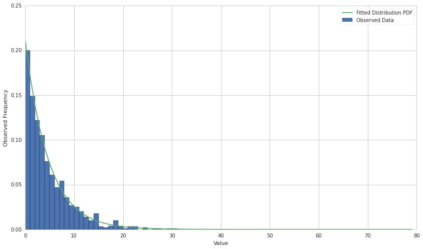
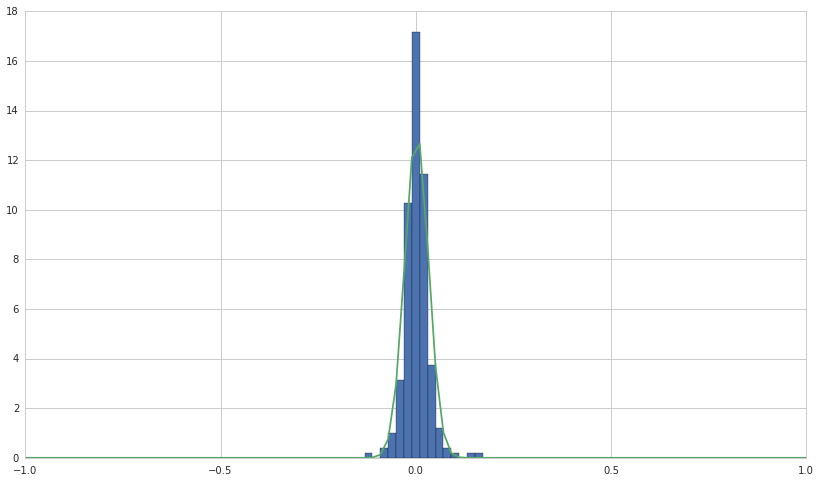

#Maximum Likelihood Estimates (MLEs)

By Delaney Granizo-Mackenzie and Andrei Kirilenko developed as part of
the Masters of Finance curriculum at MIT Sloan.

Part of the Quantopian Lecture Series:

-  `www.quantopian.com/lectures <https://www.quantopian.com/lectures>`__
-  `github.com/quantopian/research_public <https://github.com/quantopian/research_public>`__

Notebook released under the Creative Commons Attribution 4.0 License.

--------------

In this tutorial notebook, we’ll do the following things: 1. Compute the
MLE for a normal distribution. 2. Compute the MLE for an exponential
distribution. 3. Fit a normal distribution to asset returns using MLE.

First we need to import some libraries

.. code:: ipython2

    import math
    import matplotlib.pyplot as plt
    import numpy as np
    import scipy
    import scipy.stats

##Normal Distribution We’ll start by sampling some data from a normal
distribution.

.. code:: ipython2

    TRUE_MEAN = 40
    TRUE_STD = 10
    X = np.random.normal(TRUE_MEAN, TRUE_STD, 1000)

Now we’ll define functions that, given our data, will compute the MLE
for the :math:`\mu` and :math:`\sigma` parameters of the normal
distribution.

Recall that

.. math:: \hat\mu = \frac{1}{T}\sum_{t=1}^{T} x_t

.. math:: \hat\sigma = \sqrt{\frac{1}{T}\sum_{t=1}^{T}{(x_t - \hat\mu)^2}}

.. code:: ipython2

    def normal_mu_MLE(X):
        # Get the number of observations
        T = len(X)
        # Sum the observations
        s = sum(X)
        return 1.0/T * s
    
    def normal_sigma_MLE(X):
        T = len(X)
        # Get the mu MLE
        mu = normal_mu_MLE(X)
        # Sum the square of the differences
        s = sum( np.power((X - mu), 2) )
        # Compute sigma^2
        sigma_squared = 1.0/T * s
        return math.sqrt(sigma_squared)

Now let’s try our functions out on our sample data and see how they
compare to the built-in ``np.mean`` and ``np.std``

.. code:: ipython2

    print "Mean Estimation"
    print normal_mu_MLE(X)
    print np.mean(X)
    print "Standard Deviation Estimation"
    print normal_sigma_MLE(X)
    print np.std(X)

.. parsed-literal::

    Mean Estimation
    39.5829392522
    39.5829392522
    Standard Deviation Estimation
    10.2920350139
    10.2920350139

Now let’s estimate both parameters at once with scipy’s built in
``fit()`` function.

.. code:: ipython2

    mu, std = scipy.stats.norm.fit(X)
    print "mu estimate: " + str(mu)
    print "std estimate: " + str(std)

.. parsed-literal::

    mu estimate: 39.5829392522
    std estimate: 10.2920350139

Now let’s plot the distribution PDF along with the data to see how well
it fits. We can do that by accessing the pdf provided in
``scipy.stats.norm.pdf``.

.. code:: ipython2

    pdf = scipy.stats.norm.pdf
    # We would like to plot our data along an x-axis ranging from 0-80 with 80 intervals
    # (increments of 1)
    x = np.linspace(0, 80, 80)
    plt.hist(X, bins=x, normed='true')
    plt.plot(pdf(x, loc=mu, scale=std))
    plt.xlabel('Value')
    plt.ylabel('Observed Frequency')
    plt.legend(['Fitted Distribution PDF', 'Observed Data', ]);

.. image:: notebook_files/notebook_13_0.png

##Exponential Distribution Let’s do the same thing, but for the
exponential distribution. We’ll start by sampling some data.

.. code:: ipython2

    TRUE_LAMBDA = 5
    X = np.random.exponential(TRUE_LAMBDA, 1000)

``numpy`` defines the exponential distribution as

.. math:: \frac{1}{\lambda}e^{-\frac{x}{\lambda}}

So we need to invert the MLE from the lecture notes. There it is

.. math:: \hat\lambda = \frac{T}{\sum_{t=1}^{T} x_t}

Here it’s just the reciprocal, so

.. math:: \hat\lambda = \frac{\sum_{t=1}^{T} x_t}{T}

.. code:: ipython2

    def exp_lamda_MLE(X):
        T = len(X)
        s = sum(X)
        return s/T

.. code:: ipython2

    print "lambda estimate: " + str(exp_lamda_MLE(X))

.. parsed-literal::

    lambda estimate: 4.71513802853

.. code:: ipython2

    # The scipy version of the exponential distribution has a location parameter
    # that can skew the distribution. We ignore this by fixing the location
    # parameter to 0 with floc=0
    _, l = scipy.stats.expon.fit(X, floc=0)

.. code:: ipython2

    pdf = scipy.stats.expon.pdf
    x = range(0, 80)
    plt.hist(X, bins=x, normed='true')
    plt.plot(pdf(x, scale=l))
    plt.xlabel('Value')
    plt.ylabel('Observed Frequency')
    plt.legend(['Fitted Distribution PDF', 'Observed Data', ]);

##MLE for Asset Returns

Now we’ll fetch some real returns and try to fit a normal distribution
to them using MLE.

.. code:: ipython2

    prices = get_pricing('TSLA', fields='price', start_date='2014-01-01', end_date='2015-01-01')
    # This will give us the number of dollars returned each day
    absolute_returns = np.diff(prices)
    # This will give us the percentage return over the last day's value
    # the [:-1] notation gives us all but the last item in the array
    # We do this because there are no returns on the final price in the array.
    returns = absolute_returns/prices[:-1]

Let’s use ``scipy``\ ’s fit function to get the :math:`\mu` and
:math:`\sigma` MLEs.

.. code:: ipython2

    mu, std = scipy.stats.norm.fit(returns)
    pdf = scipy.stats.norm.pdf
    x = np.linspace(-1,1, num=100)
    h = plt.hist(returns, bins=x, normed='true')
    l = plt.plot(x, pdf(x, loc=mu, scale=std))

Of course, this fit is meaningless unless we’ve tested that they obey a
normal distribution first. We can test this using the Jarque-Bera
normality test. The Jarque-Bera test will reject the hypothesis of a
normal distribution if the p-value is under a c.

.. code:: ipython2

    from statsmodels.stats.stattools import jarque_bera
    jarque_bera(returns)

.. parsed-literal::

    (242.53773931956744,
     2.1557534018848578e-53,
     0.7405363946340933,
     7.582279228661398)

.. code:: ipython2

    jarque_bera(np.random.normal(0, 1, 100))

.. parsed-literal::

    (0.9856724005093672,
     0.61089132471452023,
     -0.10806345762002881,
     2.5642815902086933)

*This presentation is for informational purposes only and does not
constitute an offer to sell, a solicitation to buy, or a recommendation
for any security; nor does it constitute an offer to provide investment
advisory or other services by Quantopian, Inc. (“Quantopian”). Nothing
contained herein constitutes investment advice or offers any opinion
with respect to the suitability of any security, and any views expressed
herein should not be taken as advice to buy, sell, or hold any security
or as an endorsement of any security or company. In preparing the
information contained herein, Quantopian, Inc. has not taken into
account the investment needs, objectives, and financial circumstances of
any particular investor. Any views expressed and data illustrated herein
were prepared based upon information, believed to be reliable, available
to Quantopian, Inc. at the time of publication. Quantopian makes no
guarantees as to their accuracy or completeness. All information is
subject to change and may quickly become unreliable for various reasons,
including changes in market conditions or economic circumstances.*
