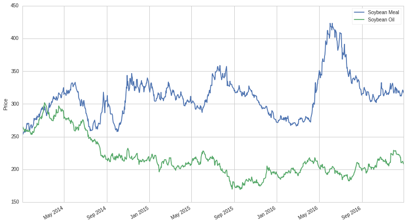
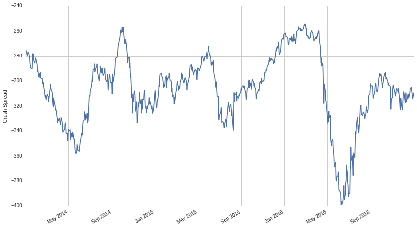
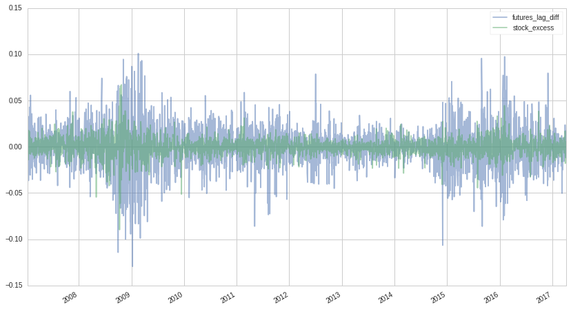

Mean Reversion on Futures
=========================

by Rob Reider and Maxwell Margenot

Part of the Quantopian Lecture Series:

-  `www.quantopian.com/lectures <https://www.quantopian.com/lectures>`__
-  `github.com/quantopian/research_public <https://github.com/quantopian/research_public>`__

Introducing futures as an asset opens up trading opportunities that were
previously unavailable. In this lecture we will look at strategies
involving one future against another. We will also look at strategies
involving trades of futures and stocks at the same time. Other
strategies, like trading calendar spreads (futures on the same commodity
but with different delivery months) will be topics for future lectures.

.. code:: ipython2

    import numpy as np
    import pandas as pd
    import statsmodels.api as sm
    from statsmodels.tsa.stattools import coint, adfuller
    
    import matplotlib.pyplot as plt
    from quantopian.research.experimental import continuous_future, history

Pairs of Futures (or Spreads)
-----------------------------

Before we look at trading pairs of futures contracts, let’s quickly
review pairs trading in general and cointegration. For full lectures on
these topics individually, see the `lecture on stationarity and
cointegration <https://www.quantopian.com/lectures/integration-cointegration-and-stationarity>`__
and the `lecture on pairs
trading <https://www.quantopian.com/lectures/introduction-to-pairs-trading>`__.

When markets are efficient, the prices of assets are often modeled as
`random walks <https://en.wikipedia.org/wiki/Random_walk_hypothesis>`__:

.. math:: P*t=\mu+P*{t-1}+\epsilon_t

We can then take the difference of the prices to get white noise,
stationary time series:

.. math:: r*t=P_t-P*{t-1}= \mu +\epsilon_t

Of course, if prices follow a random walk, they are completely
unforecastable, so the goal is to find returns that are correlated with
something in the past. For example, if we can find an asset whose price
is a little mean-reverting (and therefore its returns are negatively
autocorrelated), we can use that to forecast future returns.

Cointegration and Mean Reversion
--------------------------------

The idea behind cointegration is that even if the prices of two
different assets both follow random walks, it is still possible that a
linear combination of them is not a random walk. A common analogy is of
a dog owner walking his dog with a retractable leash. If you look at the
position of the dog owner, it may follow a random walk, and if you look
at the dog separately, it also may follow a random walk, but the
distance between them, the difference of their positions, may very well
be mean reverting. If the dog is behind the owner, he may run to catch
up and if the dog is ahead, the length of the leash may prevent him from
getting too far away.

The dog and its owner are linked together and their distance is a mean
reverting process. In cointegration, we look for assets that are
economically linked, so that if :math:`P_t` and :math:`Q_t` are both
random walks, the linear combination, :math:`P_t - b Q_t`, may not
itself be a random walk and may be forecastable.

Finding a Feasible Spread
-------------------------

For stocks, a natural starting point for identifying cointegrated pairs
is looking at stocks in the same industry. However, competitors are not
necessarily economic substitutes. Think of Apple and Blackberry. It’s
not always the case that when one of those company’s stock price jumps
up, the other catches up. The economic link is fairly tenuous. Here it
is more like the dog broke the leash and ran away from the owner.

However, with pairs of futures, there may be economic forces that link
the two prices. Consider heating oil and natural gas. Some power plants
have the ability to use either one, depending on which has become
cheaper. So when heating oil has dipped below natural gas, increased
demand for heating oil will push it back up. Platinum and Palladium are
substitutes for some types of catalytic converters used for emission
control. Corn and wheat are substitutes for animal feed. Corn and sugar
are substitutes as sweeteners. There are many potential links to examine
and test.

Let’s go through a specific example of futures prices that might be
cointegrated.

Soybean Crush
-------------

The difference in price between soybeans and their refined products is
referred to as the “crush spread”. It represents the processing margin
from “crushing” a soybean into its refined products. Note that we scale
up the futures price of soybean oil so that it is the same magnitude as
the price for soybean meal. It certainly seems from the plots that the
prices of the refined products move together.

.. code:: ipython2

    soy_meal_mult = symbols('SMF17').multiplier
    soy_oil_mult = symbols('BOF17').multiplier
    soybean_mult = symbols('SYF17').multiplier

.. code:: ipython2

    sm_future = continuous_future('SM', offset=0, roll='calendar', adjustment='mul')
    sm_price = history(sm_future, fields='price', start_date='2014-01-01', end_date='2017-01-01')
    
    bo_future = continuous_future('BO', offset=0, roll='calendar', adjustment='mul')
    bo_price = history(bo_future, fields='price', start_date='2014-01-01', end_date='2017-01-01')
    
    sm_price.plot()
    bo_price.multiply(soy_oil_mult//soy_meal_mult).plot()
    plt.ylabel('Price')
    plt.legend(['Soybean Meal', 'Soybean Oil']);

However, from looking at the p-value for our test, we conclude that
soybean meal and soybean meal and soybean oil are not cointegrated.

.. code:: ipython2

    print 'p-value: ', coint(sm_price, bo_price)[1]

.. parsed-literal::

    p-value:  0.228842012164

We still have this compelling economic link, though. Both soybean oil
and soybean meal have a root product in soybeans themselves. Let’s see
if we can suss out any signal by creating a spread between soybean
prices and the refined products together, by implementing the `crush
spread <https://en.wikipedia.org/wiki/Crush_spread>`__.

.. code:: ipython2

    sm_future = continuous_future('SM', offset=1, roll='calendar', adjustment='mul')
    sm_price = history(sm_future, fields='price', start_date='2014-01-01', end_date='2017-01-01')
    
    bo_future = continuous_future('BO', offset=1, roll='calendar', adjustment='mul')
    bo_price = history(bo_future, fields='price', start_date='2014-01-01', end_date='2017-01-01')
    
    sy_future = continuous_future('SY', offset=0, roll='calendar', adjustment='mul')
    sy_price = history(sy_future, fields='price', start_date='2014-01-01', end_date='2017-01-01')
    
    crush = sy_price - (sm_price + bo_price)
    crush.plot()
    plt.ylabel('Crush Spread');

In the above plot, we offset the refined products by one month to
roughly match the time it takes to crush the soybeans and we set
``roll='calendar'`` so that all three contracts are rolled at the same
time.

To test whether this spread is stationary, we will use the augmented
Dickey-Fuller test.

.. code:: ipython2

    print 'p-value for stationarity: ', adfuller(crush)[1]

.. parsed-literal::

    p-value for stationarity:  0.0253387237046

The test confirms that the spread is stationary. And it makes sense,
economically, that the crush spread may exhibit some mean reversion due
to simple supply and demand.

Note that there is usually a little more finesse required to obtain a
mean reverting spread. We usually find a linear combination that would
make the spread between the assets stationary after discovering
cointegration. For more details on this, see the `lecture on
cointegration <https://www.quantopian.com/lectures/integration-cointegration-and-stationarity>`__.
We skipped these steps to test this known spread off the bat.

Here are a few other examples of economically-linked futures:

-  **3:2:1 Crack Spread**: Buy three crude oil, sell two gasoline, Sell
   one heating oil (this represents the profitability of oil refining)
-  **8:4:3 Cattle Crush** Buy 8 October live-cattle, Sell 4 May feeder
   cattle, Sell 3 July corn (this represents the profitability of
   fattening feeder cattle, where the 3 corn contracts are enough to
   feed the young feeder cattle)

For widely-followed spreads like the crush spread or the crack spread,
it would be surprising if the depth of mean reversion became so large
that you could easily profit from it. If we consider futures that are
linked to stocks, however, the number of potential pairs grows.

Futures and Stocks
------------------

There are many examples of potential relationships between futures and
stocks. We already discussed one of them - the relationship between the
crush spread and the price of soybean processors. Here are several more,
though this is not meant to be a complete list:

-  Crude oil futures and oil stocks
-  Gold futures and gold mining stocks
-  Crude oil futures and airline stocks
-  Currency futures and exporters
-  Interest rate futures and utilities
-  Interest rate futures and Real Estate Investment Trusts (REITs)
-  Corn futures and agricultural processing companies (e.g., ADM)

Consider the relationship between ten-year interest rate futures and the
price of EQR, a large REIT. Interest rates heavily influence the value
of real estate, so there is a strong economic connection between the
value of interest rate futures and the value of REITs.

.. code:: ipython2

    ty_future = continuous_future('TY', offset=0, roll='calendar', adjustment='mul')
    ty_prices = history(ty_future, fields='price', start_date='2009-01-01', end_date='2017-01-01')
    ty_prices.name = ty_future.root_symbol
    
    equities = symbols(['EQR', 'SPY'])
    equity_prices = get_pricing(equities, fields='price', start_date='2009-01-01', end_date='2017-01-01')
    equity_prices.columns = map(lambda x: x.symbol, equity_prices.columns)
    
    data = pd.concat([ty_prices, equity_prices], axis=1)
    data = data.dropna()

.. code:: ipython2

    data.plot()
    plt.legend();

.. image:: notebook_files/notebook_16_0.png

If we apply a hypothesis test to the two price series we find that they
are indeed cointegrated, corroborating our economic hypothesis.

.. code:: ipython2

    print 'Cointegration test p-value: ', coint(data['TY'], data['EQR'])[1]

.. parsed-literal::

    Cointegration test p-value:  0.0299261276671

The next step would be to test if this signal is viable once we include
market impact by trading EQR against the futures contract as a pair in a
backtest.

Trading strategies based on cointegrated pairs form buy and sell signals
based on the *relative prices* of the pair. We can also form trading
signals based on *changes in prices*, or returns. Of course we would
expect that changes in futures prices to be contemporaneously correlated
with stock prices, which is not forecastable. If crude oil prices rise
today, oil company stocks are likely to rise today also. But perhaps
there are lead/lag effects also between changes in futures and stocks
returns. We know there is evidence that the market can systematically
underreact or overreact to other news releases, leading to trending and
mean reversion. Let’s look at a few examples with futures.

The first example looks at crude oil futures and oil company stocks.

.. code:: ipython2

    cl_future = continuous_future('CL', offset=0, roll='calendar', adjustment='mul')
    cl_prices = history(cl_future, fields='price', start_date='2007-01-01', end_date='2017-04-06')
    cl_prices.name = cl_future.root_symbol
    
    equities = symbols(['XOM', 'SPY'])
    equity_prices = get_pricing(equities, fields='price', start_date='2007-01-01', end_date='2017-04-06')
    equity_prices.columns = map(lambda x: x.symbol, equity_prices.columns)
    
    data = pd.concat([cl_prices, equity_prices],axis=1)
    data = data.dropna()

.. code:: ipython2

    #Take log of prices
    data['stock_ret'] = np.log(data['XOM']).diff()
    data['spy_ret'] = np.log(data['SPY']).diff()
    data['futures_ret'] = np.log(data['CL']).diff()
    
    # Compute excess returns in excess of SPY
    data['stock_excess'] = data['stock_ret'] - data['spy_ret']
    
    #Compute lagged futures returns
    data['futures_lag_diff'] = data['futures_ret'].shift(1)
    data = data[2:].dropna()
    data.tail(5)

.. raw:: html

    

    <table border="1" class="dataframe">
      <thead>
        <tr style="text-align: right;">
          <th></th>
          <th>CL</th>
          <th>XOM</th>
          <th>SPY</th>
          <th>stock_ret</th>
          <th>futures_ret</th>
          <th>spy_ret</th>
          <th>stock_excess</th>
          <th>futures_lag</th>
          <th>futures_lag_diff</th>
        </tr>
      </thead>
      <tbody>
        <tr>
          <th>2017-03-31 00:00:00+00:00</th>
          <td>50.85</td>
          <td>82.00</td>
          <td>235.72</td>
          <td>-0.020281</td>
          <td>0.010279</td>
          <td>-0.002331</td>
          <td>-0.017950</td>
          <td>0.014610</td>
          <td>0.014610</td>
        </tr>
        <tr>
          <th>2017-04-03 00:00:00+00:00</th>
          <td>50.25</td>
          <td>82.08</td>
          <td>235.37</td>
          <td>0.000975</td>
          <td>-0.011870</td>
          <td>-0.001486</td>
          <td>0.002461</td>
          <td>0.010279</td>
          <td>0.010279</td>
        </tr>
        <tr>
          <th>2017-04-04 00:00:00+00:00</th>
          <td>51.13</td>
          <td>82.35</td>
          <td>235.50</td>
          <td>0.003284</td>
          <td>0.017361</td>
          <td>0.000552</td>
          <td>0.002732</td>
          <td>-0.011870</td>
          <td>-0.011870</td>
        </tr>
        <tr>
          <th>2017-04-05 00:00:00+00:00</th>
          <td>50.82</td>
          <td>82.53</td>
          <td>234.77</td>
          <td>0.002183</td>
          <td>-0.006081</td>
          <td>-0.003105</td>
          <td>0.005288</td>
          <td>0.017361</td>
          <td>0.017361</td>
        </tr>
        <tr>
          <th>2017-04-06 00:00:00+00:00</th>
          <td>51.74</td>
          <td>83.02</td>
          <td>235.39</td>
          <td>0.005920</td>
          <td>0.017941</td>
          <td>0.002637</td>
          <td>0.003282</td>
          <td>-0.006081</td>
          <td>-0.006081</td>
        </tr>
      </tbody>
    </table>
    

We have a high positive contemporaneous correlation, but a slightly
negative lagged correlation.

.. code:: ipython2

    #Compute contemporaneous correlation
    contemp_corr = data['stock_excess'].shift(1).corr(data['futures_lag_diff'])
    #Compute correlation of excess stock returns with lagged futures returns
    lagged_corr = data['stock_excess'].corr(data['futures_lag_diff'])
    print 'Contemporaneous correlation: ', contemp_corr
    print 'Lagged correlation         : ', lagged_corr

.. parsed-literal::

    Contemporaneous correlation:  0.257312975324
    Lagged correlation         :  -0.0519203748947

And when we form a linear regression of the excess returns of XOM on the
lagged futures returns, the coefficient is significant and negative.
This and the above correlations indicate that there might be a slight
overreaction to the shift in oil prices.

.. code:: ipython2

    result = sm.OLS(data['stock_excess'], sm.add_constant(data['futures_lag_diff'])).fit()
    result.summary2()

.. raw:: html

    <table>
    <tbody><tr>
            <td>Model:</td>               <td>OLS</td>         <td>Adj. R-squared:</td>      <td>0.002</td>   
    </tr>
    <tr>
      <td>Dependent Variable:</td>   <td>stock_excess</td>          <td>AIC:</td>         <td>-16587.6204</td>
    </tr>
    <tr>
             <td>Date:</td>        <td>2017-04-25 18:21</td>        <td>BIC:</td>         <td>-16575.9124</td>
    </tr>
    <tr>
       <td>No. Observations:</td>        <td>2576</td>         <td>Log-Likelihood:</td>     <td>8295.8</td>   
    </tr>
    <tr>
           <td>Df Model:</td>              <td>1</td>           <td>F-statistic:</td>        <td>6.958</td>   
    </tr>
    <tr>
         <td>Df Residuals:</td>          <td>2574</td>       <td>Prob (F-statistic):</td>   <td>0.00840</td>  
    </tr>
    <tr>
          <td>R-squared:</td>            <td>0.003</td>            <td>Scale:</td>        <td>9.3463e-05</td> 
    </tr>
    </tbody></table>
    <table>
    <tbody><tr>
              <td></td>          <th>Coef.</th>  <th>Std.Err.</th>    <th>t</th>     <th>P&gt;|t|</th> <th>[0.025</th>  <th>0.975]</th> 
    </tr>
    <tr>
      <th>const</th>            <td>-0.0001</td>  <td>0.0002</td>  <td>-0.6881</td> <td>0.4914</td> <td>-0.0005</td> <td>0.0002</td> 
    </tr>
    <tr>
      <th>futures_lag_diff</th> <td>-0.0216</td>  <td>0.0082</td>  <td>-2.6377</td> <td>0.0084</td> <td>-0.0377</td> <td>-0.0055</td>
    </tr>
    </tbody></table>
    <table>
    <tbody><tr>
         <td>Omnibus:</td>    <td>412.749</td>  <td>Durbin-Watson:</td>     <td>1.950</td> 
    </tr>
    <tr>
      <td>Prob(Omnibus):</td>  <td>0.000</td>  <td>Jarque-Bera (JB):</td> <td>6879.407</td>
    </tr>
    <tr>
           <td>Skew:</td>     <td>-0.156</td>      <td>Prob(JB):</td>       <td>0.000</td> 
    </tr>
    <tr>
         <td>Kurtosis:</td>   <td>11.000</td>   <td>Condition No.:</td>      <td>43</td>   
    </tr>
    </tbody></table>

A coefficient of around :math:`-0.02` on the lagged futures return
implies that if the oil price increased by 1% yesterday, the pure-play
refiner is expected to go down by :math:`2` bp today. This would require
more testing to formulate a functioning model, but it indicates that
there might be some signal in drawing out the underreaction or
overreaction of equity prices to changes in futures prices.

This conjecture could be total data mining, but perhaps when the
connection between the futures and stock is exceedingly obvious, like
oil stocks and oil exploration companies or gold stocks and gold miners,
the market overreacts to fundamental information, but when the
relationship is more subtle, the market underreacts.

Also, there may be other lead/lag effects over longer time scales than
one-day, but as always, this could also lead to more data mining.

.. code:: ipython2

    data['futures_lag_diff'].plot(alpha=0.50, legend=True)
    data['stock_excess'].plot(alpha=0.50, legend=True);

*This presentation is for informational purposes only and does not
constitute an offer to sell, a solicitation to buy, or a recommendation
for any security; nor does it constitute an offer to provide investment
advisory or other services by Quantopian, Inc. (“Quantopian”). Nothing
contained herein constitutes investment advice or offers any opinion
with respect to the suitability of any security, and any views expressed
herein should not be taken as advice to buy, sell, or hold any security
or as an endorsement of any security or company. In preparing the
information contained herein, Quantopian, Inc. has not taken into
account the investment needs, objectives, and financial circumstances of
any particular investor. Any views expressed and data illustrated herein
were prepared based upon information, believed to be reliable, available
to Quantopian, Inc. at the time of publication. Quantopian makes no
guarantees as to their accuracy or completeness. All information is
subject to change and may quickly become unreliable for various reasons,
including changes in market conditions or economic circumstances.*
