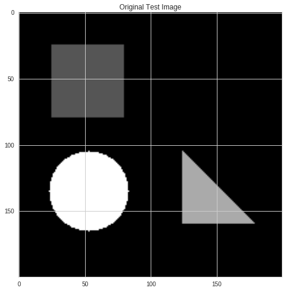
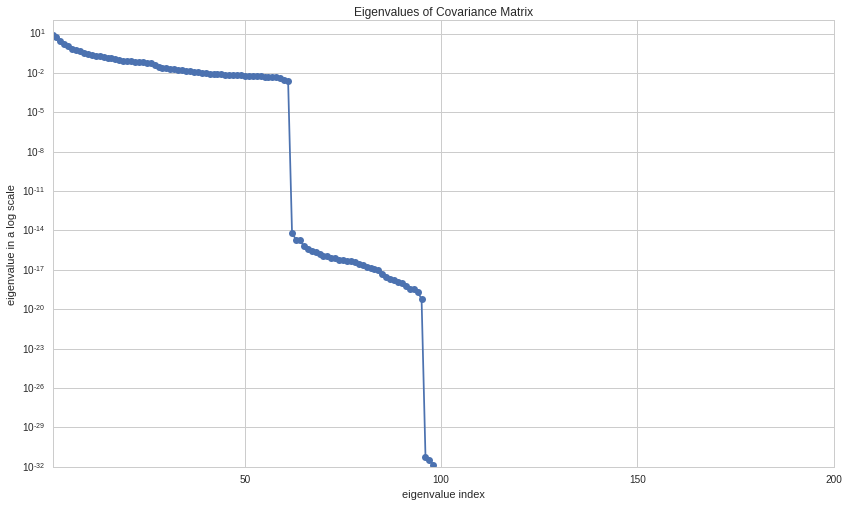
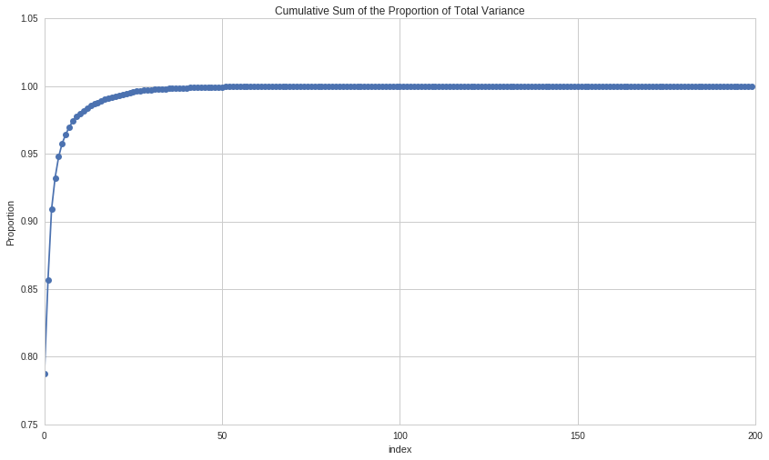
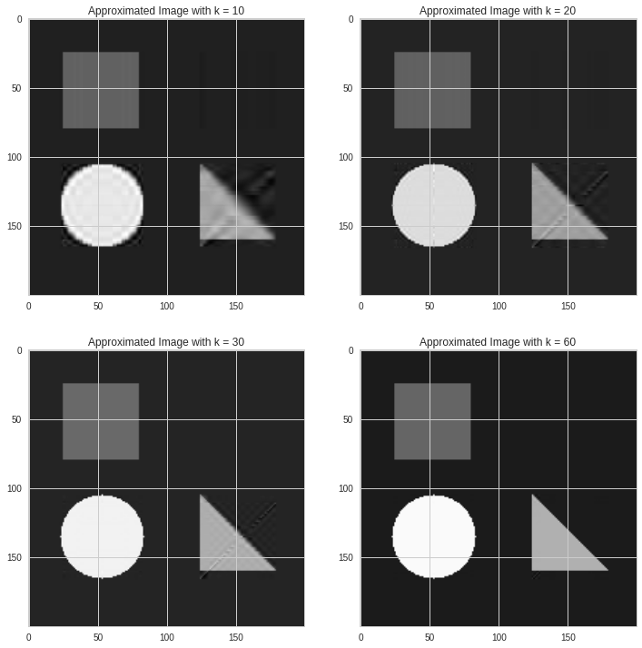
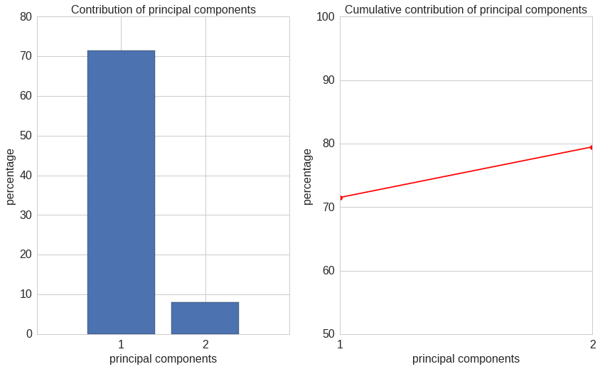
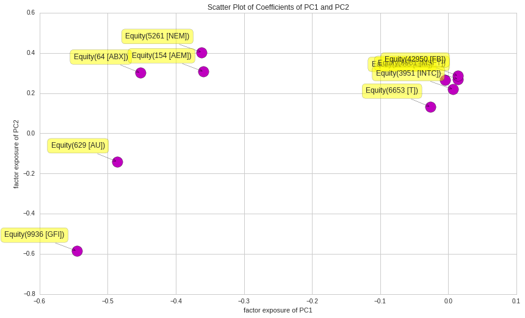

Principal Component Analysis
============================

by Rene Zhang and Max Margenot

Part of the Quantopian Lecture Series:

-  `www.quantopian.com/lectures <https://www.quantopian.com/lectures>`__
-  https://github.com/quantopian/research_public

--------------

Applications in many fields, such as image processing, bioinformatics,
and quantitative finance, involve large-scale data. Both the size and
complexity of this data can make the computations required for analysis
practically infeasible. Principal Component Analysis (PCA) is a
classical method for dimension reduction. It uses the first several
**principal components**, statistical features that explain most of the
variation of a :math:`m \times n` data matrix :math:`\mathbf{X}`, to
describe the large-scale data matrix :math:`\mathbf{X}` economically.

.. code:: ipython2

    from numpy import linalg as LA
    import numpy as np
    import pandas as pd
    import matplotlib.pyplot as plt

We will introduce PCA with an image processing example. A grayscale
digital image can be represented by a matrix, whose :math:`(i,j)^{th}`
entry corresponds to the measurement of gray scale at the
:math:`(i,j)^{th}` pixel. The following gray-scale image has
:math:`200 \times 200` pixels, though it can be changed on the fly. We
store it in a matrix :math:`\mathbf{X}`. The number of rows of the
:math:`\mathbf{X}` is :math:`200`, and the number of columns of
:math:`\mathbf{X}` is :math:`200`.

.. code:: ipython2

    def generate_test_image(m,n):
        X = np.zeros((m,n))
    # generate a rectangle
        X[25:80,25:80] = 1
    # generate a triangle
        for i in range(25, 80, 1):
            X[i+80:160, 100+i-1] = 2
    # generate a circle
        for i in range(0,200,1):
            for j in range(0,200,1):
                if ((i - 135)*(i - 135) +(j - 53)*(j - 53) <= 900):
                    X[i, j] = 3
        return X
    X = generate_test_image(200,200)

We start with a simple checkboard pattern, add some random normal noise,
and add a gradient.

.. code:: ipython2

    imgplot = plt.imshow(X, cmap='gray')
    plt.title('Original Test Image');

.. code:: ipython2

    m = X.shape[0] # num of rows
    n = X.shape[1] # num of columns

Set each row as a variable, with observations in the columns. Denote the
covariance matrix of :math:`\mathbf{X}` as :math:`\mathbf{C}`, where the
size of :math:`\mathbf{C}` is :math:`m \times m`. :math:`\mathbf{C}` is
a matrix whose :math:`(i,j)^{th}` entry is the covariance between the
:math:`i^{th}` row and :math:`j^{th}` row of the matrix
:math:`\mathbf{X}`.

.. code:: ipython2

    X = np.asarray(X, dtype=np.float64)
    C = np.cov(X)

.. code:: ipython2

    np.linalg.matrix_rank(C)

.. parsed-literal::

    62

Performing principal component analysis decomposes the matrix
:math:`\mathbf{C}` into:

.. math:: \mathbf{C} = \mathbf{L}\mathbf{P}\mathbf{L}^{\top},

where :math:`\mathbf{P}` is a diagonal matrix
:math:`\mathbf{P}=\text{diag}(\lambda_1,\lambda_2,\dots,\lambda_m)`,
with :math:`\lambda_1 \geq \lambda_1 \geq \dots \lambda_m \geq 0` being
the eigenvalues of matrix :math:`\mathbf{C}`. The matrix
:math:`\mathbf{L}` is an orthogonal matrix, consisting the eigenvectors
of matrix :math:`\mathbf{C}`.

.. code:: ipython2

    P, L = LA.eigh(C)

The function ``LA.eigh`` lists the eigenvalues from small to large in
:math:`P`. Let us change the order first to list them from largest to
smallest and make sure that
:math:`\mathbf{L}\mathbf{P}\mathbf{L}^{\top}==\mathbf{C}`.

.. code:: ipython2

    P = P[::-1]
    L = L[:,::-1]

.. code:: ipython2

    np.allclose(L.dot(np.diag(P)).dot(L.T), C)

.. parsed-literal::

    True

Here we plot all of the eigenvalues:

.. code:: ipython2

    plt.semilogy(P, '-o')
    plt.xlim([1, P.shape[0]])
    plt.xlabel('eigenvalue index')
    plt.ylabel('eigenvalue in a log scale')
    plt.title('Eigenvalues of Covariance Matrix');

The :math:`i^{th}` **principal component** is given as :math:`i^{th}`
row of :math:`\mathbf{V}`,

.. math:: \mathbf{V} =\mathbf{L}^{\top} \mathbf{X}.

.. code:: ipython2

    V = L.T.dot(X)

.. code:: ipython2

    V.shape

.. parsed-literal::

    (200, 200)

If we multiply both sides on the left by :math:`\mathbf{L}`, we get the
following:

.. math:: \mathbf{L}\mathbf{L}^{\top} \mathbf{X}= \mathbf{L}\mathbf{V}.

The matrix :math:`\mathbf{L}` is the set of eigenvectors from a
covariance matrix , so :math:`\mathbf{L}\mathbf{L}^{\top} = \mathbf{I}`
and :math:`\mathbf{L}\mathbf{L}^{\top}\mathbf{X} = \mathbf{X}`. The
relationship among matrices of :math:`\mathbf{X}`, :math:`\mathbf{L}`,
and :math:`\mathbf{V}` can be expressed as

.. math:: \mathbf{X} = \mathbf{L}\mathbf{V}.

To approximate :math:`\mathbf{X}`, we use :math:`k` eigenvectors that
have largest eigenvalues:

.. math:: \mathbf{X} \approx \mathbf{L[:, 1:k]}\mathbf{L[:, 1:k]}^{\top} \mathbf{X}.

Denote the approximated :math:`\mathbf{X}` as
:math:`\tilde{\mathbf{X}} = \mathbf{L[:, 1:k]}\mathbf{L[:, 1:k]}^{\top} \mathbf{X}`.
When $k = m $, the :math:`\tilde{\mathbf{X}}` should be same as
:math:`\mathbf{X}`.

.. code:: ipython2

    k = 200
    X_tilde =  L[:,0:k-1].dot(L[:,0:k-1].T).dot(X)

.. code:: ipython2

    np.allclose(X_tilde, X)

.. parsed-literal::

    True

.. code:: ipython2

    plt.imshow(X_tilde, cmap='gray')
    plt.title('Approximated Image with full rank');

.. image:: notebook_files/notebook_23_0.png

The proportion of total variance due to the :math:`i^{th}` principal
component is given by the ratio
:math:`\frac{\lambda_i}{\lambda_1 + \lambda_2 + \dots \lambda_m}.` The
sum of proportion of total variance should be :math:`1`. As we defined,
:math:`\lambda_i` is :math:`i^{th}` entry of :math:`\mathbf{P}`,

.. math:: \sum_{i}\frac{P_i}{\text{trace}(P)} = 1

Where the trace\ :math:`(P)` is the sum of the diagonal of :math:`P`.

.. code:: ipython2

    (P/P.sum()).sum()

.. parsed-literal::

    1.0

.. code:: ipython2

    plt.plot((P/P.sum()).cumsum(), '-o')
    plt.title('Cumulative Sum of the Proportion of Total Variance')
    plt.xlabel('index')
    plt.ylabel('Proportion');

Recall the number of principal components is denoted as :math:`k`. Let
:math:`k` be :math:`10, 20, 30, 60` as examples and take a look at the
corresponding approximated images.

.. code:: ipython2

    X_tilde_10 = L[:,0:10-1].dot(V[0:10-1,:])
    X_tilde_20 = L[:,0:20-1].dot(V[0:20-1,:])
    X_tilde_30 = L[:,0:30-1].dot(V[0:30-1,:])
    X_tilde_60 = L[:,0:60-1].dot(V[0:60-1,:])

.. code:: ipython2

    fig, ((ax1, ax2), (ax3, ax4)) = plt.subplots(2, 2, figsize=(12, 12))
    ax1.imshow(X_tilde_10, cmap='gray')
    ax1.set(title='Approximated Image with k = 10')
    ax2.imshow(X_tilde_20, cmap='gray')
    ax2.set(title='Approximated Image with k = 20')
    ax3.imshow(X_tilde_30, cmap='gray')
    ax3.set(title='Approximated Image with k = 30')
    ax4.imshow(X_tilde_60, cmap='gray')
    ax4.set(title='Approximated Image with k = 60');

The number of variables in :math:`X` is :math:`200`. When reducing the
dimension to :math:`k=60`, which uses half of the principal components,
the approximated image is close to the original one.

Moving forward, we do not have to do PCA by hand. Luckly,
`scikit-learn <http://scikit-learn.org/stable/modules/generated/sklearn.decomposition.PCA.html>`__
has an implementation that we can use. Next, let us show an example in
quantitative finance using sklearn.

PCA on a Portfolio
------------------

Construct a portfolio with 10 stocks, IBM, MSFT, FB, T, INTC, ABX, NEM,
AU, AEM, GFI. 5 of them are technology related and 5 of them are gold
mining companies.

In this case, there are 10 variables (companies), and each column is a
variable.

.. code:: ipython2

    symbol = ['IBM','MSFT', 'FB', 'T', 'INTC', 'ABX','NEM', 'AU', 'AEM', 'GFI']
    
    start = "2015-09-01"
    end = "2016-11-01"
    
    portfolio_returns = get_pricing(symbol, start_date=start, end_date=end, fields="price").pct_change()[1:]

.. code:: ipython2

    from sklearn.decomposition import PCA
    num_pc = 2
    
    X = np.asarray(portfolio_returns)
    [n,m] = X.shape
    print 'The number of timestamps is {}.'.format(n)
    print 'The number of stocks is {}.'.format(m)
    
    pca = PCA(n_components=num_pc) # number of principal components
    pca.fit(X)
    
    percentage =  pca.explained_variance_ratio_
    percentage_cum = np.cumsum(percentage)
    print '{0:.2f}% of the variance is explained by the first 2 PCs'.format(percentage_cum[-1]*100)
    
    pca_components = pca.components_

.. parsed-literal::

    The number of timestamps is 295.
    The number of stocks is 10.
    79.48% of the variance is explained by the first 2 PCs

Notice that the grand bulk of the variance of the returns of these
assets can be explained by the first two principal components.

Now we collect the first two principal components and plot their
contributions.

.. code:: ipython2

    x = np.arange(1,len(percentage)+1,1)
    
    plt.subplot(1, 2, 1)
    plt.bar(x, percentage*100, align = "center")
    plt.title('Contribution of principal components',fontsize = 16)
    plt.xlabel('principal components',fontsize = 16)
    plt.ylabel('percentage',fontsize = 16)
    plt.xticks(x,fontsize = 16) 
    plt.yticks(fontsize = 16)
    plt.xlim([0, num_pc+1])
    
    plt.subplot(1, 2, 2)
    plt.plot(x, percentage_cum*100,'ro-')
    plt.xlabel('principal components',fontsize = 16)
    plt.ylabel('percentage',fontsize = 16)
    plt.title('Cumulative contribution of principal components',fontsize = 16)
    plt.xticks(x,fontsize = 16) 
    plt.yticks(fontsize = 16)
    plt.xlim([1, num_pc])
    plt.ylim([50,100]);

From these principal components we can construct “statistical risk
factors”, similar to more conventional common risk factors. These should
give us an idea of how much of the portfolio’s returns comes from some
unobservable statistical feature.

.. code:: ipython2

    factor_returns = X.dot(pca_components.T)
    factor_returns = pd.DataFrame(columns=["factor 1", "factor 2"], 
                                  index=portfolio_returns.index,
                                  data=factor_returns)
    factor_returns.head()

.. raw:: html

    

    <table border="1" class="dataframe">
      <thead>
        <tr style="text-align: right;">
          <th></th>
          <th>factor 1</th>
          <th>factor 2</th>
        </tr>
      </thead>
      <tbody>
        <tr>
          <th>2015-09-02 00:00:00+00:00</th>
          <td>0.048380</td>
          <td>0.039362</td>
        </tr>
        <tr>
          <th>2015-09-03 00:00:00+00:00</th>
          <td>0.018534</td>
          <td>-0.025975</td>
        </tr>
        <tr>
          <th>2015-09-04 00:00:00+00:00</th>
          <td>0.009092</td>
          <td>-0.040054</td>
        </tr>
        <tr>
          <th>2015-09-08 00:00:00+00:00</th>
          <td>-0.014046</td>
          <td>0.044859</td>
        </tr>
        <tr>
          <th>2015-09-09 00:00:00+00:00</th>
          <td>0.071044</td>
          <td>-0.029646</td>
        </tr>
      </tbody>
    </table>
    

The factor returns here are an analogue to the principal component
matrix :math:`\mathbf{V}` in the image processing example.

.. code:: ipython2

    factor_exposures = pd.DataFrame(index=["factor 1", "factor 2"], 
                                    columns=portfolio_returns.columns,
                                    data = pca.components_).T

.. code:: ipython2

    factor_exposures

.. raw:: html

    

    <table border="1" class="dataframe">
      <thead>
        <tr style="text-align: right;">
          <th></th>
          <th>factor 1</th>
          <th>factor 2</th>
        </tr>
      </thead>
      <tbody>
        <tr>
          <th>Equity(3766 [IBM])</th>
          <td>-0.005298</td>
          <td>0.264700</td>
        </tr>
        <tr>
          <th>Equity(5061 [MSFT])</th>
          <td>0.014303</td>
          <td>0.269216</td>
        </tr>
        <tr>
          <th>Equity(42950 [FB])</th>
          <td>0.014244</td>
          <td>0.286379</td>
        </tr>
        <tr>
          <th>Equity(6653 [T])</th>
          <td>-0.026329</td>
          <td>0.131497</td>
        </tr>
        <tr>
          <th>Equity(3951 [INTC])</th>
          <td>0.006932</td>
          <td>0.218811</td>
        </tr>
        <tr>
          <th>Equity(64 [ABX])</th>
          <td>-0.452318</td>
          <td>0.300992</td>
        </tr>
        <tr>
          <th>Equity(5261 [NEM])</th>
          <td>-0.361989</td>
          <td>0.403250</td>
        </tr>
        <tr>
          <th>Equity(629 [AU])</th>
          <td>-0.486184</td>
          <td>-0.141009</td>
        </tr>
        <tr>
          <th>Equity(154 [AEM])</th>
          <td>-0.359356</td>
          <td>0.307325</td>
        </tr>
        <tr>
          <th>Equity(9936 [GFI])</th>
          <td>-0.545605</td>
          <td>-0.585436</td>
        </tr>
      </tbody>
    </table>
    

The factor exposures are an analogue to the eigenvector matrix
:math:`\mathbf{L}` in the image processing example.

.. code:: ipython2

    labels = factor_exposures.index
    data = factor_exposures.values

.. code:: ipython2

    plt.subplots_adjust(bottom = 0.1)
    plt.scatter(
        data[:, 0], data[:, 1], marker='o', s=300, c='m',
        cmap=plt.get_cmap('Spectral'))
    plt.title('Scatter Plot of Coefficients of PC1 and PC2')
    plt.xlabel('factor exposure of PC1')
    plt.ylabel('factor exposure of PC2')
    
    for label, x, y in zip(labels, data[:, 0], data[:, 1]):
        plt.annotate(
            label,
            xy=(x, y), xytext=(-20, 20),
            textcoords='offset points', ha='right', va='bottom',
            bbox=dict(boxstyle='round,pad=0.5', fc='yellow', alpha=0.5),
            arrowprops=dict(arrowstyle = '->', connectionstyle='arc3,rad=0')
        );

Creating statistical risk factors allows us to further break down the
returns of a portfolio to get a better idea of the risk. This can be
used as an additional step after performance attribution with more
common risk factors, such as those in the `Quantopian Risk
Model <https://www.quantopian.com/risk-model>`__, to try to account for
additional unknown risks.

References:
-----------

-  Datta, B.N., 2010. *Numerical linear algebra and applications*. Siam.
-  Qian, E.E., Hua, R.H. and Sorensen, E.H., 2007. *Quantitative equity
   portfolio management: modern techniques and applications*. CRC Press.

*This presentation is for informational purposes only and does not
constitute an offer to sell, a solicitation to buy, or a recommendation
for any security; nor does it constitute an offer to provide investment
advisory or other services by Quantopian, Inc. (“Quantopian”). Nothing
contained herein constitutes investment advice or offers any opinion
with respect to the suitability of any security, and any views expressed
herein should not be taken as advice to buy, sell, or hold any security
or as an endorsement of any security or company. In preparing the
information contained herein, Quantopian, Inc. has not taken into
account the investment needs, objectives, and financial circumstances of
any particular investor. Any views expressed and data illustrated herein
were prepared based upon information, believed to be reliable, available
to Quantopian, Inc. at the time of publication. Quantopian makes no
guarantees as to their accuracy or completeness. All information is
subject to change and may quickly become unreliable for various reasons,
including changes in market conditions or economic circumstances.*
