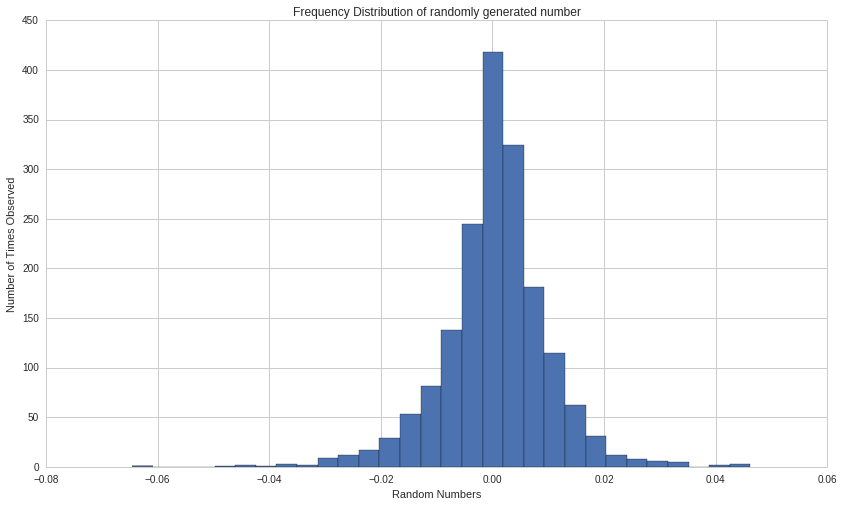
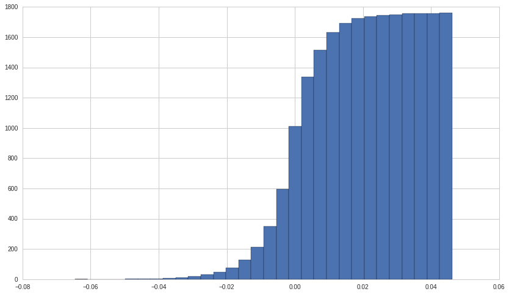
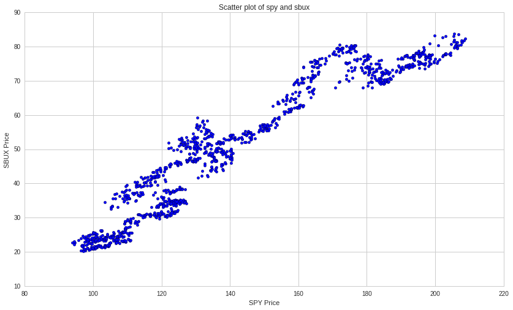
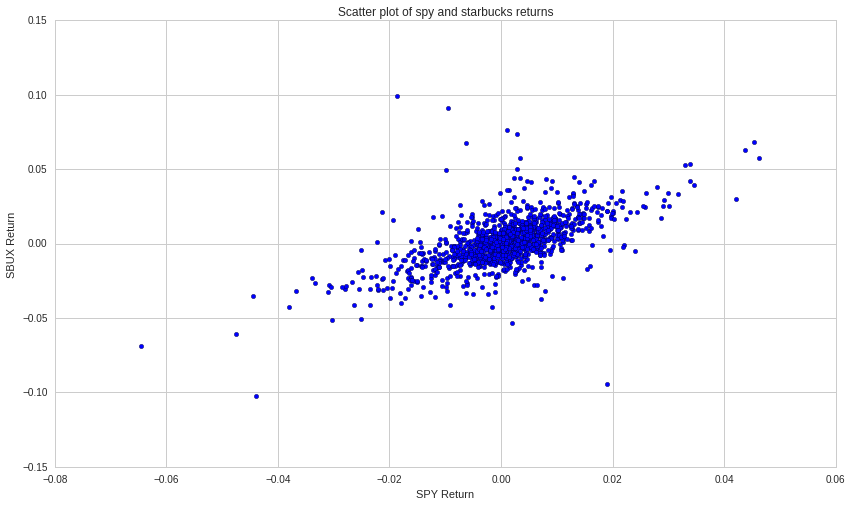
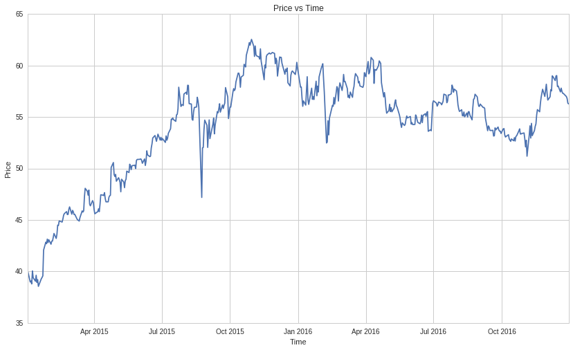
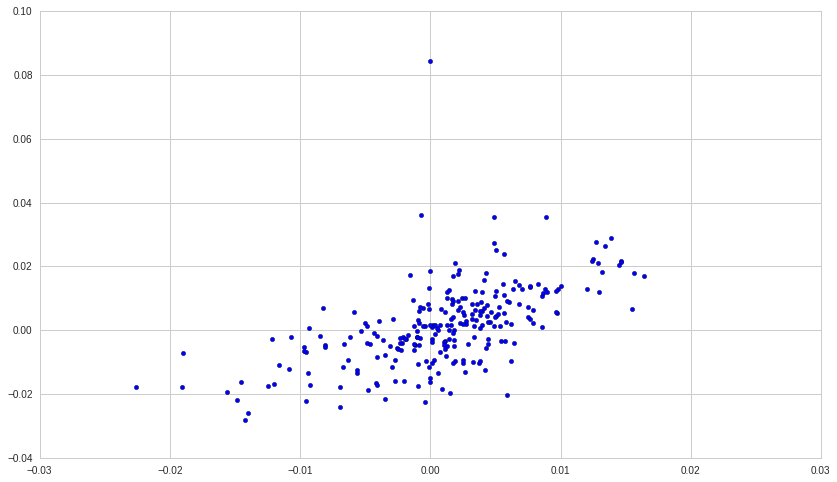
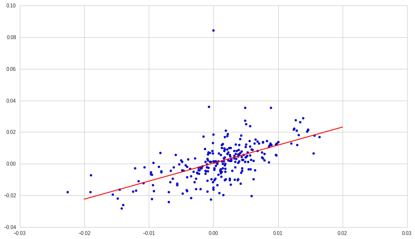

Exercises: Plotting - Answer Key
================================

By Christopher van Hoecke, Max Margenot, and Delaney Mackenzie

Lecture Link:
-------------

https://www.quantopian.com/lectures/plotting-data

IMPORTANT NOTE:
~~~~~~~~~~~~~~~

This lecture corresponds to the Plotting Data lecture, which is part of
the Quantopian lecture series. This homework expects you to rely heavily
on the code presented in the corresponding lecture. Please copy and
paste regularly from that lecture when starting to work on the problems,
as trying to do them from scratch will likely be too difficult.

Part of the Quantopian Lecture Series:

-  `www.quantopian.com/lectures <https://www.quantopian.com/lectures>`__
-  `github.com/quantopian/research_public <https://github.com/quantopian/research_public>`__

--------------

.. code:: ipython2

    # Useful Functions
    import numpy as np
    import matplotlib.pyplot as plt

--------------

Exercise 1: Histograms
======================

a. Returns
----------

Find the daily returns for SPY over a 7-year window.

.. code:: ipython2

    data = get_pricing('SPY', fields='price', start_date='2010-01-01', end_date='2017-01-01')
    returns = data.pct_change()[1:]

b. Graphing
-----------

Using the techniques laid out in lecture, plot a histogram of the
returns

.. code:: ipython2

    plt.hist(returns, bins = 30);
    plt.xlabel('Random Numbers');
    plt.ylabel('Number of Times Observed');
    plt.title('Frequency Distribution of randomly generated number');

c. Cumulative distribution
--------------------------

Plot the cumulative distribution histogram for your returns

.. code:: ipython2

    plt.hist(returns, bins = 30, cumulative='true');

--------------

Exercise 2 : Scatter Plots
==========================

a. Data
-------

Start by collecting the close prices of McDonalds Corp. (MCD) and
Starbucks (SBUX) for the last 5 years with daily frequency.

.. code:: ipython2

    SPY  = get_pricing('SPY', fields='close_price', start_date='2013-06-19', end_date='2018-06-19', frequency='daily')
    SBUX = get_pricing('SBUX', fields='close_price', start_date='2013-06-19', end_date='2018-06-19', frequency='daily')

b. Plotting
-----------

Graph a scatter plot of SPY and Starbucks.

.. code:: ipython2

    plt.scatter(SPY, SBUX);
    plt.title('Scatter plot of spy and sbux');
    plt.xlabel('SPY Price');
    plt.ylabel('SBUX Price');

c. Plotting Returns
-------------------

Graph a scatter plot of the returns of SPY and Starbucks.

.. code:: ipython2

    SPY_R = SPY.pct_change()[1:]
    SBUX_R = SBUX.pct_change()[1:]
    
    plt.scatter(SPY_R, SBUX_R);
    plt.title('Scatter plot of spy and starbucks returns');
    plt.xlabel('SPY Return');
    plt.ylabel('SBUX Return');

*Remember a scatter plot must have the same number of values for each
parameter. If spy and SBUX did not have the same number of data points,
your graph will return an error*

--------------

Exercise 3 : Linear Plots
=========================

a. Getting Data
---------------

Use the techniques laid out in lecture to find the open price over a
2-year period for Starbucks (SBUX) and Dunkin Brands Group (DNKN). Print
them out in a table.

.. code:: ipython2

    data = get_pricing(['SBUX', 'DNKN'], fields='open_price', start_date = '2015-01-01', end_date='2017-01-01') ## Your code goes here. 
    data.head()

.. raw:: html

    

    <table border="1" class="dataframe">
      <thead>
        <tr style="text-align: right;">
          <th></th>
          <th>Equity(6683 [SBUX])</th>
          <th>Equity(41759 [DNKN])</th>
        </tr>
      </thead>
      <tbody>
        <tr>
          <th>2015-01-02 00:00:00+00:00</th>
          <td>39.945</td>
          <td>40.893</td>
        </tr>
        <tr>
          <th>2015-01-05 00:00:00+00:00</th>
          <td>38.977</td>
          <td>40.721</td>
        </tr>
        <tr>
          <th>2015-01-06 00:00:00+00:00</th>
          <td>39.074</td>
          <td>40.664</td>
        </tr>
        <tr>
          <th>2015-01-07 00:00:00+00:00</th>
          <td>38.787</td>
          <td>40.616</td>
        </tr>
        <tr>
          <th>2015-01-08 00:00:00+00:00</th>
          <td>40.042</td>
          <td>41.931</td>
        </tr>
      </tbody>
    </table>
    

b. Data Structure
-----------------

The data is returned to us as a pandas dataframe object. Index your data
to convert them into simple strings.

.. code:: ipython2

    data.columns = [e.symbol for e in data.columns] 
    data['SBUX'].head()

.. parsed-literal::

    2015-01-02 00:00:00+00:00    39.945
    2015-01-05 00:00:00+00:00    38.977
    2015-01-06 00:00:00+00:00    39.074
    2015-01-07 00:00:00+00:00    38.787
    2015-01-08 00:00:00+00:00    40.042
    Freq: C, Name: SBUX, dtype: float64

c. Plotting
-----------

Plot the data for SBUX stock price as a function of time. Remember to
label your axis and title the graph.

.. code:: ipython2

    plt.plot(data['SBUX']);
    plt.xlabel('Time');
    plt.ylabel('Price');
    plt.title('Price vs Time');

--------------

Exercise 4 : Best fits plots
============================

Here we have a scatter plot of two data sets. Vary the ``a`` and ``b``
parameter in the code to try to draw a line that ‘fits’ our data nicely.
The line should seem as if it is describing a pattern in the data.
*While quantitative methods exist to do this automatically, we would
like you to try to get an intuition for what this feels like.*

.. code:: ipython2

    data1 = get_pricing('SBUX', fields='open_price', start_date='2013-01-01', end_date='2014-01-01')
    data2 = get_pricing('SPY', fields='open_price', start_date = '2013-01-01', end_date='2014-01-01')
    
    rdata1= data1.pct_change()[1:]
    rdata2= data2.pct_change()[1:]
    plt.scatter(rdata2, rdata1);

.. code:: ipython2

    plt.scatter(rdata2, rdata1)
    
    # Answer
    a = 0.0004
    b = 1.14
    #Answer
    
    x = np.arange(-0.02, 0.03, 0.01)
    y = a + (b*x)
    plt.plot(x,y, color='r');

--------------

Congratulations on completing the answer key to the Plotting exercises!

As you learn more about writing trading algorithms and the Quantopian
platform, be sure to check out the daily `Quantopian
Contest <https://www.quantopian.com/contest>`__, in which you can
compete for a cash prize every day.

Start by going through the `Writing a Contest
Algorithm <https://www.quantopian.com/tutorials/contest>`__ tutorial.

*This presentation is for informational purposes only and does not
constitute an offer to sell, a solicitation to buy, or a recommendation
for any security; nor does it constitute an offer to provide investment
advisory or other services by Quantopian, Inc. (“Quantopian”). Nothing
contained herein constitutes investment advice or offers any opinion
with respect to the suitability of any security, and any views expressed
herein should not be taken as advice to buy, sell, or hold any security
or as an endorsement of any security or company. In preparing the
information contained herein, Quantopian, Inc. has not taken into
account the investment needs, objectives, and financial circumstances of
any particular investor. Any views expressed and data illustrated herein
were prepared based upon information, believed to be reliable, available
to Quantopian, Inc. at the time of publication. Quantopian makes no
guarantees as to their accuracy or completeness. All information is
subject to change and may quickly become unreliable for various reasons,
including changes in market conditions or economic circumstances.*
