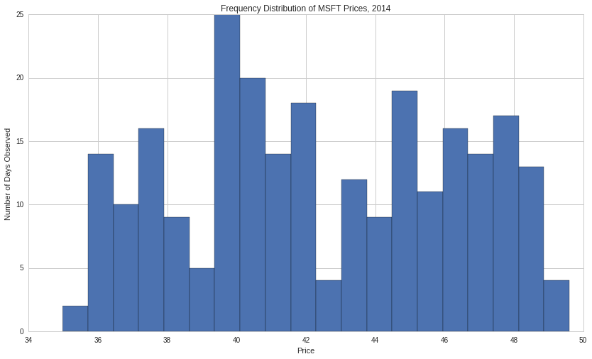
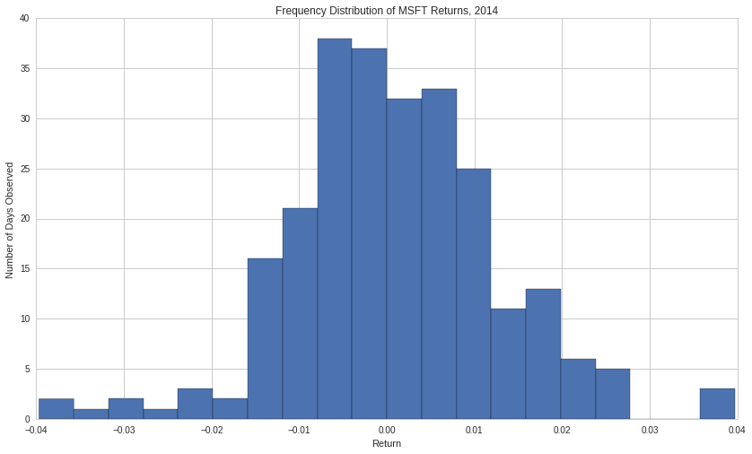
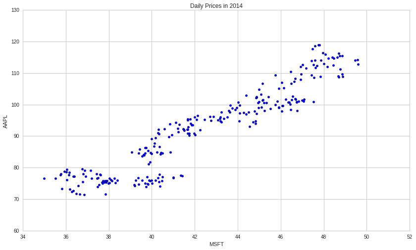
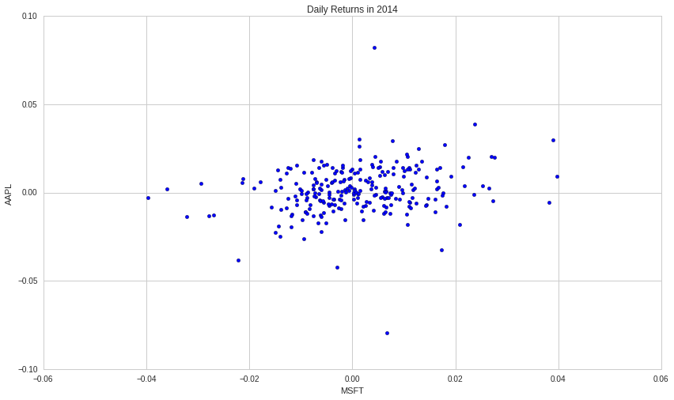
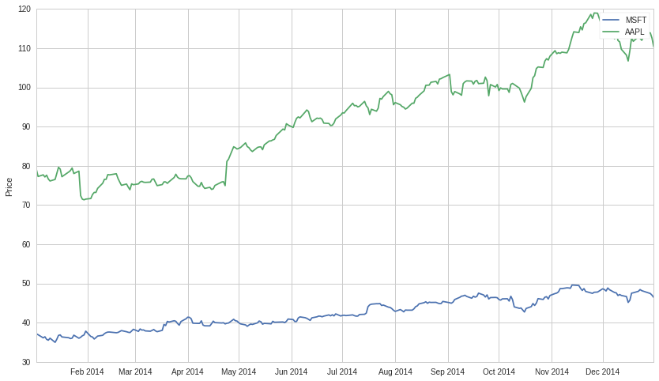
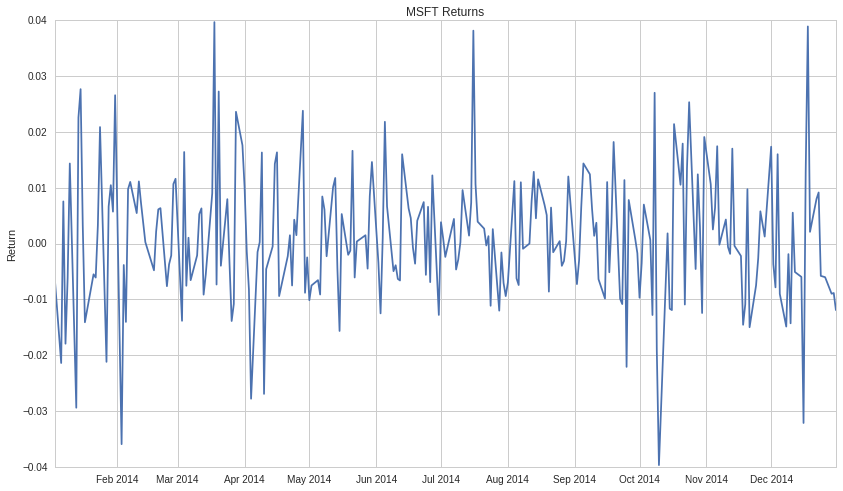

Graphical Representations of Data
=================================

By Evgenia “Jenny” Nitishinskaya, Maxwell Margenot, and Delaney
Granizo-Mackenzie.

Part of the Quantopian Lecture Series:

-  `www.quantopian.com/lectures <https://www.quantopian.com/lectures>`__
-  `github.com/quantopian/research_public <https://github.com/quantopian/research_public>`__

Representing data graphically can be incredibly useful for learning how
the data behaves and seeing potential structure or flaws. Care should be
taken, as humans are incredibly good at seeing only evidence that
confirms our beliefs, and visual data lends itself well to that. Plots
are good to use when formulating a hypothesis, but should not be used to
test a hypothesis.

We will go over some common plots here.

.. code:: ipython2

    # Import our libraries
    
    # This is for numerical processing
    import numpy as np
    # This is the library most commonly used for plotting in Python.
    # Notice how we import it 'as' plt, this enables us to type plt
    # rather than the full string every time.
    import matplotlib.pyplot as plt

Getting Some Data
-----------------

If we’re going to plot data we need some data to plot. We’ll get the
pricing data of Apple (AAPL) and Microsoft (MSFT) to use in our
examples.

Data Structure
~~~~~~~~~~~~~~

Knowing the structure of your data is very important. Normally you’ll
have to do a ton of work molding your data into the form you need for
testing. Quantopian has done a lot of cleaning on the data, but you
still need to put it into the right shapes and formats for your
purposes.

In this case the data will be returned as a pandas dataframe object. The
rows are timestamps, and the columns are the two assets, AAPL and MSFT.

.. code:: ipython2

    start = '2014-01-01'
    end = '2015-01-01'
    data = get_pricing(['AAPL', 'MSFT'], fields='price', start_date=start, end_date=end)
    data.head()

.. raw:: html

    

    <table border="1" class="dataframe">
      <thead>
        <tr style="text-align: right;">
          <th></th>
          <th>Equity(24 [AAPL])</th>
          <th>Equity(5061 [MSFT])</th>
        </tr>
      </thead>
      <tbody>
        <tr>
          <th>2014-01-02 00:00:00+00:00</th>
          <td>79.034</td>
          <td>37.145</td>
        </tr>
        <tr>
          <th>2014-01-03 00:00:00+00:00</th>
          <td>77.284</td>
          <td>36.920</td>
        </tr>
        <tr>
          <th>2014-01-06 00:00:00+00:00</th>
          <td>77.709</td>
          <td>36.130</td>
        </tr>
        <tr>
          <th>2014-01-07 00:00:00+00:00</th>
          <td>77.164</td>
          <td>36.403</td>
        </tr>
        <tr>
          <th>2014-01-08 00:00:00+00:00</th>
          <td>77.626</td>
          <td>35.750</td>
        </tr>
      </tbody>
    </table>
    

Indexing into the data with ``data['AAPL']`` will yield an error because
the type of the columns are equity objects and not simple strings. Let’s
change that using this little piece of Python code. Don’t worry about
understanding it right now, unless you do, in which case
congratulations.

.. code:: ipython2

    data.columns = [e.symbol for e in data.columns]
    data.head()

.. raw:: html

    

    <table border="1" class="dataframe">
      <thead>
        <tr style="text-align: right;">
          <th></th>
          <th>AAPL</th>
          <th>MSFT</th>
        </tr>
      </thead>
      <tbody>
        <tr>
          <th>2014-01-02 00:00:00+00:00</th>
          <td>79.034</td>
          <td>37.145</td>
        </tr>
        <tr>
          <th>2014-01-03 00:00:00+00:00</th>
          <td>77.284</td>
          <td>36.920</td>
        </tr>
        <tr>
          <th>2014-01-06 00:00:00+00:00</th>
          <td>77.709</td>
          <td>36.130</td>
        </tr>
        <tr>
          <th>2014-01-07 00:00:00+00:00</th>
          <td>77.164</td>
          <td>36.403</td>
        </tr>
        <tr>
          <th>2014-01-08 00:00:00+00:00</th>
          <td>77.626</td>
          <td>35.750</td>
        </tr>
      </tbody>
    </table>
    

Much nicer, now we can index. Indexing into the 2D dataframe will give
us a 1D series object. The index for the series is timestamps, the value
upon index is a price. Similar to an array except instead of integer
indecies it’s times.

.. code:: ipython2

    data['MSFT'].head()

.. parsed-literal::

    2014-01-02 00:00:00+00:00    37.145
    2014-01-03 00:00:00+00:00    36.920
    2014-01-06 00:00:00+00:00    36.130
    2014-01-07 00:00:00+00:00    36.403
    2014-01-08 00:00:00+00:00    35.750
    Name: MSFT, dtype: float64

##Histogram

A histogram is a visualization of how frequent different values of data
are. By displaying a frequency distribution using bars, it lets us
quickly see where most of the observations are clustered. The height of
each bar represents the number of observations that lie in each
interval. You can think of a histogram as an empirical and discrete
Probability Density Function (PDF).

.. code:: ipython2

    # Plot a histogram using 20 bins
    plt.hist(data['MSFT'], bins=20)
    plt.xlabel('Price')
    plt.ylabel('Number of Days Observed')
    plt.title('Frequency Distribution of MSFT Prices, 2014');

Returns Histogram
~~~~~~~~~~~~~~~~~

In finance rarely will we look at the distribution of prices. The reason
for this is that prices are non-stationary and move around a lot. For
more info on non-stationarity please see `this
lecture <https://www.quantopian.com/lectures/integration-cointegration-and-stationarity>`__.
Instead we will use daily returns. Let’s try that now.

.. code:: ipython2

    # Remove the first element because percent change from nothing to something is NaN
    R = data['MSFT'].pct_change()[1:]
    
    # Plot a histogram using 20 bins
    plt.hist(R, bins=20)
    plt.xlabel('Return')
    plt.ylabel('Number of Days Observed')
    plt.title('Frequency Distribution of MSFT Returns, 2014');

The graph above shows, for example, that the daily returns of MSFT were
above 0.03 on fewer than 5 days in 2014. Note that we are completely
discarding the dates corresponding to these returns.

#####IMPORTANT: Note also that this does not imply that future returns
will have the same distribution.

Cumulative Histogram (Discrete Estimated CDF)
~~~~~~~~~~~~~~~~~~~~~~~~~~~~~~~~~~~~~~~~~~~~~

An alternative way to display the data would be using a cumulative
distribution function, in which the height of a bar represents the
number of observations that lie in that bin or in one of the previous
ones. This graph is always nondecreasing since you cannot have a
negative number of observations. The choice of graph depends on the
information you are interested in.

.. code:: ipython2

    # Remove the first element because percent change from nothing to something is NaN
    R = data['MSFT'].pct_change()[1:]
    
    # Plot a histogram using 20 bins
    plt.hist(R, bins=20, cumulative=True)
    plt.xlabel('Return')
    plt.ylabel('Number of Days Observed')
    plt.title('Cumulative Distribution of MSFT Returns, 2014');

.. image:: notebook_files/notebook_14_0.png

Scatter plot
------------

A scatter plot is useful for visualizing the relationship between two
data sets. We use two data sets which have some sort of correspondence,
such as the date on which the measurement was taken. Each point
represents two corresponding values from the two data sets. However, we
don’t plot the date that the measurements were taken on.

.. code:: ipython2

    plt.scatter(data['MSFT'], data['AAPL'])
    plt.xlabel('MSFT')
    plt.ylabel('AAPL')
    plt.title('Daily Prices in 2014');

.. code:: ipython2

    R_msft = data['MSFT'].pct_change()[1:]
    R_aapl = data['AAPL'].pct_change()[1:]
    
    plt.scatter(R_msft, R_aapl)
    plt.xlabel('MSFT')
    plt.ylabel('AAPL')
    plt.title('Daily Returns in 2014');

Line graph
==========

A line graph can be used when we want to track the development of the y
value as the x value changes. For instance, when we are plotting the
price of a stock, showing it as a line graph instead of just plotting
the data points makes it easier to follow the price over time. This
necessarily involves “connecting the dots” between the data points,
which can mask out changes that happened between the time we took
measurements.

.. code:: ipython2

    plt.plot(data['MSFT'])
    plt.plot(data['AAPL'])
    plt.ylabel('Price')
    plt.legend(['MSFT', 'AAPL']);

.. code:: ipython2

    # Remove the first element because percent change from nothing to something is NaN
    R = data['MSFT'].pct_change()[1:]
    
    plt.plot(R)
    plt.ylabel('Return')
    plt.title('MSFT Returns');

Never Assume Conditions Hold
----------------------------

Again, whenever using plots to visualize data, do not assume you can
test a hypothesis by looking at a graph. Also do not assume that because
a distribution or trend used to be true, it is still true. In general
much more sophisticated and careful validation is required to test
whether models hold. Plots are mainly useful when initially deciding how
your models should work.

*This presentation is for informational purposes only and does not
constitute an offer to sell, a solicitation to buy, or a recommendation
for any security; nor does it constitute an offer to provide investment
advisory or other services by Quantopian, Inc. (“Quantopian”). Nothing
contained herein constitutes investment advice or offers any opinion
with respect to the suitability of any security, and any views expressed
herein should not be taken as advice to buy, sell, or hold any security
or as an endorsement of any security or company. In preparing the
information contained herein, Quantopian, Inc. has not taken into
account the investment needs, objectives, and financial circumstances of
any particular investor. Any views expressed and data illustrated herein
were prepared based upon information, believed to be reliable, available
to Quantopian, Inc. at the time of publication. Quantopian makes no
guarantees as to their accuracy or completeness. All information is
subject to change and may quickly become unreliable for various reasons,
including changes in market conditions or economic circumstances.*
