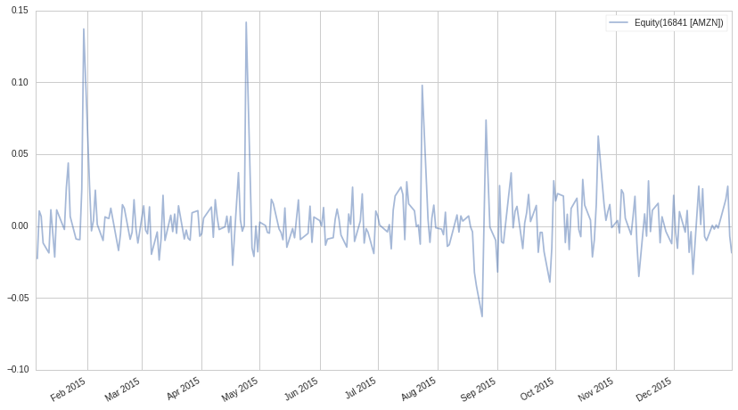
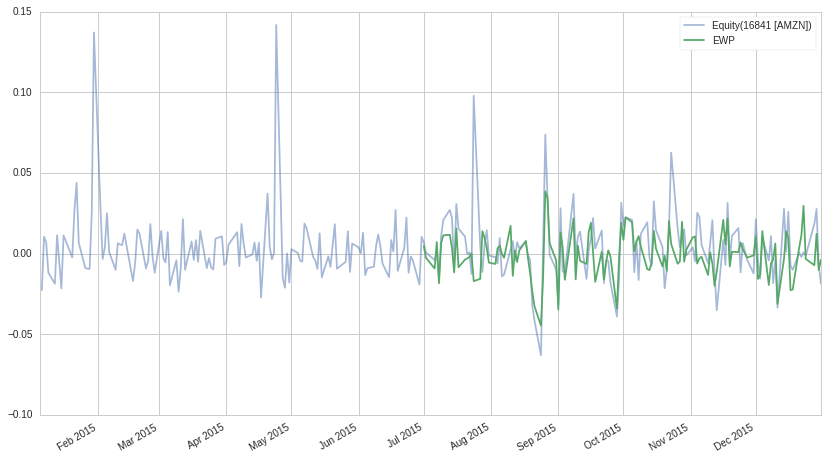
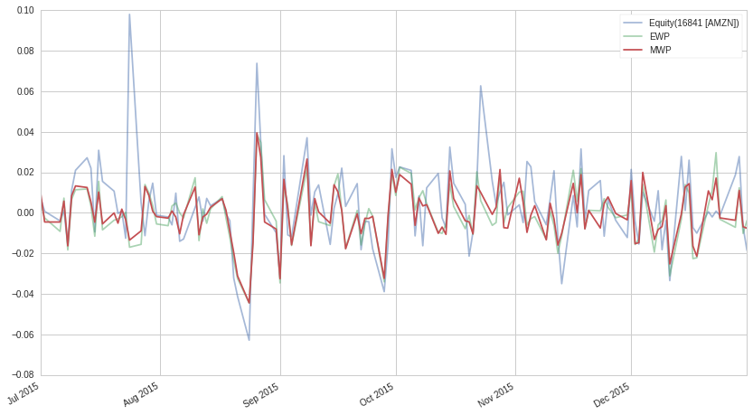
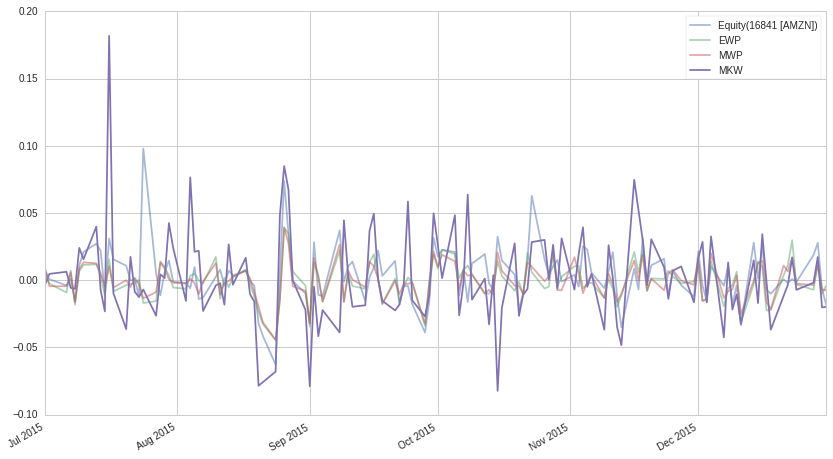

#Exercise Answer Key: Position Concentration Risk

Lecture Link
------------

This exercise notebook refers to this lecture. Please use the lecture
for explanations and sample code.

https://www.quantopian.com/lectures#Position-Concentration-Risk

Part of the Quantopian Lecture Series:

-  `www.quantopian.com/lectures <https://www.quantopian.com/lectures>`__
-  `github.com/quantopian/research_public <https://github.com/quantopian/research_public>`__

.. code:: ipython2

    import numpy as np
    import pandas as pd
    import scipy.stats as stats
    import matplotlib.pyplot as plt
    import math
    import cvxpy

##Helper Functions

.. code:: ipython2

    def get_markowitz_weights(mu, Sigma, gamma=1, max_position=1.0, max_leverage=1.0, short=False):
        w = cvxpy.Variable(len(Sigma))
        g = cvxpy.Parameter(sign='positive')
        L = cvxpy.Parameter()
        g.value = gamma
        L.value = max_leverage
        try:
            ret = mu.T*w
        except ValueError:
            ret = mu*w
        
        risk = cvxpy.quad_form(w, Sigma)
        
        objective = cvxpy.Maximize(ret - g*risk)
        constraints = [
            cvxpy.abs(w) < max_position,
            cvxpy.norm(w, 1) <= L, # Make it so we don't have to invest everything
        ]
        
        if not short:
            constraints.append(w >= 0) # Force all positive weights
        
        prob = cvxpy.Problem(
            objective,
            constraints
        )
        
        result = prob.solve()
        
        return w.value

#Exercise 1: Roulette Simulation

A roulette table has 38 pockets: 1 through 36, 0, and 00. A bet on an
even number pays out at a ratio of 1:1. Landing on 0 and 00 count as
losing.

You have $100 and are betting on an even number.

##a. All In

By running 1000 simulations, find the mean and standard deviation of the
payout if you bet your entire $100 on one round.

.. code:: ipython2

    universes = 1000
    evens = 19
    total = 38
    payout = 100
    rounds = 1
    results = np.zeros(universes)
    
    #Your code goes here
    
    p = float(19)/total
    
    for i in range(universes):
        results[i] = payout * np.random.binomial(n = rounds, p = p)
        
    print "Payout mean:", np.mean(results)
    print "Payout std:", np.std(results)

.. parsed-literal::

    Payout mean: 51.3
    Payout std: 49.9830971429

##b. $1 Bets

By running 1000 simulations, find the mean and standard deviation of the
payout if instead you bet $1 at a time and play 100 rounds.

.. code:: ipython2

    universes = 1000
    evens = 19
    total = 38
    payout = 1
    rounds = 100
    results = np.zeros(universes)
    
    #Your code goes here
    
    p = float(19)/total
    
    for i in range(universes):
        results[i] = payout * np.random.binomial(n = rounds, p = p)
        
    print "Payout mean:", np.mean(results)
    print "Payout std:", np.std(results)

.. parsed-literal::

    Payout mean: 49.882
    Payout std: 5.09706543023

#Exercise 2: Portfolio Diversification

##a. Single Asset

Use the pricing data below to find the standard deviation of the returns
of ``AMZN`` in the second half of the year 2015 and plot the price
against time.

.. code:: ipython2

    time_start = '2015-01-01'
    time_halfway = '2015-07-01'
    time_end = '2016-01-01'
    AMZN_r = get_pricing('AMZN', fields='price', start_date=time_start, end_date=time_end).pct_change()[1:]
    X = np.linspace(0, len(AMZN_r), len(AMZN_r))
    
    #Your code goes here
    
    print "AMZN returns std:", np.std(AMZN_r.loc[time_halfway:])
    AMZN_r.plot(alpha = 0.5);
    plt.legend();

.. parsed-literal::

    AMZN returns std: 0.0204975317528

##b. Equally Weighted Portfolio

Create an equally weighted portfolio of the following 10 stocks, find
the standard deviation of the portfolio’s returns, and then plot the
returns for the second half of 2015 along with the ``AMZN`` returns from
above. Putting AMZN in a portfolio of 19 other securities should
diversify the idiosyncratic risk and lower the price variability.

Hint: To calculate weighted returns dot the weight matrix
``eweights_df`` with the splice of the returns matrix containing the
``symbol_list`` pricing data (``returns_df[symbol_list]``).

.. code:: ipython2

    symbol_list = ['BEN', 'SYMC', 'IP', 'SWKS', 'IVZ', 'MJN', 'WMB', 'LB', 'TWX', 'NFX', 'PFE', 'LLY', 'HP', 'JPM', 'CXO', 'TJX', 'CAG', 'BBT', 'ATVI', 'NFLX']
    prices_df = get_pricing(symbol_list, fields=['price']
                                   , start_date=time_start, end_date=time_end)['price']
    prices_df.columns = map(lambda x: x.symbol, prices_df.columns)
    
    eweights_df = len(symbol_list) * [float(1)/len(symbol_list)]
    
    returns_df = prices_df.pct_change(1)[1:]
    
    #Your code goes here
    
    returns_df['EWP'] = returns_df[symbol_list].dot(eweights_df)
    
    print "AMZN returns std:", np.std(AMZN_r.loc[time_halfway:])
    print "Portfolio returns std:", np.std(returns_df['EWP'].loc[time_halfway:])
    AMZN_r.plot(alpha = 0.5);
    returns_df['EWP'].loc[time_halfway:].plot();
    plt.legend();

.. parsed-literal::

    AMZN returns std: 0.0204975317528
    Portfolio returns std: 0.013772358195

##c. Market Weighted Portfolio

Create a new portfolio of the same assets, this time weighted by market
capitalization, find the standard deviation of the portfolio returns,
and then plot the portfolio returns along with both results from above.
Weighting using market capitalization brings us closer to the
theoretical efficient portfolio, a portfolio of investments containing
every single asset on the market, each weighted proportionately to its
presence in the market.

The market cap is found using a pipeline factor, the steps for which are
below.

.. code:: ipython2

    #Pipeline Setup
    from quantopian.research import run_pipeline
    from quantopian.pipeline import Pipeline
    from quantopian.pipeline.data import morningstar 
    from quantopian.pipeline.factors import CustomFactor
    from quantopian.pipeline.classifiers.morningstar import Sector
    from quantopian.pipeline.filters import QTradableStocksUS
    from time import time
    
    universe = QTradableStocksUS()
    
    pipe = Pipeline(columns = {'Market Cap' : morningstar.valuation.market_cap.latest},
        screen=universe
    )
    
    start_timer = time()
    results = run_pipeline(pipe, time_start, time_end)
    end_timer = time()
    results.fillna(value=0);
    
    print "Time to run pipeline %.2f secs" % (end_timer - start_timer)
    
    # This is important as sometimes the first data returned won't be on the specified start date
    first_trading_day = results.index.levels[0][1]
    
    market_cap = results.loc[first_trading_day]['Market Cap']
    
    market_cap.index = [x.symbol for x in market_cap.index]#pd.MultiIndex.from_tuples([(x[0], x[1].symbol) for x in market_cap.index])
    
    mcs = market_cap # pd.DataFrame(market_cap.loc[(first_trading_day,)].loc[symbol_list]).transpose()

.. parsed-literal::

    Time to run pipeline 7.45 secs

.. code:: ipython2

    mweights = (mcs[symbol_list]/sum(mcs[symbol_list])).transpose()
     
    #Your code goes here
    
    returns_df['MWP'] = returns_df[symbol_list].dot(mweights)
    
    print "AMZN returns std:", np.std(AMZN_r.loc[time_halfway:])
    print "EWP returns std:", np.std(returns_df['EWP'].loc[time_halfway:])
    print "MWP returns std:", np.std(returns_df['MWP'].loc[time_halfway:])
    AMZN_r[time_halfway:].plot(alpha = 0.5);
    returns_df['EWP'].loc[time_halfway:].plot(alpha = 0.5);
    returns_df['MWP'].loc[time_halfway:].plot();
    plt.legend();

.. parsed-literal::

    AMZN returns std: 0.0204975317528
    EWP returns std: 0.013772358195
    MWP returns std: 0.0128306697957

##d. Markowitz Portfolio

Create a new portfolio of the same assets, this time using the
``get_markowitz_weights`` helper function to create the Markowitz
mean-variance portfolio. Use the pricing data from the first half of
2015 to calibrate the weights, and then plot the portfolio returns for
the second half of 2015.

Important Note
~~~~~~~~~~~~~~

If the weights from the lookback window (6 prior months), are correlated
with the weights of the forward window (6 following months), then this
optimization should be helpful in reducing out portfolio volatility
going forward. However, this is often not the case in real life. Real
markets are complicated, and historical volatility may not be a good
predictor of future volatility. Volatility forecasting models are an
entire area of research in finance, so don’t think that just because
historic volatility of your portfolio was low, it will be equally low in
the future. This is just one technique that attempts to control
portfolio risk, there is a more complete discussion of this in this
lecture:

https://www.quantopian.com/lectures/risk-constrained-portfolio-optimization

.. code:: ipython2

    mu = returns_df[symbol_list].\
            loc[:time_halfway].fillna(0).mean().as_matrix()
    sigma = returns_df[symbol_list].\
            loc[:time_halfway].fillna(0).cov().as_matrix()
    
    mkweights_df = get_markowitz_weights(mu, sigma)
    
    #Your code goes here
    
    returns_df['MKW'] = returns_df[symbol_list].dot(mkweights_df)
    
    print "AMZN returns std:", np.std(AMZN_r.loc[time_halfway:])
    print "EWP returns std:", np.std(returns_df['EWP'].loc[time_halfway:])
    print "MWP returns std:", np.std(returns_df['MWP'].loc[time_halfway:])
    print "MKW returns std:", np.std(returns_df['MKW'].loc[time_halfway:]), "\n"
    AMZN_r.loc[time_halfway:].plot(alpha = 0.5);
    returns_df['EWP'].loc[time_halfway:].plot(alpha = 0.5);
    returns_df['MWP'].loc[time_halfway:].plot(alpha = 0.5);
    returns_df['MKW'].loc[time_halfway:].plot();
    plt.legend();

.. parsed-literal::

    AMZN returns std: 0.0204975317528
    EWP returns std: 0.013772358195
    MWP returns std: 0.0128306697957
    MKW returns std: 0.0349274407989 
    

Although the Markowitz portfolio was supposed to produce the portfolio
with the least variance for the given returns, it failed to do so in
this out-of-sample scenario.

As discussed above, covariance matrices are volatile and tend to shift
rapidly. When we calibrated the Markowitz weights we used the covariance
matrix from the first half of 2015 as our sample and ran it through the
second half of 2016, meaning our test was out-of-sample. Due to the
volatile nature of covariance matrices, it is likely that the covariance
matrix had significantly changed between the sample and out-of-sample
time periods, making our Markowitz weights invalid for the out-of-sample
period.

--------------

Congratulations on completing the Position Concentration Risk exercises!

As you learn more about writing trading algorithms and the Quantopian
platform, be sure to check out the daily `Quantopian
Contest <https://www.quantopian.com/contest>`__, in which you can
compete for a cash prize every day.

Start by going through the `Writing a Contest
Algorithm <https://www.quantopian.com/tutorials/contest>`__ tutorial.

*This presentation is for informational purposes only and does not
constitute an offer to sell, a solic itation to buy, or a recommendation
for any security; nor does it constitute an offer to provide investment
advisory or other services by Quantopian, Inc. (“Quantopian”). Nothing
contained herein constitutes investment advice or offers any opinion
with respect to the suitability of any security, and any views expressed
herein should not be taken as advice to buy, sell, or hold any security
or as an endorsement of any security or company. In preparing the
information contained herein, Quantopian, Inc. has not taken into
account the investment needs, objectives, and financial circumstances of
any particular investor. Any views expressed and data illustrated herein
were prepared based upon information, believed to be reliable, available
to Quantopian, Inc. at the time of publication. Quantopian makes no
guarantees as to their accuracy or completeness. All information is
subject to change and may quickly become unreliable for various reasons,
including changes in market conditions or economic circumstances.*
