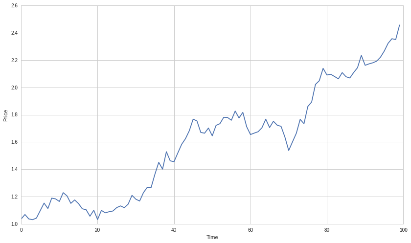
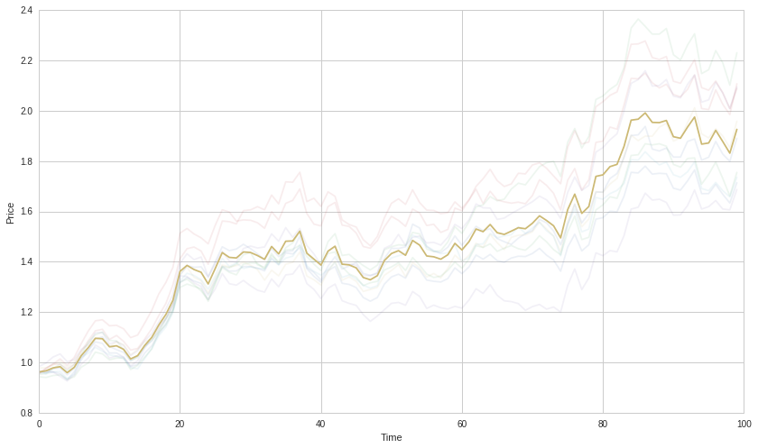
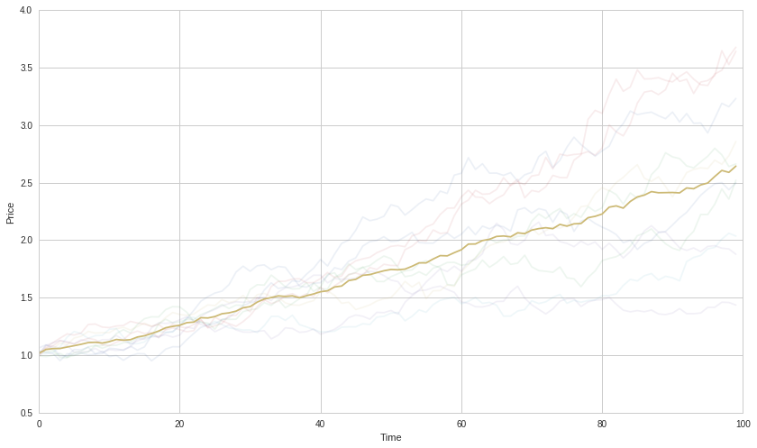
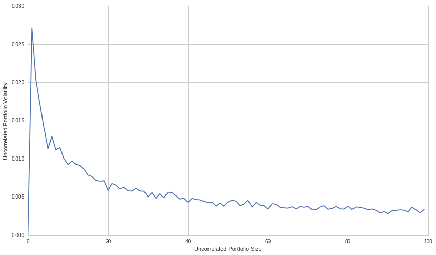

#Position Concentration Risk

By Maxwell Margenot and Delaney Granizo-Mackenzie.

Part of the Quantopian Lecture Series:

www.quantopian.com/lectures github.com/quantopian/research_public

When trading, it is important to diversify your risks. By concentrating
your positions in only a few assets, you can negatively be impacted by
their risks. This notebook is designed to show how diversifying your
portfolio can result in a lower overall risk profile.

.. code:: ipython2

    import pandas as pd
    import numpy as np
    
    import matplotlib.pyplot as plt

##Intuition

Let’s say you learned to card count at Blackjack, whereas most casinos
will throw you out if you are caught, it will give you a `1% edge over
the house <https://en.wikipedia.org/wiki/Card_counting>`__. If you
walked into the casino with $10,000 to bet, it would clearly be insane
to place all the money on one game. Whereas you have a 51% chance of
winning that game, the house still has a 49% chance. The expected
outcome is for you to win the game, but the variance is increadibly
high.

Let’s say you placed your money on 100 different tables. This is known
as making independent bets, because the outcome of one table doesn’t
affect any of the others. Your variance will be reduced as you make more
and more bets. You would still expect to win 51% of the tables, but the
chance of losing money is greatly reduced. Let’s see this in action.

###Simulating Blackjack Games

Each game will be won with a 51% probability. We can simulate this using
a binomial distribution, which is parameterized with the number of
trials we perform (games), and the chance of each trial succeeding.

First we’ll simulate 1000 different universes in which you walk into the
casino and play one game.

.. code:: ipython2

    universes = 1000
    
    results = np.zeros((universes, 1))
    for i in range(universes):
        results[i] = np.random.binomial(n = 1, p=0.51)

Now let’s check the mean and standard deviation of the results. We see
that because there are so many 0s and so many 1s, and nothing in
between, the standard deviation is very high. This is saying that you
should expect to win half a game, with the potential outcomes being
approximately evenly distributed between a loss and a win. Because you
played so few games, you have given no time for your edge to work.

.. code:: ipython2

    np.mean(results), np.std(results)

.. parsed-literal::

    (0.53200000000000003, 0.49897494927100305)

Now let’s simulate 1000 universes in which you walk into the casino and
play 100 games.

.. code:: ipython2

    universes = 1000
    
    results = np.zeros((universes, 1))
    for i in range(universes):
        results[i] = np.random.binomial(n = 100, p=0.51)
    
    np.mean(results), np.std(results)

.. parsed-literal::

    (51.201000000000001, 4.9920535854495789)

Now we see that the average result is much closer to 51 games won, with
a smaller standard deviation. We see here that you’re likely still not
safe, as your expected edge is only one game, whereas the standard
deviation is many games. This would indicate that you can reasonably
expect to lose more games than you win. Finally let’s try 10,000 games.

.. code:: ipython2

    universes = 1000
    
    results = np.zeros((universes, 1))
    for i in range(universes):
        results[i] = np.random.binomial(n = 10000, p=0.51)
    
    np.mean(results), np.std(results)

.. parsed-literal::

    (5100.6019999999999, 48.676150176446782)

In this case we’re much safer, as the expected edge is 100 games.

NOTE: There is a subtlety that it’s not always valid to use a standard
deviation, as the underlying distribution of data in this case is not
normal. We use it here because standard deviation is the metric of
volatility used in finance, and it still reflects how much ‘spread’
exists in the data. Be careful not to abuse standard deviation in
practice by assuming the underlying data is normal.

##Expanding to Portfolio Theory

The same exact principle exists in portfolio theory. If you think you
have an edge over the market in picking stocks that will go up or down,
you should try to make as many independent bets as possible. This can be
accomplished by investing in as many uncorrelated assets as possible.
Let’s take a look at an example.

Remember that in finance, volatility is measured by the standard
deviation of a time series, and the amount of future risk of a portfolio
is estimated by past portfolio volatility.

####Case 1: Investing in Few Assets

Let’s simulate some assets by sampling from a normal distribution.

NOTE: In practice real financial asset returns rarely are normally
distributed, so this is not a great assumption. However it’s okay here
to get our point across because we are just concerned with correlation
and level of volaility.

.. code:: ipython2

    R_1 = np.random.normal(1.01, 0.03, 100)
    A_1 = np.cumprod(R_1)
    P = A_1
    plt.plot(P)
    plt.xlabel('Time')
    plt.ylabel('Price');

In this case, we’re totally exposed to the volatility of that asset, as
our portfolio is entirely that asset.

####Case 2: Investing in Many Correlated Assets

In this case we expand our asset pool, but there is still a large amount
of pairwise correlation between the returns. We simulate this by
simulating assets 2 through N as asset 1 plus some noise.

.. code:: ipython2

    N = 10
    
    returns = np.zeros((N, 100))
    assets = np.zeros((N, 100))
    
    R_1 = np.random.normal(1.01, 0.03, 100)
    returns[0] = R_1
    assets[0] = np.cumprod(R_1)
    plt.plot(assets[0], alpha=0.1)
    
    for i in range(1, N):
        R_i = R_1 + np.random.normal(0.001, 0.01, 100)
        returns[i] = R_i
        assets[i] = np.cumprod(R_i)
        
        plt.plot(assets[i], alpha=0.1)
    
    R_P = np.mean(returns, axis=0)
    P = np.mean(assets, axis=0)
    plt.plot(P)
    plt.xlabel('Time')
    plt.ylabel('Price');
    
    print 'Asset Volatilities'
    print [np.std(R) for R in returns]
    print 'Mean Asset Volatility'
    print np.mean([np.std(R) for R in returns])
    print 'Portfolio Volatility'
    print np.std(R_P)

.. parsed-literal::

    Asset Volatilities
    [0.028284024256736047, 0.030739948626595206, 0.031591494947059345, 0.029374731232950157, 0.030155544749912645, 0.030279129828505846, 0.029689363035443027, 0.029602827861575445, 0.03021005066716944, 0.030774932310216038]
    Mean Asset Volatility
    0.0300702047516
    Portfolio Volatility
    0.0287023902616

Here you can see the portfolio accompanied by all the assets, the assets
being drawn much softer. The important thing to note is that the
portfolio undergoes all the same shocks as the assets, because when one
asset is up or down, all the others are likely to be so as well. This is
the problem with correlated assets. Let’s take a look at the volatility
of the assets and the volatility of the portfolio.

The mean volatility of our assets is the same as the portfolio
volatility. We haven’t gained anything by making more bets. You can
think of correlated bets as identical to the original bet. If the
outcome of the second bet is correlated with the first, then really
you’ve just made the same bet twice and you haven’t reduced your
volatility.

####Case 3: Investing in Many Uncorrelated Assets

In this case we independently generate a bunch of assets an construct a
portfolio that combines all of them.

.. code:: ipython2

    N = 10
    
    assets = np.zeros((N, 100))
    returns = np.zeros((N, 100))
    
    for i in range(N):
        R_i = np.random.normal(1.01, 0.03, 100)
        returns[i] = R_i
        assets[i] = np.cumprod(R_i)
        
        plt.plot(assets[i], alpha=0.1)
    
    R_P = np.mean(returns, axis=0)
    P = np.mean(assets, axis=0)
    plt.plot(P)
    plt.xlabel('Time')
    plt.ylabel('Price');
    
    print 'Asset Volatilities'
    print [np.std(R) for R in returns]
    print 'Mean Asset Volatility'
    print np.mean([np.std(R) for R in returns])
    print 'Portfolio Volatility'
    print np.std(R_P)

.. parsed-literal::

    Asset Volatilities
    [0.030237858089015177, 0.032903881322195787, 0.0292815777308091, 0.026911876873315674, 0.026684189948320374, 0.029975323398649917, 0.030531226213826916, 0.029564231016589962, 0.029162481483272634, 0.031000764537970443]
    Mean Asset Volatility
    0.0296253410614
    Portfolio Volatility
    0.00944852118336

Now we see the benefits of diversification. Holding more uncorrelated
assets smooths out our portfolio. When one is down, the others are no
more likely to be down, so the bumps both upwards and downwards are
often much smaller. The more assets we hold, the more we’ll reduce our
volatility as well. Let’s check that.

.. code:: ipython2

    portfolio_volatilities_by_size = np.zeros((100,1))
    
    for N in range(1,100):
    
        assets = np.zeros((N, 100))
        returns = np.zeros((N, 100))
    
        for i in range(N):
            R_i = np.random.normal(1.01, 0.03, 100)
            returns[i] = R_i
    
        R_P = np.mean(returns, axis=0)
    
        portfolio_volatilities_by_size[N] = np.std(R_P)
        
    plt.plot(portfolio_volatilities_by_size)
    plt.xlabel('Uncorrelated Portfolio Size')
    plt.ylabel('Uncorrelated Portfolio Volatility');

##Final Point

Be invested in as many uncorrelated assets as possible. In finance this
is known as diversification. If you have a pricing model, price
everything and invest accordingly. This concept is explained in the
Long-Short Equity Lecture.

###Capital Constraints

Because of transaction costs, you need to have certain minimum amounts
of capital to invest in large numbers of assets. Therefore sometimes you
are unable to invest in hundreds or thousands. In this case you should
still try to maximize your portfolio size, keeping in mind that if you
have a portfolio of size 20, you can still find 20 relatively
uncorrelated assets and that’s better than nothing.

##Now Let’s Explain with Math Rather Than Pictures

One of the key aspects of modern portfolio theory is that by combining
multiple assets into a portfolio, you can reduce the entire package’s
overall risk. Since we represent the volatility of an asset by its
standard deviation, we can easily show this mathematically.

Say that we have two assets in a portfolio, :math:`S_1` and :math:`S_2`,
with weights :math:`\omega_1` and :math:`\omega_2` such that
:math:`\omega_1 + \omega_2 = 1`. Call the portfolio :math:`P` and say
that :math:`S_1` and :math:`S_2` have mean and standard deviation
:math:`\mu_1, \sigma_1` and :math:`\mu_2, \sigma_2` respectively. We can
calculate the value of :math:`P` easily.

.. math::  P = \omega_1 S_1 + \omega_2 S_2 

Now we set :math:`\mu_P` as the return of the portfolio :math:`P`. It is
simple to calculate the expected return of this portfolio:

.. math::  E[\mu_P] = E[\omega_1 \mu_1 + \omega_2 \mu_2] = \omega_1 E[\mu_1] + \omega_2 E[\mu_2] 

As you can see, the expected return of the overall portfolio can be
directly determined using the expected returns of the assets *in* the
portfolio as well as their associated weights. Similarly, we can use
these same characteristics to determine the overall risk of the
portfolio, :math:`\sigma_p`. First, we calculate the variance of the
portfolio, :math:`\sigma_p^2 = VAR[P]`. Then we say that the correlation
between :math:`S_1` and :math:`S_2` is
:math:`COR[S_1,S_2] = \frac{COV[S_1,S_2]}{\sigma_1\sigma_2} = \rho_{12}`.
The calculations then follow:

:raw-latex:`\begin{eqnarray}
\sigma_p^2 &=& VAR[P] \\
    &=& VAR[\omega_1 S_1 + \omega_2 S_2] \\
    &=& VAR[\omega_1 S_1] + VAR[\omega_2 S_2] + COV[\omega_1 S_1,\omega_2 S_2] \\
    &=& \omega_1^2 VAR[S_1] + \omega_2^2 VAR[S_2] + 2\omega_1\omega_2 COV[S_1,S_2] \\
    &=& \omega_1^2 \sigma_1^2 + \omega_2^2 \sigma_2^2 + 2\rho_{12}\omega_1\omega_2\sigma_1\sigma_2
\end{eqnarray}`

.. code:: ipython2

    stocks = np.array([100, 75])
    mean_returns = np.array([4, 6])
    
    r_12 = 0.20
    cov_12 = r_12 * 0.05 * 0.08
    covariance_matrix = np.array([[0.05**2,cov_12],[cov_12,0.08**2]])
    
    weights = np.array([0.7, 0.3])
    
    P = np.dot(weights, stocks.T)

Now we will calculate the overall risk of the portfolio:

.. code:: ipython2

    var_p = np.dot(np.dot(weights, covariance_matrix), weights.T)
    sigma_p = np.sqrt(var_p)
    print "The overall risk of the portfolio is: ", sigma_p

.. parsed-literal::

    The overall risk of the portfolio is:  0.0462276973253

By combining assets into a portfolio, we were able to create a package
with lower overall risk than either of the individual assets. If we
include even more assets in the portfolio we can further reduce the risk
of exposure to any individual asset.

##Benefits Of Additional Bets

We can extend this idea to a portfolio made of of :math:`n` securities
fairly easily. The more assets you include in your portfolio, the lower
your overall risk will be. Here is the general form for the variance of
your portfolio in the case where you have :math:`n` assets:

.. math::  \sigma_p^2 = \sum_i \omega_i^2 \sigma_i^2 + \sum_i\sum_{j\neq i} \omega_i\omega_j\sigma_i\sigma_j\rho_{ij}, \ i, j \in \lbrace 1,\ldots, n\rbrace 

These benefits can be increased by ensuring that your assets are
independent from each other. When two assets are independent, they are
uncorrelated, i.e. \ :math:`\rho_{ij}=0`. The correlation between each
pairwise set of assets plays a very important part in our calcuations
for determining the variance of a portfolio. The higher the correlations
between assets, the more assets we need to include to reduce our risk by
a comparable amount.

.. code:: ipython2

    stocks = np.array([230, 176, 192, 105])
    mean_returns = np.array([2.0, 3.5, 7.5, 5.0])
    std_dev = np.array([0.05, 0.07, 0.11, 0.09])
    weights = np.array([0.35, 0.30, 0.15, 0.20])
    
    
    r_12 = 0.2
    r_13 = 0.08
    r_14 = 0.1
    r_23 = 0.6
    r_24 = 0.4
    r_34 = 0.8
    covariance_matrix = np.array([[0.05**2, r_12 * 0.05 * 0.07, r_13 * 0.05 * 0.11, r_14 * 0.05 * 0.09],
                                 [r_12 * 0.05 * 0.07, 0.07**2, r_23 * 0.07 * 0.11, r_24 * 0.07 * 0.09],
                                 [r_13 * 0.05 * 0.11, r_23 * 0.07 * 0.11, 0.11**2, r_34 * 0.11 * 0.09],
                                 [r_14 * 0.05 * 0.09, r_24 * 0.07 * 0.09, r_34 * 0.11 * 0.09, 0.09**2]])

.. code:: ipython2

    var_p = np.dot(np.dot(weights, covariance_matrix), weights.T)
    sigma_p = np.sqrt(var_p)
    print "The overall risk of the portfolio is: ", sigma_p

.. parsed-literal::

    The overall risk of the portfolio is:  0.052849787133

Now let’s assume that the correlations between all of these assets are
:math:`0`, that they are all pairwise independent. We will assume that
everything else remains the same as before. Using our calcualtions for
the portfolio’s risk we get:

.. code:: ipython2

    covariance_matrix = np.array([[0.05**2, 0, 0, 0],
                                 [0, 0.07**2, 0, 0],
                                 [0, 0, 0.11**2, 0],
                                 [0, 0, 0, 0.09**2]])
    var_p = np.dot(np.dot(weights, covariance_matrix), weights.T).flatten()
    sigma_p = np.sqrt(var_p)
    print "The overall risk of the portfolio is: ", sigma_p

.. parsed-literal::

    The overall risk of the portfolio is:  [ 0.03665379]

We were able to significantly reduce the overall risk of the portfolio
simply by selecting for assets that were independent of each other.
While you are still able to reduce your risk by adding assets that are
correlated, you will need to add a greater number of assets in order to
have the same effect as with uncorrelated assets.

The following function will allow you to randomly generate a portfolio
of arbitrary length:

.. code:: ipython2

    # Generate an almost entirely random portfolio
    # Only constraint is that an asset's variance
    def generate_portfolio(n = 5):
        assets = np.random.normal(100, 20, n)
        weights = np.random.uniform(0, 1, n)
        weights = weights/sum(weights)
        returns = np.random.normal(5, 2, n) # Say that 5 is the average return for our assets
        # Generate covariance matrix for assets
        cov_matrix = np.ndarray(shape = (n, n))
        std_dev = np.zeros(n)
        for i in range(n):
            for j in range(i + 1):
                if j == i:
                    std_dev[i] = returns[i]/100
                    cov_matrix[i][j] = std_dev[i]**2
                else:
                    cov_matrix[i][j] = np.random.uniform(-1, 1)
                    cov_matrix[j][i] = cov_matrix[i][j]
        # Ensures that the covariance matrix is symmetric
        # Serves the double purpose of squaring the volatility (already present in the matrix) so we get variance
        return weights, assets, returns, std_dev, cov_matrix

We can now use this function to randomly generate a set of assets, each
with a different return, as well as a covariance matrix of the assets.

.. code:: ipython2

    w, S, mu, sigma, cov = generate_portfolio(6)
    print "Weights:\n", w
    print "Assets:\n", S
    print "Returns:\n", mu
    print "Volatilities:\n", sigma
    print "\nCovariance Matrix:\n", cov

.. parsed-literal::

    Weights:
    [ 0.03771786  0.2617164   0.32334968  0.03268904  0.22775498  0.11677204]
    Assets:
    [ 115.37124584  101.36414593   95.20524606  100.33388728   86.71550432
      155.74599695]
    Returns:
    [ 3.55723833  5.87428717  3.83180457  4.71999371  4.37647257  4.81654685]
    Volatilities:
    [ 0.03557238  0.05874287  0.03831805  0.04719994  0.04376473  0.04816547]
    
    Covariance Matrix:
    [[ 0.00126539  0.66993696  0.52734301  0.09290323 -0.3467869  -0.2007909 ]
     [ 0.66993696  0.00345072  0.82253812  0.45047425 -0.26179841 -0.59875253]
     [ 0.52734301  0.82253812  0.00146827  0.52685025 -0.28920058  0.0422018 ]
     [ 0.09290323  0.45047425  0.52685025  0.00222783 -0.3957568  -0.32035693]
     [-0.3467869  -0.26179841 -0.28920058 -0.3957568   0.00191535  0.70913521]
     [-0.2007909  -0.59875253  0.0422018  -0.32035693  0.70913521  0.00231991]]

And now we can easily perform the same calculations that we did before
to determine overall portfolio value and risk.

.. code:: ipython2

    P = np.dot(w, S)
    var_p = np.dot(np.dot(w, cov), w.T)
    sigma_p = np.sqrt(var_p)
    print "Portfolio Value: ", P
    print "Portfolio Volatility: ", sigma_p

.. parsed-literal::

    Portfolio Value:  102.881285796
    Portfolio Volatility:  0.31518681162

Keep in mind that if you choose to change this function at all, you must
include some failsafe so that higher returns always correspond to higher
volatilites. This is one of the core assumptions of portfolio theory
and, while not pertinent here due to our arbitrary weight values, it is
essential to calculating the weights of an optimal portfolio.

*This presentation is for informational purposes only and does not
constitute an offer to sell, a solicitation to buy, or a recommendation
for any security; nor does it constitute an offer to provide investment
advisory or other services by Quantopian, Inc. (“Quantopian”). Nothing
contained herein constitutes investment advice or offers any opinion
with respect to the suitability of any security, and any views expressed
herein should not be taken as advice to buy, sell, or hold any security
or as an endorsement of any security or company. In preparing the
information contained herein, Quantopian, Inc. has not taken into
account the investment needs, objectives, and financial circumstances of
any particular investor. Any views expressed and data illustrated herein
were prepared based upon information, believed to be reliable, available
to Quantopian, Inc. at the time of publication. Quantopian makes no
guarantees as to their accuracy or completeness. All information is
subject to change and may quickly become unreliable for various reasons,
including changes in market conditions or economic circumstances.*
