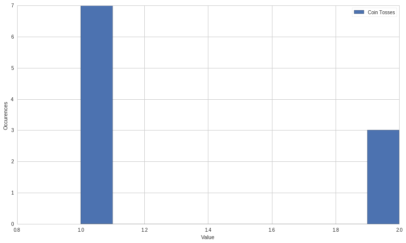
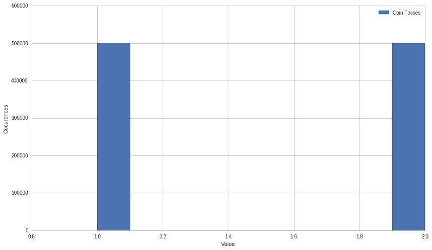
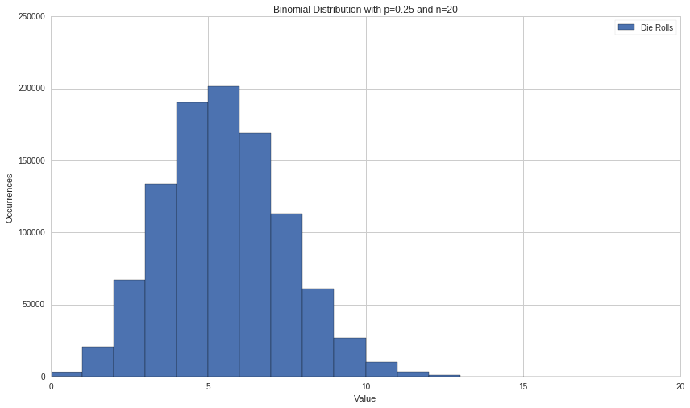
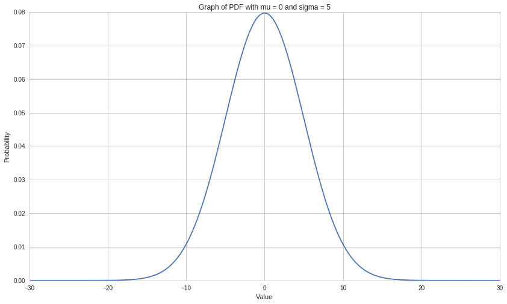
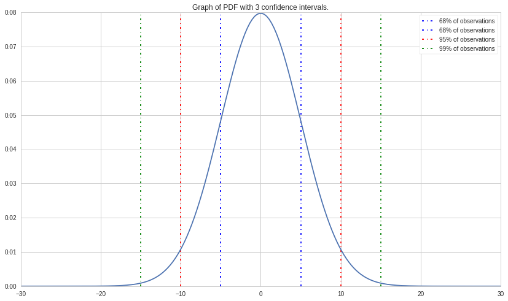
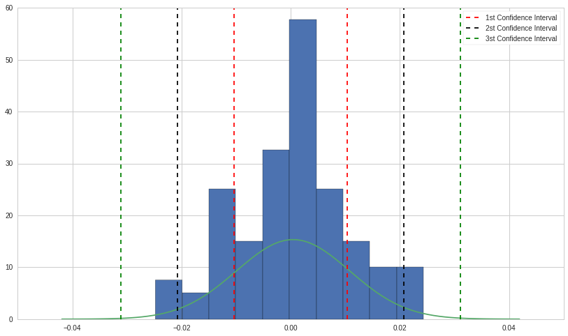

Exercises: Random Variables - Answer Key
========================================

By Christopher van Hoecke, Max Margenot, and Delaney Mackenzie

Lecture Link :
--------------

https://www.quantopian.com/lectures/random-variables

IMPORTANT NOTE:
~~~~~~~~~~~~~~~

This lecture corresponds to the Random Variables lecture, which is part
of the Quantopian lecture series. This homework expects you to rely
heavily on the code presented in the corresponding lecture. Please copy
and paste regularly from that lecture when starting to work on the
problems, as trying to do them from scratch will likely be too
difficult.

Part of the Quantopian Lecture Series:

-  `www.quantopian.com/lectures <https://www.quantopian.com/lectures>`__
-  `github.com/quantopian/research_public <https://github.com/quantopian/research_public>`__

--------------

Key Concepts
------------

.. code:: ipython2

    # Useful Functions
    class DiscreteRandomVariable:
        def __init__(self, a=0, b=1):
            self.variableType = ""
            self.low = a
            self.high = b
            return
        def draw(self, numberOfSamples):
            samples = np.random.randint(self.low, self.high, numberOfSamples)
            return samples
        
    class BinomialRandomVariable(DiscreteRandomVariable):
        def __init__(self, numberOfTrials = 10, probabilityOfSuccess = 0.5):
            self.variableType = "Binomial"
            self.numberOfTrials = numberOfTrials
            self.probabilityOfSuccess = probabilityOfSuccess
            return
        def draw(self, numberOfSamples):
            samples = np.random.binomial(self.numberOfTrials, self.probabilityOfSuccess, numberOfSamples)
            return samples
        
    def factorial(n):return reduce(lambda x,y:x*y,[1]+range(1,n+1))

.. code:: ipython2

    # Useful Libraries
    import pandas as pd
    import numpy as np
    import matplotlib.pyplot as plt
    import statsmodels.stats as stats
    from statsmodels.stats import stattools
    from __future__ import division

--------------

Exercise 1 : Uniform Distribution
=================================

-  Plot the histogram of 10 tosses with a fair coin (let 1 be heads and
   2 be tails).
-  Plot the histogram of 1000000 tosses of a fair coin

.. code:: ipython2

    # Histograms with 10 tosses. 
    cointoss = DiscreteRandomVariable(1, 3)
    plt.hist(cointoss.draw(10), align = 'mid')
    
    plt.xlabel('Value')
    plt.ylabel('Occurences')
    plt.legend(['Coin Tosses']);

.. code:: ipython2

    # Histograms with 1000000 tosses. 
    cointoss = DiscreteRandomVariable(1, 3)
    plt.hist(cointoss.draw(1000000), align = 'mid')
    
    plt.xlabel('Value')
    plt.ylabel('Occurences')
    plt.legend(['Coin Tosses']);

--------------

Exercise 2 : Binomial Distributions.
====================================

-  Graph the histogram of 1000000 samples from a binomial distribution
   of probability 0.25 and :math:`n = 20`
-  Find the value that occurs the most often
-  Calculate the probability of the value that occurs the most often
   occurring. *Use the factorial(x) function to find factorials*

.. code:: ipython2

    # Binomial distribution with p=0.25 and n=20
    binomialdistribution = BinomialRandomVariable(20, 0.25)
    bins = np.arange(0,21,1)
    n, bins, patches = plt.hist(binomialdistribution.draw(1000000), bins=bins)
    
    plt.title('Binomial Distribution with p=0.25 and n=20')
    plt.xlabel('Value')
    plt.ylabel('Occurrences')
    plt.legend(['Die Rolls']);

.. code:: ipython2

    # Finding x which occurs most often
    elem = np.argmax(n)
    print 'Maximum occurance for x =', elem

.. parsed-literal::

    Maximum occurance for x = 5

.. code:: ipython2

    # Calculating the probability of finding x. 
    n = 20
    p = 0.5
    x = elem
    n_factorial = factorial(n)
    x_factorial = factorial(x)
    n_x_factorial = factorial(n-x)
    fact = n_factorial / (n_x_factorial * x_factorial)
    probability = fact * (p**x) * ((1-p)**(n-x))
    print 'proabability of x = %d' % x, probability

.. parsed-literal::

    proabability of x = 5 0.0147857666016

--------------

Exercise 3 : Normal Distributions
=================================

a. Graphing
-----------

Graph a normal distribution using the Probability Density Function
bellow, with a mean of 0 and standard deviation of 5.

.. math:: f(x) = \frac{1}{\sigma\sqrt{2\pi}}e^{-\frac{(x - \mu)^2}{2\sigma^2}}

.. code:: ipython2

    # Graphing a normal distribution pdf. 
    mu = 0
    sigma = 5
    x = np.linspace(-30, 30, 200)
    y = (1/(sigma * np.sqrt(2 * 3.14159))) * np.exp(-(x - mu)*(x - mu) / (2 * sigma * sigma))
    plt.plot(x, y)
    plt.title('Graph of PDF with mu = 0 and sigma = 5')
    plt.xlabel('Value')
    plt.ylabel('Probability');

b. Confidence Intervals.
------------------------

-  Calculate the first, second, and third confidence intervals.
-  Plot the PDF and the first, second, and third confidence intervals.

.. code:: ipython2

    # finding the 1st, 2nd, and third confidence intervals. 
    first_ci = (-sigma, sigma)
    second_ci = (-2*sigma, 2*sigma)
    third_ci = (-3*sigma, 3*sigma)
    
    print '1-sigma -> mu +/-', sigma
    print '2-sigma -> mu +/-', second_ci[1]
    print '3-sigma -> mu +/-', third_ci[1]

.. parsed-literal::

    1-sigma -> mu +/- 5
    2-sigma -> mu +/- 10
    3-sigma -> mu +/- 15

.. code:: ipython2

    plt.axvline(first_ci[0], linestyle='dashdot', label='68% of observations', color = 'blue')
    plt.axvline(first_ci[1], linestyle='dashdot', label='68% of observations', color = 'blue')
    plt.axvline(second_ci[0], linestyle='dashdot', label='95% of observations', color = 'red')
    plt.axvline(second_ci[1],linestyle='dashdot', color = 'red')
    plt.axvline(third_ci[0],  linestyle='dashdot', label='99% of observations', color = 'green')
    plt.axvline(third_ci[1], linestyle='dashdot', color = 'green')
    plt.plot(x,y)
    plt.title('Graph of PDF with 3 confidence intervals.')
    
    plt.legend();

--------------

Exercise 4: Financial Applications:
===================================

Fit the returns of SPY from 2016-01-01 to 2016-05-01 to a normal
distribution. - Fit the returns to a normal distribution by clacluating
the values of :math:`\mu` and :math:`\sigma` - Plot the returns and the
distribution, along with 3 confidence intervals. - Use the Jarque-Bera
test to check for normality.

.. code:: ipython2

    # Collect prices and returns. 
    prices = get_pricing('SPY', start_date = '2016-01-01', end_date='2016-05-01', 
                         fields = 'price')
    returns = prices.pct_change()[1:]

.. code:: ipython2

    # Calculating the mean and standard deviation. 
    sample_mean = np.mean(returns)
    sample_std_dev = np.std(returns)
    
    x = np.linspace(-(sample_mean + 4 * sample_std_dev), (sample_mean + 4 * sample_std_dev), len(returns))
    sample_distribution = ((1/(sample_std_dev * 2 * np.pi)) * 
                           np.exp(-(x - sample_mean)*(x - sample_mean) / (2 * sample_std_dev * sample_std_dev)))

.. code:: ipython2

    # Plotting histograms and confidence intervals. 
    plt.hist(returns, range=(returns.min(), returns.max()), normed = True);
    plt.plot(x, sample_distribution)
    
    plt.axvline(sample_std_dev, linestyle='dashed', color='red', label='1st Confidence Interval')
    plt.axvline(-sample_std_dev, linestyle='dashed', color='red')
    plt.axvline(2*sample_std_dev, linestyle='dashed', color='k', label='2st Confidence Interval')
    plt.axvline(-2*sample_std_dev, linestyle='dashed', color='k')
    plt.axvline(3*sample_std_dev, linestyle='dashed', color='green', label='3st Confidence Interval')
    plt.axvline(-3*sample_std_dev, linestyle='dashed', color='green')
    
    plt.legend();

.. code:: ipython2

    # Run the JB test for normality. 
    cutoff = 0.01
    _, p_value, skewness, kurtosis = stattools.jarque_bera(returns)
    print "The JB test p-value is: ", p_value
    print "We reject the hypothesis that the data are normally distributed ", p_value < cutoff
    print "The skewness of the returns is: ", skewness
    print "The kurtosis of the returns is: ", kurtosis

.. parsed-literal::

    The JB test p-value is:  0.923015693884
    We reject the hypothesis that the data are normally distributed  False
    The skewness of the returns is:  -0.102081900914
    The kurtosis of the returns is:  3.07608657316

--------------

Congratulations on completing the Random Variables answer key!

As you learn more about writing trading models and the Quantopian
platform, enter a daily `Quantopian
Contest <https://www.quantopian.com/contest>`__. Your strategy will be
evaluated for a cash prize every day.

Start by going through the `Writing a Contest
Algorithm <https://www.quantopian.com/tutorials/contest>`__ tutorial.

*This presentation is for informational purposes only and does not
constitute an offer to sell, a solicitation to buy, or a recommendation
for any security; nor does it constitute an offer to provide investment
advisory or other services by Quantopian, Inc. (“Quantopian”). Nothing
contained herein constitutes investment advice or offers any opinion
with respect to the suitability of any security, and any views expressed
herein should not be taken as advice to buy, sell, or hold any security
or as an endorsement of any security or company. In preparing the
information contained herein, Quantopian, Inc. has not taken into
account the investment needs, objectives, and financial circumstances of
any particular investor. Any views expressed and data illustrated herein
were prepared based upon information, believed to be reliable, available
to Quantopian, Inc. at the time of publication. Quantopian makes no
guarantees as to their accuracy or completeness. All information is
subject to change and may quickly become unreliable for various reasons,
including changes in market conditions or economic circumstances.*
