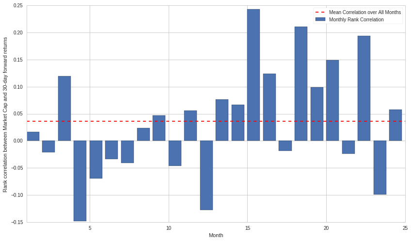
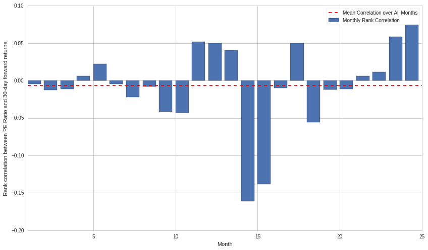
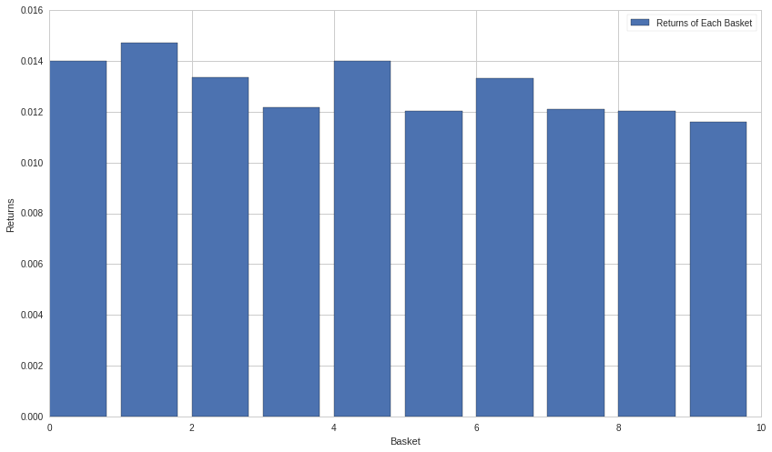
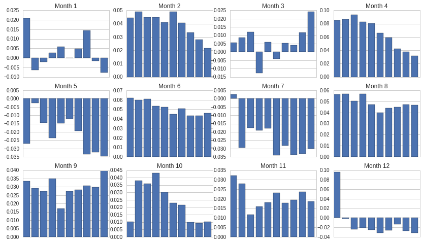
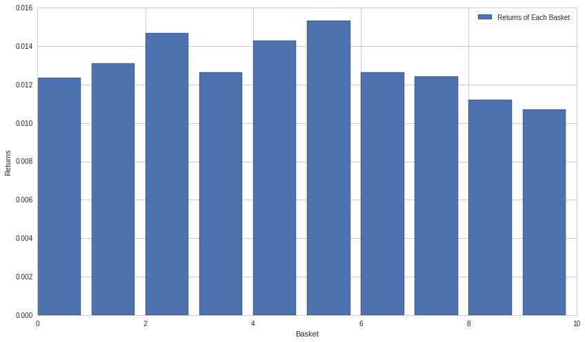
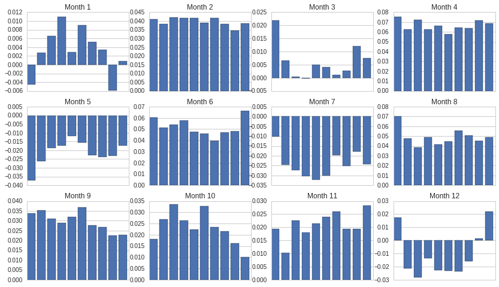
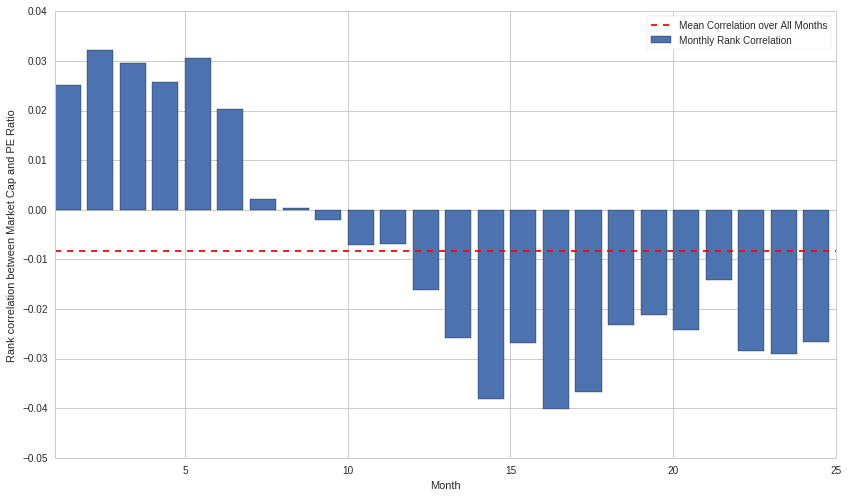
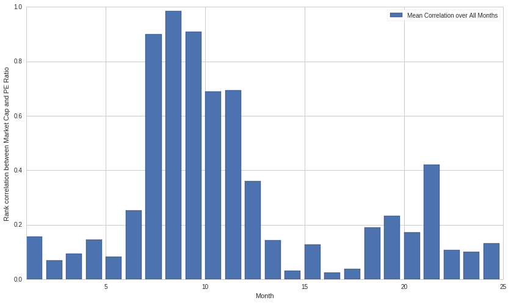
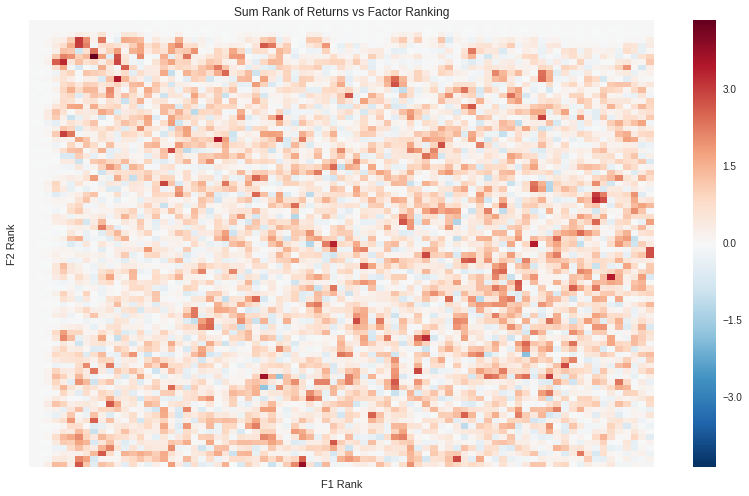

#Ranking Universes by Factors

By Delaney Granizo-Mackenzie and Gilbert Wassermann

Part of the Quantopian Lecture Series:

-  `www.quantopian.com/lectures <https://www.quantopian.com/lectures>`__
-  https://github.com/quantopian/research_public

One common technique in quantitative finance is that of ranking stocks
in some way. This ranking can be whatever you come up with, but will
often be a combination of fundamental factors and price-based signals.
One example could be the following

1. Score stocks based on 0.5 x the PE Ratio of that stock + 0.5 x the 30
   day price momentum
2. Rank stocks based on that score

These ranking systems can be used to construct long-short equity
strategies. The Long-Short Equity Lecture is recommended reading before
this Lecture.

In order to develop a good ranking system, we need to first understand
how to evaluate ranking systems. We will show a demo here.

##WARNING: This notebook does analysis over thousands of equities and
hundreds of timepoints. The resulting memory usage can crash the
research server if you are running other notebooks. Please shut down
other notebooks in the main research menu before running this notebook.
You can tell if other notebooks are running by checking the color of the
notebook symbol. Green indicates running, grey indicates not.

.. code:: ipython2

    import numpy as np
    import statsmodels.api as sm
    import scipy.stats as stats
    import scipy
    from statsmodels import regression
    import matplotlib.pyplot as plt
    import seaborn as sns
    import pandas as pd

Getting Data
------------

The first thing we’re gonna do is get monthly values for the Market Cap,
P/E Ratio and Monthly Returns for every equity. Monthly Returns is a
metric that takes the returns accrued over an entire month of trading by
dividing the last close price by the first close price and subtracting
1.

.. code:: ipython2

    from quantopian.pipeline import Pipeline
    from quantopian.pipeline.data import morningstar
    from quantopian.pipeline.data.builtin import USEquityPricing
    from quantopian.pipeline.factors import CustomFactor, Returns
            
    def make_pipeline():
        """
        Create and return our pipeline.
        
        We break this piece of logic out into its own function to make it easier to
        test and modify in isolation.
        """
        
        pipe = Pipeline(
            columns = {
                'Market Cap' : morningstar.valuation.market_cap.latest,
                'PE Ratio' : morningstar.valuation_ratios.pe_ratio.latest,
                'Monthly Returns': Returns(window_length=21),
            })
        
        return pipe
    
    pipe = make_pipeline()

Let’s take a look at the data to get a quick sense of what we have. This
may take a while.

.. code:: ipython2

    from quantopian.research import run_pipeline
    
    start_date = '2013-01-01'
    end_date = '2015-02-01'
    
    data = run_pipeline(pipe, start_date, end_date)
    
    # remove NaN values
    data = data.dropna()
    
    # show data
    data

.. raw:: html

    

    <table border="1" class="dataframe">
      <thead>
        <tr style="text-align: right;">
          <th></th>
          <th></th>
          <th>Market Cap</th>
          <th>Monthly Returns</th>
          <th>PE Ratio</th>
        </tr>
      </thead>
      <tbody>
        <tr>
          <th rowspan="30" valign="top">2013-01-02 00:00:00+00:00</th>
          <th>Equity(2 [AA])</th>
          <td>8.975170e+09</td>
          <td>0.032143</td>
          <td>135.1351</td>
        </tr>
        <tr>
          <th>Equity(21 [AAME])</th>
          <td>6.228180e+07</td>
          <td>0.065580</td>
          <td>16.0772</td>
        </tr>
        <tr>
          <th>Equity(24 [AAPL])</th>
          <td>5.505680e+11</td>
          <td>-0.089110</td>
          <td>13.2626</td>
        </tr>
        <tr>
          <th>Equity(31 [ABAX])</th>
          <td>8.283930e+08</td>
          <td>0.008415</td>
          <td>35.8423</td>
        </tr>
        <tr>
          <th>Equity(52 [ABM])</th>
          <td>1.037840e+09</td>
          <td>0.053308</td>
          <td>16.7504</td>
        </tr>
        <tr>
          <th>Equity(53 [ABMD])</th>
          <td>5.296030e+08</td>
          <td>0.008621</td>
          <td>39.8406</td>
        </tr>
        <tr>
          <th>Equity(62 [ABT])</th>
          <td>4.916000e+10</td>
          <td>0.008154</td>
          <td>15.7978</td>
        </tr>
        <tr>
          <th>Equity(64 [ABX])</th>
          <td>3.455270e+10</td>
          <td>0.014778</td>
          <td>10.2987</td>
        </tr>
        <tr>
          <th>Equity(66 [AB])</th>
          <td>1.848950e+09</td>
          <td>-0.007688</td>
          <td>9.3284</td>
        </tr>
        <tr>
          <th>Equity(67 [ADSK])</th>
          <td>7.444310e+09</td>
          <td>0.066727</td>
          <td>31.3480</td>
        </tr>
        <tr>
          <th>Equity(69 [ACAT])</th>
          <td>4.985790e+08</td>
          <td>-0.115538</td>
          <td>14.9925</td>
        </tr>
        <tr>
          <th>Equity(76 [TAP])</th>
          <td>7.513120e+09</td>
          <td>0.034208</td>
          <td>13.6054</td>
        </tr>
        <tr>
          <th>Equity(84 [ACET])</th>
          <td>2.710310e+08</td>
          <td>0.013798</td>
          <td>14.3266</td>
        </tr>
        <tr>
          <th>Equity(88 [ACI])</th>
          <td>1.426500e+09</td>
          <td>0.089153</td>
          <td>14.7493</td>
        </tr>
        <tr>
          <th>Equity(99 [ACO])</th>
          <td>9.648460e+08</td>
          <td>0.023727</td>
          <td>14.8148</td>
        </tr>
        <tr>
          <th>Equity(100 [IEP])</th>
          <td>4.212790e+09</td>
          <td>0.107074</td>
          <td>6.7204</td>
        </tr>
        <tr>
          <th>Equity(106 [ACU])</th>
          <td>3.430780e+07</td>
          <td>0.008284</td>
          <td>10.1626</td>
        </tr>
        <tr>
          <th>Equity(110 [ACXM])</th>
          <td>1.319010e+09</td>
          <td>-0.012450</td>
          <td>26.5957</td>
        </tr>
        <tr>
          <th>Equity(112 [ACY])</th>
          <td>2.004690e+07</td>
          <td>0.084681</td>
          <td>4.3764</td>
        </tr>
        <tr>
          <th>Equity(114 [ADBE])</th>
          <td>1.710190e+10</td>
          <td>0.088099</td>
          <td>20.8768</td>
        </tr>
        <tr>
          <th>Equity(122 [ADI])</th>
          <td>1.223640e+10</td>
          <td>0.044177</td>
          <td>19.0476</td>
        </tr>
        <tr>
          <th>Equity(128 [ADM])</th>
          <td>1.758370e+10</td>
          <td>0.025843</td>
          <td>18.7266</td>
        </tr>
        <tr>
          <th>Equity(153 [AE])</th>
          <td>1.471520e+08</td>
          <td>-0.003438</td>
          <td>6.0277</td>
        </tr>
        <tr>
          <th>Equity(154 [AEM])</th>
          <td>9.589180e+09</td>
          <td>-0.059362</td>
          <td>64.5161</td>
        </tr>
        <tr>
          <th>Equity(157 [AEG])</th>
          <td>1.096140e+10</td>
          <td>0.125654</td>
          <td>4.2644</td>
        </tr>
        <tr>
          <th>Equity(161 [AEP])</th>
          <td>2.069590e+10</td>
          <td>0.000469</td>
          <td>11.3636</td>
        </tr>
        <tr>
          <th>Equity(162 [AEPI])</th>
          <td>3.346250e+08</td>
          <td>-0.012629</td>
          <td>14.5349</td>
        </tr>
        <tr>
          <th>Equity(166 [AES])</th>
          <td>7.938060e+09</td>
          <td>0.005162</td>
          <td>128.2051</td>
        </tr>
        <tr>
          <th>Equity(168 [AET])</th>
          <td>1.444710e+10</td>
          <td>0.072222</td>
          <td>8.2576</td>
        </tr>
        <tr>
          <th>Equity(185 [AFL])</th>
          <td>2.484740e+10</td>
          <td>0.003021</td>
          <td>8.7108</td>
        </tr>
        <tr>
          <th>...</th>
          <th>...</th>
          <td>...</td>
          <td>...</td>
          <td>...</td>
        </tr>
        <tr>
          <th rowspan="30" valign="top">2015-02-02 00:00:00+00:00</th>
          <th>Equity(47858 [NMS])</th>
          <td>6.352770e+07</td>
          <td>0.075804</td>
          <td>10.6952</td>
        </tr>
        <tr>
          <th>Equity(47873 [OMAM])</th>
          <td>1.854000e+09</td>
          <td>-0.067692</td>
          <td>74.7579</td>
        </tr>
        <tr>
          <th>Equity(47875 [VBTX])</th>
          <td>1.237870e+08</td>
          <td>-0.064286</td>
          <td>18.4815</td>
        </tr>
        <tr>
          <th>Equity(47876 [MOLG])</th>
          <td>1.302750e+08</td>
          <td>-0.372549</td>
          <td>29.9010</td>
        </tr>
        <tr>
          <th>Equity(47883 [DPLO])</th>
          <td>1.336120e+09</td>
          <td>-0.102920</td>
          <td>171.6673</td>
        </tr>
        <tr>
          <th>Equity(47884 [PLAY])</th>
          <td>1.146320e+09</td>
          <td>0.051592</td>
          <td>87.8222</td>
        </tr>
        <tr>
          <th>Equity(47888 [FCAU])</th>
          <td>1.627660e+10</td>
          <td>0.143104</td>
          <td>14.2440</td>
        </tr>
        <tr>
          <th>Equity(47894 [KIQ])</th>
          <td>2.109430e+08</td>
          <td>-0.228376</td>
          <td>42.2230</td>
        </tr>
        <tr>
          <th>Equity(47898 [GWB])</th>
          <td>1.199980e+09</td>
          <td>-0.112478</td>
          <td>11.4336</td>
        </tr>
        <tr>
          <th>Equity(47904 [SRSC])</th>
          <td>9.647810e+08</td>
          <td>-0.030177</td>
          <td>7.6246</td>
        </tr>
        <tr>
          <th>Equity(47913 [XENE])</th>
          <td>2.444860e+08</td>
          <td>-0.113924</td>
          <td>28.1404</td>
        </tr>
        <tr>
          <th>Equity(47921 [KEYS])</th>
          <td>5.652700e+09</td>
          <td>-0.012718</td>
          <td>14.3484</td>
        </tr>
        <tr>
          <th>Equity(47923 [KE])</th>
          <td>3.170760e+08</td>
          <td>-0.149042</td>
          <td>14.2148</td>
        </tr>
        <tr>
          <th>Equity(47935 [ABCW])</th>
          <td>3.094400e+08</td>
          <td>0.008735</td>
          <td>4.1449</td>
        </tr>
        <tr>
          <th>Equity(47949 [APTO])</th>
          <td>5.733000e+07</td>
          <td>-0.156303</td>
          <td>3.3201</td>
        </tr>
        <tr>
          <th>Equity(47980 [BOOT])</th>
          <td>5.036520e+08</td>
          <td>0.108791</td>
          <td>923.0552</td>
        </tr>
        <tr>
          <th>Equity(48002 [FFWM])</th>
          <td>1.465090e+08</td>
          <td>-0.017641</td>
          <td>16.5062</td>
        </tr>
        <tr>
          <th>Equity(48019 [TBK])</th>
          <td>2.346070e+08</td>
          <td>-0.039882</td>
          <td>9.1637</td>
        </tr>
        <tr>
          <th>Equity(48090 [NDRM])</th>
          <td>1.966550e+08</td>
          <td>-0.238976</td>
          <td>0.1525</td>
        </tr>
        <tr>
          <th>Equity(48091 [VA])</th>
          <td>1.559080e+09</td>
          <td>-0.223353</td>
          <td>17.8565</td>
        </tr>
        <tr>
          <th>Equity(48103 [STOR])</th>
          <td>2.611000e+09</td>
          <td>0.062500</td>
          <td>44.1732</td>
        </tr>
        <tr>
          <th>Equity(48124 [WF])</th>
          <td>5.441790e+09</td>
          <td>-0.127706</td>
          <td>11.2718</td>
        </tr>
        <tr>
          <th>Equity(48126 [HABT])</th>
          <td>8.303110e+08</td>
          <td>0.021336</td>
          <td>47.1418</td>
        </tr>
        <tr>
          <th>Equity(48129 [UBS])</th>
          <td>6.324900e+10</td>
          <td>-0.021688</td>
          <td>16.6622</td>
        </tr>
        <tr>
          <th>Equity(48131 [NEFF])</th>
          <td>2.372420e+08</td>
          <td>-0.176889</td>
          <td>7.5635</td>
        </tr>
        <tr>
          <th>Equity(48139 [CPHR])</th>
          <td>3.714800e+08</td>
          <td>-0.046610</td>
          <td>13.9360</td>
        </tr>
        <tr>
          <th>Equity(48220 [LC])</th>
          <td>7.025730e+09</td>
          <td>-0.257708</td>
          <td>860.1009</td>
        </tr>
        <tr>
          <th>Equity(48252 [AVOL])</th>
          <td>1.582620e+09</td>
          <td>-0.010644</td>
          <td>14.0303</td>
        </tr>
        <tr>
          <th>Equity(48255 [MPG])</th>
          <td>1.234820e+09</td>
          <td>0.053026</td>
          <td>21.7141</td>
        </tr>
        <tr>
          <th>Equity(48258 [JRVR])</th>
          <td>6.139030e+08</td>
          <td>-0.063867</td>
          <td>9.1169</td>
        </tr>
      </tbody>
    </table>
    
2270710 rows × 3 columns

    

Now, we need to take each of these individual factors, clean them to
remove NaN values and aggregate them for each month.

.. code:: ipython2

    cap_data = data['Market Cap'].transpose().unstack() # extract series of data
    cap_data = cap_data.T.dropna().T # remove NaN values
    cap_data = cap_data.resample('M', how='last') # use last instance in month to aggregate
    
    pe_data = data['PE Ratio'].transpose().unstack()
    pe_data = pe_data.T.dropna().T
    pe_data = pe_data.resample('M', how='last')
    
    month_data = data['Monthly Returns'].transpose().unstack()
    month_data = month_data.T.dropna().T
    month_data = month_data.resample('M', how='last')

The next step is to figure out which equities we have data for. Data
sources are never perfect, and stocks go in and out of existence with
Mergers, Acquisitions, and Bankruptcies. We’ll make a list of the stocks
common to all three sources (our factor data sets) and then filter down
both to just those stocks.

.. code:: ipython2

    common_equities = cap_data.T.index.intersection(pe_data.T.index).intersection(month_data.T.index)

Now, we will make sure that each time series is being run over identical
an identical set of securities.

.. code:: ipython2

    cap_data_filtered = cap_data[common_equities][:-1]
    month_forward_returns = month_data[common_equities][1:]
    pe_data_filtered = pe_data[common_equities][:-1]

Here, is the filtered data for market cap over all equities for the
first 5 months, as an example.

.. code:: ipython2

    cap_data_filtered.head()

.. raw:: html

    

    <table border="1" class="dataframe">
      <thead>
        <tr style="text-align: right;">
          <th></th>
          <th>Equity(2 [AA])</th>
          <th>Equity(24 [AAPL])</th>
          <th>Equity(31 [ABAX])</th>
          <th>Equity(52 [ABM])</th>
          <th>Equity(62 [ABT])</th>
          <th>Equity(64 [ABX])</th>
          <th>Equity(66 [AB])</th>
          <th>Equity(67 [ADSK])</th>
          <th>Equity(69 [ACAT])</th>
          <th>Equity(76 [TAP])</th>
          <th>...</th>
          <th>Equity(43476 [BERY])</th>
          <th>Equity(43479 [FLTX])</th>
          <th>Equity(43493 [ANFI])</th>
          <th>Equity(43494 [SSTK])</th>
          <th>Equity(43495 [AMBA])</th>
          <th>Equity(43512 [FANG])</th>
          <th>Equity(43514 [SHOS])</th>
          <th>Equity(43572 [WWAV])</th>
          <th>Equity(43599 [RH])</th>
          <th>Equity(43627 [RKUS])</th>
        </tr>
      </thead>
      <tbody>
        <tr>
          <th>2013-01-31 00:00:00+00:00</th>
          <td>9263400000</td>
          <td>4.996960e+11</td>
          <td>828393000</td>
          <td>1085530000</td>
          <td>49412800000</td>
          <td>35048800000</td>
          <td>1833170000</td>
          <td>7943140000</td>
          <td>440098000</td>
          <td>7513120000</td>
          <td>...</td>
          <td>1678870000</td>
          <td>749643000</td>
          <td>288533000</td>
          <td>871338000</td>
          <td>290937000</td>
          <td>707182000</td>
          <td>752136000</td>
          <td>2688420000</td>
          <td>1279280000</td>
          <td>975600000</td>
        </tr>
        <tr>
          <th>2013-02-28 00:00:00+00:00</th>
          <td>9434150000</td>
          <td>4.277320e+11</td>
          <td>852731000</td>
          <td>1085530000</td>
          <td>53214500000</td>
          <td>31955400000</td>
          <td>2141330000</td>
          <td>8693570000</td>
          <td>476344000</td>
          <td>8200170000</td>
          <td>...</td>
          <td>1987300000</td>
          <td>867043000</td>
          <td>245378000</td>
          <td>845533000</td>
          <td>290937000</td>
          <td>829238000</td>
          <td>752136000</td>
          <td>2800870000</td>
          <td>1279280000</td>
          <td>1736040000</td>
        </tr>
        <tr>
          <th>2013-03-31 00:00:00+00:00</th>
          <td>9110660000</td>
          <td>4.145000e+11</td>
          <td>937567000</td>
          <td>1240500000</td>
          <td>53073200000</td>
          <td>30273500000</td>
          <td>2422140000</td>
          <td>8217940000</td>
          <td>478849000</td>
          <td>8022940000</td>
          <td>...</td>
          <td>2172600000</td>
          <td>821391000</td>
          <td>256434000</td>
          <td>1092660000</td>
          <td>269269000</td>
          <td>839964000</td>
          <td>1029570000</td>
          <td>2705720000</td>
          <td>1465930000</td>
          <td>1587240000</td>
        </tr>
        <tr>
          <th>2013-04-30 00:00:00+00:00</th>
          <td>9110660000</td>
          <td>4.161420e+11</td>
          <td>1046720000</td>
          <td>1215370000</td>
          <td>55059100000</td>
          <td>29433900000</td>
          <td>2309700000</td>
          <td>9231750000</td>
          <td>577001000</td>
          <td>8924830000</td>
          <td>...</td>
          <td>2154440000</td>
          <td>876024000</td>
          <td>227074000</td>
          <td>1507590000</td>
          <td>423369000</td>
          <td>992719000</td>
          <td>932085000</td>
          <td>2953110000</td>
          <td>1328870000</td>
          <td>1560850000</td>
        </tr>
        <tr>
          <th>2013-05-31 00:00:00+00:00</th>
          <td>9089870000</td>
          <td>4.156150e+11</td>
          <td>944303000</td>
          <td>1215370000</td>
          <td>57553300000</td>
          <td>19732700000</td>
          <td>2498490000</td>
          <td>8813240000</td>
          <td>594034000</td>
          <td>9411840000</td>
          <td>...</td>
          <td>2148790000</td>
          <td>847847000</td>
          <td>219620000</td>
          <td>1397660000</td>
          <td>423369000</td>
          <td>971266000</td>
          <td>1030490000</td>
          <td>2925430000</td>
          <td>1328870000</td>
          <td>1435260000</td>
        </tr>
      </tbody>
    </table>
    
5 rows × 3203 columns

    

Because we’re dealing with ranking systems, at several points we’re
going to want to rank our data. Let’s check how our data looks when
ranked to get a sense for this.

.. code:: ipython2

    cap_data_filtered.rank().head()

.. raw:: html

    

    <table border="1" class="dataframe">
      <thead>
        <tr style="text-align: right;">
          <th></th>
          <th>Equity(2 [AA])</th>
          <th>Equity(24 [AAPL])</th>
          <th>Equity(31 [ABAX])</th>
          <th>Equity(52 [ABM])</th>
          <th>Equity(62 [ABT])</th>
          <th>Equity(64 [ABX])</th>
          <th>Equity(66 [AB])</th>
          <th>Equity(67 [ADSK])</th>
          <th>Equity(69 [ACAT])</th>
          <th>Equity(76 [TAP])</th>
          <th>...</th>
          <th>Equity(43476 [BERY])</th>
          <th>Equity(43479 [FLTX])</th>
          <th>Equity(43493 [ANFI])</th>
          <th>Equity(43494 [SSTK])</th>
          <th>Equity(43495 [AMBA])</th>
          <th>Equity(43512 [FANG])</th>
          <th>Equity(43514 [SHOS])</th>
          <th>Equity(43572 [WWAV])</th>
          <th>Equity(43599 [RH])</th>
          <th>Equity(43627 [RKUS])</th>
        </tr>
      </thead>
      <tbody>
        <tr>
          <th>2013-01-31 00:00:00+00:00</th>
          <td>9.0</td>
          <td>14</td>
          <td>3</td>
          <td>1.5</td>
          <td>1</td>
          <td>25</td>
          <td>2</td>
          <td>2</td>
          <td>4</td>
          <td>1</td>
          <td>...</td>
          <td>1</td>
          <td>1</td>
          <td>9</td>
          <td>2</td>
          <td>2.5</td>
          <td>1</td>
          <td>18.5</td>
          <td>1</td>
          <td>1.5</td>
          <td>5</td>
        </tr>
        <tr>
          <th>2013-02-28 00:00:00+00:00</th>
          <td>10.0</td>
          <td>7</td>
          <td>6</td>
          <td>1.5</td>
          <td>5</td>
          <td>24</td>
          <td>7</td>
          <td>7</td>
          <td>8</td>
          <td>3</td>
          <td>...</td>
          <td>2</td>
          <td>4</td>
          <td>5</td>
          <td>1</td>
          <td>2.5</td>
          <td>2</td>
          <td>18.5</td>
          <td>3</td>
          <td>1.5</td>
          <td>25</td>
        </tr>
        <tr>
          <th>2013-03-31 00:00:00+00:00</th>
          <td>7.5</td>
          <td>3</td>
          <td>11</td>
          <td>5.0</td>
          <td>4</td>
          <td>23</td>
          <td>14</td>
          <td>5</td>
          <td>9</td>
          <td>2</td>
          <td>...</td>
          <td>5</td>
          <td>2</td>
          <td>7</td>
          <td>3</td>
          <td>1.0</td>
          <td>3</td>
          <td>23.0</td>
          <td>2</td>
          <td>5.0</td>
          <td>24</td>
        </tr>
        <tr>
          <th>2013-04-30 00:00:00+00:00</th>
          <td>7.5</td>
          <td>5</td>
          <td>17</td>
          <td>3.5</td>
          <td>7</td>
          <td>22</td>
          <td>10</td>
          <td>11</td>
          <td>14</td>
          <td>5</td>
          <td>...</td>
          <td>4</td>
          <td>5</td>
          <td>2</td>
          <td>5</td>
          <td>5.5</td>
          <td>5</td>
          <td>20.0</td>
          <td>6</td>
          <td>3.5</td>
          <td>23</td>
        </tr>
        <tr>
          <th>2013-05-31 00:00:00+00:00</th>
          <td>5.5</td>
          <td>4</td>
          <td>14</td>
          <td>3.5</td>
          <td>12</td>
          <td>12</td>
          <td>18</td>
          <td>8</td>
          <td>15</td>
          <td>11</td>
          <td>...</td>
          <td>3</td>
          <td>3</td>
          <td>1</td>
          <td>4</td>
          <td>5.5</td>
          <td>4</td>
          <td>24.0</td>
          <td>5</td>
          <td>3.5</td>
          <td>22</td>
        </tr>
      </tbody>
    </table>
    
5 rows × 3203 columns

    

Looking at Correlations Over Time
---------------------------------

Now that we have the data, let’s do something with it. Our first
analysis will be to measure the monthly Spearman rank correlation
coefficient between Market Cap and month-forward returns. In other
words, how predictive of 30-day returns is ranking your universe by
market cap.

.. code:: ipython2

    scores = np.zeros(24)
    pvalues = np.zeros(24)
    for i in range(24):
        score, pvalue = stats.spearmanr(cap_data_filtered.iloc[i], month_forward_returns.iloc[i])
        pvalues[i] = pvalue
        scores[i] = score
        
    plt.bar(range(1,25),scores)
    plt.hlines(np.mean(scores), 1, 25, colors='r', linestyles='dashed')
    plt.xlabel('Month')
    plt.xlim((1, 25))
    plt.legend(['Mean Correlation over All Months', 'Monthly Rank Correlation'])
    plt.ylabel('Rank correlation between Market Cap and 30-day forward returns');

We can see that the average correlation is positive, but varies a lot
from month to month.

Let’s look at the same analysis, but with PE Ratio.

.. code:: ipython2

    scores = np.zeros(24)
    pvalues = np.zeros(24)
    for i in range(24):
        score, pvalue = stats.spearmanr(pe_data_filtered.iloc[i], month_forward_returns.iloc[i])
        pvalues[i] = pvalue
        scores[i] = score
        
    plt.bar(range(1,25),scores)
    plt.hlines(np.mean(scores), 1, 25, colors='r', linestyles='dashed')
    plt.xlabel('Month')
    plt.xlim((1, 25))
    plt.legend(['Mean Correlation over All Months', 'Monthly Rank Correlation'])
    plt.ylabel('Rank correlation between PE Ratio and 30-day forward returns');

The correlation of PE Ratio and 30-day returns seems to be near 0 on
average. It’s important to note that this monthly and between 2012 and
2015. Different factors are predictive on differen timeframes and
frequencies, so the fact that PE Ratio doesn’t appear predictive here is
not necessary throwing it out as a useful factor. Beyond it’s usefulness
in predicting returns, it can be used for risk exposure analysis as
discussed in the Factor Risk Exposure Lecture.

Basket Returns
--------------

The next step is to compute the returns of baskets taken out of our
ranking. If we rank all equities and then split them into :math:`n`
groups, what would the mean return be of each group? We can answer this
question in the following way. The first step is to create a function
that will give us the mean return in each basket in a given the month
and a ranking factor.

.. code:: ipython2

    def compute_basket_returns(factor_data, forward_returns, number_of_baskets, month):
    
        data = pd.concat([factor_data.iloc[month-1],forward_returns.iloc[month-1]], axis=1)
        # Rank the equities on the factor values
        data.columns = ['Factor Value', 'Month Forward Returns']
        data.sort('Factor Value', inplace=True)
        
        # How many equities per basket
        equities_per_basket = np.floor(len(data.index) / number_of_baskets)
    
        basket_returns = np.zeros(number_of_baskets)
    
        # Compute the returns of each basket
        for i in range(number_of_baskets):
            start = i * equities_per_basket
            if i == number_of_baskets - 1:
                # Handle having a few extra in the last basket when our number of equities doesn't divide well
                end = len(data.index) - 1
            else:
                end = i * equities_per_basket + equities_per_basket
            # Actually compute the mean returns for each basket
            basket_returns[i] = data.iloc[start:end]['Month Forward Returns'].mean()
            
        return basket_returns

The first thing we’ll do with this function is compute this for each
month and then average. This should give us a sense of the relationship
over a long timeframe.

.. code:: ipython2

    number_of_baskets = 10
    mean_basket_returns = np.zeros(number_of_baskets)
    for m in range(1, 25):
        basket_returns = compute_basket_returns(cap_data_filtered, month_forward_returns, number_of_baskets, m)
        mean_basket_returns += basket_returns
    
    mean_basket_returns /= 24    
    
    # Plot the returns of each basket
    plt.bar(range(number_of_baskets), mean_basket_returns)
    plt.ylabel('Returns')
    plt.xlabel('Basket')
    plt.legend(['Returns of Each Basket']);

Spread Consistency
~~~~~~~~~~~~~~~~~~

Of course, that’s just the average relationship. To get a sense of how
consistent this is, and whether or not we would want to trade on it, we
should look at it over time. Here we’ll look at the monthly spreads for
the first year. We can see a lot of variation, and further analysis
should be done to determine whether Market Cap is tradeable.

.. code:: ipython2

    f, axarr = plt.subplots(3, 4)
    for month in range(1, 13):
        basket_returns = compute_basket_returns(cap_data_filtered, month_forward_returns, 10, month)
    
        r = np.floor((month-1) / 4)
        c = (month-1) % 4
        axarr[r, c].bar(range(number_of_baskets), basket_returns)
        axarr[r, c].xaxis.set_visible(False) # Hide the axis lables so the plots aren't super messy
        axarr[r, c].set_title('Month ' + str(month))

We’ll repeat the same analysis for PE Ratio.

.. code:: ipython2

    number_of_baskets = 10
    mean_basket_returns = np.zeros(number_of_baskets)
    for m in range(1, 25):
        basket_returns = compute_basket_returns(pe_data_filtered, month_forward_returns, number_of_baskets, m)
        mean_basket_returns += basket_returns
    
    mean_basket_returns /= 24    
    
    # Plot the returns of each basket
    plt.bar(range(number_of_baskets), mean_basket_returns)
    plt.ylabel('Returns')
    plt.xlabel('Basket')
    plt.legend(['Returns of Each Basket']);

.. code:: ipython2

    f, axarr = plt.subplots(3, 4)
    for month in range(1, 13):
        basket_returns = compute_basket_returns(pe_data_filtered, month_forward_returns, 10, month)
    
        r = np.floor((month-1) / 4)
        c = (month-1) % 4
        axarr[r, c].bar(range(10), basket_returns)
        axarr[r, c].xaxis.set_visible(False) # Hide the axis lables so the plots aren't super messy
        axarr[r, c].set_title('Month ' + str(month))

Sometimes Factors are Just Other Factors
----------------------------------------

Often times a new factor will be discovered that seems to induce spread,
but it turns out that it is just a new and potentially more complicated
way to compute a well known factor. Consider for instance the case in
which you have poured tons of resources into developing a new factor, it
looks great, but how do you know it’s not just another factor in
disguise?

To check for this, there are many analyses that can be done.

Correlation Analysis
~~~~~~~~~~~~~~~~~~~~

One of the most intuitive ways is to check what the correlation of the
factors is over time. We’ll plot that here.

.. code:: ipython2

    scores = np.zeros(24)
    pvalues = np.zeros(24)
    for i in range(24):
        score, pvalue = stats.spearmanr(cap_data_filtered.iloc[i], pe_data_filtered.iloc[i])
        pvalues[i] = pvalue
        scores[i] = score
        
    plt.bar(range(1,25),scores)
    plt.hlines(np.mean(scores), 1, 25, colors='r', linestyles='dashed')
    plt.xlabel('Month')
    plt.xlim((1, 25))
    plt.legend(['Mean Correlation over All Months', 'Monthly Rank Correlation'])
    plt.ylabel('Rank correlation between Market Cap and PE Ratio');

And also the p-values because the correlations may not be that
meaningful by themselves.

.. code:: ipython2

    scores = np.zeros(24)
    pvalues = np.zeros(24)
    for i in range(24):
        score, pvalue = stats.spearmanr(cap_data_filtered.iloc[i], pe_data_filtered.iloc[i])
        pvalues[i] = pvalue
        scores[i] = score
        
    plt.bar(range(1,25),pvalues)
    plt.xlabel('Month')
    plt.xlim((1, 25))
    plt.legend(['Mean Correlation over All Months', 'Monthly Rank Correlation'])
    plt.ylabel('Rank correlation between Market Cap and PE Ratio');

There is interesting behavior, and further analysis would be needed to
determine whether a relationship existed.

.. code:: ipython2

    pe_dataframe = pd.DataFrame(pe_data_filtered.iloc[0])
    pe_dataframe.columns = ['F1']
    cap_dataframe = pd.DataFrame(cap_data_filtered.iloc[0])
    cap_dataframe.columns = ['F2']
    returns_dataframe = pd.DataFrame(month_forward_returns.iloc[0])
    returns_dataframe.columns = ['Returns']
    
    data = pe_dataframe.join(cap_dataframe).join(returns_dataframe)
    
    data = data.rank(method='first')
    
    heat = np.zeros((len(data), len(data)))
    
    for e in data.index:
        F1 = data.loc[e]['F1']
        F2 = data.loc[e]['F2']
        R = data.loc[e]['Returns']
        heat[F1-1, F2-1] += R
        
    heat = scipy.signal.decimate(heat, 40)
    heat = scipy.signal.decimate(heat.T, 40).T
    
    p = sns.heatmap(heat, xticklabels=[], yticklabels=[])
    # p.xaxis.set_ticks([])
    # p.yaxis.set_ticks([])
    p.xaxis.set_label_text('F1 Rank')
    p.yaxis.set_label_text('F2 Rank')
    p.set_title('Sum Rank of Returns vs Factor Ranking');

##How to Choose Ranking System

The ranking system is the secret sauce of many strategies. Choosing a
good ranking system, or factor, is not easy and the subject of much
research. We’ll discuss a few starting points here.

Clone and Tweak
~~~~~~~~~~~~~~~

Choose one that is commonly discussed and see if you can modify it
slightly to gain back an edge. Often times factors that are public will
have no signal left as they have been completely arbitraged out of the
market. However, sometimes they lead you in the right direction of where
to go.

Pricing Models
~~~~~~~~~~~~~~

Any model that predicts future returns can be a factor. The future
return predicted is now that factor, and can be used to rank your
universe. You can take any complicated pricing model and transform it
into a ranking.

Price Based Factors (Technical Indicators)
~~~~~~~~~~~~~~~~~~~~~~~~~~~~~~~~~~~~~~~~~~

Price based factors take information about the historical price of each
equity and use it to generate the factor value. Examples could be 30-day
momentum, or volatility measures.

Reversion vs. Momentum
^^^^^^^^^^^^^^^^^^^^^^

It’s important to note that some factors bet that prices, once moving in
a direction, will continue to do so. Some factors bet the opposite. Both
are valid models on different time horizons and assets, and it’s
important to investigate whether the underlying behavior is momentum or
reversion based.

Fundamental Factors (Value Based)
~~~~~~~~~~~~~~~~~~~~~~~~~~~~~~~~~

This is using combinations of fundamental values as we discussed today.
Fundamental values contain information that is tied to real world facts
about a company, so in many ways can be more robust than prices.

The Arms Race
~~~~~~~~~~~~~

Ultimately, developing predictive factors is an arms race in which you
are trying to stay one step ahead. Factors get arbitraged out of markets
and have a lifespan, so it’s important that you are constantly doing
work to determine how much decay your factors are experiencing, and what
new factors might be used to take their place.

*This presentation is for informational purposes only and does not
constitute an offer to sell, a solicitation to buy, or a recommendation
for any security; nor does it constitute an offer to provide investment
advisory or other services by Quantopian, Inc. (“Quantopian”). Nothing
contained herein constitutes investment advice or offers any opinion
with respect to the suitability of any security, and any views expressed
herein should not be taken as advice to buy, sell, or hold any security
or as an endorsement of any security or company. In preparing the
information contained herein, Quantopian, Inc. has not taken into
account the investment needs, objectives, and financial circumstances of
any particular investor. Any views expressed and data illustrated herein
were prepared based upon information, believed to be reliable, available
to Quantopian, Inc. at the time of publication. Quantopian makes no
guarantees as to their accuracy or completeness. All information is
subject to change and may quickly become unreliable for various reasons,
including changes in market conditions or economic circumstances.*
