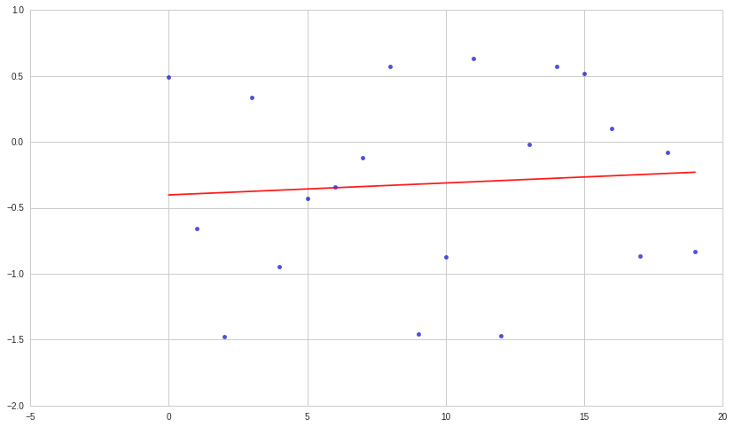
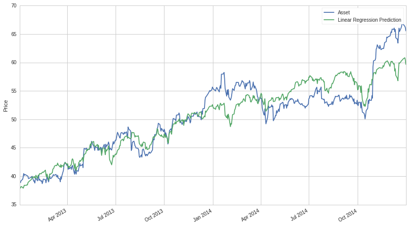
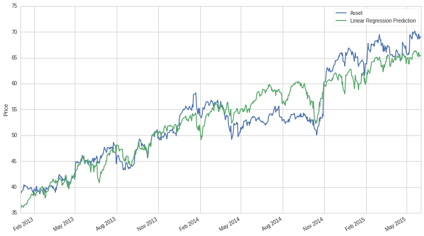

Regression Model Instability
============================

By Evgenia “Jenny” Nitishinskaya and Delaney Granizo-Mackenzie.
Algorithms by David Edwards.

Part of the Quantopian Lecture Series:

-  `www.quantopian.com/lectures <https://www.quantopian.com/lectures>`__
-  `github.com/quantopian/research_public <https://github.com/quantopian/research_public>`__

--------------

Regression analysis allows us to estimate coefficients in a function
which approximately relates multiple data sets. We hypothesize a
specific form for this function and then find coefficients which fit the
data well, working under the assumption that deviations from the model
can be considered noise.

When building such a model, we accept that it cannot perfectly predict
the dependent variable. Here we would like to evaluate the accuracy of
the model not by how well it explains the dependent variable, but by how
stable it is (that is, how stable the regression coefficients are) with
respect to our sample data. After all, if a model is truly a good fit,
it should be similar, say, for two random halves of our data set that we
model individually. Otherwise, we cannot assume that the model isn’t
simply an artifact of the particular sample of data we happened to
choose, or that it will be predictive of new data points.

We’ll be using linear regressions here for illustration purposes, but
the same considerations apply for all regression models. Below we define
a wrapper function for the linear regression from ``statsmodels`` so we
can use it later.

.. code:: ipython2

    import numpy as np
    import pandas as pd
    from statsmodels import regression, stats
    import statsmodels.api as sm
    import matplotlib.pyplot as plt
    import scipy as sp
    
    def linreg(X,Y):
        # Running the linear regression
        x = sm.add_constant(X) # Add a row of 1's so that our model has a constant term
        model = regression.linear_model.OLS(Y, x).fit()
        return model.params[0], model.params[1] # Return the coefficients of the linear model

Biased noise
============

The particular sample we choose for the data affects the model
generated, and unevenly distributed noise can lead to an inaccurate
model. Below we’re drawing from a normal distribution, but because we do
not have very many data points, we get a significant downward bias. If
we took more measurements, both of the regression coefficients would
move toward zero.

.. code:: ipython2

    # Draw observations from normal distribution
    np.random.seed(107) # Fix seed for random number generation
    rand = np.random.randn(20)
    
    # Conduct linear regression on the ordered list of observations
    xs = np.arange(20)
    a, b = linreg(xs, rand)
    print 'Slope:', b, 'Intercept:', a
    
    # Plot the raw data and the regression line
    plt.scatter(xs, rand, alpha=0.7)
    Y_hat = xs * b + a
    plt.plot(xs, Y_hat, 'r', alpha=0.9);

.. parsed-literal::

    Slope: 0.00907250382269 Intercept: -0.402077440853

.. code:: ipython2

    import seaborn
    
    seaborn.regplot(xs, rand)

.. parsed-literal::

    <matplotlib.axes._subplots.AxesSubplot at 0x7f0109440b50>

.. image:: notebook_files/notebook_4_1.png

.. code:: ipython2

    # Draw more observations
    rand2 = np.random.randn(100)
    
    # Conduct linear regression on the ordered list of observations
    xs2 = np.arange(100)
    a2, b2 = linreg(xs2, rand2)
    print 'Slope:', b2, 'Intercept:', a2
    
    # Plot the raw data and the regression line
    plt.scatter(xs2, rand2, alpha=0.7)
    Y_hat2 = xs2 * b2 + a2
    plt.plot(xs2, Y_hat2, 'r', alpha=0.9);

.. parsed-literal::

    Slope: -0.000569342363105 Intercept: 0.00901176731902

.. image:: notebook_files/notebook_5_1.png

Regression analysis is very sensitive to outliers. Sometimes these
outliers contain information, in which case we want to take them into
account; however, in cases like the above, they can simply be random
noise. Although we often have many more data points than in the example
above, we could have (for example) fluctuations on the order of weeks or
months, which then significantly change the regression coefficients.

Regime changes
==============

A regime change (or structural break) is when something changes in the
process generating the data, causing future samples to follow a
different distribution. Below, we can see that there is a regime change
at the end of 2007, and splitting the data there results in a much
better fit (in red) than a regression on the whole data set (yellow). In
this case our regression model will not be predictive of future data
points since the underlying system is no longer the same as in the
sample. In fact, the regression analysis assumes that the errors are
uncorrelated and have constant variance, which is often not be the case
if there is a regime change.

.. code:: ipython2

    start = '2003-01-01'
    end = '2009-02-01'
    pricing = get_pricing('SPY', fields='price', start_date=start, end_date=end)
    
    # Manually set the point where we think a structural break occurs
    breakpoint = 1200
    xs = np.arange(len(pricing))
    xs2 = np.arange(breakpoint)
    xs3 = np.arange(len(pricing) - breakpoint)
    
    # Perform linear regressions on the full data set, the data up to the breakpoint, and the data after
    a, b = linreg(xs, pricing)
    a2, b2 = linreg(xs2, pricing[:breakpoint])
    a3, b3 = linreg(xs3, pricing[breakpoint:])
    
    Y_hat = pd.Series(xs * b + a, index=pricing.index)
    Y_hat2 = pd.Series(xs2 * b2 + a2, index=pricing.index[:breakpoint])
    Y_hat3 = pd.Series(xs3 * b3 + a3, index=pricing.index[breakpoint:])
    
    # Plot the raw data
    pricing.plot()
    Y_hat.plot(color='y')
    Y_hat2.plot(color='r')
    Y_hat3.plot(color='r')
    plt.title('SPY Price')
    plt.ylabel('Price');

.. image:: notebook_files/notebook_8_0.png

Of course, the more pieces we break our data set into, the more
precisely we can fit to it. It’s important to avoid fitting to noise,
which will always fluctuate and is not predictive. We can test for the
existence of a structural break, either at a particular point we have
identified or in general. Below we use a test from ``statsmodels`` which
computes the probability of observing the data if there were no
breakpoint.

.. code:: ipython2

    stats.diagnostic.breaks_cusumolsresid(
        regression.linear_model.OLS(pricing, sm.add_constant(xs)).fit().resid)[1]

.. parsed-literal::

    7.4485869571761304e-59

Multicollinearity
=================

Above we were only considering regressions of one dependent variable
against one independent one. However, we can also have multiple
independent variables. This leads to instability if the independent
variables are highly correlated.

Imagine we are using two independent variables, :math:`X_1` and
:math:`X_2`, which are very highly correlated. Then the coefficients may
shift drastically if we add a new observation that is slightly better
explained by one of the two than by the other. In the extreme case, if
:math:`X_1 = X_2`, then the choice of coefficients will depend on the
particular linear regression algorithm.

Below, we run a multiple linear regression in which the independent
variables are highly correlated. If we take our sample period to be
2013-01-01 to 2015-01-01, then the coefficients are approximately .25
and .1. But if we extend the period to 2015-06-01, the coefficients
become approximately .18 and .20, respectively.

.. code:: ipython2

    # Get pricing data for two benchmarks (stock indices) and a stock
    start = '2013-01-01'
    end = '2015-01-01'
    b1 = get_pricing('SPY', fields='price', start_date=start, end_date=end)
    b2 = get_pricing('MDY', fields='price', start_date=start, end_date=end)
    asset = get_pricing('V', fields='price', start_date=start, end_date=end)
    
    mlr = regression.linear_model.OLS(asset, sm.add_constant(np.column_stack((b1, b2)))).fit()
    prediction = mlr.params[0] + mlr.params[1]*b1 + mlr.params[2]*b2
    print 'Constant:', mlr.params[0], 'MLR beta to S&P 500:', mlr.params[1], ' MLR beta to MDY', mlr.params[2]
    
    # Plot the asset pricing data and the regression model prediction, just for fun
    asset.plot()
    prediction.plot();
    plt.ylabel('Price')
    plt.legend(['Asset', 'Linear Regression Prediction']);

.. parsed-literal::

    Constant: -16.3503624604 MLR beta to S&P 500: 0.246866260161  MLR beta to MDY 0.0957537082372

.. code:: ipython2

    # Get pricing data for two benchmarks (stock indices) and a stock
    start = '2013-01-01'
    end = '2015-06-01'
    b1 = get_pricing('SPY', fields='price', start_date=start, end_date=end)
    b2 = get_pricing('MDY', fields='price', start_date=start, end_date=end)
    asset = get_pricing('V', fields='price', start_date=start, end_date=end)
    
    mlr = regression.linear_model.OLS(asset, sm.add_constant(np.column_stack((b1, b2)))).fit()
    prediction = mlr.params[0] + mlr.params[1]*b1 + mlr.params[2]*b2
    print 'Constant:', mlr.params[0], 'MLR beta to S&P 500:', mlr.params[1], ' MLR beta to MDY', mlr.params[2]
    
    # Plot the asset pricing data and the regression model prediction, just for fun
    asset.plot()
    prediction.plot();
    plt.ylabel('Price')
    plt.legend(['Asset', 'Linear Regression Prediction']);

.. parsed-literal::

    Constant: -28.5210310926 MLR beta to S&P 500: 0.176425363423  MLR beta to MDY 0.203681925802

We can check that our independent variables are correlated by computing
their correlation coefficient. This number always lies between -1 and 1,
and a value of 1 means that the two variables are perfectly correlated.

.. code:: ipython2

    # Compute Pearson correlation coefficient
    sp.stats.pearsonr(b1,b2)[0] # Second return value is p-value

.. parsed-literal::

    0.98870295660403051

*This presentation is for informational purposes only and does not
constitute an offer to sell, a solicitation to buy, or a recommendation
for any security; nor does it constitute an offer to provide investment
advisory or other services by Quantopian, Inc. (“Quantopian”). Nothing
contained herein constitutes investment advice or offers any opinion
with respect to the suitability of any security, and any views expressed
herein should not be taken as advice to buy, sell, or hold any security
or as an endorsement of any security or company. In preparing the
information contained herein, Quantopian, Inc. has not taken into
account the investment needs, objectives, and financial circumstances of
any particular investor. Any views expressed and data illustrated herein
were prepared based upon information, believed to be reliable, available
to Quantopian, Inc. at the time of publication. Quantopian makes no
guarantees as to their accuracy or completeness. All information is
subject to change and may quickly become unreliable for various reasons,
including changes in market conditions or economic circumstances.*
