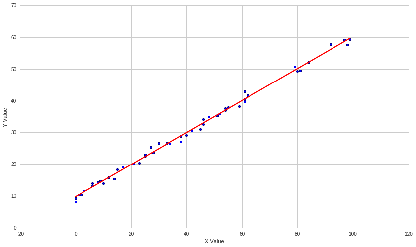
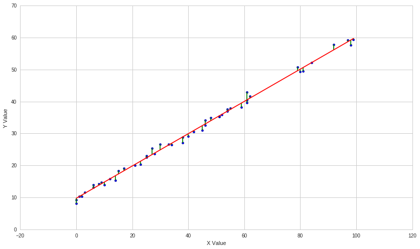
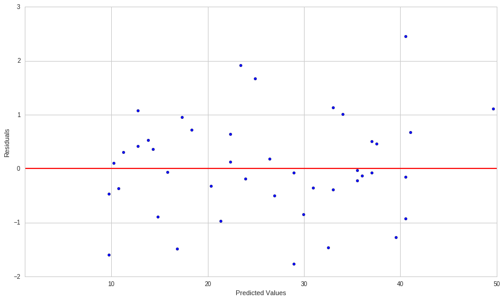
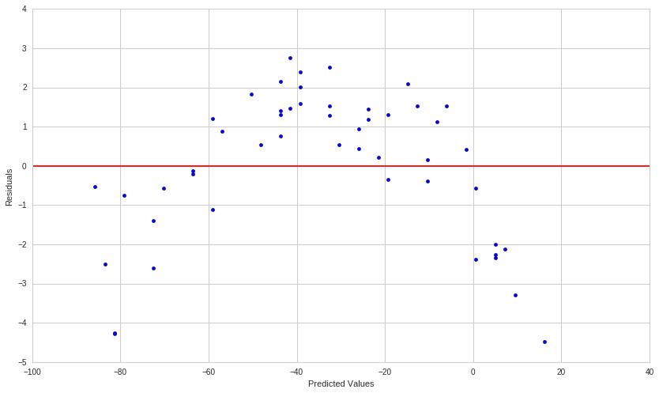
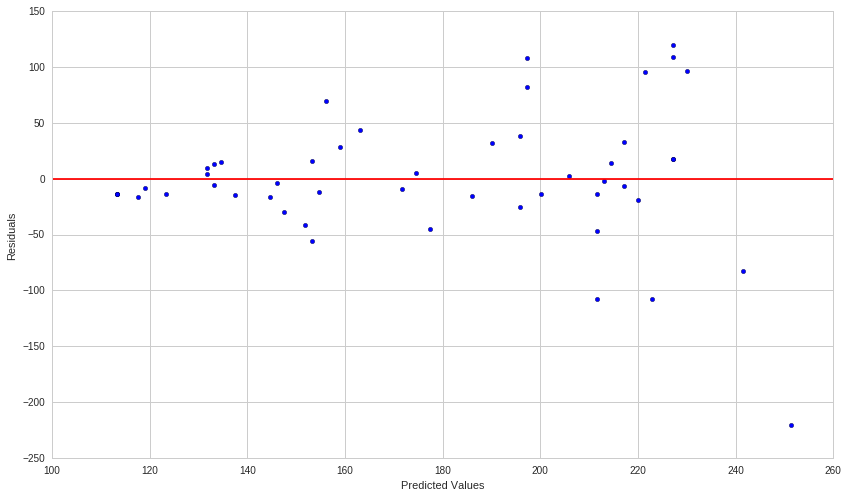
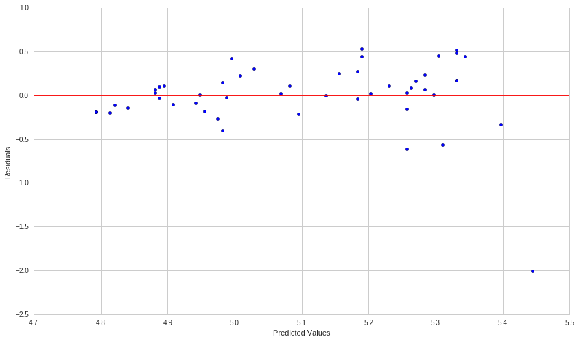
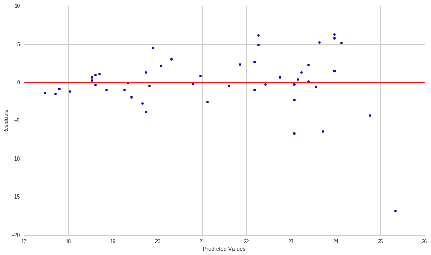
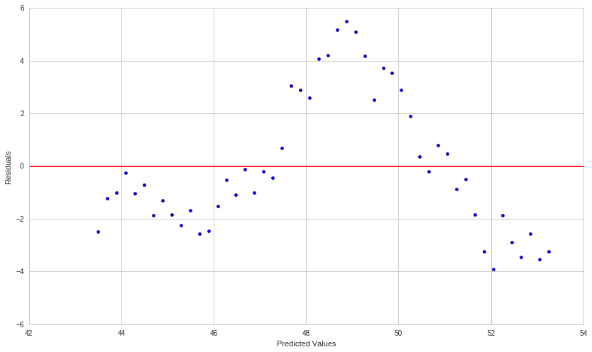
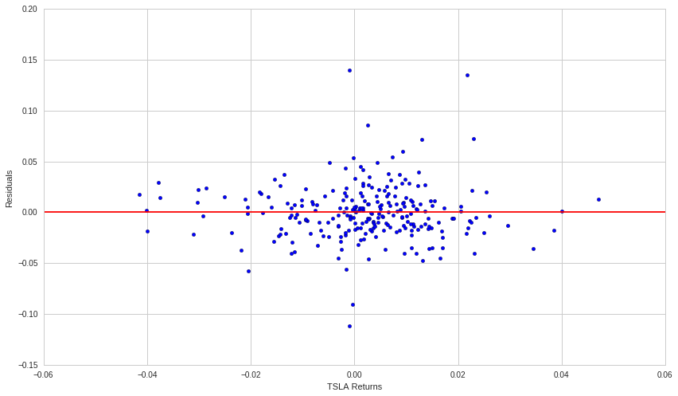

Residuals Analysis
==================

By Chris Fenaroli and Max Margenot

Part of the Quantopian Lecture Series:

-  `www.quantopian.com/lectures <https://www.quantopian.com/lectures>`__
-  `github.com/quantopian/research_public <https://github.com/quantopian/research_public>`__

--------------

Linear Regression
-----------------

Linear regression is one of our most fundamental modeling techniques. We
use it to estimate a linear relationship between a set of independent
variables :math:`X_i` and a dependent outcome variable :math:`y`. Our
model takes the form of:

.. math::  y_i = \beta_{0} 1 + \beta_{i, 1} x_{i, 1} + \dots + \beta_{i, p} x_{i, p} + \epsilon_i = x_i'\beta + \epsilon_i 

For :math:`i \in \{1, \dots, n\}`, where :math:`n` is the number of
observations. We write this in vector form as:

.. math::  y = X\beta + \epsilon 

Where :math:`y` is a :math:`n \times 1` vector, :math:`X` is a
:math:`n \times p` matrix, :math:`\beta` is a :math:`p \times 1` vector
of coefficients, and :math:`\epsilon` is a standard normal error term.
Typically we call a model with :math:`p = 1` a simple linear regression
and a model with :math:`p > 1` a multiple linear regression. More
background information on regressions can be found in the lectures on
`simple linear
regression <https://www.quantopian.com/lectures#Linear-Regression>`__
and `multiple linear
regression <https://www.quantopian.com/lectures#Multiple-Linear-Regression>`__.

Whenever we build a model, there will be gaps between what a model
predicts and what is observed in the sample. The differences between
these values are known as the residuals of the model and can be used to
check for some of the basic assumptions that go into the model. The key
assumptions to check for are:

-  **Linear Fit:** The underlying relationship should be linear
-  **Homoscedastic:** The data should have no trend in the variance
-  **Independent and Identically Distributed:** The residuals of the
   regression should be independent and identically distributed (i.i.d.)
   and show no signs of serial correlation

We can use the residuals to help diagnose whether the relationship we
have estimated is real or spurious.

Statistical error is a similar metric associated with regression
analysis with one important difference: While residuals quantify the gap
between a regression model predictions and the observed sample,
statistical error is the difference between a regression model and the
unobservable expected value. We use residuals in an attempt to estimate
this error.

.. code:: ipython2

    # Import libraries
    import numpy as np
    import pandas as pd
    from statsmodels import regression
    import statsmodels.api as sm
    import statsmodels.stats.diagnostic as smd
    import scipy.stats as stats
    import matplotlib.pyplot as plt
    import math

Simple Linear Regression
========================

First we’ll define a function that performs linear regression and plots
the results.

.. code:: ipython2

    def linreg(X,Y):
        # Running the linear regression
        X = sm.add_constant(X)
        model = sm.OLS(Y, X).fit()
        B0 = model.params[0]
        B1 = model.params[1]
        X = X[:, 1]
    
        # Return summary of the regression and plot results
        X2 = np.linspace(X.min(), X.max(), 100)
        Y_hat = X2 * B1 + B0
        plt.scatter(X, Y, alpha=1) # Plot the raw data
        plt.plot(X2, Y_hat, 'r', alpha=1);  # Add the regression line, colored in red
        plt.xlabel('X Value')
        plt.ylabel('Y Value')
        return model, B0, B1

Let’s define a toy relationship between :math:`X` and :math:`Y` that we
can model with a linear regression. Here we define the relationship and
construct a model on it, drawing the determined line of best fit with
the regression parameters.

.. code:: ipython2

    n = 50
    X = np.random.randint(0, 100, n)
    epsilon = np.random.normal(0, 1, n)
    
    Y = 10 + 0.5 * X + epsilon
    
    linreg(X,Y)[0];
    print "Line of best fit: Y = {0} + {1}*X".format(linreg(X, Y)[1], linreg(X, Y)[2])

.. parsed-literal::

    Line of best fit: Y = 9.7469046901 + 0.50511977846*X

This toy example has some generated noise, but all real data will also
have noise. This is inherent in sampling from any sort of wild
data-generating process. As a result, our line of best fit will never
exactly fit the data (which is why it is only “best”, not “perfect”).
Having a model that fits every single observation that you have is a
sure sign of
`overfitting <https://www.quantopian.com/lectures/the-dangers-of-overfitting>`__.

For all fit models, there will be a difference between what the
regression model predicts and what was observed, which is where
residuals come in.

Residuals
---------

The definition of a residual is the difference between what is observed
in the sample and what is predicted by the regression. For any residual
:math:`r_i`, we express this as

.. math:: r_i = Y_i - \hat{Y_i}

Where :math:`Y_i` is the observed :math:`Y`-value and :math:`\hat{Y}_i`
is the predicted Y-value. We plot these differences on the following
graph:

.. code:: ipython2

    model, B0, B1 = linreg(X,Y)
    
    residuals = model.resid
    plt.errorbar(X,Y,xerr=0,yerr=[residuals,0*residuals],linestyle="None",color='Green');

We can pull the residuals directly out of the fit model.

.. code:: ipython2

    residuals = model.resid
    print residuals

.. parsed-literal::

    [ 0.4616126   1.55896771  1.00595323 -0.92969553 -0.97642556  1.91867126
     -0.19036639  2.45196655  0.95088289  0.72254804 -0.49832712 -0.38443602
     -0.08126784  0.10741945 -1.77071504 -0.793265   -0.21592237 -1.0917219
      0.36573601  1.67416585  1.13164385  0.51603258  1.07430432 -0.46318056
     -0.02875667 -0.36153253  0.12337483 -1.46223406 -1.59525781  0.17736508
     -0.15310837  0.50982731 -1.62994098 -0.35550632  0.52423832 -0.07132131
     -1.27189472 -0.06552032  0.30683582 -0.84899309  0.63629516  0.67761994
     -0.32525429 -0.00386061  1.10690629  0.42042294 -1.48185375 -0.89396672
     -0.12733034 -0.3511348 ]

Diagnosing Residuals
====================

Many of the assumptions that are necessary to have a valid linear
regression model can be checked by identifying patterns in the residuals
of that model. We can make a quick visual check by looking at the
residual plot of a given model.

With a residual plot, we look at the predicted values of the model
versus the residuals themselves. What we want to see is just a cloud of
unrelated points, like so:

.. code:: ipython2

    plt.scatter(model.predict(), residuals);
    plt.axhline(0, color='red')
    plt.xlabel('Predicted Values');
    plt.ylabel('Residuals');
    plt.xlim([1,50]);

What we want is a fairly random distribution of residuals. The points
should form no discernible pattern. This would indicate that a plain
linear model is likely a good fit. If we see any sort of trend, this
might indicate the presence of autocorrelation or heteroscedasticity in
the model.

Appropriateness of a Linear Model
---------------------------------

By looking for patterns in residual plots we can determine whether a
linear model is appropriate in the first place. A plain linear
regression would not be appropriate for an underlying relationship of
the form:

.. math:: Y = \beta_0 + \beta_1 X^2

as a linear function would not be able to fully explain the relationship
between :math:`X` and :math:`Y`.

If the relationship is not a good fit for a linear model, the residual
plot will show a distinct pattern. In general, a residual plot of a
linear regression on a non-linear relationship will show bias and be
asymmetrical with respect to residual = 0 line while a residual plot of
a linear regression on a linear relationship will be generally
symmetrical over the residual = 0 axis.

As an example, let’s consider a new relationship between the variables
:math:`X` and :math:`Y` that incorporates a quadratic term.

.. code:: ipython2

    n = 50
    X = np.random.randint(0, 50, n)
    epsilon = np.random.normal(0, 1, n)
    Y_nonlinear = 10 - X**1.2 + epsilon
    
    model = sm.OLS(Y_nonlinear, sm.add_constant(X)).fit()
    B0, B1 = model.params
    residuals = model.resid
    
    print 'beta_0: ', B0
    print 'beta_1: ', B1
    plt.scatter(model.predict(), residuals);
    plt.axhline(0, color='red')
    plt.xlabel('Predicted Values');
    plt.ylabel('Residuals');

.. parsed-literal::

    beta_0:  16.1629344528
    beta_1:  -2.2154769386

The “inverted-U” shape shown by the residuals is a sign that a
non-linear model might be a better fit than a linear one.

Heteroscedasticity
------------------

One of the main assumptions behind a linear regression is that the
underlying data has a constant variance. If there are some parts of the
data with a variance different from another part the data is not
appropriate for a linear regression. **Heteroscedasticity** is a term
that refers to data with non-constant variance, as opposed to
homoscedasticity, when data has constant variance.

Significant heteroscedasticity invalidates linear regression results by
biasing the standard error of the model. As a result, we can’t trust the
outcomes of significance tests and confidence intervals generated from
the model and its parameters.

To avoid these consequences it is important to use residual plots to
check for heteroscedasticity and adjust if necessary.

As an example of detecting and correcting heteroscedasticity, let’s
consider yet another relationship between :math:`X` and :math:`Y`:

.. code:: ipython2

    n = 50
    X = np.random.randint(0, 100, n)
    epsilon = np.random.normal(0, 1, n)
    Y_heteroscedastic = 100 + 2*X + epsilon*X
    
    model = sm.OLS(Y_heteroscedastic, sm.add_constant(X)).fit()
    B0, B1 = model.params
    residuals = model.resid
    
    plt.scatter(model.predict(), residuals);
    plt.axhline(0, color='red')
    plt.xlabel('Predicted Values');
    plt.ylabel('Residuals');

Heteroscedasticity often manifests as this spread, giving us a tapered
cloud in one direction or another. As we move along in the
:math:`x`-axis, the magnitudes of the residuals are clearly increasing.
A linear regression is unable to explain this varying variability and
the regression standard errors will be biased.

Statistical Methods for Detecting Heteroscedasticity
~~~~~~~~~~~~~~~~~~~~~~~~~~~~~~~~~~~~~~~~~~~~~~~~~~~~

Generally, we want to back up qualitative observations on a residual
plot with a quantitative method. The residual plot led us to believe
that the data might be heteroscedastic. Let’s confirm that result with a
statistical test.

A common way to test for the presence of heteroscedasticity is the
Breusch-Pagan hypothesis test. It’s good to combine the qualitative
analysis of a residual plot with the quantitative analysis of at least
one hypothesis test. We can add the White test as well, but for now we
will use only Breush-Pagan to test our relationship above. A function
exists in the ``statsmodels`` package called ``het_breushpagan`` that
simplifies the computation:

.. code:: ipython2

    breusch_pagan_p = smd.het_breushpagan(model.resid, model.model.exog)[1]
    print breusch_pagan_p
    if breusch_pagan_p > 0.05:
        print "The relationship is not heteroscedastic."
    if breusch_pagan_p < 0.05:
        print "The relationship is heteroscedastic."

.. parsed-literal::

    0.000790491370489
    The relationship is heteroscedastic.

We set our confidence level at :math:`\alpha = 0.05`, so a Breusch-Pagan
p-value below :math:`0.05` tells us that the relationship is
heteroscedastic. For more on hypothesis tests and interpreting p-values,
refer to the `lecture on hypothesis
testing. <https://www.quantopian.com/research/notebooks/Cloned%20from%20%22Quantopian%20Lecture%20Series%3A%20Hypothesis%20Testing%22%201.ipynb>`__.
Using a hypothesis test bears the risk of a false positive or a false
negative, which is why it can be good to confirm with additional tests
if we are skeptical.

Adjusting for Heteroscedasticity
~~~~~~~~~~~~~~~~~~~~~~~~~~~~~~~~

If, after creating a residual plot and conducting tests, you believe you
have heteroscedasticity, there are a number of methods you can use to
attempt to adjust for it. The three we will focus on are differences
analysis, log transformations, and Box-Cox transformations.

Differences Analysis
^^^^^^^^^^^^^^^^^^^^

A differences analysis involves looking at the first-order differences
between adjacent values. With this, we are looking at the changes from
period to period of an independent variable rather than looking directly
at its values. Often, by looking at the differences instead of the raw
values, we can remove heteroscedasticity. We correct for it and can use
the ensuing model on the differences.

.. code:: ipython2

    # Finding first-order differences in Y_heteroscedastic
    Y_heteroscedastic_diff = np.diff(Y_heteroscedastic)

Now that we have stored the first-order differences of
``Y_heteroscedastic`` in ``Y_heteroscedastic_diff`` let’s repeat the
regression and residual plot to see if the heteroscedasticity is still
present:

.. code:: ipython2

    model = sm.OLS(Y_heteroscedastic_diff, sm.add_constant(X[1:])).fit()
    B0, B1 = model.params
    residuals = model.resid
    
    plt.scatter(model.predict(), residuals);
    plt.axhline(0, color='red')
    plt.xlabel('Predicted Values');
    plt.ylabel('Residuals');

.. image:: notebook_files/notebook_26_0.png

.. code:: ipython2

    breusch_pagan_p = smd.het_breushpagan(residuals, model.model.exog)[1]
    print breusch_pagan_p
    if breusch_pagan_p > 0.05:
        print "The relationship is not heteroscedastic."
    if breusch_pagan_p < 0.05:
        print "The relationship is heteroscedastic."

.. parsed-literal::

    0.0835164211771
    The relationship is not heteroscedastic.

*Note: This new regression was conducted on the differences between
data, and therefore the regression output must be back-transformed to
reach a prediction in the original scale. Since we regressed the
differences, we can add our predicted difference onto the original data
to get our estimate:*

.. math:: \hat{Y_i} = Y_{i-1} + \hat{Y}_{diff}

Logarithmic Transformation
^^^^^^^^^^^^^^^^^^^^^^^^^^

Next, we apply a log transformation to the underlying data. A log
transformation will bring residuals closer together and ideally remove
heteroscedasticity. In many (though not all) cases, a log transformation
is sufficient in stabilizing the variance of a relationship.

.. code:: ipython2

    # Taking the log of the previous data Y_heteroscedastic and saving it in Y_heteroscedastic_log
    Y_heteroscedastic_log = np.log(Y_heteroscedastic)

Now that we have stored the log transformed version of
``Y_heteroscedastic`` in ``Y_heteroscedastic_log`` let’s repeat the
regression and residual plot to see if the heteroscedasticity is still
present:

.. code:: ipython2

    model = sm.OLS(Y_heteroscedastic_log, sm.add_constant(X)).fit()
    B0, B1 = model.params
    residuals = model.resid
    
    plt.scatter(model.predict(), residuals);
    plt.axhline(0, color='red')
    plt.xlabel('Predicted Values');
    plt.ylabel('Residuals');

.. code:: ipython2

    # Running and interpreting a Breusch-Pagan test
    breusch_pagan_p = smd.het_breushpagan(residuals, model.model.exog)[1]
    print breusch_pagan_p
    if breusch_pagan_p > 0.05:
        print "The relationship is not heteroscedastic."
    if breusch_pagan_p < 0.05:
        print "The relationship is heteroscedastic."

.. parsed-literal::

    0.0225023159539
    The relationship is heteroscedastic.

*Note: This new regression was conducted on the log of the original
data. This means the scale has been altered and the regression estimates
will lie on this transformed scale. To bring the estimates back to the
original scale, you must back-transform the values using the inverse of
the log:*

.. math:: \hat{Y} = e^{\log(\hat{Y})}

Box-Cox Transformation
^^^^^^^^^^^^^^^^^^^^^^

Finally, we examine the Box-Cox transformation. The Box-Cox
transformation is a powerful method that will work on many types of
heteroscedastic relationships. The process works by testing all values
of :math:`\lambda` within the range :math:`[-5, 5]` to see which makes
the output of the following equation closest to being normally
distributed:

.. math::

   Y^{(\lambda)} = \begin{cases}
       \frac{Y^{\lambda}-1}{\lambda} & : \lambda \neq 0\\ \log{Y} & : \lambda = 0
   \end{cases}

The “best” :math:`\lambda` will be used to transform the series along
the above function. Instead of having to do all of this manually, we can
simply use the ``scipy`` function ``boxcox``. We use this to adjust
:math:`Y` and hopefully remove heteroscedasticity.

*Note: The Box-Cox transformation can only be used if all the data is
positive*

.. code:: ipython2

    # Finding a power transformation adjusted Y_heteroscedastic
    Y_heteroscedastic_box_cox = stats.boxcox(Y_heteroscedastic)[0]

Now that we have stored the power transformed version of
``Y_heteroscedastic`` in ``Y_heteroscedastic_prime`` let’s repeat the
regression and residual plot to see if the heteroscedasticity is still
present:

.. code:: ipython2

    model = sm.OLS(Y_heteroscedastic_box_cox, sm.add_constant(X)).fit()
    B0, B1 = model.params
    residuals = model.resid
    
    plt.scatter(model.predict(), residuals);
    plt.axhline(0, color='red')
    plt.xlabel('Predicted Values');
    plt.ylabel('Residuals');

.. code:: ipython2

    # Running and interpreting a Breusch-Pagan test
    breusch_pagan_p = smd.het_breushpagan(residuals, model.model.exog)[1]
    print breusch_pagan_p
    if breusch_pagan_p > 0.05:
        print "The relationship is not heteroscedastic."
    if breusch_pagan_p < 0.05:
        print "The relationship is heteroscedastic."

.. parsed-literal::

    0.00663602327059
    The relationship is heteroscedastic.

*Note: Now that the relationship is not heteroscedastic, a linear
regression is appropriate. However, because the data was power
transformed, the regression estimates will be on a different scale than
the original data. This is why it is important to remember to
back-transform results using the inverse of the Box-Cox function:*

.. math:: \hat{Y} = (Y^{(\lambda)}\lambda + 1)^{1/\lambda}

GARCH Modeling
~~~~~~~~~~~~~~

Another approach to dealing with heteroscadasticity is through a GARCH
(generalized autoregressive conditional heteroscedasticity) model. More
information can be found in the `lecture on GARCH
modeling <https://www.quantopian.com/lectures#ARCH,-GARCH,-and-GMM>`__.

Residuals and Autocorrelation
-----------------------------

Another assumption behind linear regressions is that the residuals are
not autocorrelated. A series is autocorrelated when it is correlated
with a delayed version of itself. An example of a potentially
autocorrelated time series series would be daily high temperatures.
Today’s temperature gives you information on tomorrow’s temperature with
reasonable confidence (i.e. if it is 90 °F today, you can be very
confident that it will not be below freezing tomorrow). A series of fair
die rolls, however, would not be autocorrelated as seeing one roll gives
you no information on what the next might be. Each roll is independent
of the last.

In finance, stock prices are usually autocorrelated while stock returns
are independent from one day to the next. We represent a time dependency
on previous values like so:

.. math:: Y_i = Y_{i-1} + \epsilon

If the residuals of a model are autocorrelated, you will be able to make
predictions about adjacent residuals. In the case of :math:`Y`, we know
the data will be autocorrelated because we can make predictions based on
adjacent residuals being close to one another.

.. code:: ipython2

    n = 50
    X = np.linspace(0, n, n)
    Y_autocorrelated = np.zeros(n)
    Y_autocorrelated[0] = 50
    for t in range(1, n):
        Y_autocorrelated[t] = Y_autocorrelated[t-1] + np.random.normal(0, 1) 
    
    # Regressing X and Y_autocorrelated
    model = sm.OLS(Y_autocorrelated, sm.add_constant(X)).fit()
    B0, B1 = model.params
    residuals = model.resid
    
    plt.scatter(model.predict(), residuals);
    plt.axhline(0, color='red')
    plt.xlabel('Predicted Values');
    plt.ylabel('Residuals');

Autocorrelation in the residuals in this example is not explicitly
obvious, so our check is more to make absolutely certain.

Statistical Methods for Detecting Autocorrelation
~~~~~~~~~~~~~~~~~~~~~~~~~~~~~~~~~~~~~~~~~~~~~~~~~

As with all statistical properties, we require a statistical test to
ultimately decide whether there is autocorrelation in our residuals or
not. To this end, we use a Ljung-Box test.

A Ljung-Box test is used to detect autocorrelation in a time series. The
Ljung-Box test examines autocorrelation at all lag intervals below a
specified maximum and returns arrays containing the outputs for every
tested lag interval.

Let’s use the ``acorr_ljungbox`` function in ``statsmodels`` to test for
autocorrelation in the residuals of our above model. We use a max lag
interval of :math:`10`, and see if any of the lags have significant
autocorrelation:

.. code:: ipython2

    ljung_box = smd.acorr_ljungbox(residuals, lags = 10)
    print "Lagrange Multiplier Statistics:", ljung_box[0]
    print "\nP-values:", ljung_box[1], "\n"
    
    if any(ljung_box[1] < 0.05):
        print "The residuals are autocorrelated."
    else:
        print "The residuals are not autocorrelated."

.. parsed-literal::

    Lagrange Multiplier Statistics: [  43.65325348   80.80728237  112.66873613  138.14145184  157.50322113
      171.78472133  179.18420508  181.49990291  181.72987791  181.8555585 ]
    
    P-values: [  3.92024856e-11   2.83740666e-18   2.92375611e-24   7.05507263e-29
       3.36983459e-32   1.88110240e-34   2.89663288e-35   4.98447013e-35
       2.20529138e-34   9.64841145e-34] 
    
    The residuals are autocorrelated.

Because the Ljung-Box test yielded a p-value below :math:`0.05` for at
least one lag interval, we can conclude that the residuals of our model
are autocorrelated.

Adjusting for Autocorrelation
-----------------------------

We can adjust for autocorrelation in many of the same ways that we
adjust for heteroscedasticity. Let’s see if a model on the first-order
differences of :math:`Y` has autocorrelated residuals:

.. code:: ipython2

    # Finding first-order differences in Y_autocorrelated
    Y_autocorrelated_diff = np.diff(Y_autocorrelated)

.. code:: ipython2

    model = sm.OLS(Y_autocorrelated_diff, sm.add_constant(X[1:])).fit()
    B0, B1 = model.params
    residuals = model.resid
    
    plt.scatter(model.predict(), residuals);
    plt.axhline(0, color='red')
    plt.xlabel('Predicted Values');
    plt.ylabel('Residuals');
    
    # Running and interpreting a Ljung-Box test
    ljung_box = smd.acorr_ljungbox(residuals, lags = 10)
    print "P-values:", ljung_box[1], "\n"
    
    if any(ljung_box[1] < 0.05):
        print "The residuals are autocorrelated."
    else:
        print "The residuals are not autocorrelated."

.. parsed-literal::

    P-values: [ 0.46043772  0.74908377  0.82067765  0.92091356  0.96659539  0.91694346
      0.8644615   0.78746052  0.63628018  0.62962119] 
    
    The residuals are not autocorrelated.

.. image:: notebook_files/notebook_49_1.png

*Note: This new regression was conducted on the differences between
data, and therefore the regression output must be back-transformed to
reach a prediction in the original scale. Since we regressed the
differences, we can add our predicted difference onto the original data
to get our estimate:*

.. math:: \hat{Y_i} = Y_{i-1} + \hat{Y_{diff}}

We can also perform a log transformation, if we so choose. This process
is identical to the one we performed on the heteroscedastic data up
above, so we will leave it out this time.

Example: Market Beta Calculation
================================

Let’s calculate the market beta between TSLA and SPY using a simple
linear regression, and then conduct a residual analysis on the
regression to ensure the validity of our results. To regress TSLA and
SPY, we will focus on their returns, not their price, and set SPY
returns as our independent variable and TSLA returns as our outcome
variable. The regression will give us a line of best fit:

.. math:: \hat{r_{TSLA}} = \hat{\beta_0} + \hat{\beta_1}r_{SPY}

The slope of the regression line :math:`\hat{\beta_1}` will represent
our market beta, as for every :math:`r` percent change in the returns of
SPY, the predicted returns of TSLA will change by :math:`\hat{\beta_1}`.

Let’s start by conducting the regression the returns of the two assets.

.. code:: ipython2

    start = '2014-01-01'
    end = '2015-01-01'
    asset = get_pricing('TSLA', fields='price', start_date=start, end_date=end)
    benchmark = get_pricing('SPY', fields='price', start_date=start, end_date=end)
    
    # We have to take the percent changes to get to returns
    # Get rid of the first (0th) element because it is NAN
    r_a = asset.pct_change()[1:].values
    r_b = benchmark.pct_change()[1:].values
    
    # Regressing the benchmark b and asset a
    r_b = sm.add_constant(r_b)
    model = sm.OLS(r_a, r_b).fit()
    r_b = r_b[:, 1]
    B0, B1 = model.params
    
    # Plotting the regression
    A_hat = (B1*r_b + B0)
    plt.scatter(r_b, r_a, alpha=1) # Plot the raw data
    plt.plot(r_b, A_hat, 'r', alpha=1);  # Add the regression line, colored in red
    plt.xlabel('TSLA Returns')
    plt.ylabel('SPY Returns')
    
    # Print our result
    print "Estimated TSLA Beta:", B1
    
    # Calculating the residuals
    residuals = model.resid

.. parsed-literal::

    Estimated TSLA Beta: 1.92533467685

.. image:: notebook_files/notebook_53_1.png

Our regression yielded an estimated market beta of 1.9253; according to
the regression, for every 1% in return we see from the SPY, we should
see 1.92% from TSLA.

Now that we have the regression results and residuals, we can conduct
our residual analysis. Our first step will be to plot the residuals and
look for any red flags:

.. code:: ipython2

    plt.scatter(model.predict(), residuals);
    plt.axhline(0, color='red')
    plt.xlabel('TSLA Returns');
    plt.ylabel('Residuals');

By simply observing the distribution of residuals, it does not seem as
if there are any abnormalities. The distribution is relatively random
and no patterns can be observed (the clustering around the origin is a
result of the nature of returns to cluster around 0 and is not a red
flag). Our qualitative conclusion is that the data is homoscedastic and
not autocorrelated and therefore satisfies the assumptions for linear
regression.

###Breusch-Pagan Heteroscedasticity Test

Our qualitative assessment of the residual plot is nicely supplemented
with a couple statistical tests. Let’s begin by testing for
heteroscedasticity using a Breusch-Pagan test. Using the
``het_breuschpagan`` function from the statsmodels package:

.. code:: ipython2

    bp_test = smd.het_breushpagan(residuals, model.model.exog)
    
    print "Lagrange Multiplier Statistic:", bp_test[0]
    print "P-value:", bp_test[1]
    print "f-value:", bp_test[2]
    print "f_p-value:", bp_test[3], "\n"
    if bp_test[1] > 0.05:
        print "The relationship is not heteroscedastic."
    if bp_test[1] < 0.05:
        print "The relationship is heteroscedastic."

.. parsed-literal::

    Lagrange Multiplier Statistic: 0.669337376498
    P-value: 0.413282723143
    f-value: 0.665779433495
    f_p-value: 0.415306831916 
    
    The relationship is not heteroscedastic.

Because the P-value is greater than 0.05, we do not have enough evidence
to reject the null hypothesis that the relationship is homoscedastic.
This result matches up with our qualitative conclusion.

###Ljung-Box Autocorrelation Test

Let’s also check for autocorrelation quantitatively using a Ljung-Box
test. Using the ``acorr_ljungbox`` function from the statsmodels package
and the default maximum lag:

.. code:: ipython2

    ljung_box = smd.acorr_ljungbox(r_a)
    print "P-Values:", ljung_box[1], "\n"
    if any(ljung_box[1] < 0.05):
        print "The residuals are autocorrelated."
    else:
        print "The residuals are not autocorrelated."

.. parsed-literal::

    P-Values: [ 0.8846583   0.88950844  0.96229443  0.96341497  0.91599599  0.93032135
      0.9643816   0.97852899  0.98390172  0.98786945  0.99167638  0.97134708
      0.91203802  0.9216252   0.94242703  0.87812148  0.90007513  0.92664875
      0.94471082  0.88594594  0.88744682  0.91583141  0.8960177   0.92045423
      0.87780239  0.89866989  0.91536025  0.93228388  0.93825939  0.95373621
      0.91155827  0.9313345   0.94201011  0.94355971  0.94414366  0.95678029
      0.96694651  0.96684993  0.95284072  0.96254994] 
    
    The residuals are not autocorrelated.

Because the Ljung-Box test yielded p-values above 0.05 for all lags, we
can conclude that the residuals are not autocorrelated. This result
matches up with our qualitative conclusion.

After having visually assessed the residual plot of the regression and
then backing it up using statistical tests, we can conclude that the
data satisfies the main assumptions and the linear model is valid.

References
----------

-  “Analysis of Financial Time Series”, by Ruey Tsay

*This presentation is for informational purposes only and does not
constitute an offer to sell, a solicitation to buy, or a recommendation
for any security; nor does it constitute an offer to provide investment
advisory or other services by Quantopian, Inc. (“Quantopian”). Nothing
contained herein constitutes investment advice or offers any opinion
with respect to the suitability of any security, and any views expressed
herein should not be taken as advice to buy, sell, or hold any security
or as an endorsement of any security or company. In preparing the
information contained herein, Quantopian, Inc. has not taken into
account the investment needs, objectives, and financial circumstances of
any particular investor. Any views expressed and data illustrated herein
were prepared based upon information, believed to be reliable, available
to Quantopian, Inc. at the time of publication. Quantopian makes no
guarantees as to their accuracy or completeness. All information is
subject to change and may quickly become unreliable for various reasons,
including changes in market conditions or economic circumstances.*
