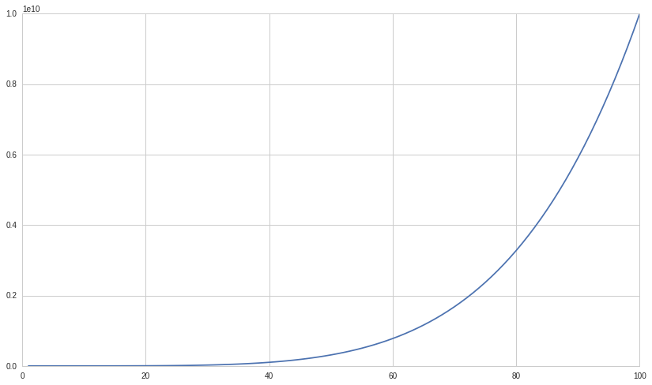
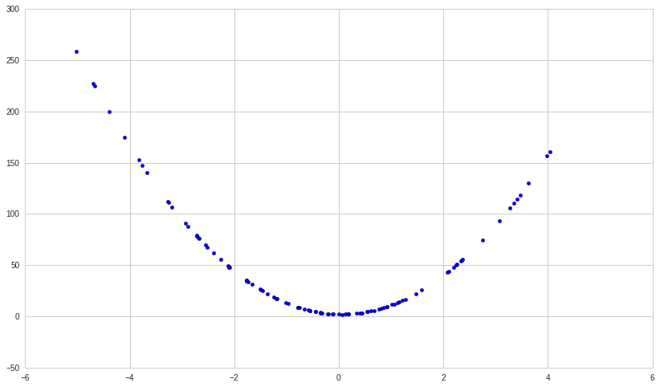
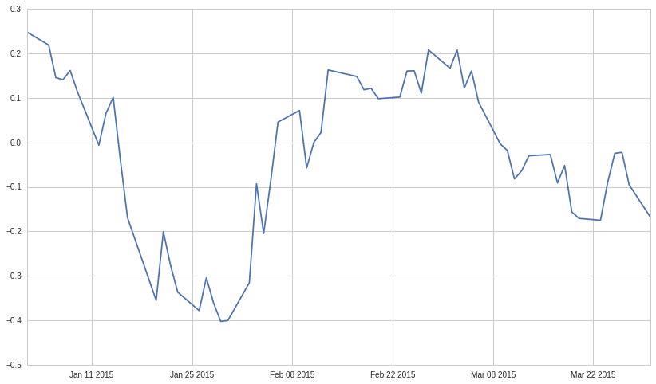

#Exercises: Spearman Rank Correlation

Lecture Link
------------

This exercise notebook refers to this lecture. Please use the lecture
for explanations and sample code.

https://www.quantopian.com/lectures#Spearman-Rank-Correlation

Part of the Quantopian Lecture Series:

-  `www.quantopian.com/lectures <https://www.quantopian.com/lectures>`__
-  `github.com/quantopian/research_public <https://github.com/quantopian/research_public>`__

.. code:: ipython2

    import numpy as np
    import pandas as pd
    import scipy.stats as stats
    import matplotlib.pyplot as plt
    import math

#Exercise 1: Finding Correlations of Non-Linear Relationships

##a. Traditional (Pearson) Correlation

Find the correlation coefficient for the relationship between ``x`` and
``y``.

.. code:: ipython2

    n = 100
    x = np.linspace(1, n, n)
    y = x**5
    
    #Your code goes here
    
    corr = np.corrcoef(x, y)[1][0]
    
    print corr
    
    plt.plot(x, y);

.. parsed-literal::

    0.822025231123

b. Spearman Rank Correlation
============================

Find the Spearman rank correlation coefficient for the relationship
between ``x`` and ``y`` using the ``stats.rankdata`` function and the
formula

.. math:: r_S = 1 - \frac{6 \sum_{i=1}^n d_i^2}{n(n^2 - 1)}

where :math:`d_i` is the difference in rank of the ``i``\ th pair of
``x`` and ``y`` values.

.. code:: ipython2

    #Your code goes here
    
    xrank = stats.rankdata(x, method='average')
    
    yrank = stats.rankdata(y, method='average')
    
    diffs = xrank - yrank
    
    spr_corr = 1 - 6*np.sum( diffs*diffs )/( n*( n**2 - 1 ) )
    
    print "Because the ranks of the two data sets are perfectly correlated,\
    the relationship between x and y has a Spearman rank correlation coefficient of", spr_corr

.. parsed-literal::

    Because the ranks of the two data sets are perfectly correlated,the relationship between x and y has a Spearman rank correlation coefficient of 1.0

Check your results against scipy’s Spearman rank function.
``stats.spearmanr``

.. code:: ipython2

    # Your code goes here
    
    stats.spearmanr(x, y)

.. parsed-literal::

    SpearmanrResult(correlation=0.99999999999999989, pvalue=0.0)

#Exercise 2: Limitations of Spearman Rank Correlation

##a. Lagged Relationships

First, create a series ``b`` that is identical to ``a`` but lagged one
step (``b[i] = a[i-1]``). Then, find the Spearman rank correlation
coefficient of the relationship between ``a`` and ``b``.

.. code:: ipython2

    n = 100
    a = np.random.normal(0, 1, n)
    
    #Your code goes here
    
    b = [0] + list(a[:(n-1)])
    
    results = stats.spearmanr(a, b)
    
    print "Despite the underlying relationship being a perfect correlation,\
    the one-step lag led to a Spearman rank correlation coefficient of\n", results.correlation, \
    ", meaning the test failed to detect the strong relationship."

.. parsed-literal::

    Despite the underlying relationship being a perfect correlation,the one-step lag led to a Spearman rank correlation coefficient of
    -0.0136813681368 , meaning the test failed to detect the strong relationship.

##b. Non-Monotonic Relationships

First, create a series ``d`` using the relationship
:math:`d=10c^2 - c + 2`. Then, find the Spearman rank rorrelation
coefficient of the relationship between ``c`` and ``d``.

.. code:: ipython2

    n = 100
    c = np.random.normal(0, 2, n)
    
    #Your code goes here
    
    d = 10*c**2 - c + 2
    
    results = stats.spearmanr(c, d)
    
    print "Despite an exact underlying relationship of d = 10c^2 - c + 2,\
    the non-monotonic nature of the relationship led to a Spearman rank Correlation coefficient of", \
    results.correlation, ", meaning the test failed to detect the relationship."
    plt.scatter(c, d);

.. parsed-literal::

    Despite an exact underlying relationship of d = 10c^2 - c + 2,the non-monotonic nature of the relationship led to a Spearman rank Correlation coefficient of -0.24397239724 , meaning the test failed to detect the relationship.

#Exercise 3: Real World Example

##a. Factor and Forward Returns

Here we’ll define a simple momentum factor (model). To evaluate it we’d
need to look at how its predictions correlate with future returns over
many days. We’ll start by just evaluating the Spearman rank correlation
between our factor values and forward returns on just one day.

Compute the Spearman rank correlation between factor values and 10
trading day forward returns on 2015-1-2.

For help on the pipeline API, see this tutorial:
https://www.quantopian.com/tutorials/pipeline

.. code:: ipython2

    #Pipeline Setup
    from quantopian.research import run_pipeline
    from quantopian.pipeline import Pipeline
    from quantopian.pipeline.data.builtin import USEquityPricing
    from quantopian.pipeline.factors import CustomFactor, Returns, RollingLinearRegressionOfReturns
    from quantopian.pipeline.classifiers.morningstar import Sector
    from quantopian.pipeline.filters import QTradableStocksUS
    from time import time
    
    #MyFactor is our custom factor, based off of asset price momentum
    
    class MyFactor(CustomFactor):
            """ Momentum factor """
    
            inputs = [USEquityPricing.close] 
            window_length = 60
    
            def compute(self, today, assets, out, close):       
                out[:] = close[-1]/close[0]
                
    universe = QTradableStocksUS()
    
    pipe = Pipeline(
        columns = {
                'MyFactor' : MyFactor(mask=universe),
        },
        screen=universe
    )
    
    start_timer = time()
    results = run_pipeline(pipe, '2015-01-01', '2015-06-01')
    end_timer = time()
    results.fillna(value=0);
    
    print "Time to run pipeline %.2f secs" % (end_timer - start_timer)
    
    my_factor = results['MyFactor']

.. parsed-literal::

    Time to run pipeline 4.89 secs

.. code:: ipython2

    n = len(my_factor)
    
    asset_list = results.index.levels[1].unique()
    prices_df = get_pricing(asset_list, start_date='2015-01-01', end_date='2016-01-01', fields='price')
    
    # Compute 10-day forward returns, then shift the dataframe back by 10
    forward_returns_df = prices_df.pct_change(10).shift(-10)
    
    # The first trading day is actually 2015-1-2
    single_day_factor_values = my_factor['2015-1-2']
    
    # Because prices are indexed over the total time period, while the factor values dataframe
    # has a dynamic universe that excludes hard to trade stocks, each day there may be assets in 
    # the returns dataframe that are not present in the factor values dataframe. We have to filter down
    # as a result.
    single_day_forward_returns = forward_returns_df.loc['2015-1-2'][single_day_factor_values.index]
    
    #Your code goes here
    r = stats.spearmanr(single_day_factor_values,
                              single_day_forward_returns)
    
    print "A Spearman rank rorrelation test yielded a coefficient of %s" %(r.correlation)

.. parsed-literal::

    A Spearman rank rorrelation test yielded a coefficient of 0.248112201793

##b. Rolling Spearman Rank Correlation

Repeat the above correlation for the first 60 days in the dataframe as
opposed to just a single day. You should get a time series of Spearman
rank correlations. From this we can start getting a better sense of how
the factor correlates with forward returns.

What we’re driving towards is known as an information coefficient. This
is a very common way of measuring how predictive a model is. All of this
plus much more is automated in our open source alphalens library. In
order to see alphalens in action you can check out these resources:

A basic tutorial:
https://www.quantopian.com/tutorials/getting-started#lesson4

An in-depth lecture: https://www.quantopian.com/lectures/factor-analysis

.. code:: ipython2

    rolling_corr = pd.Series(index=None, data=None)
    
    #Your code goes here
    
    for dt in prices_df.index[:60]:
        # The first trading day is actually 2015-1-2
        single_day_factor_values = my_factor[dt]
    
        # Because prices are indexed over the total time period, while the factor values dataframe
        # has a dynamic universe that excludes hard to trade stocks, each day there may be assets in 
        # the returns dataframe that are not present in the factor values dataframe. We have to filter down
        # as a result.
        single_day_forward_returns = forward_returns_df.loc[dt][single_day_factor_values.index]
    
        rolling_corr[dt] = stats.spearmanr(single_day_factor_values,
                                  single_day_forward_returns).correlation

##b. Rolling Spearman Rank Correlation

Plot out the rolling correlation as a time series, and compute the mean
and standard deviation.

.. code:: ipython2

    # Your code goes here
    print 'Spearman rank correlation mean: %s' %(np.mean(rolling_corr))
    print 'Spearman rank correlation std: %s' %(np.std(rolling_corr))
    plt.plot(rolling_corr);

.. parsed-literal::

    Spearman rank correlation mean: -0.0295884429781
    Spearman rank correlation std: 0.176767175031

--------------

Congratulations on completing the Spearman rank correlation exercises!

As you learn more about writing trading models and the Quantopian
platform, enter a daily `Quantopian
Contest <https://www.quantopian.com/contest>`__. Your strategy will be
evaluated for a cash prize every day.

Start by going through the `Writing a Contest
Algorithm <https://www.quantopian.com/tutorials/contest>`__ tutorial.

*This presentation is for informational purposes only and does not
constitute an offer to sell, a solic itation to buy, or a recommendation
for any security; nor does it constitute an offer to provide investment
advisory or other services by Quantopian, Inc. (“Quantopian”). Nothing
contained herein constitutes investment advice or offers any opinion
with respect to the suitability of any security, and any views expressed
herein should not be taken as advice to buy, sell, or hold any security
or as an endorsement of any security or company. In preparing the
information contained herein, Quantopian, Inc. has not taken into
account the investment needs, objectives, and financial circumstances of
any particular investor. Any views expressed and data illustrated herein
were prepared based upon information, believed to be reliable, available
to Quantopian, Inc. at the time of publication. Quantopian makes no
guarantees as to their accuracy or completeness. All information is
subject to change and may quickly become unreliable for various reasons,
including changes in market conditions or economic circumstances.*
