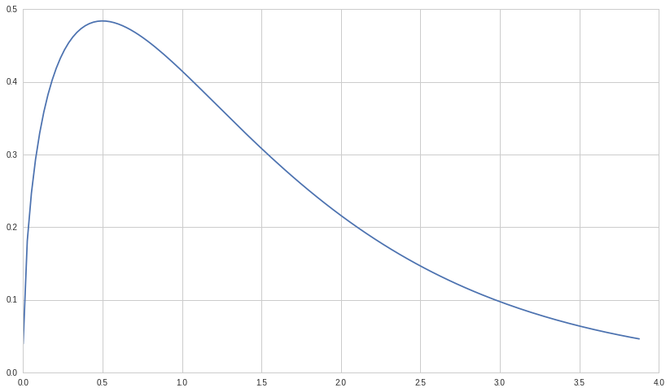
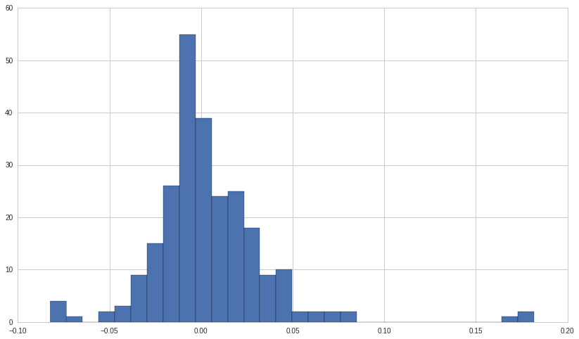
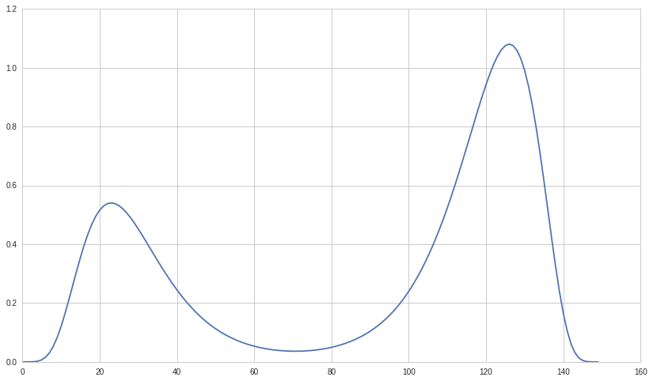
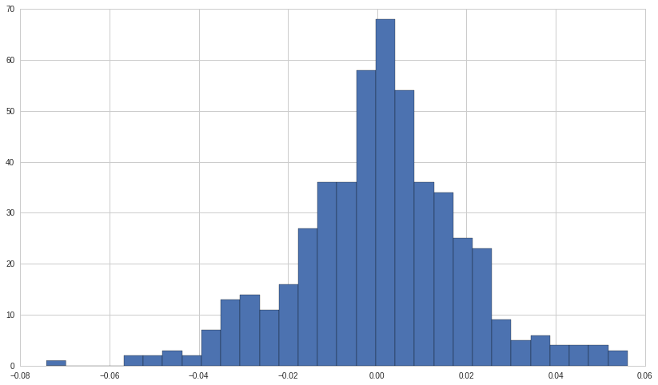
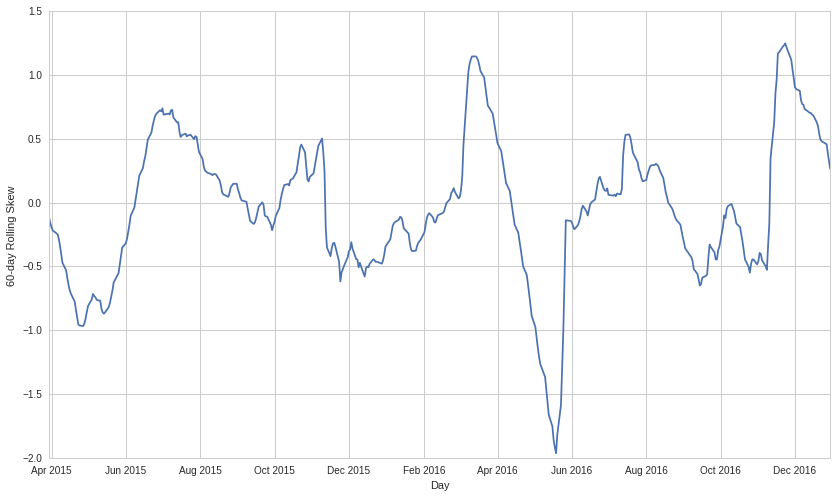

#Exercises: Statistical Moments and Normality Testing - Answer Key

Lecture Link :
--------------

https://www.quantopian.com/lectures/statistical-moments

###IMPORTANT NOTE: This lecture corresponds to the Statistical Moments
and Normality Testing lecture, which is part of the Quantopian lecture
series. This homework expects you to rely heavily on the code presented
in the corresponding lecture. Please copy and paste regularly from that
lecture when starting to work on the problems, as trying to do them from
scratch will likely be too difficult.

Part of the Quantopian Lecture Series:

-  `www.quantopian.com/lectures <https://www.quantopian.com/lectures>`__
-  `github.com/quantopian/research_public <https://github.com/quantopian/research_public>`__

--------------

.. code:: ipython2

    # Useful Libraries
    import matplotlib.pyplot as plt
    import numpy as np
    import pandas as pd
    import scipy.stats as stats
    from statsmodels.stats.stattools import jarque_bera

--------------

#Exercise 1: Testing for Skew

##a. Artificial Example

Use the results from the ``stats.skew`` function to determine the skew
of the artificial distribution named X.

.. code:: ipython2

    xs2 = np.linspace(stats.gamma.ppf(0.01, 0.7, loc=-1), stats.gamma.ppf(0.99, 0.7, loc=-1), 150) + 1
    
    X = stats.gamma.pdf(xs2, 1.5)
    
    #Your code goes here
    
    skew = stats.skew(X)
    
    plt.plot(xs2, X)
    
    print 'Skew:', skew
    if skew > 0:
        print 'The distribution is positively skewed'
    elif skew < 0:
        print 'The distribution is negatively skewed'
    else:
        print 'The distribution is symmetric'

.. parsed-literal::

    Skew: 0.264748310964
    The distribution is positively skewed

##b. Real Example

Use the results from the ``stats.skew`` function to determine the skew
of the returns of NFLX and use it to make a conclusion about the
symmetry of the stock’s returns.

.. code:: ipython2

    start = '2015-01-01'
    end = '2016-01-01'
    pricing = get_pricing('NFLX', fields='price', start_date=start, end_date=end)
    returns = pricing.pct_change()[1:]
    
    #Your code goes here
    
    skew = stats.skew(returns)
    
    plt.hist(returns, 30)
    
    print 'Skew:', skew
    print 'The returns of NFLX have a strong positive skew, meaning their volatility is characterized by frequent small changes in price with interspersed large upticks.'

.. parsed-literal::

    Skew: 1.84134227597
    The returns of NFLX have a strong positive skew, meaning their volatility is characterized by frequent small changes in price with interspersed large upticks.

--------------

#Exercise 2: Testing for Kurtosis

##a. Artificial Example

Use the results from the ``stats.kurtosis`` function to determine the
excess kurtosis of the artificial distribution named Y.

.. code:: ipython2

    xs = np.linspace(-6,6, 300) + 2 
    
    Y = stats.cosine.pdf(xs)
    
    #Your code goes here
    
    plt.plot(xs, Y)
    
    print 'Excess kurtosis of Y:', (stats.kurtosis(Y))
    print 'Because the excess kurtosis is negative, Y is platykurtic. Platykurtic distributions cluster around the mean, so large values in either direction are less likely'

.. parsed-literal::

    Excess kurtosis of Y: -0.634472016416
    Because the excess kurtosis is negative, Y is platykurtic. Platykurtic distributions cluster around the mean, so large values in either direction are less likely

.. image:: notebook_files/notebook_9_1.png

##b. Real Example

Use the results from the ``stats.kurtosis`` function to determine the
kurtosis of the returns of NFLX and use it to make a conclusion about
the volatility of the stock’s price.

.. code:: ipython2

    start = '2015-01-01'
    end = '2016-01-01'
    pricing = get_pricing('NFLX', fields='price', start_date=start, end_date=end)
    returns = pricing.pct_change()[1:]
    
    #Your code goes here
    
    kurt = stats.kurtosis(returns)
    
    plt.hist(returns, 30)
    
    print 'Kurtosis:', kurt
    print 'The historical returns of NFLX are strongly leptokurtic. Because of a leptokurtic distribution`s fatter tails, small changes in prices happen less often and large changes are more common. This makes the stock a riskier investment.'

.. parsed-literal::

    Kurtosis: 9.52008087913
    The historical returns of NFLX are strongly leptokurtic. Because of a leptokurtic distribution`s fatter tails, small changes in prices happen less often and large changes are more common. This makes the stock a riskier investment.

.. image:: notebook_files/notebook_11_1.png

--------------

Exercise 3: Skew and Normality
==============================

##a. Artificial Example II

Use the results from the ``stats.skew`` function to determine the skew
of the artificial distribution named Z.

.. code:: ipython2

    xs2 = np.linspace(stats.lognorm.ppf(0.01, 0.7, loc=-.1), stats.lognorm.ppf(0.99, 0.7, loc=-.1), 150)
    
    lognorm = stats.lognorm.pdf(xs2, 0.4)
    
    Z = lognorm/2 + lognorm[::-1]
    
    #Your code goes here
    
    skew = stats.skew(Z)
    
    print 'Skew:', skew
    if skew > 0:
        print 'The distribution is positively skewed'
    elif skew < 0:
        print 'The distribution is negatively skewed'
    else:
        print 'The distribution is symmetric'

.. parsed-literal::

    Skew: 1.1121491036
    The distribution is positively skewed

b. Jarque-Bera Calibration
--------------------------

Ensure that the ``jarque-bera`` function is calibrated by running it on
many trials of simulated data and ensuring that the sample probability
that the test returns a result under the p-value is equal to the
p-value.

.. code:: ipython2

    N = 1000
    M = 1000
    
    pvalues = np.ndarray((N))
    
    for i in range(N):
        # Draw M samples from a normal distribution 
        X = np.random.normal(0, 1, M);
        _, pvalue, _, _ = jarque_bera(X)
        pvalues[i] = pvalue
    
    num_significant = len(pvalues[pvalues < 0.05])
    
    #Your code goes here
    
    print float(num_significant) / N
    print 'Our answer is around 5%, which is what we would expect for a cutoff of 5% and a correctly-calibrated Jarque-Bera test.'

.. parsed-literal::

    0.048
    Our answer is around 5%, which is what we would expect for a cutoff of 5% and a correctly-calibrated Jarque-Bera test.

c. Jarque-Bera Test
-------------------

Use the ``Jarque-Bera`` function to determine the normality of Z.

.. code:: ipython2

    #Your code goes here
    
    _, pvalue, _, _ = jarque_bera(Z)
    
    print pvalue
    if pvalue > 0.05:
        print 'The returns are likely normal.'
    else:
        print 'The returns are likely not normal.'

.. parsed-literal::

    1.67689917417e-07
    The returns are likely not normal.

d. Skewness and Normality
-------------------------

Plot Z and observe that skewness is not informative unless the
underlying distribution is somewhat normal.

.. code:: ipython2

    #Your code goes here
    
    plt.plot(Z)
    
    print 'The positive skew found in part a would have led us to believe values are concentrated below the mean and a tail extends to the right, however this is not the case. Because Z is bimodal, we can make no conclusions based on the skewness value alone. In order for skewness to be useful, the underlying distribution must be somewhat normal'

.. parsed-literal::

    The positive skew found in part a would have led us to believe values are concentrated below the mean and a tail extends to the right, however this is not the case. Because Z is bimodal, we can make no conclusions based on the skewness value alone. In order for skewness to be useful, the underlying distribution must be somewhat normal

--------------

Exercise 4: Out of Sample Test
==============================

##a. Testing for Normality

Plot a histogram of the historical returns of AMC to ensure it is
unimodal and vaguely normal before testing it for skewness in part b.

.. code:: ipython2

    start = '2014-01-01'
    end = '2016-01-01'
    pricing = get_pricing('AMC', fields='price', start_date=start, end_date=end)
    returns = pricing.pct_change()[1:]
    
    #Your code goes here
    
    print 'The returns of AMC from 2014 through 2016 are unimodal and vaguely normal, so a skewness measure would be relevant.'
    
    plt.hist(returns, 30);

.. parsed-literal::

    The returns of AMC from 2014 through 2016 are unimodal and vaguely normal, so a skewness measure would be relevant.

##b. Test for Skew

Find the skew of the historical returns of AMC between 2014 to 2016.

.. code:: ipython2

    start = '2014-01-01'
    end = '2016-01-01'
    pricing = get_pricing('AMC', fields='price', start_date=start, end_date=end)
    returns = pricing.pct_change()[1:]
    
    #Your code goes here
    
    print 'Skew of AMC:', stats.skew(returns)

.. parsed-literal::

    Skew of AMC: -0.128642043604

c. Out of Sample Test
---------------------

Find the skew of the historical retunrs of AMC from the first half of
2016 to determine if the skew from part b holds outside of the original
sample.

.. code:: ipython2

    start = '2016-01-01'
    end = '2016-07-01'
    out_pricing = get_pricing('AMC', fields='price', start_date=start, end_date=end)
    out_returns = out_pricing.pct_change()[1:]
    
    #Your code goes here
    
    print 'Skew of AMC:', stats.skew(out_returns)
    print 'The negative skew of AMC between 2014 and 2016 did not hold outside of the orignal sample, meaning the skew of AMC might be volatile and not reliable enough for predictions about future behavior.'

.. parsed-literal::

    Skew of AMC: 0.971754222772
    The negative skew of AMC between 2014 and 2016 did not hold outside of the orignal sample, meaning the skew of AMC might be volatile and not reliable enough for predictions about future behavior.

d. Rolling Skew
---------------

Plot the rolling skew of AMC using the ``pd.rolling_skew`` function.

.. code:: ipython2

    AMC = get_pricing('AMC', fields='price', start_date='2015-01-01', end_date='2017-01-01')
    
    #Your code goes here
    rolling_skew = AMC.rolling(window=60,center=False).skew()
    plt.plot(rolling_skew)
    plt.xlabel('Day')
    plt.ylabel('60-day Rolling Skew')
    print "This confirms our result from part c, that the skew is too volatile to use it to make predictions outside of the sample."

.. parsed-literal::

    This confirms our result from part c, that the skew is too volatile to use it to make predictions outside of the sample.

--------------

Congratulations on completing the Statistical Moments and Normality
Testing exercises!

As you learn more about writing trading algorithms and the Quantopian
platform, be sure to check out the daily `Quantopian
Contest <https://www.quantopian.com/contest>`__, in which you can
compete for a cash prize every day.

Start by going through the `Writing a Contest
Algorithm <https://www.quantopian.com/tutorials/contest>`__ tutorial.

*This presentation is for informational purposes only and does not
constitute an offer to sell, a solicitation to buy, or a recommendation
for any security; nor does it constitute an offer to provide investment
advisory or other services by Quantopian, Inc. (“Quantopian”). Nothing
contained herein constitutes investment advice or offers any opinion
with respect to the suitability of any security, and any views expressed
herein should not be taken as advice to buy, sell, or hold any security
or as an endorsement of any security or company. In preparing the
information contained herein, Quantopian, Inc. has not taken into
account the investment needs, objectives, and financial circumstances of
any particular investor. Any views expressed and data illustrated herein
were prepared based upon information, believed to be reliable, available
to Quantopian, Inc. at the time of publication. Quantopian makes no
guarantees as to their accuracy or completeness. All information is
subject to change and may quickly become unreliable for various reasons,
including changes in market conditions or economic circumstances.*
