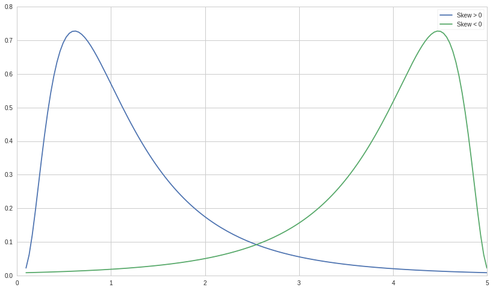
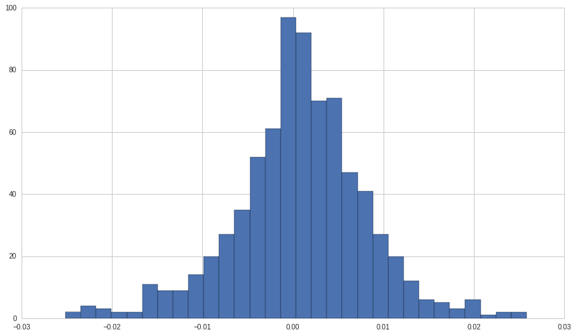
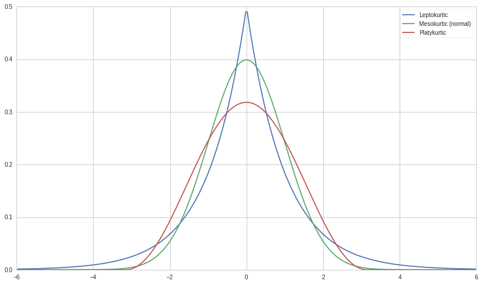

Statistical Moments - Skewness and Kurtosis
===========================================

By Evgenia “Jenny” Nitishinskaya, Maxwell Margenot, and Delaney
Granizo-Mackenzie.

Part of the Quantopian Lecture Series:

-  `www.quantopian.com/lectures <https://www.quantopian.com/lectures>`__
-  `github.com/quantopian/research_public <https://github.com/quantopian/research_public>`__

Notebook released under the Creative Commons Attribution 4.0 License.

.. code:: ipython2

    import matplotlib.pyplot as plt
    import numpy as np
    import scipy.stats as stats

Sometimes mean and variance are not enough to describe a distribution.
When we calculate variance, we square the deviations around the mean. In
the case of large deviations, we do not know whether they are likely to
be positive or negative. This is where the skewness and symmetry of a
distribution come in. A distribution is symmetric if the parts on either
side of the mean are mirror images of each other. For example, the
normal distribution is symmetric. The normal distribution with mean
:math:`\mu` and standard deviation :math:`\sigma` is defined as

.. math::  f(x) = \frac{1}{\sigma \sqrt{2 \pi}} e^{-\frac{(x - \mu)^2}{2 \sigma^2}} 

We can plot it to confirm that it is symmetric:

.. code:: ipython2

    # Plot a normal distribution with mean = 0 and standard deviation = 2
    xs = np.linspace(-6,6, 300)
    normal = stats.norm.pdf(xs)
    plt.plot(xs, normal);

.. image:: notebook_files/notebook_3_0.png

A distribution which is not symmetric is called skewed. For instance, a
distribution can have many small positive and a few large negative
values (negatively skewed) or vice versa (positively skewed), and still
have a mean of 0. A symmetric distribution has skewness 0. Positively
skewed unimodal (one mode) distributions have the property that mean >
median > mode. Negatively skewed unimodal distributions are the reverse,
with mean < median < mode. All three are equal for a symmetric unimodal
distribution.

The explicit formula for skewness is:

.. math::  S_K = \frac{n}{(n-1)(n-2)} \frac{\sum_{i=1}^n (X_i - \mu)^3}{\sigma^3} 

Where :math:`n` is the number of observations, :math:`\mu` is the
arithmetic mean, and :math:`\sigma` is the standard deviation. The sign
of this quantity describes the direction of the skew as described above.
We can plot a positively skewed and a negatively skewed distribution to
see what they look like. For unimodal distributions, a negative skew
typically indicates that the tail is fatter on the left, while a
positive skew indicates that the tail is fatter on the right.

.. code:: ipython2

    # Generate x-values for which we will plot the distribution
    xs2 = np.linspace(stats.lognorm.ppf(0.01, .7, loc=-.1), stats.lognorm.ppf(0.99, .7, loc=-.1), 150)
    
    # Negatively skewed distribution
    lognormal = stats.lognorm.pdf(xs2, .7)
    plt.plot(xs2, lognormal, label='Skew > 0')
    
    # Positively skewed distribution
    plt.plot(xs2, lognormal[::-1], label='Skew < 0')
    plt.legend();

Although skew is less obvious when graphing discrete data sets, we can
still compute it. For example, below are the skew, mean, and median for
S&P 500 returns 2012-2014. Note that the skew is negative, and so the
mean is less than the median.

.. code:: ipython2

    start = '2012-01-01'
    end = '2015-01-01'
    pricing = get_pricing('SPY', fields='price', start_date=start, end_date=end)
    returns = pricing.pct_change()[1:]
    
    print 'Skew:', stats.skew(returns)
    print 'Mean:', np.mean(returns)
    print 'Median:', np.median(returns)
    
    plt.hist(returns, 30);

.. parsed-literal::

    Skew: -0.208327061229
    Mean: 0.000732549262327
    Median: 0.000805529770079

Kurtosis
========

Kurtosis attempts to measure the shape of the deviation from the mean.
Generally, it describes how peaked a distribution is compared the the
normal distribution, called mesokurtic. All normal distributions,
regardless of mean and variance, have a kurtosis of 3. A leptokurtic
distribution (kurtosis > 3) is highly peaked and has fat tails, while a
platykurtic distribution (kurtosis < 3) is broad. Sometimes, however,
kurtosis in excess of the normal distribution (kurtosis - 3) is used,
and this is the default in ``scipy``. A leptokurtic distribution has
more frequent large jumps away from the mean than a normal distribution
does while a platykurtic distribution has fewer.

.. code:: ipython2

    # Plot some example distributions
    plt.plot(xs,stats.laplace.pdf(xs), label='Leptokurtic')
    print 'Excess kurtosis of leptokurtic distribution:', (stats.laplace.stats(moments='k'))
    plt.plot(xs, normal, label='Mesokurtic (normal)')
    print 'Excess kurtosis of mesokurtic distribution:', (stats.norm.stats(moments='k'))
    plt.plot(xs,stats.cosine.pdf(xs), label='Platykurtic')
    print 'Excess kurtosis of platykurtic distribution:', (stats.cosine.stats(moments='k'))
    plt.legend();

.. parsed-literal::

    Excess kurtosis of leptokurtic distribution: 3.0
    Excess kurtosis of mesokurtic distribution: 0.0
    Excess kurtosis of platykurtic distribution: -0.593762875598

The formula for kurtosis is

.. math::  K = \left ( \frac{n(n+1)}{(n-1)(n-2)(n-3)} \frac{\sum_{i=1}^n (X_i - \mu)^4}{\sigma^4} \right ) 

while excess kurtosis is given by

.. math::  K_E = \left ( \frac{n(n+1)}{(n-1)(n-2)(n-3)} \frac{\sum_{i=1}^n (X_i - \mu)^4}{\sigma^4} \right ) - \frac{3(n-1)^2}{(n-2)(n-3)} 

For a large number of samples, the excess kurtosis becomes approximately

.. math::  K_E \approx \frac{1}{n} \frac{\sum_{i=1}^n (X_i - \mu)^4}{\sigma^4} - 3 

Since above we were considering perfect, continuous distributions, this
was the form that kurtosis took. However, for a set of samples drawn for
the normal distribution, we would use the first definition, and (excess)
kurtosis would only be approximately 0.

We can use ``scipy`` to find the excess kurtosis of the S&P 500 returns
from before.

.. code:: ipython2

    print "Excess kurtosis of returns: ", stats.kurtosis(returns)

.. parsed-literal::

    Excess kurtosis of returns:  1.21431979997

The histogram of the returns shows significant observations beyond 3
standard deviations away from the mean, multiple large spikes, so we
shouldn’t be surprised that the kurtosis is indicating a leptokurtic
distribution.

Other standardized moments
==========================

It’s no coincidence that the variance, skewness, and kurtosis take
similar forms. They are the first and most important standardized
moments, of which the :math:`k`\ th has the form

.. math::  \frac{E[(X - E[X])^k]}{\sigma^k} 

The first standardized moment is always 0
:math:`(E[X - E[X]] = E[X] - E[E[X]] = 0)`, so we only care about the
second through fourth. All of the standardized moments are dimensionless
numbers which describe the distribution, and in particular can be used
to quantify how close to normal (having standardized moments
:math:`0, \sigma, 0, \sigma^2`) a distribution is.

Normality Testing Using Jarque-Bera
===================================

The Jarque-Bera test is a common statistical test that compares whether
sample data has skewness and kurtosis similar to a normal distribution.
We can run it here on the S&P 500 returns to find the p-value for them
coming from a normal distribution.

The Jarque Bera test’s null hypothesis is that the data came from a
normal distribution. Because of this it can err on the side of not
catching a non-normal process if you have a low p-value. To be safe it
can be good to increase your cutoff when using the test.

Remember to treat p-values as binary and not try to read into them or
compare them. We’ll use a cutoff of 0.05 for our p-value.

Test Calibration
----------------

Remember that each test is written a little differently across different
programming languages. You might not know whether it’s the null or
alternative hypothesis that the tested data comes from a normal
distribution. It is recommended that you use the ``?`` notation plus
online searching to find documentation on the test; plus it is often a
good idea to calibrate a test by checking it on simulated data and
making sure it gives the right answer. Let’s do that now.

.. code:: ipython2

    from statsmodels.stats.stattools import jarque_bera
    
    N = 1000
    M = 1000
    
    pvalues = np.ndarray((N))
    
    for i in range(N):
        # Draw M samples from a normal distribution 
        X = np.random.normal(0, 1, M);
        _, pvalue, _, _ = jarque_bera(X)
        pvalues[i] = pvalue
        
    # count number of pvalues below our default 0.05 cutoff
    num_significant = len(pvalues[pvalues < 0.05])
    
    print float(num_significant) / N

.. parsed-literal::

    0.054

Great, if properly calibrated we should expect to be wrong :math:`5\%`
of the time at a 0.05 significance level, and this is pretty close. This
means that the test is working as we expect.

.. code:: ipython2

    _, pvalue, _, _ = jarque_bera(returns)
    
    if pvalue > 0.05:
        print 'The returns are likely normal.'
    else:
        print 'The returns are likely not normal.'

.. parsed-literal::

    The returns are likely not normal.

This tells us that the S&P 500 returns likely do not follow a normal
distribution.

*This presentation is for informational purposes only and does not
constitute an offer to sell, a solicitation to buy, or a recommendation
for any security; nor does it constitute an offer to provide investment
advisory or other services by Quantopian, Inc. (“Quantopian”). Nothing
contained herein constitutes investment advice or offers any opinion
with respect to the suitability of any security, and any views expressed
herein should not be taken as advice to buy, sell, or hold any security
or as an endorsement of any security or company. In preparing the
information contained herein, Quantopian, Inc. has not taken into
account the investment needs, objectives, and financial circumstances of
any particular investor. Any views expressed and data illustrated herein
were prepared based upon information, believed to be reliable, available
to Quantopian, Inc. at the time of publication. Quantopian makes no
guarantees as to their accuracy or completeness. All information is
subject to change and may quickly become unreliable for various reasons,
including changes in market conditions or economic circumstances.*
