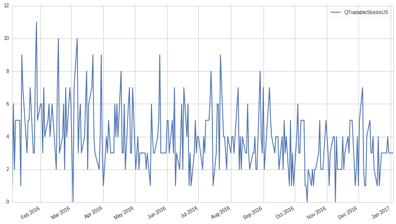
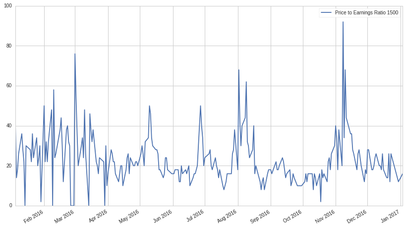

#Exercises: Universe Selection - Answer Key

Lecture Link
------------

This exercise notebook refers to this lecture. Please use the lecture
for explanations and sample code.

https://www.quantopian.com/lectures#Universe-Selection

Part of the Quantopian Lecture Series:

-  `www.quantopian.com/lectures <https://www.quantopian.com/lectures>`__
-  `github.com/quantopian/research_public <https://github.com/quantopian/research_public>`__

.. code:: ipython2

    import numpy as np
    import pandas as pd
    import matplotlib.pyplot as plt
    from quantopian.pipeline.classifiers.morningstar import Sector
    from quantopian.pipeline import Pipeline
    from quantopian.pipeline.data.builtin import USEquityPricing
    from quantopian.pipeline.filters import QTradableStocksUS, AtLeastN
    from quantopian.research import run_pipeline
    from quantopian.pipeline.data import morningstar
    from quantopian.pipeline.factors import CustomFactor, AverageDollarVolume

Helper Functions
----------------

.. code:: ipython2

    def calculate_daily_turnover(unstacked):
        return (unstacked
                .diff()        # Get True/False showing where values changed from previous day.
                .iloc[1:]      # Drop first row, which is meaningless after diff().
                .astype(bool)  # diff() coerces from bool -> object :(.  Undo that.
                .groupby(axis=1, level=0)  
                .sum())  

#Exercise 1: Examining the QTradableStocksUS Universe

##a. Initializing the Universe

Set the QTradableStocksUS as your universe by using the
``QTradableStocksUS()`` function.

.. code:: ipython2

    # Your code goes here
    
    universe = QTradableStocksUS()

b. Finding Asset Composition
----------------------------

Use the pipeline API with the QTradableStocksUS as a screen to find and
print the list of equities included in the QTradableStocksUS on
2016-07-01.

.. code:: ipython2

    # Your code goes here
    
    pipe = Pipeline(
        columns={
        },
        screen=universe
    )
    
    result = run_pipeline(pipe, '2016-07-01', '2016-07-01')
    
    pd.DataFrame(result.index.levels[1])

.. raw:: html

    

    <table border="1" class="dataframe">
      <thead>
        <tr style="text-align: right;">
          <th></th>
          <th>0</th>
        </tr>
      </thead>
      <tbody>
        <tr>
          <th>0</th>
          <td>Equity(2 [ARNC])</td>
        </tr>
        <tr>
          <th>1</th>
          <td>Equity(24 [AAPL])</td>
        </tr>
        <tr>
          <th>2</th>
          <td>Equity(31 [ABAX])</td>
        </tr>
        <tr>
          <th>3</th>
          <td>Equity(39 [DDC])</td>
        </tr>
        <tr>
          <th>4</th>
          <td>Equity(41 [ARCB])</td>
        </tr>
        <tr>
          <th>5</th>
          <td>Equity(52 [ABM])</td>
        </tr>
        <tr>
          <th>6</th>
          <td>Equity(53 [ABMD])</td>
        </tr>
        <tr>
          <th>7</th>
          <td>Equity(62 [ABT])</td>
        </tr>
        <tr>
          <th>8</th>
          <td>Equity(64 [ABX])</td>
        </tr>
        <tr>
          <th>9</th>
          <td>Equity(67 [ADSK])</td>
        </tr>
        <tr>
          <th>10</th>
          <td>Equity(76 [TAP])</td>
        </tr>
        <tr>
          <th>11</th>
          <td>Equity(84 [ACET])</td>
        </tr>
        <tr>
          <th>12</th>
          <td>Equity(110 [ACXM])</td>
        </tr>
        <tr>
          <th>13</th>
          <td>Equity(114 [ADBE])</td>
        </tr>
        <tr>
          <th>14</th>
          <td>Equity(122 [ADI])</td>
        </tr>
        <tr>
          <th>15</th>
          <td>Equity(128 [ADM])</td>
        </tr>
        <tr>
          <th>16</th>
          <td>Equity(154 [AEM])</td>
        </tr>
        <tr>
          <th>17</th>
          <td>Equity(161 [AEP])</td>
        </tr>
        <tr>
          <th>18</th>
          <td>Equity(166 [AES])</td>
        </tr>
        <tr>
          <th>19</th>
          <td>Equity(168 [AET])</td>
        </tr>
        <tr>
          <th>20</th>
          <td>Equity(185 [AFL])</td>
        </tr>
        <tr>
          <th>21</th>
          <td>Equity(197 [AGCO])</td>
        </tr>
        <tr>
          <th>22</th>
          <td>Equity(216 [HES])</td>
        </tr>
        <tr>
          <th>23</th>
          <td>Equity(239 [AIG])</td>
        </tr>
        <tr>
          <th>24</th>
          <td>Equity(247 [AIN])</td>
        </tr>
        <tr>
          <th>25</th>
          <td>Equity(253 [AIR])</td>
        </tr>
        <tr>
          <th>26</th>
          <td>Equity(266 [AJG])</td>
        </tr>
        <tr>
          <th>27</th>
          <td>Equity(270 [AKRX])</td>
        </tr>
        <tr>
          <th>28</th>
          <td>Equity(289 [MATX])</td>
        </tr>
        <tr>
          <th>29</th>
          <td>Equity(300 [ALK])</td>
        </tr>
        <tr>
          <th>...</th>
          <td>...</td>
        </tr>
        <tr>
          <th>2057</th>
          <td>Equity(49203 [GCI])</td>
        </tr>
        <tr>
          <th>2058</th>
          <td>Equity(49204 [CABO])</td>
        </tr>
        <tr>
          <th>2059</th>
          <td>Equity(49207 [BLD])</td>
        </tr>
        <tr>
          <th>2060</th>
          <td>Equity(49208 [BW])</td>
        </tr>
        <tr>
          <th>2061</th>
          <td>Equity(49210 [CC])</td>
        </tr>
        <tr>
          <th>2062</th>
          <td>Equity(49213 [ENR])</td>
        </tr>
        <tr>
          <th>2063</th>
          <td>Equity(49222 [TDOC])</td>
        </tr>
        <tr>
          <th>2064</th>
          <td>Equity(49229 [KHC])</td>
        </tr>
        <tr>
          <th>2065</th>
          <td>Equity(49238 [SRG])</td>
        </tr>
        <tr>
          <th>2066</th>
          <td>Equity(49242 [PYPL])</td>
        </tr>
        <tr>
          <th>2067</th>
          <td>Equity(49271 [OLLI])</td>
        </tr>
        <tr>
          <th>2068</th>
          <td>Equity(49275 [RPD])</td>
        </tr>
        <tr>
          <th>2069</th>
          <td>Equity(49279 [BUFF])</td>
        </tr>
        <tr>
          <th>2070</th>
          <td>Equity(49288 [LITE])</td>
        </tr>
        <tr>
          <th>2071</th>
          <td>Equity(49298 [NK])</td>
        </tr>
        <tr>
          <th>2072</th>
          <td>Equity(49312 [GLBL])</td>
        </tr>
        <tr>
          <th>2073</th>
          <td>Equity(49315 [Z])</td>
        </tr>
        <tr>
          <th>2074</th>
          <td>Equity(49318 [BETR])</td>
        </tr>
        <tr>
          <th>2075</th>
          <td>Equity(49321 [RUN])</td>
        </tr>
        <tr>
          <th>2076</th>
          <td>Equity(49322 [PLNT])</td>
        </tr>
        <tr>
          <th>2077</th>
          <td>Equity(49325 [CCP])</td>
        </tr>
        <tr>
          <th>2078</th>
          <td>Equity(49335 [GBT])</td>
        </tr>
        <tr>
          <th>2079</th>
          <td>Equity(49413 [PEN])</td>
        </tr>
        <tr>
          <th>2080</th>
          <td>Equity(49434 [FLOW])</td>
        </tr>
        <tr>
          <th>2081</th>
          <td>Equity(49448 [PJT])</td>
        </tr>
        <tr>
          <th>2082</th>
          <td>Equity(49455 [PFGC])</td>
        </tr>
        <tr>
          <th>2083</th>
          <td>Equity(49456 [SGRY])</td>
        </tr>
        <tr>
          <th>2084</th>
          <td>Equity(49458 [MSG])</td>
        </tr>
        <tr>
          <th>2085</th>
          <td>Equity(49460 [NVCR])</td>
        </tr>
        <tr>
          <th>2086</th>
          <td>Equity(49464 [PSTG])</td>
        </tr>
      </tbody>
    </table>
    
2087 rows × 1 columns

    

c. Sector Exposure
------------------

Use the pipeline API with the QTradableStocksUS as a screen to find and
print the sector composition of the universe on 2016-07-01.

.. code:: ipython2

    SECTOR_CODE_NAMES = {
        Sector.BASIC_MATERIALS: 'Basic Materials',
        Sector.CONSUMER_CYCLICAL: 'Consumer Cyclical',
        Sector.FINANCIAL_SERVICES: 'Financial Services',
        Sector.REAL_ESTATE: 'Real Estate',
        Sector.CONSUMER_DEFENSIVE: 'Consumer Defensive',
        Sector.HEALTHCARE: 'Healthcare',
        Sector.UTILITIES: 'Utilities',
        Sector.COMMUNICATION_SERVICES: 'Communication Services',
        Sector.ENERGY: 'Energy',
        Sector.INDUSTRIALS: 'Industrials',
        Sector.TECHNOLOGY: 'Technology',
        -1 : 'Misc'
    }
    
    # Your code goes here
    
    pipe = Pipeline(
        columns={'Sector': Sector()
        },
        screen=universe
    )
    
    result = run_pipeline(pipe, '2016-07-01', '2016-07-01')
    
    sectors = result.groupby('Sector').size()
    sectors.index = sectors.index.map(lambda code: SECTOR_CODE_NAMES[code])
    sectors

.. parsed-literal::

    Misc                        1
    Basic Materials           132
    Consumer Cyclical         308
    Financial Services        270
    Real Estate               170
    Consumer Defensive        100
    Healthcare                266
    Utilities                  63
    Communication Services     40
    Energy                    121
    Industrials               309
    Technology                307
    dtype: int64

d. Turnover Rate
----------------

Use the pipeline API with the QTradableStocksUS as a screen and the
``calculate_daily_turnover`` helper function to find and plot the
turnover of the universe during 2016.

.. code:: ipython2

    # Your code goes here
    
    pipe = Pipeline(
        columns={'QTradableStocksUS' : universe
        },
        screen=universe
    )
    
    result = run_pipeline(pipe, '2016-01-01', '2017-01-01')
    
    result = result.unstack().fillna(False)
    
    turnover = calculate_daily_turnover(result)
    
    turnover.plot(figsize=(14, 8));
    
    turnover.describe()

.. raw:: html

    

    <table border="1" class="dataframe">
      <thead>
        <tr style="text-align: right;">
          <th></th>
          <th>QTradableStocksUS</th>
        </tr>
      </thead>
      <tbody>
        <tr>
          <th>count</th>
          <td>252.000000</td>
        </tr>
        <tr>
          <th>mean</th>
          <td>3.896825</td>
        </tr>
        <tr>
          <th>std</th>
          <td>2.042689</td>
        </tr>
        <tr>
          <th>min</th>
          <td>0.000000</td>
        </tr>
        <tr>
          <th>25%</th>
          <td>3.000000</td>
        </tr>
        <tr>
          <th>50%</th>
          <td>4.000000</td>
        </tr>
        <tr>
          <th>75%</th>
          <td>5.000000</td>
        </tr>
        <tr>
          <th>max</th>
          <td>11.000000</td>
        </tr>
      </tbody>
    </table>
    

Exercise 2: Examining Tradability
=================================

a. NetIncome 1500
-----------------

Create a universe consisting of the top 1500 equities by net income then
find and print the list of equities included in the universe on
2016-07-01.

.. code:: ipython2

    # Your code goes here
    
    universe = morningstar.income_statement.net_income.latest.top(1500)
    
    pipe = Pipeline(
        columns={
        },
        screen=universe
    )
    
    result = run_pipeline(pipe, '2016-07-01', '2016-07-01')
    
    pd.DataFrame(result.index.levels[1])

.. raw:: html

    

    <table border="1" class="dataframe">
      <thead>
        <tr style="text-align: right;">
          <th></th>
          <th>0</th>
        </tr>
      </thead>
      <tbody>
        <tr>
          <th>0</th>
          <td>Equity(24 [AAPL])</td>
        </tr>
        <tr>
          <th>1</th>
          <td>Equity(62 [ABT])</td>
        </tr>
        <tr>
          <th>2</th>
          <td>Equity(66 [AB])</td>
        </tr>
        <tr>
          <th>3</th>
          <td>Equity(76 [TAP])</td>
        </tr>
        <tr>
          <th>4</th>
          <td>Equity(114 [ADBE])</td>
        </tr>
        <tr>
          <th>5</th>
          <td>Equity(122 [ADI])</td>
        </tr>
        <tr>
          <th>6</th>
          <td>Equity(128 [ADM])</td>
        </tr>
        <tr>
          <th>7</th>
          <td>Equity(154 [AEM])</td>
        </tr>
        <tr>
          <th>8</th>
          <td>Equity(161 [AEP])</td>
        </tr>
        <tr>
          <th>9</th>
          <td>Equity(166 [AES])</td>
        </tr>
        <tr>
          <th>10</th>
          <td>Equity(168 [AET])</td>
        </tr>
        <tr>
          <th>11</th>
          <td>Equity(185 [AFL])</td>
        </tr>
        <tr>
          <th>12</th>
          <td>Equity(266 [AJG])</td>
        </tr>
        <tr>
          <th>13</th>
          <td>Equity(270 [AKRX])</td>
        </tr>
        <tr>
          <th>14</th>
          <td>Equity(300 [ALK])</td>
        </tr>
        <tr>
          <th>15</th>
          <td>Equity(332 [ALX])</td>
        </tr>
        <tr>
          <th>16</th>
          <td>Equity(337 [AMAT])</td>
        </tr>
        <tr>
          <th>17</th>
          <td>Equity(353 [AME])</td>
        </tr>
        <tr>
          <th>18</th>
          <td>Equity(357 [TWX])</td>
        </tr>
        <tr>
          <th>19</th>
          <td>Equity(368 [AMGN])</td>
        </tr>
        <tr>
          <th>20</th>
          <td>Equity(410 [AN])</td>
        </tr>
        <tr>
          <th>21</th>
          <td>Equity(412 [ANAT])</td>
        </tr>
        <tr>
          <th>22</th>
          <td>Equity(438 [AON])</td>
        </tr>
        <tr>
          <th>23</th>
          <td>Equity(465 [APH])</td>
        </tr>
        <tr>
          <th>24</th>
          <td>Equity(523 [AAN])</td>
        </tr>
        <tr>
          <th>25</th>
          <td>Equity(538 [ARW])</td>
        </tr>
        <tr>
          <th>26</th>
          <td>Equity(547 [ASB])</td>
        </tr>
        <tr>
          <th>27</th>
          <td>Equity(559 [ASH])</td>
        </tr>
        <tr>
          <th>28</th>
          <td>Equity(595 [GAS])</td>
        </tr>
        <tr>
          <th>29</th>
          <td>Equity(600 [OA])</td>
        </tr>
        <tr>
          <th>...</th>
          <td>...</td>
        </tr>
        <tr>
          <th>1470</th>
          <td>Equity(49723 [PSA_PRB])</td>
        </tr>
        <tr>
          <th>1471</th>
          <td>Equity(49734 [BAC_PRC])</td>
        </tr>
        <tr>
          <th>1472</th>
          <td>Equity(49746 [C_PRS])</td>
        </tr>
        <tr>
          <th>1473</th>
          <td>Equity(49750 [FRC_PRG])</td>
        </tr>
        <tr>
          <th>1474</th>
          <td>Equity(49758 [OSB])</td>
        </tr>
        <tr>
          <th>1475</th>
          <td>Equity(49781 [GS_PRN])</td>
        </tr>
        <tr>
          <th>1476</th>
          <td>Equity(49786 [SCHW_PRD])</td>
        </tr>
        <tr>
          <th>1477</th>
          <td>Equity(49805 [BBT_PRH])</td>
        </tr>
        <tr>
          <th>1478</th>
          <td>Equity(49820 [AFSI_PRE])</td>
        </tr>
        <tr>
          <th>1479</th>
          <td>Equity(49831 [HBAN_O])</td>
        </tr>
        <tr>
          <th>1480</th>
          <td>Equity(49870 [STT_PRG])</td>
        </tr>
        <tr>
          <th>1481</th>
          <td>Equity(49876 [BATS])</td>
        </tr>
        <tr>
          <th>1482</th>
          <td>Equity(49877 [PNK])</td>
        </tr>
        <tr>
          <th>1483</th>
          <td>Equity(49878 [BATR_A])</td>
        </tr>
        <tr>
          <th>1484</th>
          <td>Equity(49879 [BATR_K])</td>
        </tr>
        <tr>
          <th>1485</th>
          <td>Equity(49880 [LSXM_B])</td>
        </tr>
        <tr>
          <th>1486</th>
          <td>Equity(49881 [LSXM_A])</td>
        </tr>
        <tr>
          <th>1487</th>
          <td>Equity(49883 [LSXM_K])</td>
        </tr>
        <tr>
          <th>1488</th>
          <td>Equity(49885 [FWON_A])</td>
        </tr>
        <tr>
          <th>1489</th>
          <td>Equity(49908 [RRR])</td>
        </tr>
        <tr>
          <th>1490</th>
          <td>Equity(49909 [BAC_PRA])</td>
        </tr>
        <tr>
          <th>1491</th>
          <td>Equity(49941 [PRE_PRG])</td>
        </tr>
        <tr>
          <th>1492</th>
          <td>Equity(49942 [PRE_PRI])</td>
        </tr>
        <tr>
          <th>1493</th>
          <td>Equity(49943 [PRE_PRH])</td>
        </tr>
        <tr>
          <th>1494</th>
          <td>Equity(49976 [DFT_PRC])</td>
        </tr>
        <tr>
          <th>1495</th>
          <td>Equity(49977 [PSA_PRC])</td>
        </tr>
        <tr>
          <th>1496</th>
          <td>Equity(49987 [IBKC_O])</td>
        </tr>
        <tr>
          <th>1497</th>
          <td>Equity(49998 [LHO_PRJ])</td>
        </tr>
        <tr>
          <th>1498</th>
          <td>Equity(50059 [VR_PRA])</td>
        </tr>
        <tr>
          <th>1499</th>
          <td>Equity(50061 [WFC_PRX])</td>
        </tr>
      </tbody>
    </table>
    
1500 rows × 1 columns

    

b. Measuring Tradability
------------------------

Find the average 200 day average dollar volume of the NetIncome 1500
universe using the ``AverageDollarVolume`` built in factor and compare
to that of the QTradableStocksUS.

.. code:: ipython2

    # Your code goes here
    
    pipe = Pipeline(
        columns={'Average Dollar Volume' : AverageDollarVolume(window_length = 200)
        },
        screen=universe
    )
    
    result = run_pipeline(pipe, '2016-07-01', '2016-07-01')
    
    print "NetIncome 1500 ADV:", np.mean(result['Average Dollar Volume'])
    
    pipe = Pipeline(
        columns={'Average Dollar Volume' : AverageDollarVolume(window_length = 30)
        },
        screen=QTradableStocksUS()
    )
    
    result = run_pipeline(pipe, '2016-07-01', '2016-07-01')
    
    print "QTradableStocksUS ADV:", np.mean(result['Average Dollar Volume'])

.. parsed-literal::

    NetIncome 1500 ADV: 74816585.5336
    QTradableStocksUS ADV: 61220949.8328

Using average dollar volume as a stand-in liquidity metric, the
QTradableStocksUS is more liquid than the NetIncome 1500.

We used ADV as a liquidity metric here as it is an important indicator
and its calculation is simple. However, average dollar volume is not a
perfect measurement of liquidity as liquidity is determined by several
factors and volume is only one of those. For more information on
liquidity and its effects on algorithm performance, refer to the
`lecture on Volume, Slippage, and
Liquidity <https://www.quantopian.com/research/notebooks/Cloned%20from%20%22Quantopian%20Lecture%20Series%3A%20Introduction%20to%20Volume%2C%20Slippage%2C%20and%20Liquidity%22.ipynb>`__

Exercise 3: Sector Balance
==========================

a. Dividend 1500
----------------

Create a universe consisting of the top 1500 equities by dividend yield
then find and print the list of equities included in the this universe
on 2016-07-01.

.. code:: ipython2

    # Your code goes here
    
    universe = morningstar.income_statement.net_income.latest.top(1500)
    
    pipe = Pipeline(
        columns={
        },
        screen=universe
    )
    
    result = run_pipeline(pipe, '2016-07-01', '2016-07-01')
    
    pd.DataFrame(result.index.levels[1])

.. raw:: html

    

    <table border="1" class="dataframe">
      <thead>
        <tr style="text-align: right;">
          <th></th>
          <th>0</th>
        </tr>
      </thead>
      <tbody>
        <tr>
          <th>0</th>
          <td>Equity(24 [AAPL])</td>
        </tr>
        <tr>
          <th>1</th>
          <td>Equity(62 [ABT])</td>
        </tr>
        <tr>
          <th>2</th>
          <td>Equity(66 [AB])</td>
        </tr>
        <tr>
          <th>3</th>
          <td>Equity(76 [TAP])</td>
        </tr>
        <tr>
          <th>4</th>
          <td>Equity(114 [ADBE])</td>
        </tr>
        <tr>
          <th>5</th>
          <td>Equity(122 [ADI])</td>
        </tr>
        <tr>
          <th>6</th>
          <td>Equity(128 [ADM])</td>
        </tr>
        <tr>
          <th>7</th>
          <td>Equity(154 [AEM])</td>
        </tr>
        <tr>
          <th>8</th>
          <td>Equity(161 [AEP])</td>
        </tr>
        <tr>
          <th>9</th>
          <td>Equity(166 [AES])</td>
        </tr>
        <tr>
          <th>10</th>
          <td>Equity(168 [AET])</td>
        </tr>
        <tr>
          <th>11</th>
          <td>Equity(185 [AFL])</td>
        </tr>
        <tr>
          <th>12</th>
          <td>Equity(266 [AJG])</td>
        </tr>
        <tr>
          <th>13</th>
          <td>Equity(270 [AKRX])</td>
        </tr>
        <tr>
          <th>14</th>
          <td>Equity(300 [ALK])</td>
        </tr>
        <tr>
          <th>15</th>
          <td>Equity(332 [ALX])</td>
        </tr>
        <tr>
          <th>16</th>
          <td>Equity(337 [AMAT])</td>
        </tr>
        <tr>
          <th>17</th>
          <td>Equity(353 [AME])</td>
        </tr>
        <tr>
          <th>18</th>
          <td>Equity(357 [TWX])</td>
        </tr>
        <tr>
          <th>19</th>
          <td>Equity(368 [AMGN])</td>
        </tr>
        <tr>
          <th>20</th>
          <td>Equity(410 [AN])</td>
        </tr>
        <tr>
          <th>21</th>
          <td>Equity(412 [ANAT])</td>
        </tr>
        <tr>
          <th>22</th>
          <td>Equity(438 [AON])</td>
        </tr>
        <tr>
          <th>23</th>
          <td>Equity(465 [APH])</td>
        </tr>
        <tr>
          <th>24</th>
          <td>Equity(523 [AAN])</td>
        </tr>
        <tr>
          <th>25</th>
          <td>Equity(538 [ARW])</td>
        </tr>
        <tr>
          <th>26</th>
          <td>Equity(547 [ASB])</td>
        </tr>
        <tr>
          <th>27</th>
          <td>Equity(559 [ASH])</td>
        </tr>
        <tr>
          <th>28</th>
          <td>Equity(595 [GAS])</td>
        </tr>
        <tr>
          <th>29</th>
          <td>Equity(600 [OA])</td>
        </tr>
        <tr>
          <th>...</th>
          <td>...</td>
        </tr>
        <tr>
          <th>1470</th>
          <td>Equity(49723 [PSA_PRB])</td>
        </tr>
        <tr>
          <th>1471</th>
          <td>Equity(49734 [BAC_PRC])</td>
        </tr>
        <tr>
          <th>1472</th>
          <td>Equity(49746 [C_PRS])</td>
        </tr>
        <tr>
          <th>1473</th>
          <td>Equity(49750 [FRC_PRG])</td>
        </tr>
        <tr>
          <th>1474</th>
          <td>Equity(49758 [OSB])</td>
        </tr>
        <tr>
          <th>1475</th>
          <td>Equity(49781 [GS_PRN])</td>
        </tr>
        <tr>
          <th>1476</th>
          <td>Equity(49786 [SCHW_PRD])</td>
        </tr>
        <tr>
          <th>1477</th>
          <td>Equity(49805 [BBT_PRH])</td>
        </tr>
        <tr>
          <th>1478</th>
          <td>Equity(49820 [AFSI_PRE])</td>
        </tr>
        <tr>
          <th>1479</th>
          <td>Equity(49831 [HBAN_O])</td>
        </tr>
        <tr>
          <th>1480</th>
          <td>Equity(49870 [STT_PRG])</td>
        </tr>
        <tr>
          <th>1481</th>
          <td>Equity(49876 [BATS])</td>
        </tr>
        <tr>
          <th>1482</th>
          <td>Equity(49877 [PNK])</td>
        </tr>
        <tr>
          <th>1483</th>
          <td>Equity(49878 [BATR_A])</td>
        </tr>
        <tr>
          <th>1484</th>
          <td>Equity(49879 [BATR_K])</td>
        </tr>
        <tr>
          <th>1485</th>
          <td>Equity(49880 [LSXM_B])</td>
        </tr>
        <tr>
          <th>1486</th>
          <td>Equity(49881 [LSXM_A])</td>
        </tr>
        <tr>
          <th>1487</th>
          <td>Equity(49883 [LSXM_K])</td>
        </tr>
        <tr>
          <th>1488</th>
          <td>Equity(49885 [FWON_A])</td>
        </tr>
        <tr>
          <th>1489</th>
          <td>Equity(49908 [RRR])</td>
        </tr>
        <tr>
          <th>1490</th>
          <td>Equity(49909 [BAC_PRA])</td>
        </tr>
        <tr>
          <th>1491</th>
          <td>Equity(49941 [PRE_PRG])</td>
        </tr>
        <tr>
          <th>1492</th>
          <td>Equity(49942 [PRE_PRI])</td>
        </tr>
        <tr>
          <th>1493</th>
          <td>Equity(49943 [PRE_PRH])</td>
        </tr>
        <tr>
          <th>1494</th>
          <td>Equity(49976 [DFT_PRC])</td>
        </tr>
        <tr>
          <th>1495</th>
          <td>Equity(49977 [PSA_PRC])</td>
        </tr>
        <tr>
          <th>1496</th>
          <td>Equity(49987 [IBKC_O])</td>
        </tr>
        <tr>
          <th>1497</th>
          <td>Equity(49998 [LHO_PRJ])</td>
        </tr>
        <tr>
          <th>1498</th>
          <td>Equity(50059 [VR_PRA])</td>
        </tr>
        <tr>
          <th>1499</th>
          <td>Equity(50061 [WFC_PRX])</td>
        </tr>
      </tbody>
    </table>
    
1500 rows × 1 columns

    

b. Dividend 1500 Sector Composition
-----------------------------------

Find and print the sector composition of the universe on 2016-07-01.

.. code:: ipython2

    SECTOR_CODE_NAMES = {
        Sector.BASIC_MATERIALS: 'Basic Materials',
        Sector.CONSUMER_CYCLICAL: 'Consumer Cyclical',
        Sector.FINANCIAL_SERVICES: 'Financial Services',
        Sector.REAL_ESTATE: 'Real Estate',
        Sector.CONSUMER_DEFENSIVE: 'Consumer Defensive',
        Sector.HEALTHCARE: 'Healthcare',
        Sector.UTILITIES: 'Utilities',
        Sector.COMMUNICATION_SERVICES: 'Communication Services',
        Sector.ENERGY: 'Energy',
        Sector.INDUSTRIALS: 'Industrials',
        Sector.TECHNOLOGY: 'Technology',
        -1 : 'Misc'
    }
    
    # Your code goes here
    
    universe = morningstar.valuation_ratios.dividend_yield.latest.top(1500)
    
    
    pipe = Pipeline(
        columns={'Sector': Sector()
        },
        screen=universe
    )
    
    result = run_pipeline(pipe, '2016-07-01', '2016-07-01')
    
    sectors = 100*result.groupby('Sector').size()/1500
    sectors.index = sectors.index.map(lambda code: SECTOR_CODE_NAMES[code])
    sectors

.. parsed-literal::

    Basic Materials            4.600000
    Consumer Cyclical          6.066667
    Financial Services        33.866667
    Real Estate               21.200000
    Consumer Defensive         2.133333
    Healthcare                 1.800000
    Utilities                  4.000000
    Communication Services     2.400000
    Energy                    11.800000
    Industrials                8.200000
    Technology                 3.933333
    dtype: float64

The Dividend 1500 has a very unbalanced sector composition, with 34% of
equities being from the financial services sector. This exposes the
universe to sector risk and makes it vulnerable to volatility in the
financial services sector. The QTradableStocksUS avoids this by capping
the number of equities from any single sector at 30%.

Exercise 4: Turnover Smoothing
==============================

a. PE 1500
----------

Create a universe consisting of the top 1500 equities by price to
earnings ratio then find and print the list of equities included in the
this universe on 2016-07-01.

.. code:: ipython2

    # Your code goes here
    
    universe = morningstar.valuation_ratios.pe_ratio.latest.top(1500)
    
    pipe = Pipeline(
        columns={
        },
        screen=universe
    )
    
    result = run_pipeline(pipe, '2016-07-01', '2016-07-01')
    
    pd.DataFrame(result.index.levels[1])

.. raw:: html

    

    <table border="1" class="dataframe">
      <thead>
        <tr style="text-align: right;">
          <th></th>
          <th>0</th>
        </tr>
      </thead>
      <tbody>
        <tr>
          <th>0</th>
          <td>Equity(31 [ABAX])</td>
        </tr>
        <tr>
          <th>1</th>
          <td>Equity(39 [DDC])</td>
        </tr>
        <tr>
          <th>2</th>
          <td>Equity(52 [ABM])</td>
        </tr>
        <tr>
          <th>3</th>
          <td>Equity(53 [ABMD])</td>
        </tr>
        <tr>
          <th>4</th>
          <td>Equity(67 [ADSK])</td>
        </tr>
        <tr>
          <th>5</th>
          <td>Equity(69 [ACAT])</td>
        </tr>
        <tr>
          <th>6</th>
          <td>Equity(76 [TAP])</td>
        </tr>
        <tr>
          <th>7</th>
          <td>Equity(100 [IEP])</td>
        </tr>
        <tr>
          <th>8</th>
          <td>Equity(110 [ACXM])</td>
        </tr>
        <tr>
          <th>9</th>
          <td>Equity(114 [ADBE])</td>
        </tr>
        <tr>
          <th>10</th>
          <td>Equity(153 [AE])</td>
        </tr>
        <tr>
          <th>11</th>
          <td>Equity(154 [AEM])</td>
        </tr>
        <tr>
          <th>12</th>
          <td>Equity(225 [AHPI])</td>
        </tr>
        <tr>
          <th>13</th>
          <td>Equity(239 [AIG])</td>
        </tr>
        <tr>
          <th>14</th>
          <td>Equity(301 [ALKS])</td>
        </tr>
        <tr>
          <th>15</th>
          <td>Equity(311 [ALOG])</td>
        </tr>
        <tr>
          <th>16</th>
          <td>Equity(351 [AMD])</td>
        </tr>
        <tr>
          <th>17</th>
          <td>Equity(366 [AVD])</td>
        </tr>
        <tr>
          <th>18</th>
          <td>Equity(371 [TVTY])</td>
        </tr>
        <tr>
          <th>19</th>
          <td>Equity(392 [AMS])</td>
        </tr>
        <tr>
          <th>20</th>
          <td>Equity(447 [AP])</td>
        </tr>
        <tr>
          <th>21</th>
          <td>Equity(450 [CLFD])</td>
        </tr>
        <tr>
          <th>22</th>
          <td>Equity(455 [APC])</td>
        </tr>
        <tr>
          <th>23</th>
          <td>Equity(484 [ATU])</td>
        </tr>
        <tr>
          <th>24</th>
          <td>Equity(553 [ASEI])</td>
        </tr>
        <tr>
          <th>25</th>
          <td>Equity(559 [ASH])</td>
        </tr>
        <tr>
          <th>26</th>
          <td>Equity(579 [ASTE])</td>
        </tr>
        <tr>
          <th>27</th>
          <td>Equity(600 [OA])</td>
        </tr>
        <tr>
          <th>28</th>
          <td>Equity(610 [ATNI])</td>
        </tr>
        <tr>
          <th>29</th>
          <td>Equity(629 [AU])</td>
        </tr>
        <tr>
          <th>...</th>
          <td>...</td>
        </tr>
        <tr>
          <th>1470</th>
          <td>Equity(49463 [KLDX])</td>
        </tr>
        <tr>
          <th>1471</th>
          <td>Equity(49501 [LIVN])</td>
        </tr>
        <tr>
          <th>1472</th>
          <td>Equity(49503 [AFCO])</td>
        </tr>
        <tr>
          <th>1473</th>
          <td>Equity(49516 [MPSX])</td>
        </tr>
        <tr>
          <th>1474</th>
          <td>Equity(49523 [TLGT])</td>
        </tr>
        <tr>
          <th>1475</th>
          <td>Equity(49576 [AC])</td>
        </tr>
        <tr>
          <th>1476</th>
          <td>Equity(49606 [MIME])</td>
        </tr>
        <tr>
          <th>1477</th>
          <td>Equity(49608 [MTCH])</td>
        </tr>
        <tr>
          <th>1478</th>
          <td>Equity(49627 [RMR])</td>
        </tr>
        <tr>
          <th>1479</th>
          <td>Equity(49630 [CSRA])</td>
        </tr>
        <tr>
          <th>1480</th>
          <td>Equity(49655 [TEAM])</td>
        </tr>
        <tr>
          <th>1481</th>
          <td>Equity(49666 [AGR])</td>
        </tr>
        <tr>
          <th>1482</th>
          <td>Equity(49668 [CCRC])</td>
        </tr>
        <tr>
          <th>1483</th>
          <td>Equity(49697 [CIFC])</td>
        </tr>
        <tr>
          <th>1484</th>
          <td>Equity(49700 [FCE_A])</td>
        </tr>
        <tr>
          <th>1485</th>
          <td>Equity(49701 [FCE_B])</td>
        </tr>
        <tr>
          <th>1486</th>
          <td>Equity(49703 [PBBI])</td>
        </tr>
        <tr>
          <th>1487</th>
          <td>Equity(49722 [SPI])</td>
        </tr>
        <tr>
          <th>1488</th>
          <td>Equity(49727 [GCP])</td>
        </tr>
        <tr>
          <th>1489</th>
          <td>Equity(49758 [OSB])</td>
        </tr>
        <tr>
          <th>1490</th>
          <td>Equity(49817 [HCM])</td>
        </tr>
        <tr>
          <th>1491</th>
          <td>Equity(49830 [UA])</td>
        </tr>
        <tr>
          <th>1492</th>
          <td>Equity(49880 [LSXM_B])</td>
        </tr>
        <tr>
          <th>1493</th>
          <td>Equity(49881 [LSXM_A])</td>
        </tr>
        <tr>
          <th>1494</th>
          <td>Equity(49883 [LSXM_K])</td>
        </tr>
        <tr>
          <th>1495</th>
          <td>Equity(49894 [ARA])</td>
        </tr>
        <tr>
          <th>1496</th>
          <td>Equity(49908 [RRR])</td>
        </tr>
        <tr>
          <th>1497</th>
          <td>Equity(49959 [SITE])</td>
        </tr>
        <tr>
          <th>1498</th>
          <td>Equity(50002 [COTV])</td>
        </tr>
        <tr>
          <th>1499</th>
          <td>Equity(50005 [ZDGE])</td>
        </tr>
      </tbody>
    </table>
    
1500 rows × 1 columns

    

b. PE 1500 Turnover
-------------------

Use the ``calculate_daily_turnover`` helper function to find and plot
the turnover of the PE 1500 universe during 2016. Compare the average to
that of the QTradableStocksUS.

.. code:: ipython2

    # Your code goes here
    
    pipe = Pipeline(
        columns={'Price to Earnings Ratio 1500' : universe
        },
        screen=universe
    )
    
    result = run_pipeline(pipe, '2016-01-01', '2017-01-01')
    
    result = result.unstack().fillna(False)
    
    turnover = calculate_daily_turnover(result)
    
    turnover.plot(figsize=(14, 8));
    
    print turnover.describe().loc['mean']

.. parsed-literal::

    Price to Earnings Ratio 1500    23.269841
    Name: mean, dtype: float64

The mean turnover was almost twice as high as in the QTradableStocksUS,
which has built-in smoothing features to prevent equities near the
threshold from entering and exiting frequently.

c. Smoothing the PE 1500
------------------------

Using ``AtLeastN``, apply a smoothing function to the PE 1500 to reduce
turnover noise and find the new mean turnover.

.. code:: ipython2

    # Your code goes here
    
    universe_smoothed = AtLeastN(inputs=[universe],
                           window_length=21,
                           N=16,)
    
    pipe = Pipeline(
        columns={'Smoothed PE 1500' : universe_smoothed
        },
        screen=universe_smoothed
    )
    
    result = run_pipeline(pipe, '2016-01-01', '2017-01-01')
    
    result = result.unstack().fillna(False)
    
    turnover = calculate_daily_turnover(result)
    
    print turnover.describe().loc['mean']

.. parsed-literal::

    Smoothed PE 1500    8.849206
    Name: mean, dtype: float64

The mean turnover of the smoothed universe is less than half of what it
was before the smoothing. This action reduced the noise from small
movements near the threshold and left only the meaningful turnover
events.

--------------

Congratulations on completing the Universe Selection answer key!

As you learn more about writing trading models and the Quantopian
platform, enter a daily `Quantopian
Contest <https://www.quantopian.com/contest>`__. Your strategy will be
evaluated for a cash prize every day.

Start by going through the `Writing a Contest
Algorithm <https://www.quantopian.com/tutorials/contest>`__ tutorial.

*This presentation is for informational purposes only and does not
constitute an offer to sell, a solicitation to buy, or a recommendation
for any security; nor does it constitute an offer to provide investment
advisory or other services by Quantopian, Inc. (“Quantopian”). Nothing
contained herein constitutes investment advice or offers any opinion
with respect to the suitability of any security, and any views expressed
herein should not be taken as advice to buy, sell, or hold any security
or as an endorsement of any security or company. In preparing the
information contained herein, Quantopian, Inc. has not taken into
account the investment needs, objectives, and financial circumstances of
any particular investor. Any views expressed and data illustrated herein
were prepared based upon information, believed to be reliable, available
to Quantopian, Inc. at the time of publication. Quantopian makes no
guarantees as to their accuracy or completeness. All information is
subject to change and may quickly become unreliable for various reasons,
including changes in market conditions or economic circumstances.*
