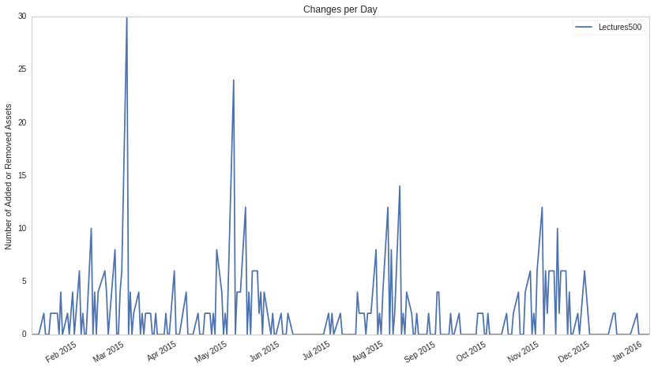
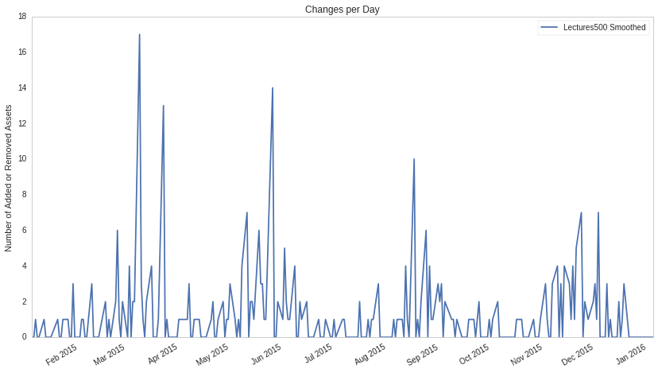

Universe Selection
==================

by Gil Wassermann, Maxwell Margenot

Part of the Quantopian Lecture Series:

-  `www.quantopian.com/lectures <https://www.quantopian.com/lectures>`__
-  `github.com/quantopian/research_public <https://github.com/quantopian/research_public>`__

--------------

Selecting the product space in which an algorithm trades can be as
important as, if not more than, the strategy itself. In this lecture, we
will walk through the basics of constructing a universe and introduce
Quantopian’s new tools that allow you to accomplish these often tricky
and subtle calculations with ease.

What is a Universe?
-------------------

On a high level, universe selection is the process of choosing the pool
of securities upon which your algorithm will trade. For example, an
algorithm designed to play with the characteristics of a universe
consisting of technology equities may perform exceptionally well in that
universe with the tradeoff of falling flat in other sectors.
Experimenting with different universes by tweaking their components is
an essential part of developing a trading strategy.

Using Pipeline, we have access to around 8300 securities to choose from
each day. However, the securities within this basket are markedly
different. Some are different asset classes, some belong to different
sectors and super-sectors, some employ different business models, some
practice different management styles, and so on. By defining a universe,
a trader can narrow in on securities with one or more of these
attributes in order to craft a strategy that is most effective for that
subset of the population.

Without a properly-constructed universe, your algorithm may be exposed
to risks that you just aren’t aware of. For example, it could be
possible that your universe selection methodology only selects a stock
basket whose constituents do not trade very often. Let’s say that your
algorithm wants to place an order of 100,000 shares for a company that
only trades 1,000 on a given day. The inability to fill this order or
others might prevent you from achieving the optimal weights for your
portfolio, thereby undermining your strategy. These risks can be
controlled for by careful and thoughtful universe slection.

On the Quantopian platform, universes are often implemented as a
Pipeline screen. If you are not familiar with Pipeline, feel free to
check out the
`tutorial <https://www.quantopian.com/tutorials/pipeline>`__. Below is
an example implementation of a universe that limits Pipeline output to
the 500 securities with the largest revenue each day. This can be seen
as a naive implementation of the Fortune500.

.. code:: ipython2

    import numpy as np
    import pandas as pd
    import matplotlib.pyplot as plt
    from quantopian.pipeline.classifiers.fundamentals import Sector  
    from quantopian.pipeline import Pipeline
    from quantopian.pipeline.data.builtin import USEquityPricing
    from quantopian.research import run_pipeline
    from quantopian.pipeline.data import Fundamentals  
    from quantopian.pipeline.factors import CustomFactor

.. code:: ipython2

    universe = Fundamentals.total_revenue.latest.top(500)
    
    pipe = Pipeline(
        columns={
            'Revenue': Fundamentals.total_revenue.latest
        },
        screen=universe
    )
    res = run_pipeline(pipe, '2016-01-01', '2016-01-01')
    print "There are %d assets in this universe." % len(res.index.levels[1])
    
    res.head(10) # print 10 constituents 

.. parsed-literal::

    There are 500 assets in this universe.

.. raw:: html

    

    <table border="1" class="dataframe">
      <thead>
        <tr style="text-align: right;">
          <th></th>
          <th></th>
          <th>Revenue</th>
        </tr>
      </thead>
      <tbody>
        <tr>
          <th rowspan="10" valign="top">2016-01-04 00:00:00+00:00</th>
          <th>Equity(2 [ARNC])</th>
          <td>5.573000e+09</td>
        </tr>
        <tr>
          <th>Equity(24 [AAPL])</th>
          <td>5.150100e+10</td>
        </tr>
        <tr>
          <th>Equity(25 [ARNC_PR])</th>
          <td>5.573000e+09</td>
        </tr>
        <tr>
          <th>Equity(62 [ABT])</th>
          <td>5.150000e+09</td>
        </tr>
        <tr>
          <th>Equity(128 [ADM])</th>
          <td>1.656500e+10</td>
        </tr>
        <tr>
          <th>Equity(161 [AEP])</th>
          <td>4.432000e+09</td>
        </tr>
        <tr>
          <th>Equity(166 [AES])</th>
          <td>3.721000e+09</td>
        </tr>
        <tr>
          <th>Equity(168 [AET])</th>
          <td>1.495300e+10</td>
        </tr>
        <tr>
          <th>Equity(185 [AFL])</th>
          <td>5.040000e+09</td>
        </tr>
        <tr>
          <th>Equity(239 [AIG])</th>
          <td>1.282200e+10</td>
        </tr>
      </tbody>
    </table>
    

This is a good start, but again, it is a very naive universe. Normally,
high revenue is a characteristic of a healthy, thriving company, but
there are many other things that play into the construction of a good
universe. While this idea has a reasonable economic basis, more analysis
has to be conducted to determine the efficacy of this universe. There
may be more subtle things occurring independently of the revenue of its
constituent companies.

For the rest of this notebook, we will design our own universe, profile
it and check its performance. Let’s create the Lectures500!

##Lectures500

###Sector Exposure

If I create a universe that only looks at equities in the technology
sector, my algorithm will have an extreme sector bias. Companies in the
same industry sector are affected by similar macroeconomic trends and
therefore their performance tends to be correlated. In the case of
particular strategies, we may find the benefits of working exclusively
within a particular sector greater than the downside risks, but this is
not suitable for creating a general-purpose, quality universe.

Let’s have a look at the sector breakdown of the Lectures500.

.. code:: ipython2

    # Rename our universe to Lectures500
    Lectures500 = universe
    
    SECTOR_CODE_NAMES = {
        Sector.BASIC_MATERIALS: 'Basic Materials',
        Sector.CONSUMER_CYCLICAL: 'Consumer Cyclical',
        Sector.FINANCIAL_SERVICES: 'Financial Services',
        Sector.REAL_ESTATE: 'Real Estate',
        Sector.CONSUMER_DEFENSIVE: 'Consumer Defensive',
        Sector.HEALTHCARE: 'Healthcare',
        Sector.UTILITIES: 'Utilities',
        Sector.COMMUNICATION_SERVICES: 'Communication Services',
        Sector.ENERGY: 'Energy',
        Sector.INDUSTRIALS: 'Industrials',
        Sector.TECHNOLOGY: 'Technology',
        -1 : 'Misc'
    }
    
    def get_sector_codes(day, universe):
        pipe = Pipeline(columns={'Sector': Sector()}, screen=universe)
        # Drop the datetime level of the index, since we only have one day of data 
        return run_pipeline(pipe, day, day).reset_index(level=0, drop=True)
    
    
    def calculate_sector_counts(sectors):
        counts = (sectors.groupby('Sector').size())
    
        # Replace numeric sector codes with human-friendly names
        counts.index = counts.index.map(lambda code: SECTOR_CODE_NAMES[code])
        return counts
    
    lectures500_sectors = get_sector_codes('2016-01-04', Lectures500)
    lectures500_counts = calculate_sector_counts(lectures500_sectors)

.. code:: ipython2

    def plot_sector_counts(sector_counts):
        
        bar = plt.subplot2grid((5,5), (0,0), rowspan=2, colspan=5)
        pie = plt.subplot2grid((5,5), (2,0), rowspan=3, colspan=5)
        
        # Bar chart
        sector_counts.plot(
            kind='bar',
            color='b',
            rot=30,
            ax=bar,
        )
        
        bar.set_title('Sector Exposure - Counts')
        
        # Pie chart
        sector_counts.plot(
            kind='pie', 
            colormap='Set3', 
            autopct='%.2f %%',
            fontsize=12,
            ax=pie,
        )
        pie.set_ylabel('')  # This overwrites default ylabel, which is None :(
        pie.set_title('Sector Exposure - Proportions')
        
        plt.tight_layout();

.. code:: ipython2

    plot_sector_counts(lectures500_counts)

.. image:: notebook_files/notebook_8_0.png

From the above plots it is clear that there is a mild sector bias
towards the financial services industry. Any big events that affect
companies in this sector will have a large effect on this universe and
any algorithm that uses it.

One option is to equal-weight the sectors, so that equities from each
industry sector make up an identical proportion of the final universe.
This, however, comes with its own disadvantages. In a sector-equal
Lectures500, the universe would include some lower-revenue real estate
equities at the expense of higher-revenue financial services equities.

###Turnover

Another thing to consider when designing a universe is the rate at which
the universe changes. Turnover is a way of measuring this rate of
change. Turnover is defined as the number of equities to enter or exit
the universe in a particular time window.

Let us imagine a universe with a turnover of 0. This universe would be
completely unchanged by market movements. Moreover, stocks inappropriate
for the universe would never be removed and stocks that should be
included will never enter.

Conversely, imagine a universe that changes every one of its
constituents every day. An algorithm built on this universe will be
forced to sell its entire portfolio every day. This incurs transaction
costs which erode returns.

When creating a universe, there is an inherent tradeoff between
stagnation and sensitivity to the market.

Let’s have a look at the turnover for the Lectures500!

.. code:: ipython2

    res = run_pipeline(Pipeline(columns={'Lectures500' : Lectures500}), '2015-01-01', '2016-01-01')
    res = res.unstack().fillna(False)
    
    def calculate_daily_turnover(unstacked):
        return (unstacked
                .diff()        # Get True/False showing where values changed from previous day.
                .iloc[1:]      # Drop first row, which is meaningless after diff().
                .astype(bool)  # diff() coerces from bool -> object :(.  Undo that.
                .groupby(axis=1, level=0)  
                .sum())        # Group by universe and count number of True values in each row.
    
    def plot_daily_turnover(unstacked):
        
        # Calculate locations where the inclusion state of an asset changed.
        turnover = calculate_daily_turnover(unstacked)
        
        # Write the data to an axis.
        ax = turnover.plot(figsize=(14, 8))
        
        # Add style to the axis.
        ax.grid(False)
        ax.set_title('Changes per Day')
        ax.set_ylabel('Number of Added or Removed Assets')
        
    
    def print_daily_turnover_stats(unstacked):
        turnover = calculate_daily_turnover(unstacked)
        print(turnover.describe().loc[['mean', 'std', '25%', '50%', '75%', 'min', 'max']])

.. code:: ipython2

    plot_daily_turnover(res)
    print_daily_turnover_stats(res)

.. parsed-literal::

          Lectures500
    mean     1.761905
    std      3.402433
    25%      0.000000
    50%      0.000000
    75%      2.000000
    min      0.000000
    max     30.000000

Smoothing
^^^^^^^^^

A good way to reduce turnover is through smoothing functions. Smoothing
is the process of taking noisy data and aggregating it in order to
analyze its underlying trends. When applied to universe selection, a
good smoothing function prevents equities at the universe boundary from
entering and exiting frequently.

One example of a potential smoothing function is a filter that finds
equities that have passed the Lectures500 criteria for 16 or more days
out of the past 21 days. We will call this filter ``AtLeast16``. This
aggregation many days of data lends a certain degree of flexibility to
the edges of our universe. If, for example, Equity XYZ is very close to
the boundary for inclusion, in a given month, it may flit in and out of
the Lectures500 day after day. However, with the ``AtLeast16`` filter,
Equity XYZ is allowed to enter and exit the daily universe a maximum of
5 times before it is excluded from the smoothed universe.

Let’s apply a smoothing function to our universe and see its effect on
turnover.

.. code:: ipython2

    from quantopian.pipeline.filters import AtLeastN
    
    Lectures500 = AtLeastN(inputs=[Lectures500],
                           window_length=21,
                           N=16,)
    
    res_smoothed = run_pipeline(Pipeline(columns={'Lectures500 Smoothed' : Lectures500}), 
                                '2015-01-01',
                                '2016-01-01')
    res_smoothed = res_smoothed.unstack().fillna(False)
    
    plot_daily_turnover(res_smoothed)
    print_daily_turnover_stats(res_smoothed)

.. parsed-literal::

          Lectures500 Smoothed
    mean              1.190476
    std               2.145000
    25%               0.000000
    50%               0.000000
    75%               1.000000
    min               0.000000
    max              17.000000

Looking at the metrics, we can see that the smoothed universe has a
lower turnover than the original Lectures500. Since this is a good
characteristic, we will add this logic to the universe.

NB: Smoothing can also be accomplished by downsampling.

##QTradableStocksUS

Although the Lectures500 is a decent universe, we highly recommend that
you use the QTradableStocksUS when designing your algorithms.

The QTradableStocksUS is defined using the following limits:

-  Market cap: over $500M: This restriction eliminates many
   undiversifiable risks like low liquidity and difficulty in shorting.
-  Dollar volume: It is important that stocks in our universe be
   relatively easy to trade when entering and exiting positions. The
   QTradableStocksUS manages that by including only stocks that have
   median daily dollar volume of $2.5m or more over the trailing 200
   days.
-  Prior day’s close: If a stock’s price is lower than $5, the bid-ask
   spread becomes larger relative to the price, and the transaction cost
   becomes too high. 200 days of price and volume: If a stock has
   missing data for the previous 200 days, the company is excluded. This
   targets stocks with trading halts, IPOs, and other situations that
   make them harder to assess.
-  Primary/Common share: The QTradableStocksUS chooses a single share
   class for each company. The criteria is to find the common share with
   the most dollar volume. ADRs, Limited Partnerships: QTradableStocksUS
   excludes ADRs and LPs.

and can be implemented in a single line of code.

For more information about the QTradableStocksUS, check out `this
link <https://www.quantopian.com/posts/working-on-our-best-universe-yet-qtradablestocksus>`__.

*This presentation is for informational purposes only and does not
constitute an offer to sell, a solicitation to buy, or a recommendation
for any security; nor does it constitute an offer to provide investment
advisory or other services by Quantopian, Inc. (“Quantopian”). Nothing
contained herein constitutes investment advice or offers any opinion
with respect to the suitability of any security, and any views expressed
herein should not be taken as advice to buy, sell, or hold any security
or as an endorsement of any security or company. In preparing the
information contained herein, Quantopian, Inc. has not taken into
account the investment needs, objectives, and financial circumstances of
any particular investor. Any views expressed and data illustrated herein
were prepared based upon information, believed to be reliable, available
to Quantopian, Inc. at the time of publication. Quantopian makes no
guarantees as to their accuracy or completeness. All information is
subject to change and may quickly become unreliable for various reasons,
including changes in market conditions or economic circumstances.*
