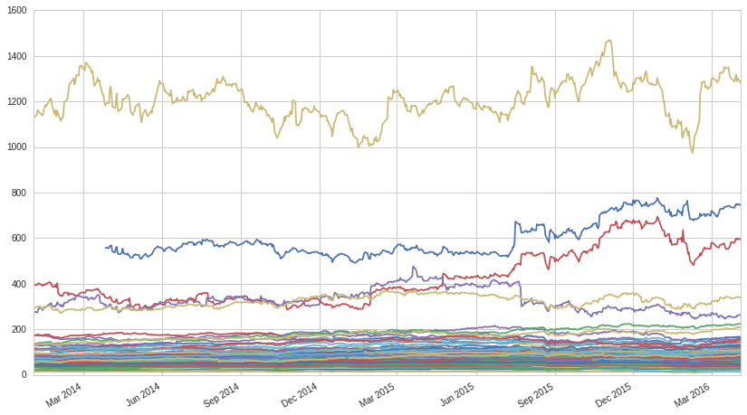
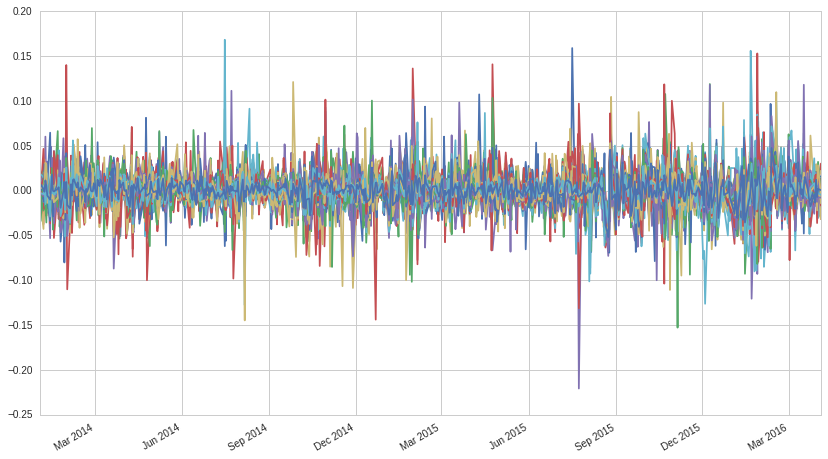
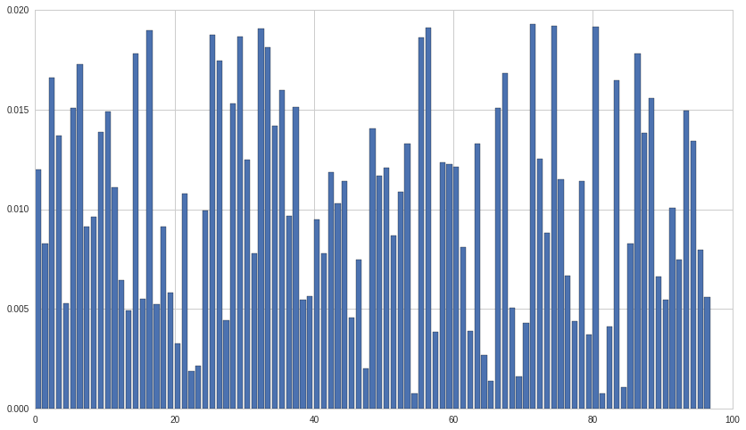
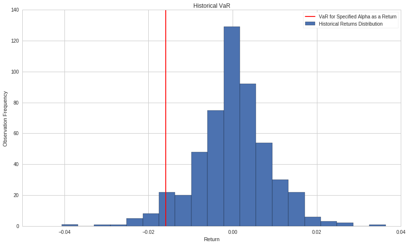
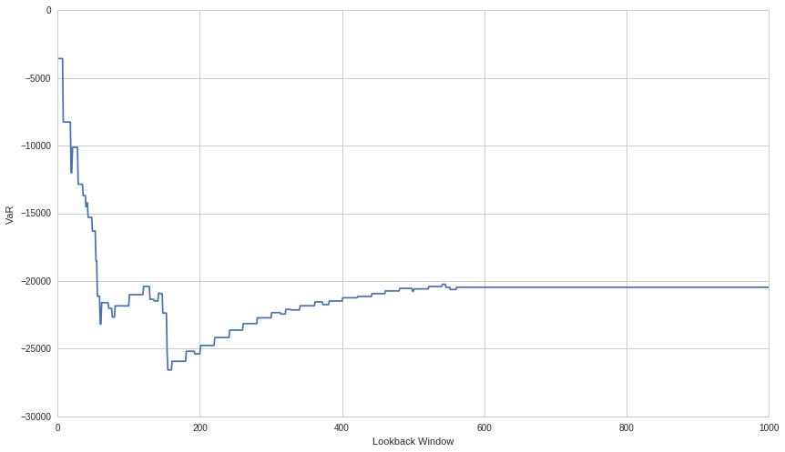

Portfolio Value at Risk and Conditional Value at Risk
=====================================================

By Jonathan Larkin and Delaney Granizo-Mackenzie.

Part of the Quantopian Lecture Series:

-  `www.quantopian.com/lectures <https://www.quantopian.com/lectures>`__
-  `github.com/quantopian/research_public <https://github.com/quantopian/research_public>`__

--------------

Value at Risk (VaR) is a key concept in portfolio risk management. It
uses the past observed distribution of portfolio returns to estimate
what your future losses might be at different likelihood levels. Let’s
demonstrate this concept through an example.

.. code:: ipython2

    import numpy as np
    import pandas as pd
    
    from scipy.stats import norm
    import time
    
    import matplotlib.pyplot as plt

Simulated Data Example
----------------------

Let’s simulate some returns of 10 hypothetical assets.

####NOTE

We use normal distributions to simulate the returns, in practice real
returns will almost never follow normal distributions and usually have
weird behavior including fat tails. We’ll discuss this more later.

.. code:: ipython2

    # mu = 0.01, std = 0.10, 1000 bars, 10 assets
    mu = 0.01
    sigma = 0.10
    bars = 1000
    num_assets = 10
    
    returns = np.random.normal(mu, sigma, (bars, num_assets))
    
    # Fake asset names
    names = ['Asset %s' %i  for i in range(num_assets)]
    
    # Put in a pandas dataframe
    returns = pd.DataFrame(returns, columns=names)
    
    # Plot the last 50 bars
    plt.plot(returns.head(50))
    plt.xlabel('Time')
    plt.ylabel('Return');

.. image:: notebook_files/notebook_3_0.png

The Value at Risk (VaR) for coverage :math:`\alpha` is defined as the
maximum amount we could expect to lose with likelihood
:math:`p = 1 - \alpha`. Put another way, on no more that
:math:`100 \times p \%` of days should we expect to lose more than the
VaR. There are many ways to estimate VaR and none of them are perfect.
In fact you should not put complete trust in VaR, it is rather intended
as a way to get a sense of how much might be lost in different levels of
extreme scenarios, and provide this info to people responsible for risk
management.

VaR for a high :math:`\alpha` is a measure of worst case outcomes. For
example one might track their :math:`\alpha = 0.999` VaR to understand
how a 1/1000 crisis event might affect them. Because real distributions
tend to diverge and become less and less consistent the further along
the tail we go, extreme VaR should be taken with a grain of salt.

Relationship to Confidence Intervals
~~~~~~~~~~~~~~~~~~~~~~~~~~~~~~~~~~~~

For those familiar with confidence intervals, VaR is very similar. The
idea of trying to cover a set of possible values with an interval
specified by :math:`\alpha` is similar to how VaR tries to cover a set
of possible losses. For those unfamiliar there is a lecture available
`here <https://www.quantopian.com/lectures/confidence-intervals>`__.

Historical (Non-Parametric) VaR
~~~~~~~~~~~~~~~~~~~~~~~~~~~~~~~

We’ll use historical VaR, which looks at previous returns distributions
and uses that to compute the :math:`p` percentile. This percentile is
the amount of loss you could reasonably expect to experience with
probability :math:`p`, assuming future returns are close to past
returns. Again, this isn’t perfect, and requires that there is no regime
change in which the returns distribution changes. For instance, if your
historical window doesn’t include any crisis events, your VaR estimate
will be far lower than it should be.

To compute historical VaR for coverage :math:`\alpha` we simply take the
:math:`100 \times (1 - \alpha)` percentile of lowest oberserved returns
and multiply that by our total value invested.

Now let’s compute the VaR of this set of 10 assets. To do this we need a
set of portfolio weights. We’ll start super simple.

.. code:: ipython2

    weights = np.ones((10, 1))
    # Normalize
    weights = weights / np.sum(weights)

.. code:: ipython2

    def value_at_risk(value_invested, returns, weights, alpha=0.95, lookback_days=520):
        returns = returns.fillna(0.0)
        # Multiply asset returns by weights to get one weighted portfolio return
        portfolio_returns = returns.iloc[-lookback_days:].dot(weights)
        # Compute the correct percentile loss and multiply by value invested
        return np.percentile(portfolio_returns, 100 * (1-alpha)) * value_invested

We’ll compute the VaR for :math:`\alpha = 0.95`.

.. code:: ipython2

    value_invested = 1000000
    
    value_at_risk(value_invested, returns, weights, alpha=0.95)

.. parsed-literal::

    -44176.636327078253

Interpreting this, we say that historically no more than :math:`5\%` of
days resulted in losses more extreme than this, or that on each day your
probability of losing this much is less than :math:`5\%`. Keeping in
mind that any forecast like this is just an estimate.

Normal vs. Non-Parametric Historical VaR
----------------------------------------

Normal Case
~~~~~~~~~~~

A special case of VaR is when you assume that the returns follow a given
distribution rather than non-parametrically estiamting it historically.
In this case a normal VaR would fit our data, because all our returns
were simulated form a normal distribution. We can check this by using a
normal distribution Cumulative Distribution Function (CDF), which sums
the area under a normal curve to figure out how likely certain values
are. We’ll use an inverse CDF, or PPF, which for a given likelihood will
tell us to which value that likelihood corresponds.

Specifically, the closed form formula for Normal VaR is

.. math:: VaR_{\alpha}(x) = \mu - \sigma N^{-1}(\alpha)

.. code:: ipython2

    # Portfolio mean return is unchanged, but std has to be recomputed
    # This is because independent variances sum, but std is sqrt of variance
    portfolio_std = np.sqrt( np.power(sigma, 2) * num_assets ) / num_assets
    
    # manually 
    (mu - portfolio_std * norm.ppf(0.95)) * value_invested

.. parsed-literal::

    -42014.838787555738

Seems close enough to within some random variance. Let’s visualize the
continuous normal case. Notice that the VaR is expressed as a return
rather than an absolute loss. To get aboslute loss we just need to
multiply by value invested.

.. code:: ipython2

    def value_at_risk_N(mu=0, sigma=1.0, alpha=0.95):
        return mu - sigma*norm.ppf(alpha)
    
    
    x = np.linspace(-3*sigma,3*sigma,1000)
    y = norm.pdf(x, loc=mu, scale=portfolio_std)
    plt.plot(x,y);
    plt.axvline(value_at_risk_N(mu = 0.01, sigma = portfolio_std, alpha=0.95), color='red', linestyle='solid');
    plt.legend(['Return Distribution', 'VaR for Specified Alpha as a Return'])
    plt.title('VaR in Closed Form for a Normal Distribution');

.. image:: notebook_files/notebook_13_0.png

Historical (Non-Parametric) Case
~~~~~~~~~~~~~~~~~~~~~~~~~~~~~~~~

Historical VaR instead uses historical data to draw a discrete
Probability Density Function, or histogram. Then finds the point at
which only :math:`100 \times (1-\alpha)\%` of the points are below that
return. It returns that return as the VaR return for coverage
:math:`\alpha`.

.. code:: ipython2

    lookback_days = 520
    alpha = 0.95
    
    # Multiply asset returns by weights to get one weighted portfolio return
    portfolio_returns = returns.fillna(0.0).iloc[-lookback_days:].dot(weights)
    
    portfolio_VaR = value_at_risk(value_invested, returns, weights, alpha=0.95)
    # Need to express it as a return rather than absolute loss
    portfolio_VaR_return = portfolio_VaR / value_invested
    
    plt.hist(portfolio_returns, bins=20)
    plt.axvline(portfolio_VaR_return, color='red', linestyle='solid');
    plt.legend(['VaR for Specified Alpha as a Return', 'Historical Returns Distribution'])
    plt.title('Historical VaR');

.. image:: notebook_files/notebook_15_0.png

Underlying Distributions Are Not Always Normal
~~~~~~~~~~~~~~~~~~~~~~~~~~~~~~~~~~~~~~~~~~~~~~

In real financial data the underlying distributions are rarely normal.
This is why we prefer historical VaR as opposed to an assumption of an
underlying distribution. Historical VaR is also non-parametric, so we
aren’t at risk of overfitting distribution parameters to some data set.

Real Data Example
^^^^^^^^^^^^^^^^^

We’ll show this on some real financial data.

.. code:: ipython2

    # OEX components as of 3/31/16
    # http://www.cboe.com/products/indexcomponents.aspx?DIR=OPIndexComp&FILE=snp100.doc
    oex = ['MMM','T','ABBV','ABT','ACN','ALL','GOOGL','GOOG','MO','AMZN','AXP','AIG','AMGN','AAPL','BAC',
           'BRK-B','BIIB','BLK','BA','BMY','CVS','COF','CAT','CELG','CVX','CSCO','C','KO','CL','CMCSA',
           'COP','CSOT','DHR','DOW','DUK','DD','EMC','EMR','EXC','XOM','FB','FDX','F','GD','GE','GM','GILD',
           'GS','HAL','HD','HON','INTC','IBM','JPM','JNJ','KMI','LLY','LMT','LOW','MA','MCD','MDT','MRK',
           'MET,','MSFT','MDZL','MON','MS','NKE','NEE','OXY','ORCL','PYPL','PEP','PFE','PM','PG','QCOM',
           'RTN','SLB','SPG','SO','SBUX','TGT','TXN','BK','PCLN','TWX','FOXA','FOX','USB','UNP','UPS','UTX',
           'UNH','VZ','V','WMT','WBA','DIS','WFC']
    tickers = symbols(oex)
    num_stocks = len(tickers)

.. code:: ipython2

    start = time.time()
    data = get_pricing(tickers, fields='close_price', start_date='2014-01-01', end_date='2016-04-04')
    end = time.time()
    print "Time: %0.2f seconds." % (end - start)

.. parsed-literal::

    Time: 0.47 seconds.

.. code:: ipython2

    returns = data.pct_change()
    returns = returns - returns.mean(skipna=True) # de-mean the returns
    
    data.plot(legend=None);
    returns.plot(legend=None); 

Now we need to generate some weights.

.. code:: ipython2

    def scale(x):
        return x / np.sum(np.abs(x))
    
    weights = scale(np.random.random(num_stocks))
    plt.bar(np.arange(num_stocks),weights);

Now let’s compute the VaR for :math:`\alpha = 0.95`. We’ll write this as
:math:`VaR_{\alpha=0.95}` from now on.

.. code:: ipython2

    value_at_risk(value_invested, returns, weights, alpha=0.95, lookback_days=520)

.. parsed-literal::

    -15855.958346392685

Let’s visualize this.

.. code:: ipython2

    lookback_days = 520
    alpha = 0.95
    
    # Multiply asset returns by weights to get one weighted portfolio return
    portfolio_returns = returns.fillna(0.0).iloc[-lookback_days:].dot(weights)
    
    portfolio_VaR = value_at_risk(value_invested, returns, weights, alpha=0.95)
    # Need to express it as a return rather than absolute loss
    portfolio_VaR_return = portfolio_VaR / value_invested
    
    plt.hist(portfolio_returns, bins=20)
    plt.axvline(portfolio_VaR_return, color='red', linestyle='solid');
    plt.legend(['VaR for Specified Alpha as a Return', 'Historical Returns Distribution'])
    plt.title('Historical VaR');
    plt.xlabel('Return');
    plt.ylabel('Observation Frequency');

The distribution looks visibly non-normal, but let’s confirm that the
returns are non-normal using a statistical test. We’ll use Jarque-Bera,
and our p-value cutoff is 0.05.

.. code:: ipython2

    from statsmodels.stats.stattools import jarque_bera
    
    _, pvalue, _, _ = jarque_bera(portfolio_returns)
    
    if pvalue > 0.05:
        print 'The portfolio returns are likely normal.'
    else:
        print 'The portfolio returns are likely not normal.'

.. parsed-literal::

    The portfolio returns are likely not normal.

Sure enough, they’re likely not normal, so it would be a big mistake to
use a normal distribution to underlie a VaR computation here.

We Lied About ‘Non-Parametric’
------------------------------

You’ll notice the VaR computation conspicuously uses a lookback window.
This is a parameter to the otherwise ‘non-parametric’ historical VaR.
Keep in mind that because lookback window affects VaR, it’s important to
pick a lookback window that’s long enough for the VaR to converge. To
check if our value has seemingly converged let’s run an experiment.

Also keep in mind that even if something has converged on a say 500 day
window, that may be ignoring a financial collapse that happened 1000
days ago, and therefore is ignoring crucial data. On the other hand,
using all time data may be useless for reasons of non-stationarity in
returns varaince. Basically as returns variance changes over time, older
measurements may reflect state that is no longer accurate. For more
information on non-stationarity you can check out `this
lecture <https://www.quantopian.com/lectures/integration-cointegration-and-stationarity>`__.

.. code:: ipython2

    N = 1000
    VaRs = np.zeros((N, 1))
    for i in range(N):
        VaRs[i] = value_at_risk(value_invested, returns, weights, lookback_days=i)
    
    plt.plot(VaRs)
    plt.xlabel('Lookback Window')
    plt.ylabel('VaR');

.. image:: notebook_files/notebook_30_0.png

We can see here that VaR does appear to converge within a 400-600
lookback window period. Therefore our 520 day parameter should be fine.
In fact, 1000 may be better as it uses strictly more information, but
more computationally intensive and prey to stationarity concerns.

It can be useful to do analyses like this when evaluating whether a VaR
is meaningful. Another check we’ll do is for stationarity of the
portfolio returns over this time period.

.. code:: ipython2

    from statsmodels.tsa.stattools import adfuller
    
    results = adfuller(portfolio_returns)
    pvalue = results[1]
    
    if pvalue < 0.05:
        print 'Process is likely stationary.'
    else:
        print 'Process is likely non-stationary.'

.. parsed-literal::

    Process is likely stationary.

Conditional Value at Risk (CVaR)
--------------------------------

CVaR is what many consider an improvement on VaR, as it takes into
account the shape of the returns distribution. It is also known as
Expected Shortfall (ES), as it is an expectation over all the different
possible losses greater than VaR and their corresponding estimated
likelihoods.

If you are not familiar with expectations, much content is available
online. However we will provide a brief refresher.

Expected Value
~~~~~~~~~~~~~~

Say you have a fair six sided die. Each number is equally likely. The
notion of an expectation, written as :math:`\mathrm{E}(X)`, is what
should you expect to happen out of all the possible outcomes. To get
this you multiply each event by the probability of that event and add
that up, think of it as a probability weighted average. With a die we
get

.. math:: 1/6 \times 1 + 1/6 \times 2 + 1/6 \times 3 + 1/6 \times 4 + 1/6 \times 5 + 1/6 \times 6 =  3.5

When the probabilities are unequal it gets more complicated, and when
the outcomes are continuous we have to use integration in closed form
equations. Here is the formula for CVaR.

.. math:: CVaR_{\alpha}(x) \approx \frac{1}{(1-\alpha)} \int_{f(x,y) \geq VaR_{\alpha}(x)} f(x,y)p(y)dy dx

.. code:: ipython2

    def cvar(value_invested, returns, weights, alpha=0.95, lookback_days=520):
        # Call out to our existing function
        var = value_at_risk(value_invested, returns, weights, alpha, lookback_days=lookback_days)
        returns = returns.fillna(0.0)
        portfolio_returns = returns.iloc[-lookback_days:].dot(weights)
        
        # Get back to a return rather than an absolute loss
        var_pct_loss = var / value_invested
        
        return value_invested * np.nanmean(portfolio_returns[portfolio_returns < var_pct_loss])

Let’s compute CVaR on our data and see how it compares with VaR.

.. code:: ipython2

    cvar(value_invested, returns, weights, lookback_days=500)

.. parsed-literal::

    -20763.593360233601

.. code:: ipython2

    value_at_risk(value_invested, returns, weights, lookback_days=500)

.. parsed-literal::

    -16025.325166269373

CVaR is higher because it is capturing more information about the shape
of the distribution, AKA the moments of the distribution. If the tails
have more mass, this will capture that. In general it is considered to
be a far superior metric compared with VaR and you should use it over
VaR in most cases.

Let’s visualize what it’s capturing.

.. code:: ipython2

    lookback_days = 520
    alpha = 0.95
    
    # Multiply asset returns by weights to get one weighted portfolio return
    portfolio_returns = returns.fillna(0.0).iloc[-lookback_days:].dot(weights)
    
    portfolio_VaR = value_at_risk(value_invested, returns, weights, alpha=0.95)
    # Need to express it as a return rather than absolute loss
    portfolio_VaR_return = portfolio_VaR / value_invested
    
    portfolio_CVaR = cvar(value_invested, returns, weights, alpha=0.95)
    # Need to express it as a return rather than absolute loss
    portfolio_CVaR_return = portfolio_CVaR / value_invested
    
    # Plot only the observations > VaR on the main histogram so the plot comes out
    # nicely and doesn't overlap.
    plt.hist(portfolio_returns[portfolio_returns > portfolio_VaR_return], bins=20)
    plt.hist(portfolio_returns[portfolio_returns < portfolio_VaR_return], bins=10)
    plt.axvline(portfolio_VaR_return, color='red', linestyle='solid');
    plt.axvline(portfolio_CVaR_return, color='red', linestyle='dashed');
    plt.legend(['VaR for Specified Alpha as a Return',
                'CVaR for Specified Alpha as a Return',
                'Historical Returns Distribution', 
                'Returns < VaR'])
    plt.title('Historical VaR and CVaR');
    plt.xlabel('Return');
    plt.ylabel('Observation Frequency');

.. image:: notebook_files/notebook_39_0.png

###Checking for Convergence Again

Finally, we’ll check for convergence.

.. code:: ipython2

    N = 1000
    CVaRs = np.zeros((N, 1))
    for i in range(N):
        CVaRs[i] = cvar(value_invested, returns, weights, lookback_days=i)
    
    plt.plot(CVaRs)
    plt.xlabel('Lookback Window')
    plt.ylabel('VaR');

.. parsed-literal::

    /usr/local/lib/python2.7/dist-packages/numpy/lib/nanfunctions.py:675: RuntimeWarning: Mean of empty slice
      warnings.warn("Mean of empty slice", RuntimeWarning)

Sources
=======

-  http://www.wiley.com/WileyCDA/WileyTitle/productCd-1118445597.html
-  http://www.ise.ufl.edu/uryasev/publications/
-  http://www.ise.ufl.edu/uryasev/files/2011/11/VaR_vs_CVaR_CARISMA_conference_2010.pdf
-  http://faculty.washington.edu/ezivot/econ589/me20-1-4.pdf

*This presentation is for informational purposes only and does not
constitute an offer to sell, a solicitation to buy, or a recommendation
for any security; nor does it constitute an offer to provide investment
advisory or other services by Quantopian, Inc. (“Quantopian”). Nothing
contained herein constitutes investment advice or offers any opinion
with respect to the suitability of any security, and any views expressed
herein should not be taken as advice to buy, sell, or hold any security
or as an endorsement of any security or company. In preparing the
information contained herein, Quantopian, Inc. has not taken into
account the investment needs, objectives, and financial circumstances of
any particular investor. Any views expressed and data illustrated herein
were prepared based upon information, believed to be reliable, available
to Quantopian, Inc. at the time of publication. Quantopian makes no
guarantees as to their accuracy or completeness. All information is
subject to change and may quickly become unreliable for various reasons,
including changes in market conditions or economic circumstances.*
