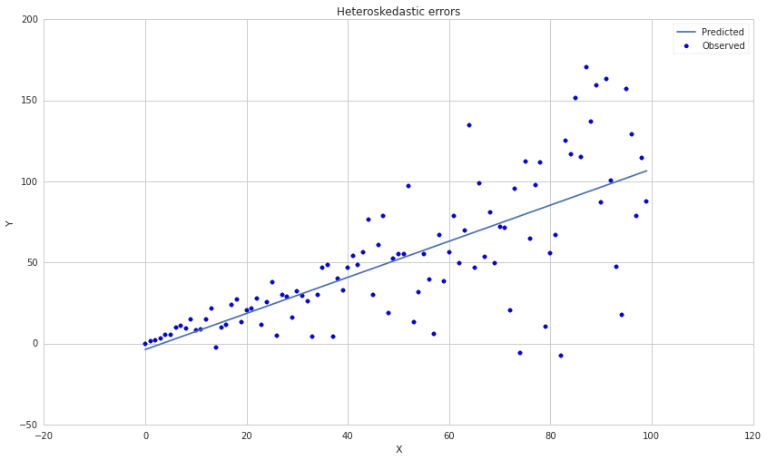
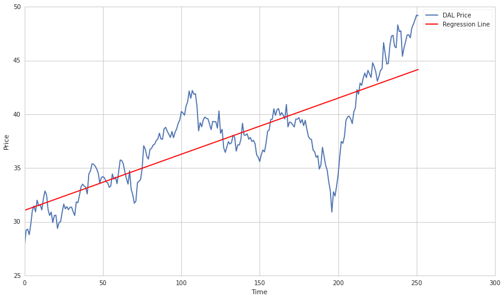
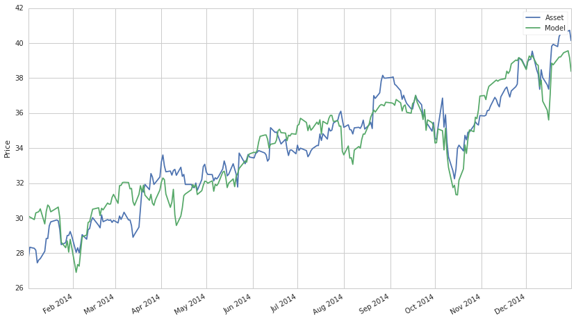
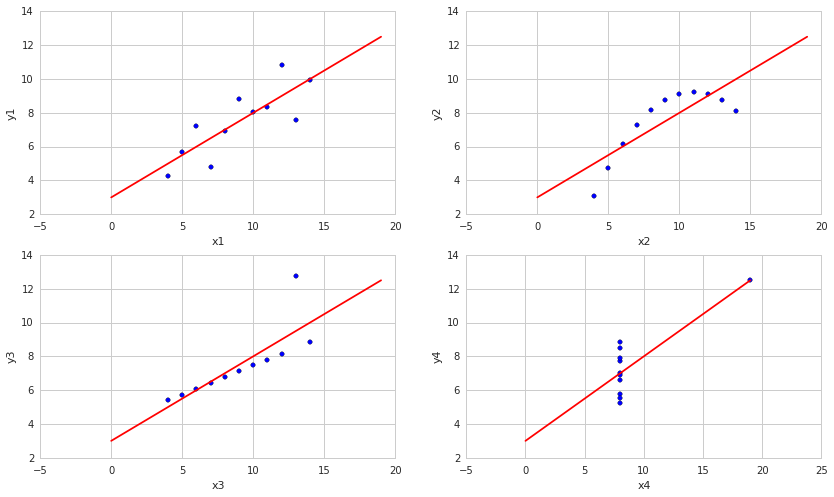

Violations of Regression Models
===============================

By Evgenia “Jenny” Nitishinskaya and Delaney Mackenzie

Part of the Quantopian Lecture Series:

-  `www.quantopian.com/lectures <https://www.quantopian.com/lectures>`__
-  `github.com/quantopian/research_public <https://github.com/quantopian/research_public>`__

--------------

When using a regression to fit a model to our data, the assumptions of
regression analysis must be satisfied in order to ensure good parameter
estimates and accurate fit statistics. We would like parameters to be:
\* unbiased (expected value over different samples is the true value) \*
consistent (converging to the true value with many samples), and \*
efficient (minimized variance)

Below we investigate the ways in which these assumptions can be violated
and the effect on the parameters and fit statistics. We’ll be using
single-variable linear equations for the examples, but the same
considerations apply to other models. We’ll also assume that our model
is correctly specified; that is, that the functional form we chose is
valid. We discuss model specification errors along with the assumption
violations and other problems that they cause in another notebook.

Focus on the Residuals
======================

Rather than focusing on your model construction, it is possible to gain
a huge amount of information from your residuals (errors). Your model
may be incredibly complex and impossible to analyze, but as long as you
have predictions and observed values, you can compute residuals. Once
you have your residuals you can perform many statistical tests.

If your residuals do not follow a given distribution (usually normal,
but depends on your model), then you know that something is wrong and
you should be concerned with the accuracy of your predictions.

Residuals not normally-distributed
==================================

If the error term is not normally distributed, then our tests of
statistical significance will be off. Fortunately, the central limit
theorem tells us that, for large enough data samples, the coefficient
distributions will be close to normal even if the errors are not.
Therefore our analysis will still be valid for large data datasets.

Testing for normality
---------------------

A good test for normality is the Jarque-Bera test. It has a python
implementation at ``statsmodels.stats.stattools.jarque_bera`` , we will
use it frequently in this notebook.

Always test for normality!
~~~~~~~~~~~~~~~~~~~~~~~~~~

It’s incredibly easy and can save you a ton of time.

.. code:: ipython2

    # Import all the libraries we'll be using
    import numpy as np
    import statsmodels.api as sm
    from statsmodels import regression, stats
    import statsmodels
    import matplotlib.pyplot as plt

.. code:: ipython2

    residuals = np.random.normal(0, 1, 100)
    
    _, pvalue, _, _ = statsmodels.stats.stattools.jarque_bera(residuals)
    print pvalue
    
    residuals = np.random.poisson(size = 100)
    
    _, pvalue, _, _ = statsmodels.stats.stattools.jarque_bera(residuals)
    print pvalue

.. parsed-literal::

    0.832710660505
    0.0326186154758

Heteroskedasticity
==================

Heteroskedasticity means that the variance of the error terms is not
constant across observations. Intuitively, this means that the
observations are not uniformly distributed along the regression line. It
often occurs in cross-sectional data where the differences in the
samples we are measuring lead to differences in the variance.

.. code:: ipython2

    # Artificially create dataset with constant variance around a line
    xs = np.arange(100)
    y1 = xs + 3*np.random.randn(100)
    
    # Get results of linear regression
    slr1 = regression.linear_model.OLS(y1, sm.add_constant(xs)).fit()
    
    # Construct the fit line
    fit1 = slr1.params[0] + slr1.params[1]*xs
    
    # Plot data and regression line
    plt.scatter(xs, y1)
    plt.plot(xs, fit1)
    plt.title('Homoskedastic errors');
    plt.legend(['Predicted', 'Observed'])
    plt.xlabel('X')
    plt.ylabel('Y');

.. image:: notebook_files/notebook_6_0.png

.. code:: ipython2

    # Artificially create dataset with changing variance around a line
    y2 = xs*(1 + .5*np.random.randn(100))
    
    # Perform linear regression
    slr2 = regression.linear_model.OLS(y2, sm.add_constant(xs)).fit()
    fit2 = slr2.params[0] + slr2.params[1]*xs
    
    # Plot data and regression line
    plt.scatter(xs, y2)
    plt.plot(xs, fit2)
    plt.title('Heteroskedastic errors')
    plt.legend(['Predicted', 'Observed'])
    plt.xlabel('X')
    plt.ylabel('Y')
    
    # Print summary of regression results
    slr2.summary()

.. raw:: html

    <table class="simpletable">
    <caption>OLS Regression Results</caption>
    <tr>
      <th>Dep. Variable:</th>            <td>y</td>        <th>  R-squared:         </th> <td>   0.538</td>
    </tr>
    <tr>
      <th>Model:</th>                   <td>OLS</td>       <th>  Adj. R-squared:    </th> <td>   0.533</td>
    </tr>
    <tr>
      <th>Method:</th>             <td>Least Squares</td>  <th>  F-statistic:       </th> <td>   114.0</td>
    </tr>
    <tr>
      <th>Date:</th>             <td>Mon, 21 Sep 2015</td> <th>  Prob (F-statistic):</th> <td>4.15e-18</td>
    </tr>
    <tr>
      <th>Time:</th>                 <td>14:32:35</td>     <th>  Log-Likelihood:    </th> <td> -481.43</td>
    </tr>
    <tr>
      <th>No. Observations:</th>      <td>   100</td>      <th>  AIC:               </th> <td>   966.9</td>
    </tr>
    <tr>
      <th>Df Residuals:</th>          <td>    98</td>      <th>  BIC:               </th> <td>   972.1</td>
    </tr>
    <tr>
      <th>Df Model:</th>              <td>     1</td>      <th>                     </th>     <td> </td>   
    </tr>
    <tr>
      <th>Covariance Type:</th>      <td>nonrobust</td>    <th>                     </th>     <td> </td>   
    </tr>
    </table>
    <table class="simpletable">
    <tr>
        <td></td>       <th>coef</th>     <th>std err</th>      <th>t</th>      <th>P>|t|</th> <th>[95.0% Conf. Int.]</th> 
    </tr>
    <tr>
      <th>const</th> <td>   -3.7552</td> <td>    5.981</td> <td>   -0.628</td> <td> 0.532</td> <td>  -15.624     8.114</td>
    </tr>
    <tr>
      <th>x1</th>    <td>    1.1143</td> <td>    0.104</td> <td>   10.676</td> <td> 0.000</td> <td>    0.907     1.321</td>
    </tr>
    </table>
    <table class="simpletable">
    <tr>
      <th>Omnibus:</th>       <td>10.027</td> <th>  Durbin-Watson:     </th> <td>   1.986</td>
    </tr>
    <tr>
      <th>Prob(Omnibus):</th> <td> 0.007</td> <th>  Jarque-Bera (JB):  </th> <td>  15.483</td>
    </tr>
    <tr>
      <th>Skew:</th>          <td>-0.419</td> <th>  Prob(JB):          </th> <td>0.000434</td>
    </tr>
    <tr>
      <th>Kurtosis:</th>      <td> 4.736</td> <th>  Cond. No.          </th> <td>    114.</td>
    </tr>
    </table>

###Testing for Heteroskedasticity

You can test for heteroskedasticity using a few tests, we’ll use the
Breush Pagan test from the statsmodels library. We’ll also test for
normality, which in this case also picks up the weirdness in the second
case. HOWEVER, it is possible to have normally distributed residuals
which are also heteroskedastic, so both tests must be performed to be
sure.

.. code:: ipython2

    residuals1 = y1-fit1
    residuals2 = y2-fit2
    
    xs_with_constant = sm.add_constant(xs)
    
    _, jb_pvalue1, _, _ = statsmodels.stats.stattools.jarque_bera(residuals1)
    _, jb_pvalue2, _, _ = statsmodels.stats.stattools.jarque_bera(residuals2)
    print "p-value for residuals1 being normal", jb_pvalue1
    print "p-value for residuals2 being normal", jb_pvalue2
    
    _, pvalue1, _, _ = stats.diagnostic.het_breushpagan(residuals1, xs_with_constant)
    _, pvalue2, _, _ = stats.diagnostic.het_breushpagan(residuals2, xs_with_constant)
    print "p-value for residuals1 being heteroskedastic", pvalue1
    print "p-value for residuals2 being heteroskedastic", pvalue2

.. parsed-literal::

    p-value for residuals1 being normal 0.784522688195
    p-value for residuals2 being normal 0.000434469596894
    p-value for residuals1 being heteroskedastic 0.626386416784
    p-value for residuals2 being heteroskedastic 1.72642319402e-06

###Correcting for Heteroskedasticity

How does heteroskedasticity affect our analysis? The problematic
situation, known as conditional heteroskedasticity, is when the error
variance is correlated with the independent variables as it is above.
This makes the F-test for regression significance and t-tests for the
significances of individual coefficients unreliable. Most often this
results in overestimation of the significance of the fit.

The Breusch-Pagan test and the White test can be used to detect
conditional heteroskedasticity. If we suspect that this effect is
present, we can alter our model to try and correct for it. One method is
generalized least squares, which requires a manual alteration of the
original equation. Another is computing robust standard errors, which
corrects the fit statistics to account for the heteroskedasticity.
``statsmodels`` can compute robust standard errors; note the difference
in the statistics below.

.. code:: ipython2

    print slr2.summary()
    print slr2.get_robustcov_results().summary()

.. parsed-literal::

                                OLS Regression Results                            
    ==============================================================================
    Dep. Variable:                      y   R-squared:                       0.538
    Model:                            OLS   Adj. R-squared:                  0.533
    Method:                 Least Squares   F-statistic:                     114.0
    Date:                Mon, 21 Sep 2015   Prob (F-statistic):           4.15e-18
    Time:                        14:32:36   Log-Likelihood:                -481.43
    No. Observations:                 100   AIC:                             966.9
    Df Residuals:                      98   BIC:                             972.1
    Df Model:                           1                                         
    Covariance Type:            nonrobust                                         
    ==============================================================================
                     coef    std err          t      P>|t|      [95.0% Conf. Int.]
    ------------------------------------------------------------------------------
    const         -3.7552      5.981     -0.628      0.532       -15.624     8.114
    x1             1.1143      0.104     10.676      0.000         0.907     1.321
    ==============================================================================
    Omnibus:                       10.027   Durbin-Watson:                   1.986
    Prob(Omnibus):                  0.007   Jarque-Bera (JB):               15.483
    Skew:                          -0.419   Prob(JB):                     0.000434
    Kurtosis:                       4.736   Cond. No.                         114.
    ==============================================================================
    
    Warnings:
    [1] Standard Errors assume that the covariance matrix of the errors is correctly specified.
                                OLS Regression Results                            
    ==============================================================================
    Dep. Variable:                      y   R-squared:                       0.538
    Model:                            OLS   Adj. R-squared:                  0.533
    Method:                 Least Squares   F-statistic:                     94.33
    Date:                Mon, 21 Sep 2015   Prob (F-statistic):           5.10e-16
    Time:                        14:32:36   Log-Likelihood:                -481.43
    No. Observations:                 100   AIC:                             966.9
    Df Residuals:                      98   BIC:                             972.1
    Df Model:                           1                                         
    Covariance Type:                  HC1                                         
    ==============================================================================
                     coef    std err          t      P>|t|      [95.0% Conf. Int.]
    ------------------------------------------------------------------------------
    const         -3.7552      3.542     -1.060      0.292       -10.785     3.275
    x1             1.1143      0.115      9.712      0.000         0.887     1.342
    ==============================================================================
    Omnibus:                       10.027   Durbin-Watson:                   1.986
    Prob(Omnibus):                  0.007   Jarque-Bera (JB):               15.483
    Skew:                          -0.419   Prob(JB):                     0.000434
    Kurtosis:                       4.736   Cond. No.                         114.
    ==============================================================================
    
    Warnings:
    [1] Standard Errors are heteroscedasticity robust (HC1)

Serial correlation of errors
============================

A common and serious problem is when errors are correlated across
observations (known serial correlation or autocorrelation). This can
occur, for instance, when some of the data points are related, or when
we use time-series data with periodic fluctuations. If one of the
independent variables depends on previous values of the dependent
variable - such as when it is equal to the value of the dependent
variable in the previous period - or if incorrect model specification
leads to autocorrelation, then the coefficient estimates will be
inconsistent and therefore invalid. Otherwise, the parameter estimates
will be valid, but the fit statistics will be off. For instance, if the
correlation is positive, we will have inflated F- and t-statistics,
leading us to overestimate the significance of the model.

If the errors are homoskedastic, we can test for autocorrelation using
the Durbin-Watson test, which is conveniently reported in the regression
summary in ``statsmodels``.

.. code:: ipython2

    # Load pricing data for an asset
    start = '2014-01-01'
    end = '2015-01-01'
    y = get_pricing('DAL', fields='price', start_date=start, end_date=end)
    x = np.arange(len(y))
    
    # Regress pricing data against time
    model = regression.linear_model.OLS(y, sm.add_constant(x)).fit()
    
    # Construct the fit line
    prediction = model.params[0] + model.params[1]*x
    
    # Plot pricing data and regression line
    plt.plot(x,y)
    plt.plot(x, prediction, color='r')
    plt.legend(['DAL Price', 'Regression Line'])
    plt.xlabel('Time')
    plt.ylabel('Price')
    
    # Print summary of regression results
    model.summary()

.. raw:: html

    <table class="simpletable">
    <caption>OLS Regression Results</caption>
    <tr>
      <th>Dep. Variable:</th>    <td>Equity(33729 [DAL])</td> <th>  R-squared:         </th> <td>   0.660</td>
    </tr>
    <tr>
      <th>Model:</th>                    <td>OLS</td>         <th>  Adj. R-squared:    </th> <td>   0.659</td>
    </tr>
    <tr>
      <th>Method:</th>              <td>Least Squares</td>    <th>  F-statistic:       </th> <td>   486.2</td>
    </tr>
    <tr>
      <th>Date:</th>              <td>Mon, 21 Sep 2015</td>   <th>  Prob (F-statistic):</th> <td>1.44e-60</td>
    </tr>
    <tr>
      <th>Time:</th>                  <td>14:32:36</td>       <th>  Log-Likelihood:    </th> <td> -610.08</td>
    </tr>
    <tr>
      <th>No. Observations:</th>       <td>   252</td>        <th>  AIC:               </th> <td>   1224.</td>
    </tr>
    <tr>
      <th>Df Residuals:</th>           <td>   250</td>        <th>  BIC:               </th> <td>   1231.</td>
    </tr>
    <tr>
      <th>Df Model:</th>               <td>     1</td>        <th>                     </th>     <td> </td>   
    </tr>
    <tr>
      <th>Covariance Type:</th>       <td>nonrobust</td>      <th>                     </th>     <td> </td>   
    </tr>
    </table>
    <table class="simpletable">
    <tr>
        <td></td>       <th>coef</th>     <th>std err</th>      <th>t</th>      <th>P>|t|</th> <th>[95.0% Conf. Int.]</th> 
    </tr>
    <tr>
      <th>const</th> <td>   31.0620</td> <td>    0.344</td> <td>   90.425</td> <td> 0.000</td> <td>   30.385    31.739</td>
    </tr>
    <tr>
      <th>x1</th>    <td>    0.0522</td> <td>    0.002</td> <td>   22.050</td> <td> 0.000</td> <td>    0.048     0.057</td>
    </tr>
    </table>
    <table class="simpletable">
    <tr>
      <th>Omnibus:</th>       <td>30.398</td> <th>  Durbin-Watson:     </th> <td>   0.085</td>
    </tr>
    <tr>
      <th>Prob(Omnibus):</th> <td> 0.000</td> <th>  Jarque-Bera (JB):  </th> <td>  44.557</td>
    </tr>
    <tr>
      <th>Skew:</th>          <td>-0.748</td> <th>  Prob(JB):          </th> <td>2.11e-10</td>
    </tr>
    <tr>
      <th>Kurtosis:</th>      <td> 4.417</td> <th>  Cond. No.          </th> <td>    289.</td>
    </tr>
    </table>

###Testing for Autocorrelation

We can test for autocorrelation in both our prices and residuals. We’ll
use the built-in method to do this, which is based on the Ljun-Box test.
This test computes the probability that the n-th lagged datapoint is
predictive of the current. If no max lag is given, then the function
computes a max lag and returns the p-values for all lags up to that one.
We can see here that for the 5 most recent datapoints, a significant
correlation exists with the current. Therefore we conclude that both the
data is autocorrelated.

We also test for normality for fun.

.. code:: ipython2

    _, prices_qstats, prices_qstat_pvalues = statsmodels.tsa.stattools.acf(y, qstat=True)
    _, prices_qstats, prices_qstat_pvalues = statsmodels.tsa.stattools.acf(y-prediction, qstat=True)
    
    print 'Prices autocorrelation p-values', prices_qstat_pvalues
    print 'Residuals autocorrelation p-values', prices_qstat_pvalues
    
    _, jb_pvalue, _, _ = statsmodels.stats.stattools.jarque_bera(y-prediction)
    
    print 'Jarque-Bera p-value that residuals are normally distributed', jb_pvalue

.. parsed-literal::

    Prices autocorrelation p-values [  9.22951839e-052   6.54325625e-096   1.29666216e-135   1.30651874e-171
       6.92102050e-204   3.24924533e-232   3.23985200e-257   2.96588565e-279
       6.50391089e-299   0.00000000e+000   0.00000000e+000   0.00000000e+000
       0.00000000e+000   0.00000000e+000   0.00000000e+000   0.00000000e+000
       0.00000000e+000   0.00000000e+000   0.00000000e+000   0.00000000e+000
       0.00000000e+000   0.00000000e+000   0.00000000e+000   0.00000000e+000
       0.00000000e+000   0.00000000e+000   0.00000000e+000   0.00000000e+000
       0.00000000e+000   0.00000000e+000   0.00000000e+000   0.00000000e+000
       0.00000000e+000   0.00000000e+000   0.00000000e+000   0.00000000e+000
       0.00000000e+000   0.00000000e+000   0.00000000e+000   0.00000000e+000]
    Residuals autocorrelation p-values [  9.22951839e-052   6.54325625e-096   1.29666216e-135   1.30651874e-171
       6.92102050e-204   3.24924533e-232   3.23985200e-257   2.96588565e-279
       6.50391089e-299   0.00000000e+000   0.00000000e+000   0.00000000e+000
       0.00000000e+000   0.00000000e+000   0.00000000e+000   0.00000000e+000
       0.00000000e+000   0.00000000e+000   0.00000000e+000   0.00000000e+000
       0.00000000e+000   0.00000000e+000   0.00000000e+000   0.00000000e+000
       0.00000000e+000   0.00000000e+000   0.00000000e+000   0.00000000e+000
       0.00000000e+000   0.00000000e+000   0.00000000e+000   0.00000000e+000
       0.00000000e+000   0.00000000e+000   0.00000000e+000   0.00000000e+000
       0.00000000e+000   0.00000000e+000   0.00000000e+000   0.00000000e+000]
    Jarque-Bera p-value that residuals are normally distributed 2.11092237997e-10

##Newey-West

Newey-West is a method of computing variance which accounts for
autocorrelation. A naive variance computation will actually produce
inaccurate standard errors with the presence of autocorrelation.

We can attempt to change the regression equation to eliminate serial
correlation. A simpler fix is adjusting the standard errors using an
appropriate method and using the adjusted values to check for
significance. Below we use the Newey-West method from ``statsmodels`` to
compute adjusted standard errors for the coefficients. They are higher
than those originally reported by the regression, which is what we
expected for positively correlated errors.

.. code:: ipython2

    from math import sqrt
    
    # Find the covariance matrix of the coefficients
    cov_mat = stats.sandwich_covariance.cov_hac(model)
    
    # Print the standard errors of each coefficient from the original model and from the adjustment
    print 'Old standard errors:', model.bse[0], model.bse[1]
    print 'Adjusted standard errors:', sqrt(cov_mat[0,0]), sqrt(cov_mat[1,1])

.. parsed-literal::

    Old standard errors: 0.343510916163 0.00236807424591
    Adjusted standard errors: 0.507679344438 0.00511956168035

# Multicollinearity

When using multiple independent variables, it is important to check for
multicollinearity; that is, an approximate linear relation between the
independent variables, such as

.. math::  X_2 \approx 5 X_1 - X_3 + 4.5 

With multicollinearity, it is difficult to identify the independent
effect of each variable, since we can change around the coefficients
according to the linear relation without changing the model. As with
truly unnecessary variables, this will usually not hurt the accuracy of
the model, but will cloud our analysis. In particular, the estimated
coefficients will have large standard errors. The coefficients will also
no longer represent the partial effect of each variable, since with
multicollinearity we cannot change one variable while holding the others
constant.

High correlation between independent variables is indicative of
multicollinearity. However, it is not enough, since we would want to
detect correlation between one of the variables and a linear combination
of the other variables. If we have high R-squared but low t-statistics
on the coefficients (the fit is good but the coefficients are not
estimated precisely) we may suspect multicollinearity. To resolve the
problem, we can drop one of the independent variables involved in the
linear relation.

For instance, using two stock indices as our independent variables is
likely to lead to multicollinearity. Below we can see that removing one
of them improves the t-statistics without hurting R-squared.

Another important thing to determine here is which variable may be the
casual one. If we hypothesize that the market influences both MDY and
HPQ, then the market is the variable that we should use in our
predictive model.

.. code:: ipython2

    # Load pricing data for asset and two market indices
    start = '2014-01-01'
    end = '2015-01-01'
    b1 = get_pricing('SPY', fields='price', start_date=start, end_date=end)
    b2 = get_pricing('MDY', fields='price', start_date=start, end_date=end)
    a = get_pricing('HPQ', fields='price', start_date=start, end_date=end)
    
    # Run multiple linear regression
    mlr = regression.linear_model.OLS(a, sm.add_constant(np.column_stack((b1,b2)))).fit()
    
    # Construct fit curve using dependent variables and estimated coefficients
    mlr_prediction = mlr.params[0] + mlr.params[1]*b1 + mlr.params[2]*b2
    
    # Print regression statistics 
    print 'R-squared:', mlr.rsquared_adj
    print 't-statistics of coefficients:\n', mlr.tvalues
    
    # Plot asset and model
    a.plot()
    mlr_prediction.plot()
    plt.legend(['Asset', 'Model']);
    plt.ylabel('Price')

.. parsed-literal::

    R-squared: 0.887802860768
    t-statistics of coefficients:
    const   -11.676469
    x1       24.201404
    x2       -5.862084
    dtype: float64

.. parsed-literal::

    <matplotlib.text.Text at 0x7f52f81a6810>

.. image:: notebook_files/notebook_20_2.png

.. code:: ipython2

    # Perform linear regression
    slr = regression.linear_model.OLS(a, sm.add_constant(b1)).fit()
    slr_prediction = slr.params[0] + slr.params[1]*b1
    
    # Print fit statistics
    print 'R-squared:', slr.rsquared_adj
    print 't-statistics of coefficients:\n', slr.tvalues
    
    # Plot asset and model
    a.plot()
    slr_prediction.plot()
    plt.ylabel('Price')
    plt.legend(['Asset', 'Model']);

.. parsed-literal::

    R-squared: 0.872829465873
    t-statistics of coefficients:
    const                -21.616393
    Equity(8554 [SPY])    41.517799
    dtype: float64

Example: Anscombe’s quartet
===========================

Anscombe constructed 4 datasets which not only have the same mean and
variance in each variable, but also the same correlation coefficient,
regression line, and R-squared regression value. Below, we test this
result as well as plotting the datasets. A quick glance at the graphs
shows that only the first dataset satisfies the regression model
assumptions. Consequently, the high R-squared values of the other three
are not meaningful, which agrees with our intuition that the other three
are not modeled well by the lines of best fit.

.. code:: ipython2

    from scipy.stats import pearsonr
    
    # Construct Anscombe's arrays
    x1 = [10, 8, 13, 9, 11, 14, 6, 4, 12, 7, 5]
    y1 = [8.04, 6.95, 7.58, 8.81, 8.33, 9.96, 7.24, 4.26, 10.84, 4.82, 5.68]
    x2 = [10, 8, 13, 9, 11, 14, 6, 4, 12, 7, 5]
    y2 = [9.14, 8.14, 8.74, 8.77, 9.26, 8.10, 6.13, 3.10, 9.13, 7.26, 4.74]
    x3 = [10, 8, 13, 9, 11, 14, 6, 4, 12, 7, 5]
    y3 = [7.46, 6.77, 12.74, 7.11, 7.81, 8.84, 6.08, 5.39, 8.15, 6.42, 5.73]
    x4 = [8, 8, 8, 8, 8, 8, 8, 19, 8, 8, 8]
    y4 = [6.58, 5.76, 7.71, 8.84, 8.47, 7.04, 5.25, 12.50, 5.56, 7.91, 6.89]
    
    # Perform linear regressions on the datasets
    slr1 = regression.linear_model.OLS(y1, sm.add_constant(x1)).fit()
    slr2 = regression.linear_model.OLS(y2, sm.add_constant(x2)).fit()
    slr3 = regression.linear_model.OLS(y3, sm.add_constant(x3)).fit()
    slr4 = regression.linear_model.OLS(y4, sm.add_constant(x4)).fit()
    
    # Print regression coefficients, Pearson r, and R-squared for the 4 datasets
    print 'Cofficients:', slr1.params, slr2.params, slr3.params, slr4.params
    print 'Pearson r:', pearsonr(x1, y1)[0], pearsonr(x2, y2)[0], pearsonr(x3, y3)[0], pearsonr(x4, y4)[0]
    print 'R-squared:', slr1.rsquared, slr2.rsquared, slr3.rsquared, slr4.rsquared
    
    # Plot the 4 datasets with their regression lines
    f, ((ax1, ax2), (ax3, ax4)) = plt.subplots(2,2)
    xs = np.arange(20)
    ax1.plot(slr1.params[0] + slr1.params[1]*xs, 'r')
    ax1.scatter(x1, y1)
    ax1.set_xlabel('x1')
    ax1.set_ylabel('y1')
    ax2.plot(slr2.params[0] + slr2.params[1]*xs, 'r')
    ax2.scatter(x2, y2)
    ax2.set_xlabel('x2')
    ax2.set_ylabel('y2')
    ax3.plot(slr3.params[0] + slr3.params[1]*xs, 'r')
    ax3.scatter(x3, y3)
    ax3.set_xlabel('x3')
    ax3.set_ylabel('y3')
    ax4.plot(slr4.params[0] + slr4.params[1]*xs, 'r')
    ax4.scatter(x4,y4)
    ax4.set_xlabel('x4')
    ax4.set_ylabel('y4');

.. parsed-literal::

    Cofficients: [ 3.00009091  0.50009091] [ 3.00090909  0.5       ] [ 3.00245455  0.49972727] [ 3.00172727  0.49990909]
    Pearson r: 0.816420516345 0.816236506 0.81628673949 0.816521436889
    R-squared: 0.666542459509 0.666242033727 0.666324041067 0.666707256898

References
----------

-  “Quantitative Investment Analysis”, by DeFusco, McLeavey, Pinto, and
   Runkle

*This presentation is for informational purposes only and does not
constitute an offer to sell, a solicitation to buy, or a recommendation
for any security; nor does it constitute an offer to provide investment
advisory or other services by Quantopian, Inc. (“Quantopian”). Nothing
contained herein constitutes investment advice or offers any opinion
with respect to the suitability of any security, and any views expressed
herein should not be taken as advice to buy, sell, or hold any security
or as an endorsement of any security or company. In preparing the
information contained herein, Quantopian, Inc. has not taken into
account the investment needs, objectives, and financial circumstances of
any particular investor. Any views expressed and data illustrated herein
were prepared based upon information, believed to be reliable, available
to Quantopian, Inc. at the time of publication. Quantopian makes no
guarantees as to their accuracy or completeness. All information is
subject to change and may quickly become unreliable for various reasons,
including changes in market conditions or economic circumstances.*
