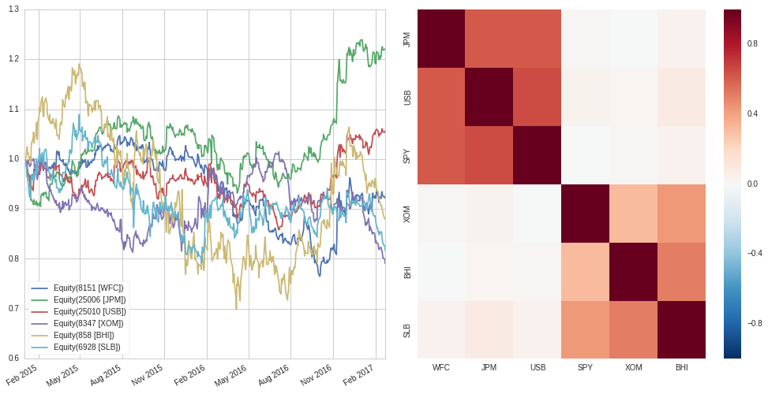
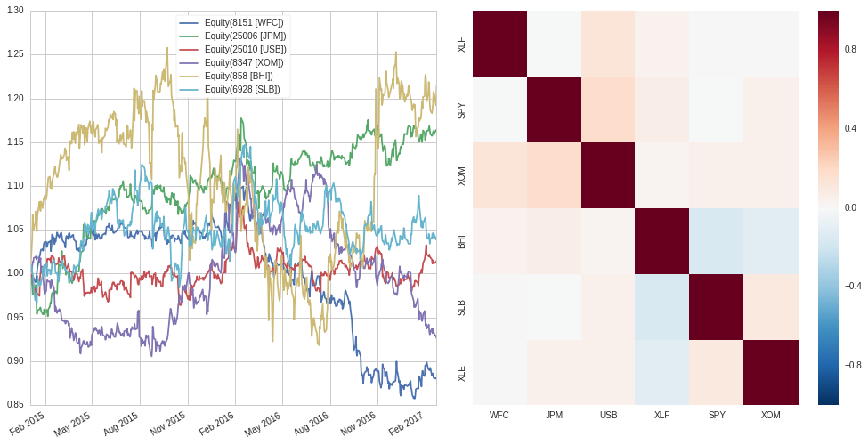

Why You Should Hedge Beta and Sector Exposures (Part I)
=======================================================

by Jonathan Larkin and Maxwell Margenot

Part of the Quantopian Lecture Series:

-  `www.quantopian.com/lectures <https://www.quantopian.com/lectures>`__
-  `github.com/quantopian/research_public <https://github.com/quantopian/research_public>`__

--------------

Whenever we have a trading strategy of any sort, we need to be
considering the impact of systematic risk. There needs to be some risk
involved in a strategy in order for there to be a return above the
risk-free rate, but systematic risk poisons the well, so to speak. By
its nature, systematic risk provides a commonality between the many
securities in the market that cannot be diversified away. As such, we
need to construct a hedge to get rid of it.

.. code:: ipython2

    import numpy as np
    import matplotlib.pyplot as plt
    import pandas as pd
    from sklearn.covariance import LedoitWolf
    import seaborn as sns
    import statsmodels.api as sm

The Fundamental Law of Asset Management
=======================================

The primary driver of the value of any strategy is whether or not it
provides a compelling risk-adjusted return, i.e., the Sharpe Ratio. As
expressed in `The Foundation of Algo
Success <https://blog.quantopian.com/the-foundation-of-algo-success/>`__
and “The Fundamental Law of Active Management”, by Richard Grinold,
Sharpe Ratio can be decomposed into two components, skill and breadth,
as:

.. math:: IR = IC \sqrt{BR}

Technically, this is the definition of the Information Ratio (IR), but
for our purposes it is equivalent to the Sharpe Ratio. The IR is the
ratio of the excess return of a portfolio over its benchmark per unit
active risk, i.e., the excess return of a long-only portfolio less its
benchmark per unit tracking error. In the time of Grinold’s publication,
however, long/short investing was a rarity. Today, in the world of hedge
funds and long/short investing, there is no benchmark. We seek absolute
returns so, in this case, the IR is equivalent to the Sharpe ratio.

In this equation, skill is measured by IC (Information Coefficient),
calculated with `Alphalens <https://github.com/quantopian/alphalens>`__.
The IC is essentially the Spearman rank correlation, used to correlate
your prediction and its realization. Breadth is measured as the number
of **independent** bets in the period. The takeaway from this “law” is
that, with any strategy, we need to:

1. Bet well (high IC),
2. Bet often (high number of bets), *and*
3. **Make independent bets**

If the bets are completely independent, then breadth is the total number
of bets we have made for every individual asset, the number of assets
times the number of periods. If the bets are not independent then the
**effective breadth** can be much much less than the number of assets.
Let’s see precisely what beta exposure and sector exposure do to
**effective breadth**.

.. container:: alert alert-warning

   TL;DR: Beta exposure and sector exposure lead to a significant
   increase in correlation among bets. Portfolios with beta and sector
   bets have very low effective breadth. In order to have high Sharpe
   then, these portfolios must have very high IC. It is easier to
   increase effective breadth by hedging beta and sector exposure than
   it is to increase your IC.

Forecasts and Bet Correlation
=============================

We define a bet as the forecast of the *residual* of a security return.
This forecast can be implicit – i.e., we buy a stock and thus implicity
we forecast that the stock will go up. What though do we mean by
*residual*? Without any fancy math, this simply means the return **less
a hedge**. Let’s work through three examples. We use the Ledoit-Wolf
covariance estimator to assess our covariance in all cases. For more
information on why we use Ledoit-Wolf instead of typical sample
covariance, check out `Estimating Covariance
Matrices <https://www.quantopian.com/lectures/estimating-covariance-matrices>`__.

Example 1: No Hedge!
~~~~~~~~~~~~~~~~~~~~

If we go long on a set of securities, but do not hold any short
positions, there is no hedge! So the *residual* is the stock return
itself.

.. math:: r_{resid,i} = r_i

Let’s see what the correlation of our bets are in this case.

.. code:: ipython2

    tickers = ['WFC', 'JPM', 'USB', 'XOM', 'BHI', 'SLB'] # The securities we want to go long on
    historical_prices = get_pricing(tickers, start_date='2015-01-01',end_date='2017-02-22') # Obtain prices
    rets = historical_prices['close_price'].pct_change().fillna(0) # Calculate returns
    lw_cov = LedoitWolf().fit(rets).covariance_ # Calculate Ledoit-Wolf estimator
    
    def extract_corr_from_cov(cov_matrix):
        # Linear algebra result:
        # https://math.stackexchange.com/questions/186959/correlation-matrix-from-covariance-matrix
        d = np.linalg.inv(np.diag(np.sqrt(np.diag(cov_matrix))))
        corr = d.dot(cov_matrix).dot(d)
        return corr

.. code:: ipython2

    fig, (ax1, ax2) = plt.subplots(ncols=2)
    fig.tight_layout()
    
    corr = extract_corr_from_cov(lw_cov)
    # Plot prices
    left = historical_prices['close_price'].plot(ax=ax1)
    # Plot covariance as a heat map
    right = sns.heatmap(corr, ax=ax2, fmt='d', vmin=-1, vmax=1, xticklabels=tickers, yticklabels=tickers)

.. image:: notebook_files/notebook_7_0.png

.. code:: ipython2

    average_corr = np.mean(corr[np.triu_indices_from(corr, k=1)])
    print 'Average pairwise correlation: %.4f' % average_corr

.. parsed-literal::

    Average pairwise correlation: 0.5644

The result here is that we have six bets and they are all very highly
correlated.

Example 2: Beta Hedge
~~~~~~~~~~~~~~~~~~~~~

In this case, we will assume that each bet is hedged against the market
(SPY). In this case, the residual is calculated as:

.. math::  r_{resid,i} = r_i - \beta_i r_i 

where :math:`\beta_i` is the beta to the market of security :math:`i`
calculated with the
`CAPM <https://www.quantopian.com/lectures/the-capital-asset-pricing-model-and-arbitrage-pricing-theory>`__
and :math:`r_i` is the return of security :math:`i`.

.. code:: ipython2

    tickers = ['WFC', 'JPM', 'USB', 'SPY', 'XOM', 'BHI', 'SLB' ] # The securities we want to go long on plus SPY
    historical_prices = get_pricing(tickers, start_date='2015-01-01',end_date='2017-02-22') # Obtain prices
    rets = historical_prices['close_price'].pct_change().fillna(0) # Calculate returns
    
    market = rets[symbols(['SPY'])]
    stock_rets = rets.drop(symbols(['SPY']), axis=1)
    residuals = stock_rets.copy()*0
    
    for stock in stock_rets.columns:
        model = sm.OLS(stock_rets[stock], market.values)
        results = model.fit()
        residuals[stock] = results.resid
    
    lw_cov = LedoitWolf().fit(residuals).covariance_ # Calculate Ledoit-Wolf Estimator

.. code:: ipython2

    fig, (ax1, ax2) = plt.subplots(ncols=2)
    fig.tight_layout()
    
    corr = extract_corr_from_cov(lw_cov)
    left = (1+residuals).cumprod().plot(ax=ax1)
    right = sns.heatmap(corr, ax=ax2, fmt='d', vmin=-1, vmax=1, xticklabels=tickers, yticklabels=tickers)

.. code:: ipython2

    average_corr = np.mean(corr[np.triu_indices_from(corr, k=1)])
    print 'Average pairwise correlation: %.4f' % average_corr

.. parsed-literal::

    Average pairwise correlation: 0.2256

The beta hedge has brought down the average correlation significanty.
Theoretically, this should improve our breadth. It is obvious that we
are left with two highly correlated clusters however. Let’s see what
happens when we hedge the sector risk.

Example 3: Sector Hedge
~~~~~~~~~~~~~~~~~~~~~~~

The sector return and the market return are themselves highly
correlated. As such, you cannot do a multivariate regression due to
multicollinearity, a classic `violation of regression
assumptions <https://www.quantopian.com/lectures/violations-of-regression-models>`__.
To hedge against both the market and a given security’s sector, you
first estimate the market beta residuals and then calculate the sector
beta on *those* residuals.

.. math::

   r_{resid,i} = r_i - \beta_i r_i \\
   r_{resid_{SECTOR},i}= r_{resid,i} - \beta_{SECTOR,i}r_{resid,i}

Here, :math:`r_{resid, i}` is the residual between the security return
and a market beta hedge and :math:`r_{resid_{SECTOR}, i}` is the
residual between *that* residual and a hedge of that residual against
the relevant sector.

.. code:: ipython2

    tickers = ['WFC', 'JPM', 'USB', 'XLF', 'SPY', 'XOM', 'BHI', 'SLB', 'XLE']
    historical_prices = get_pricing(tickers, start_date='2015-01-01',end_date='2017-02-22')
    rets = historical_prices['close_price'].pct_change().fillna(0)
    
    # Get market hedge ticker
    mkt = symbols(['SPY'])
    # Get sector hedge tickers
    sector_1_hedge = symbols(['XLF'])
    sector_2_hedge = symbols(['XLE'])
    # Identify securities for each sector
    sector_1_stocks = symbols(['WFC', 'JPM', 'USB'])
    sector_2_stocks = symbols(['XOM', 'BHI', 'SLB'])
    
    market_rets = rets[mkt]
    sector_1_rets = rets[sector_1_hedge]
    sector_2_rets = rets[sector_2_hedge]
                               
    stock_rets = rets.drop(symbols(['XLF', 'SPY', 'XLE']), axis=1)
    residuals_market = stock_rets.copy()*0
    residuals = stock_rets.copy()*0
    # Calculate market beta of sector 1 benchmark
    model = sm.OLS(sector_1_rets.values, market.values)
    results = model.fit()
    sector_1_excess = results.resid
    # Calculate market beta of sector 2 benchmark
    model = sm.OLS(sector_2_rets.values, market.values)
    results = model.fit()
    sector_2_excess = results.resid
    
    for stock in sector_1_stocks:
        # Calculate market betas for sector 1 stocks
        model = sm.OLS(stock_rets[stock], market.values)
        results = model.fit()
        # Calculate residual of security + market hedge
        residuals_market[stock] = results.resid
        # Calculate sector beta for previous residuals
        model = sm.OLS(residuals_market[stock], sector_1_excess)
        results = model.fit()
        # Get final residual
        residuals[stock] = results.resid
                               
    for stock in sector_2_stocks:
        # Calculate market betas for sector 2 stocks
        model = sm.OLS(stock_rets[stock], market.values)
        results = model.fit()
        # Calculate residual of security + market hedge
        residuals_market[stock] = results.resid
        # Calculate sector beta for previous residuals
        model = sm.OLS(residuals_market[stock], sector_2_excess)
        results = model.fit()
        # Get final residual
        residuals[stock] = results.resid
    
    # Get covariance of residuals
    lw_cov = LedoitWolf().fit(residuals).covariance_

.. code:: ipython2

    fig, (ax1, ax2) = plt.subplots(ncols=2)
    fig.tight_layout()
    
    corr = extract_corr_from_cov(lw_cov)
    left = (1+residuals).cumprod().plot(ax=ax1)
    right = sns.heatmap(corr, ax=ax2, fmt='d', vmin=-1, vmax=1, xticklabels=tickers, yticklabels=tickers)

.. code:: ipython2

    average_corr = np.mean(corr[np.triu_indices_from(corr, k=1)])
    print 'Average pairwise correlation: %.4f' % average_corr

.. parsed-literal::

    Average pairwise correlation: 0.0281

There we go! The sector hedge brought down the correlation between our
bets to close to zero.

Calculating Effective Breadth
-----------------------------

This section is based on “How to calculate breadth: An evolution of the
fundamental law of active portfolio management”, by David Buckle; Vol.
4, 6, 393-405, 2003, *Journal of Asset Management*. Buckle derives the
“semi-generalised fundamental law of active management” under several
weak assumptions. The key result of this paper (for us) is a closed-form
calculaiton of effective breadth as a function of the correlation
between bets. Buckle shows that breadth, :math:`BR`, can be modeled as

.. math:: BR = \frac{N}{1 + \rho(N -1)}

where N is the number of stocks in the portfolio and :math:`\rho` is the
assumed single correlation of the expected variation around the
forecast.

.. code:: ipython2

    def buckle_BR_const(N, rho):
        return N/(1 + rho*(N - 1))
    
    corr = np.linspace(start=0, stop=1.0, num=500)
    plt.plot(corr, buckle_BR_const(6, corr))
    plt.title('Effective Breadth as a function of Forecast Correlation (6 Stocks)')
    plt.ylabel('Effective Breadth (Number of Bets)')
    plt.xlabel('Forecast Correlation');

.. image:: notebook_files/notebook_21_0.png

Here we see that in the case of the long-only portfolio, where the
average correlation is 0.56, we are *effectively making only
approximately 2 bets*. When we hedge beta, with a resulting average
correlation of 0.22, things get a little better, *three effective bets*.
When we add the sector hedge, we get close to zero correlation, and in
this case the number of bets equals the number of assets, 6.

**More independent bets with the same IC leads to higher Sharpe ratio.**

Using this in Practice
----------------------

Trading costs money due to market impact and commissions. As such, the
post hoc implementation of a hedge is almost always suboptimal. In that
case, you are trading purely to hedge risk. It is preferable to think
about your sector and market exposure *throughout the model development
process*. Sector and market risk is naturally hedged in a pairs-style
strategy; in a cross-sectional strategy, consider de-meaning the alpha
vector by the sector average; with an event-driven strategy, consider
adding additional alphas so you can find offsetting bets in the same
sector. As a last resort, hedge with a well chosen sector ETF.

*This presentation is for informational purposes only and does not
constitute an offer to sell, a solicitation to buy, or a recommendation
for any security; nor does it constitute an offer to provide investment
advisory or other services by Quantopian, Inc. (“Quantopian”). Nothing
contained herein constitutes investment advice or offers any opinion
with respect to the suitability of any security, and any views expressed
herein should not be taken as advice to buy, sell, or hold any security
or as an endorsement of any security or company. In preparing the
information contained herein, Quantopian, Inc. has not taken into
account the investment needs, objectives, and financial circumstances of
any particular investor. Any views expressed and data illustrated herein
were prepared based upon information, believed to be reliable, available
to Quantopian, Inc. at the time of publication. Quantopian makes no
guarantees as to their accuracy or completeness. All information is
subject to change and may quickly become unreliable for various reasons,
including changes in market conditions or economic circumstances.*
