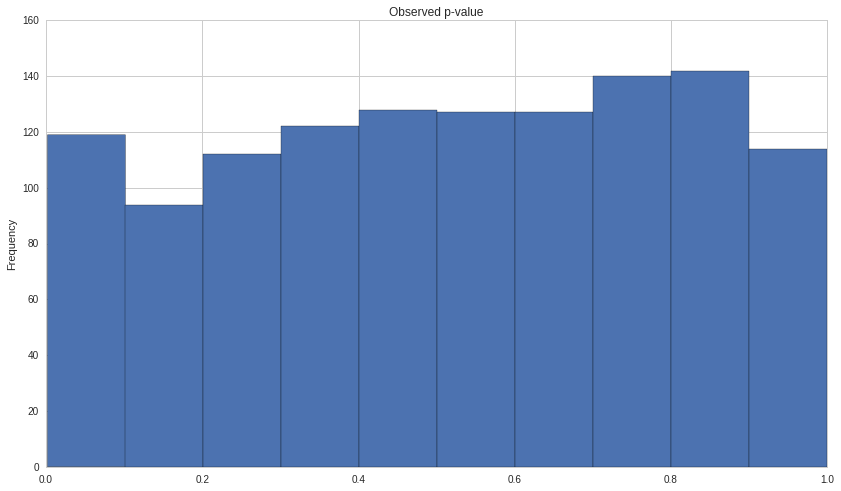
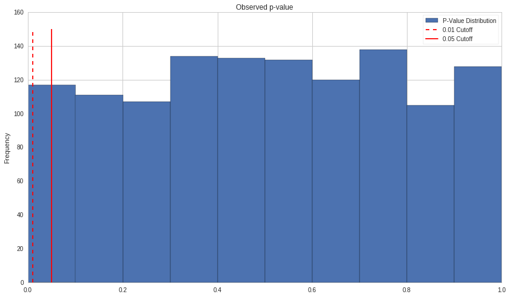

p-Hacking and Multiple Comparisons Bias
=======================================

By Delaney Mackenzie and Maxwell Margenot.

Part of the Quantopian Lecture Series:

-  `www.quantopian.com/lectures <https://www.quantopian.com/lectures>`__
-  `github.com/quantopian/research_public <https://github.com/quantopian/research_public>`__

--------------

Multiple comparisons bias is a pervasive problem in statistics, data
science, and in general forecasting/predictions. The short explanation
is that the more tests you run, the more likely you are to get an
outcome that you want/expect. If you ignore the multitude of tests that
failed, you are clearly setting yourself up for failure by
misinterpreting what’s going on in your data.

A particularly common example of this is when looking for relationships
in large data sets comprising of many indepedent series or variables. In
this case you run a test each time you evaluate whether a relationship
exists between a set of variables.

Statistics Merely Illuminates This Issue
----------------------------------------

Most folks also fall prey to multiple comparisons bias in real life. Any
time you make a decision you are effectively taking an action based on
an hypothesis. That hypothesis is often tested. You can end up
unknowingly making many tests in your daily life.

An example might be deciding which medicine is helping cure a cold you
have. Many people will take multiple medicines at once to try and get
rid of symptoms. You may think that a certain medicine worked, when in
reality none did and the cold just happened to start getting better at
some point.

The point here is that this problem doesn’t stem from statistical
testing and p-values. Rather, these techniques give us much more
information about the problem and when it might be occuring.

.. code:: ipython2

    import numpy as np
    import pandas as pd
    import scipy.stats as stats
    import matplotlib.pyplot as plt

Refresher: Spearman Rank Correlation
~~~~~~~~~~~~~~~~~~~~~~~~~~~~~~~~~~~~

Please refer to `this
lecture <https://www.quantopian.com/lectures/spearman-rank-correlation>`__
for more full info, but here is a very brief refresher on Spearman Rank
Correlation.

It’s a variation of correlation that takes into account the ranks of the
data. This can help with weird distributions or outliers that would
confuse other measures. The test also returns a p-value, which is key
here.

A higher coefficient means a stronger estimated relationship.

.. code:: ipython2

    X = pd.Series(np.random.normal(0, 1, 100))
    Y = X
    
    r_s = stats.spearmanr(Y, X)
    print 'Spearman Rank Coefficient: ', r_s[0]
    print 'p-value: ', r_s[1]

.. parsed-literal::

    Spearman Rank Coefficient:  1.0
    p-value:  0.0

If we add some noise our coefficient will drop.

.. code:: ipython2

    X = pd.Series(np.random.normal(0, 1, 100))
    Y = X + np.random.normal(0, 1, 100)
    
    r_s = stats.spearmanr(Y, X)
    print 'Spearman Rank Coefficient: ', r_s[0]
    print 'p-value: ', r_s[1]

.. parsed-literal::

    Spearman Rank Coefficient:  0.701278127813
    p-value:  4.47737717228e-16

p-value Refresher
~~~~~~~~~~~~~~~~~

For more info on p-values see `this
lecture <https://www.quantopian.com/lectures/hypothesis-testing>`__.
What’s important to remember is they’re used to test a hypothesis given
some data. Here we are testing the hypothesis that a relationship exists
between two series given the series values.

####IMPORTANT: p-values must be treated as binary.

A common mistake is that p-values are treated as more or less
significant. This is bad practice as it allows for what’s known as
`p-hacking <https://en.wikipedia.org/wiki/Data_dredging>`__ and will
result in more false positives than you expect. Effectively, you will be
too likely to convince yourself that relationships exist in your data.

To treat p-values as binary, a cutoff must be set in advance. Then the
p-value must be compared with the cutoff and treated as significant/not
signficant. Here we’ll show this.

The Cutoff is our Significance Level
~~~~~~~~~~~~~~~~~~~~~~~~~~~~~~~~~~~~

We can refer to the cutoff as our significance level because a lower
cutoff means that results which pass it are significant at a higher
level of confidence. So if you have a cutoff of 0.05, then even on
random data 5% of tests will pass based on chance. A cutoff of 0.01
reduces this to 1%, which is a more stringent test. We can therefore
have more confidence in our results.

.. code:: ipython2

    # Setting a cutoff of 5% means that there is a 5% chance
    # of us getting a significant p-value given no relationship
    # in our data (false positive).
    # NOTE: This is only true if the test's assumptions have been
    # satisfied and the test is therefore properly calibrated.
    # All tests have different assumptions.
    cutoff = 0.05
    
    X = pd.Series(np.random.normal(0, 1, 100))
    Y = X + np.random.normal(0, 1, 100)
    
    r_s = stats.spearmanr(Y, X)
    print 'Spearman Rank Coefficient: ', r_s[0]
    if r_s[1] < cutoff:
        print 'There is significant evidence of a relationship.'
    else:
        print 'There is not significant evidence of a relationship.'

.. parsed-literal::

    Spearman Rank Coefficient:  0.712859285929
    There is significant evidence of a relationship.

Experiment - Running Many Tests
-------------------------------

We’ll start by defining a data frame.

.. code:: ipython2

    df = pd.DataFrame()

Now we’ll populate it by adding ``N`` randomly generated timeseries of
length ``T``.

.. code:: ipython2

    N = 20
    T = 100
    
    for i in range(N):
        X = np.random.normal(0, 1, T)
        X = pd.Series(X)
        name = 'X%s' % i
        df[name] = X

.. code:: ipython2

    df.head()

.. raw:: html

    

    <table border="1" class="dataframe">
      <thead>
        <tr style="text-align: right;">
          <th></th>
          <th>X0</th>
          <th>X1</th>
          <th>X2</th>
          <th>X3</th>
          <th>X4</th>
          <th>X5</th>
          <th>X6</th>
          <th>X7</th>
          <th>X8</th>
          <th>X9</th>
          <th>X10</th>
          <th>X11</th>
          <th>X12</th>
          <th>X13</th>
          <th>X14</th>
          <th>X15</th>
          <th>X16</th>
          <th>X17</th>
          <th>X18</th>
          <th>X19</th>
        </tr>
      </thead>
      <tbody>
        <tr>
          <th>0</th>
          <td>0.003398</td>
          <td>-0.144477</td>
          <td>-0.264571</td>
          <td>-0.446171</td>
          <td>-1.796904</td>
          <td>-0.337402</td>
          <td>-0.932036</td>
          <td>0.197074</td>
          <td>-0.602790</td>
          <td>-1.566984</td>
          <td>0.481944</td>
          <td>-0.388371</td>
          <td>-0.271313</td>
          <td>0.369861</td>
          <td>-1.349012</td>
          <td>-0.461832</td>
          <td>-0.082507</td>
          <td>0.131566</td>
          <td>0.747419</td>
          <td>0.300860</td>
        </tr>
        <tr>
          <th>1</th>
          <td>0.065948</td>
          <td>-0.578287</td>
          <td>-0.406458</td>
          <td>0.749940</td>
          <td>1.555616</td>
          <td>-1.473557</td>
          <td>1.197403</td>
          <td>0.546267</td>
          <td>0.428453</td>
          <td>-0.540101</td>
          <td>-0.458922</td>
          <td>0.509046</td>
          <td>-1.947394</td>
          <td>-0.245362</td>
          <td>-0.004364</td>
          <td>-0.147721</td>
          <td>-0.080884</td>
          <td>-1.428521</td>
          <td>-0.058653</td>
          <td>0.691348</td>
        </tr>
        <tr>
          <th>2</th>
          <td>-1.313196</td>
          <td>0.410431</td>
          <td>0.175016</td>
          <td>-0.016276</td>
          <td>-1.313580</td>
          <td>0.811902</td>
          <td>-0.288606</td>
          <td>1.148393</td>
          <td>-0.539966</td>
          <td>-0.784766</td>
          <td>0.997860</td>
          <td>0.077192</td>
          <td>0.003534</td>
          <td>0.596858</td>
          <td>-0.134513</td>
          <td>0.731397</td>
          <td>-1.191697</td>
          <td>0.555361</td>
          <td>-1.580280</td>
          <td>1.454631</td>
        </tr>
        <tr>
          <th>3</th>
          <td>0.701392</td>
          <td>-1.300107</td>
          <td>1.637737</td>
          <td>0.480279</td>
          <td>-1.638725</td>
          <td>-1.383335</td>
          <td>-1.131033</td>
          <td>0.324741</td>
          <td>-1.338035</td>
          <td>0.088153</td>
          <td>-1.962547</td>
          <td>0.297710</td>
          <td>0.221197</td>
          <td>-0.826667</td>
          <td>-0.193141</td>
          <td>-0.889288</td>
          <td>0.529142</td>
          <td>-0.799146</td>
          <td>0.213504</td>
          <td>-0.782524</td>
        </tr>
        <tr>
          <th>4</th>
          <td>-0.746462</td>
          <td>1.834684</td>
          <td>-0.053429</td>
          <td>-0.327324</td>
          <td>1.129058</td>
          <td>-0.442510</td>
          <td>0.886439</td>
          <td>-1.170066</td>
          <td>0.572916</td>
          <td>-0.064708</td>
          <td>0.347081</td>
          <td>-0.117600</td>
          <td>0.247260</td>
          <td>1.131062</td>
          <td>1.184124</td>
          <td>0.011468</td>
          <td>0.380755</td>
          <td>0.908365</td>
          <td>0.203786</td>
          <td>1.063872</td>
        </tr>
      </tbody>
    </table>
    

Now we’ll run a test on all pairs within our data looking for instances
where our p-value is below our defined cutoff of 5%.

.. code:: ipython2

    cutoff = 0.05
    
    significant_pairs = []
    
    for i in range(N):
        for j in range(i+1, N):
            Xi = df.iloc[:, i]
            Xj = df.iloc[:, j]
            
            results = stats.spearmanr(Xi, Xj)
            
            pvalue = results[1]
            
            if pvalue < cutoff:
                significant_pairs.append((i, j))

Before we check how many significant results we got, let’s run out some
math to check how many we’d expect. The formula for the number of pairs
given N series is

.. math:: \frac{N(N-1)}{2}

There are no relationships in our data as it’s all randomly generated.
If our test is properly calibrated we should expect a false positive
rate of 5% given our 5% cutoff. Therefore we should expect the following
number of pairs that achieved significance based on pure random chance.

.. code:: ipython2

    (N * (N-1) / 2) * 0.05

.. parsed-literal::

    9.5

Now let’s compare to how many we actually found.

.. code:: ipython2

    len(significant_pairs)

.. parsed-literal::

    7

We shouldn’t expect the numbers to match too closely here on a
consistent basis as we’ve only run one experiment. If we run many of
these experiments we should see a convergence to what we’d expect.

Repeating the Experiment
~~~~~~~~~~~~~~~~~~~~~~~~

.. code:: ipython2

    def do_experiment(N, T, cutoff=0.05):
        df = pd.DataFrame()
    
        # Make random data
        for i in range(N):
            X = np.random.normal(0, 1, T)
            X = pd.Series(X)
            name = 'X%s' % i
            df[name] = X
    
        significant_pairs = []
    
        # Look for relationships
        for i in range(N):
            for j in range(i+1, N):
                Xi = df.iloc[:, i]
                Xj = df.iloc[:, j]
    
                results = stats.spearmanr(Xi, Xj)
    
                pvalue = results[1]
    
                if pvalue < cutoff:
                    significant_pairs.append((i, j))
        
        return significant_pairs
    
    
    num_experiments = 100
    
    results = np.zeros((num_experiments,))
    
    for i in range(num_experiments):
        # Run a single experiment
        result = do_experiment(20, 100, cutoff=0.05)
        
        # Count how many pairs
        n = len(result)
        
        # Add to array
        results[i] = n

The average over many experiments should be closer.

.. code:: ipython2

    np.mean(results)

.. parsed-literal::

    9.8900000000000006

Visualizing What’s Going On
---------------------------

What’s happening here is that p-values should be uniformly distributed,
given no signal in the underlying data. Basically, they carry no
information whatsoever and will be equally likely to be 0.01 as 0.99.
Because they’re popping out randomly, you will expect a certain
percentage of p-values to be underneath any threshold you choose. The
lower the threshold the fewer will pass your test.

Let’s visualize this by making a modified function that returns
p-values.

.. code:: ipython2

    def get_pvalues_from_experiment(N, T):
        df = pd.DataFrame()
    
        # Make random data
        for i in range(N):
            X = np.random.normal(0, 1, T)
            X = pd.Series(X)
            name = 'X%s' % i
            df[name] = X
    
        pvalues = []
    
        # Look for relationships
        for i in range(N):
            for j in range(i+1, N):
                Xi = df.iloc[:, i]
                Xj = df.iloc[:, j]
    
                results = stats.spearmanr(Xi, Xj)
    
                pvalue = results[1]
    
                pvalues.append(pvalue)
        
        return pvalues

We’ll now collect a bunch of pvalues. As in any case we’ll want to
collect quite a number of p-values to start getting a sense of how the
underlying distribution looks. If we only collect few, it will be noisy
like this:

.. code:: ipython2

    pvalues = get_pvalues_from_experiment(10, 100)
    plt.hist(pvalues)
    plt.ylabel('Frequency')
    plt.title('Observed p-value');

.. image:: notebook_files/notebook_28_0.png

Let’s dial up our ``N`` parameter to get a better sense. Keep in mind
that the number of p-values will increase at a rate of

.. math:: \frac{N (N-1)}{2}

or approximately quadratically. Therefore we don’t need to increase
``N`` by much.

.. code:: ipython2

    pvalues = get_pvalues_from_experiment(50, 100)
    plt.hist(pvalues)
    plt.ylabel('Frequency')
    plt.title('Observed p-value');

Starting to look pretty flat, as we expected. Lastly, just to visualize
the process of drawing a cutoff, we’ll draw two artificial lines.

.. code:: ipython2

    pvalues = get_pvalues_from_experiment(50, 100)
    plt.vlines(0.01, 0, 150, colors='r', linestyle='--', label='0.01 Cutoff')
    plt.vlines(0.05, 0, 150, colors='r', label='0.05 Cutoff')
    plt.hist(pvalues, label='P-Value Distribution')
    plt.legend()
    plt.ylabel('Frequency')
    plt.title('Observed p-value');

We can see that with a lower cutoff we should expect to get fewer false
positives. Let’s check that with our above experiment.

.. code:: ipython2

    num_experiments = 100
    
    results = np.zeros((num_experiments,))
    
    for i in range(num_experiments):
        # Run a single experiment
        result = do_experiment(20, 100, cutoff=0.01)
        
        # Count how many pairs
        n = len(result)
        
        # Add to array
        results[i] = n

.. code:: ipython2

    np.mean(results)

.. parsed-literal::

    2.1699999999999999

And finally compare it to what we expected.

.. code:: ipython2

    (N * (N-1) / 2) * 0.01

.. parsed-literal::

    1.9000000000000001

Sensitivity / Specificity Tradeoff
----------------------------------

As with any adjustment of p-value cutoff, we have a tradeoff. A lower
cutoff decreases the rate of false positives, but also decreases the
chance we find a real relationship (true positive). So you can’t just
decrease your cutoff to solve this problem.

https://en.wikipedia.org/wiki/Sensitivity_and_specificity

Reducing Multiple Comparisons Bias
----------------------------------

You can’t really eliminate multiple comparisons bias, but you can reduce
how much it impacts you. To do so we have two options.

Option 1: Run fewer tests.
~~~~~~~~~~~~~~~~~~~~~~~~~~

This is often the best option. Rather than just sweeping around hoping
you hit an interesting signal, use your expert knowledge of the system
to develop a great hypothesis and test that. This process of exploring
the data, coming up with a hypothesis, then gathering more data and
testing the hypothesis on the new data is considered the gold standard
in statistical and scientific research. It’s crucial that the data set
on which you develop your hypothesis is not the one on which you test
it. Because you found the effect while exploring, the test will likely
pass and not really tell you anything. What you want to know is how
consistent the effect is. Moving to new data and testing there will not
only mean you only run one test, but will be an ‘unbiased estimator’ of
whether your hypothesis is true. We discuss this a lot in other
lectures.

Option 2: Adjustment Factors and Bon Ferroni Correction
~~~~~~~~~~~~~~~~~~~~~~~~~~~~~~~~~~~~~~~~~~~~~~~~~~~~~~~

WARNING: This section gets a little technical. Unless you’re comfortable with significance levels, we recommend looking at the code examples first and maybe reading the linked articles before fully diving into the text.
^^^^^^^^^^^^^^^^^^^^^^^^^^^^^^^^^^^^^^^^^^^^^^^^^^^^^^^^^^^^^^^^^^^^^^^^^^^^^^^^^^^^^^^^^^^^^^^^^^^^^^^^^^^^^^^^^^^^^^^^^^^^^^^^^^^^^^^^^^^^^^^^^^^^^^^^^^^^^^^^^^^^^^^^^^^^^^^^^^^^^^^^^^^^^^^^^^^^^^^^^^^^^^^^^^^^^^^^^^^

If you must run many tests, try to correct your p-values. This means
applying a correction factor to the cutoff you desire to obtain the one
actually used when determining whether p-values are significant. The
most conservative and common correction factor is Bon Ferroni.

Example: Bon Ferroni Correction
~~~~~~~~~~~~~~~~~~~~~~~~~~~~~~~

The concept behind Bon Ferroni is quite simple. It just says that if we
run :math:`m` tests, and we have a significance level/cutoff of
:math:`a`, then we should use :math:`a/m` as our new cutoff when
determining significance. The math works out because of the following.

Let’s say we run :math:`m` tests. We should expect to see :math:`ma`
false positives based on random chance that pass out cutoff. If we
instead use :math:`a/m` as our cutoff, then we should expect to see
:math:`ma/m = a` tests that pass our cutoff. Therefore we are back to
our desired false positive rate of :math:`a`.

Let’s try it on our experiment above.

.. code:: ipython2

    num_experiments = 100
    
    results = np.zeros((num_experiments,))
    
    N = 20
    
    T = 100
    
    desired_level = 0.05
    
    num_tests = N * (N - 1) / 2
    
    new_cutoff = desired_level / num_tests
    
    for i in range(num_experiments):
        # Run a single experiment
        result = do_experiment(20, 100, cutoff=new_cutoff)
        
        # Count how many pairs
        n = len(result)
        
        # Add to array
        results[i] = n

.. code:: ipython2

    np.mean(results)

.. parsed-literal::

    0.080000000000000002

As you can see, our number of significant results is now far lower on
average. Which is good because the data was random to begin with.

These are Often Overly Conservative
~~~~~~~~~~~~~~~~~~~~~~~~~~~~~~~~~~~

Because Bon Ferroni is so stringent, you can often end up passing over
real relationships. There is a good example in the following article

https://en.wikipedia.org/wiki/Multiple_comparisons_problem

Effectively, it assumes that all the tests you are running are
independent, and doesn’t take into account any structure in your data.
You may be able to design a more finely tuned correction factor, but
this is adding a layer of complexity and therefore a point of failure to
your research. In general any time you relax your stringency, you need
to be very careful not to make a mistake.

Because of the over-zealousness of Bon Ferroni, often running fewer
tests is the better option. Or, if you must run many tests, reserve
multiple sets of data so your candidate signals can undergo an
out-of-sample round of testing. For example, you might have the
following flow:

-  Let’s say there are 100,000 possible relationships.
-  Run a test on each possible relationship, and pick those that passed
   the test.
-  With these candidates, run a test on a new out-of-sample set of data.
   Because you have many fewer candidates, you can now apply a Bon
   Ferroni correction to these p-values, or if necessary repeat another
   round of out-of-sample testing.

What is p-Hacking?
==================

p-hacking is just intentional or accidental abuse of multiple
comparisons bias. It is surprisingly common, even in academic
literature. The excellent statistical news website FiveThirtyEight has a
great visualization here:

https://fivethirtyeight.com/features/science-isnt-broken/

Wikipedia’s article is also informative:

https://en.wikipedia.org/wiki/Data_dredging

In general, the concept is simple. By running many tests or experiments
and then focusing only on the ones that worked, you can present false
positives as real results. Keep in mind that this also applies to
running many different models or different types of experiments and on
different data sets. Imagine that you spend a summer researching a new
model to forecast corn future prices. You try 50 different models until
finally one succeeds. Is this just luck at this point? Certainly you
would want to be more careful about validating that model and testing it
out-of-sample on new data before believing that it works.

Final Notes
===========

You can never eliminate, only reduce risk.
------------------------------------------

In general you can never completely eliminate multiple comparisons bias,
you can only reduce the risk of false positives using techniques we
described above. At the end of the day most ideas tried in research
don’t work, so you’ll end up testing many different hypotheses over
time. Just try to be careful and use common sense about whether there is
sufficient evidence that a hypothesis is true, or that you just happened
to get lucky on this iteration.

Use Out-of-Sample Testing
-------------------------

As mentioned above, out-of-sample testing is one of the best ways to
reduce your risk. You should always use it, no matter the circumstances.
Often one of the ways that false positives make it through your workflow
is a lack of an out-of-sample test at the end.

####Sources

-  https://en.wikipedia.org/wiki/Multiple_comparisons_problem
-  https://en.wikipedia.org/wiki/Sensitivity_and_specificity
-  https://en.wikipedia.org/wiki/Bonferroni_correction
-  https://fivethirtyeight.com/features/science-isnt-broken/

*This presentation is for informational purposes only and does not
constitute an offer to sell, a solicitation to buy, or a recommendation
for any security; nor does it constitute an offer to provide investment
advisory or other services by Quantopian, Inc. (“Quantopian”). Nothing
contained herein constitutes investment advice or offers any opinion
with respect to the suitability of any security, and any views expressed
herein should not be taken as advice to buy, sell, or hold any security
or as an endorsement of any security or company. In preparing the
information contained herein, Quantopian, Inc. has not taken into
account the investment needs, objectives, and financial circumstances of
any particular investor. Any views expressed and data illustrated herein
were prepared based upon information, believed to be reliable, available
to Quantopian, Inc. at the time of publication. Quantopian makes no
guarantees as to their accuracy or completeness. All information is
subject to change and may quickly become unreliable for various reasons,
including changes in market conditions or economic circumstances.*
