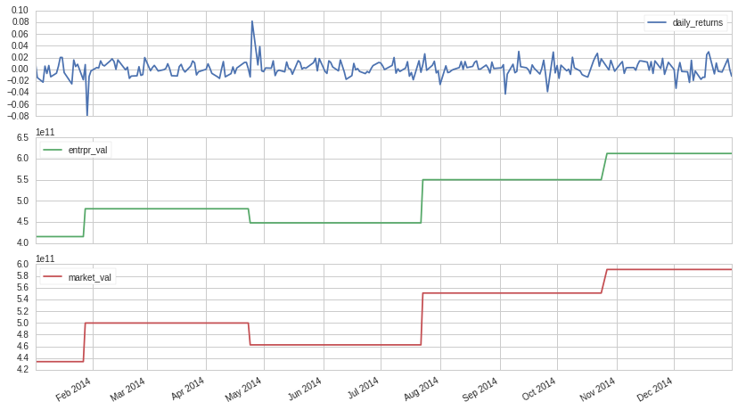

Data Exploration
----------------

Research provides utility functions to query pricing, volume, and
returns data for 8000+ US equities, from 2004 up to the most recently
completed trading day. These functions take an asset (or list of assets)
along with a start and end date, and return a pandas
`Series <http://pandas.pydata.org/pandas-docs/version/0.18/generated/pandas.Series.html>`__
(or
`DataFrame <http://pandas.pydata.org/pandas-docs/version/0.18/generated/pandas.DataFrame.html>`__)
indexed by date.

Let’s define the period of time we want to explore and use the
``returns`` function to query data for AAPL:

.. code:: ipython2

    # Research environment functions
    from quantopian.research import returns, symbols
    
    # Select a time range to inspect
    period_start = '2014-01-01'
    period_end = '2014-12-31'
    
    # Query returns data for AAPL
    # over the selected time range
    aapl_returns = returns(
        assets=symbols('AAPL'),
        start=period_start,
        end=period_end,
    )
    
    # Display first 10 rows
    aapl_returns.head(10)

.. parsed-literal::

    2014-01-02 00:00:00+00:00   -0.014137
    2014-01-03 00:00:00+00:00   -0.022027
    2014-01-06 00:00:00+00:00    0.005376
    2014-01-07 00:00:00+00:00   -0.007200
    2014-01-08 00:00:00+00:00    0.006406
    2014-01-09 00:00:00+00:00   -0.012861
    2014-01-10 00:00:00+00:00   -0.006674
    2014-01-13 00:00:00+00:00    0.005043
    2014-01-14 00:00:00+00:00    0.020123
    2014-01-15 00:00:00+00:00    0.020079
    Freq: C, Name: Equity(24 [AAPL]), dtype: float64

FactSet Fundamentals
~~~~~~~~~~~~~~~~~~~~

In addition to pricing and volume data, Quantopian integrates corporate
fundamentals data sourced from FactSet. Over 800 fundamental data fields
are available, and you can find the full list on `this reference
page <https://factset.quantopian.com/help/fundamentals>`__.

Our goal in this tutorial will be to build an algorithm that selects and
trades assets based on pricing and fundamentals data. We can start by
inspecting the data using Quantopian’s Pipeline API, which is a powerful
tool you will use over and over again to access and analyze data in
Research. You will learn a lot more about the Pipeline API in the next
lesson. For now all you need to know is that the following code uses a
data pipeline to query market cap, enterprise value, and returns data,
and plots the results for AAPL:

.. code:: ipython2

    # Pipeline imports
    from quantopian.research import run_pipeline
    from quantopian.pipeline import Pipeline
    from quantopian.pipeline.factors import Returns
    from quantopian.pipeline.data import factset
    
    # Pipeline definition
    def make_pipeline():
    
        returns = Returns(window_length=2)
        market_val = factset.Fundamentals.mkt_val.latest
        entrpr_val = factset.Fundamentals.entrpr_val_qf.latest
    
        return Pipeline(
            columns={
                'daily_returns': returns,
                'market_val': market_val,
                'entrpr_val': entrpr_val,
            },
        )
    
    # Pipeline execution
    data_output = run_pipeline(
        make_pipeline(),
        start_date=period_start,
        end_date=period_end
    )
    
    # Filter results for AAPL
    aapl_output = data_output.xs(
        symbols('AAPL'),
        level=1
    )
    
    # Plot results for AAPL
    aapl_output.plot(subplots=True);

In the next lesson we will cover the Pipeline API in more depth.
