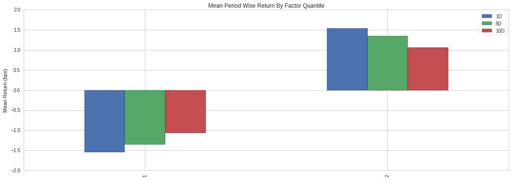
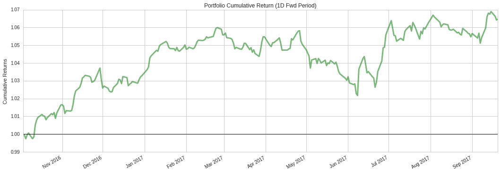

Strategy Definition
-------------------

Now that we have learned how to access and manipulate data in
Quantopian, let’s construct a data pipeline for our long-short equity
strategy. In general, long-short equity strategies consist of modeling
the relative value of assets with respect to each other, and placing
bets on the sets of assets that we are confident will increase (long)
and decrease (short) the most in value.

Long-short equity strategies profit as the spread in returns between the
sets of high and low value assets increases. The quality of a long-short
equity strategy relies entirely on the quality of its underling ranking
model. In this tutorial we will use a simple ranking schema for our
strategy:

**Strategy**: We will score assets based on two factors -> short-term to
long-term average price ratio (mean reversion), and free cash flow to
enterprise value ratio. Assets with a combined high score will be
considered high value, while assets with a combined low score will be
considered low value.

Strategy Analysis
-----------------

First, we will define our mean reversion factor using
``SimpleMovingAverage`` and ``USEquityPricing.close``. We will try to
capitalize on assets whose prices deviate, on the short term, from their
long-term average. Assets with ratios greater than 1 should get low
scores, while assets with ratios lower than 1 should get high scores:

.. code:: ipython2

    # Pipeline imports
    from quantopian.pipeline.data.builtin import USEquityPricing
    from quantopian.pipeline.factors import SimpleMovingAverage
    
    # Mean Reversion Factor
    sma60 = SimpleMovingAverage(
        inputs=[USEquityPricing.close],
        window_length=60
    )
    sma5 = SimpleMovingAverage(
        inputs=[USEquityPricing.close],
        window_length=5
    )
    
    mean_reversion_factor = 1 - (sma5 / sma60)

To calculate our valuation ratio we can simply get the latest value for
both free cash flow and enterprise value, and divide:

.. code:: ipython2

    # Pipeline imports
    from quantopian.pipeline.data import factset
    
    # Free Cash Flow to Enterprise Value Factor
    free_cf_to_entrpr_val_factor = (
        factset.Fundamentals.free_cf_fcfe_qf.latest /
        factset.Fundamentals.entrpr_val_qf.latest
    )

Let’s build a Pipeline definition using these factors, along with the
trading universe we created in the previous lesson. We will combine both
factors by adding their z-scores:

.. code:: ipython2

    # Pipeline imports
    from quantopian.pipeline import Pipeline
    from quantopian.pipeline.data.builtin import USEquityPricing
    from quantopian.pipeline.data import factset
    from quantopian.pipeline.factors import (
        AverageDollarVolume,
        SimpleMovingAverage,
    )
    
    # Pipeline definition
    def make_pipeline():
        # Universe Selection
        mcap_filter = factset.Fundamentals.mkt_val.latest > 500000000
        adv_filter = AverageDollarVolume(window_length=200) > 2500000
        price_filter = USEquityPricing.close.latest > 5
    
        universe = mcap_filter & adv_filter & price_filter
    
        # Mean Reversion Factor
        sma60 = SimpleMovingAverage(
            inputs=[USEquityPricing.close],
            window_length=60
        )
        sma5 = SimpleMovingAverage(
            inputs=[USEquityPricing.close],
            window_length=5
        )
    
        mean_reversion_factor = 1 - (sma5 / sma60)
    
        # Free Cash Flow to Enterprise Value Factor
        free_cf_to_entrpr_val_factor = (
            factset.Fundamentals.free_cf_fcfe_qf.latest /
            factset.Fundamentals.entrpr_val_qf.latest
        )
    
        alpha = (
            mean_reversion_factor.zscore(mask=universe) +
            free_cf_to_entrpr_val_factor.zscore(mask=universe)
        )
    
        return Pipeline(
            columns={
                'alpha': alpha,
            },
            screen=alpha.notnull()
        )

Notice we passed our universe as the ``mask`` parameter of ``zscore``.
This ensures that only assets in our universe are taken into account
when computing z-scores. Also, our Pipeline definition now filters out
assets for which no alpha value was calculated (``alpha.notnull()``).

Next, let’s execute our pipeline over the period of time we want to
analyze. This will take ~1 minute.

.. code:: ipython2

    # Import run_pipeline method
    from quantopian.research import run_pipeline
    
    # Specify a time range to evaluate
    period_start = '2016-10-03'
    period_end = '2017-10-03'
    
    # Execute pipeline over evaluation period
    pipeline_output = run_pipeline(
        make_pipeline(),
        start_date=period_start,
        end_date=period_end
    )

In addition to our pipeline’s data, we will need pricing data for all
assets present in this period. We can easily get a list of these assets
from our pipeline output’s index, and pass that list to ``prices`` to
get the pricing data we need:

.. code:: ipython2

    # Import prices function
    from quantopian.research import prices
    
    # Get list of unique assets from the pipeline output
    asset_list = pipeline_output.index.levels[1].unique()
    
    # Query pricing data for all assets present during
    # evaluation period
    asset_prices = prices(
        asset_list,
        start=period_start,
        end=period_end
    )

Now we can use Quantopian’s open source factor analysis tool,
`Alphalens <https://factset.quantopian.com/lectures/factor-analysis>`__,
to test the quality of our selection strategy. First, let’s combine our
factor and pricing data using ``get_clean_factor_and_forward_returns``.
This function classifies our factor data into quantiles and computes
forward returns for each security for multiple holding periods. We will
separate our factor data into 2 quantiles (the top and bottom half), and
use 1, 5 and 10 day holding periods:

.. code:: ipython2

    # Import Alphalens
    import alphalens as al
    
    # Get asset forward returns and quantile classification
    # based on sentiment scores
    factor_data = al.utils.get_clean_factor_and_forward_returns(
        factor=pipeline_output['alpha'],
        prices=asset_prices,
        quantiles=2,
        periods=(1,5,10),
    )
    
    # Display first 5 rows
    factor_data.head(5)

.. parsed-literal::

    Dropped 4.2% entries from factor data: 4.2% in forward returns computation and 0.0% in binning phase (set max_loss=0 to see potentially suppressed Exceptions).
    max_loss is 35.0%, not exceeded: OK!

.. raw:: html

    

    <table border="1" class="dataframe">
      <thead>
        <tr style="text-align: right;">
          <th></th>
          <th></th>
          <th>1D</th>
          <th>5D</th>
          <th>10D</th>
          <th>factor</th>
          <th>factor_quantile</th>
        </tr>
        <tr>
          <th>date</th>
          <th>asset</th>
          <th></th>
          <th></th>
          <th></th>
          <th></th>
          <th></th>
        </tr>
      </thead>
      <tbody>
        <tr>
          <th rowspan="5" valign="top">2016-10-03 00:00:00+00:00</th>
          <th>Equity(2 [ARNC])</th>
          <td>0.006897</td>
          <td>0.037183</td>
          <td>-0.132938</td>
          <td>0.415877</td>
          <td>2</td>
        </tr>
        <tr>
          <th>Equity(24 [AAPL])</th>
          <td>0.004441</td>
          <td>0.031467</td>
          <td>0.044881</td>
          <td>-0.548061</td>
          <td>1</td>
        </tr>
        <tr>
          <th>Equity(31 [ABAX])</th>
          <td>0.004126</td>
          <td>0.035496</td>
          <td>0.008173</td>
          <td>-0.052883</td>
          <td>1</td>
        </tr>
        <tr>
          <th>Equity(39 [DDC])</th>
          <td>-0.051478</td>
          <td>-0.044280</td>
          <td>-0.035664</td>
          <td>-2.006637</td>
          <td>1</td>
        </tr>
        <tr>
          <th>Equity(52 [ABM])</th>
          <td>-0.017141</td>
          <td>-0.027918</td>
          <td>-0.051449</td>
          <td>-0.553338</td>
          <td>1</td>
        </tr>
      </tbody>
    </table>
    

Having our data in this format allows us to use several of Alphalens’s
analysis and plotting tools. Let’s start by looking at the mean returns
by quantile over the entire period. Because our goal is to build a
long-short strategy, we want to see the lower quantile (1) have negative
returns and the upper quantile(2) have positive returns:

.. code:: ipython2

    # Calculate mean return by factor quantile
    mean_return_by_q, std_err_by_q = al.performance.mean_return_by_quantile(factor_data)
    
    # Plot mean returns by quantile and holding period
    # over evaluation time range
    al.plotting.plot_quantile_returns_bar(
        mean_return_by_q.apply(
            al.utils.rate_of_return,
            axis=0,
            args=('1D',)
        )
    );

We can also plot the cumulative returns of a factor-weighted long-short
portfolio with a 1 day holding period using the following code:

.. code:: ipython2

    # Calculate factor-weighted long-short portfolio returns
    ls_factor_returns = al.performance.factor_returns(factor_data)
    
    # Plot cumulative returns for 1 day holding period
    al.plotting.plot_cumulative_returns(ls_factor_returns['1D'], '1D');

The plot above shows a large drawdown period, and this analysis does not
yet take into account transaction costs or market impact. It is not a
very promising strategy. At this point we really should conduct a deeper
analysis using Alphalens and then iterate on our strategy idea. But for
the sake of this tutorial, let’s continue with our strategy as it is.

Having defined and tested a strategy, let’s use it to build and test a
long-short equity algorithm. The rest of the tutorial will cover the
Algorithm API and will take place in the Interactive Development
Environment (IDE).
