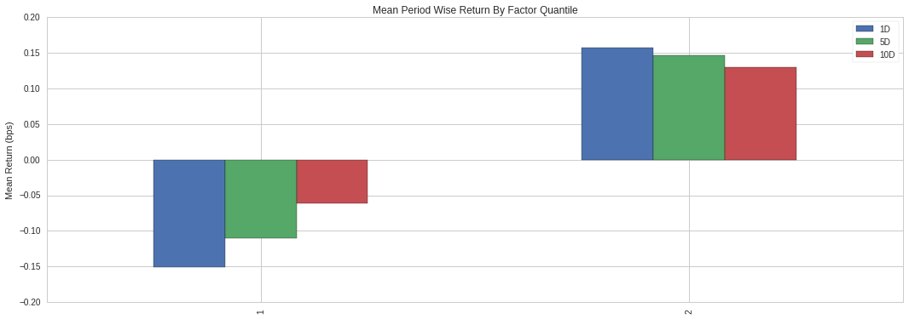
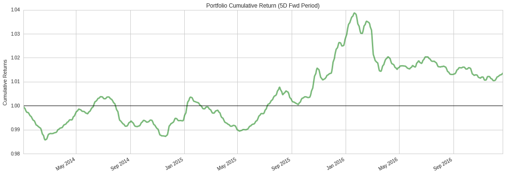

Strategy Definition
-------------------

Now that we have learned how to access and manipulate data in
Quantopian, let’s construct a data pipeline for our long-short equity
strategy. In general, long-short equity strategies consist of modeling
the relative value of assets with respect to each other, and placing
bets on the sets of assets that we are confident will increase
(`long <https://www.investopedia.com/terms/l/long.asp>`__) and decrease
(`short <https://www.investopedia.com/terms/s/short.asp>`__) the most in
value.

Long-short equity strategies profit as the spread in returns between the
sets of high and low value assets increases. The quality of long-short
equity strategy relies entirely on the quality of its underling ranking
model. In this tutorial we will use a simple ranking schema for our
strategy:

**Strategy**: We will consider assets with a high 3 day average
sentiment score as high value, and assets with a low 3 day average
sentiment score as low value.

Strategy Analysis
-----------------

We can define the strategy above using ``SimpleMovingAverage`` and
sentdex ``sentiment`` dataset, similar to the pipeline we created in the
previous lesson:

.. code:: ipython3

    # Import Pipeline class and datasets
    from quantopian.pipeline import Pipeline
    from quantopian.pipeline.data import EquityPricing
    from quantopian.pipeline.domain import US_EQUITIES
    from quantopian.pipeline.data.sentdex import sentiment
    
    # Import built-in moving average calculation
    from quantopian.pipeline.factors import SimpleMovingAverage
    
    # Import built-in trading universe
    from quantopian.pipeline.filters import QTradableStocksUS
    
    
    # Pipeline definition
    def make_pipeline():
        # Create a reference to our trading universe
        base_universe = QTradableStocksUS()
    
        # Calculate 3 day average of sentiment scores
        sentiment_score = SimpleMovingAverage(
            inputs=[sentiment.sentiment_signal],
            window_length=3,
        )
    
        # Return Pipeline containing sentiment_score that has our trading universe as a screen
        return Pipeline(
            columns={
                'close_price': close_price,
                'sentiment_score': sentiment_score,
            },
            screen=base_universe,
            domain=US_EQUITIES,
        )

For simplicity, we will only analyze the top 350 and bottom 350 stocks
ranked by ``sentiment_mean``. We can create pipeline filters for these
sets using the ``top`` and ``bottom`` methods of our ``sentiment_mean``
output, and combine them using the ``|`` operator to get their union.
Then, we will remove anything outside of our tradable universe by using
the ``&amp;`` operator to get the intersection between our filter and
our universe:

.. code:: ipython3

    # Pipeline imports
    from quantopian.pipeline import Pipeline
    from quantopian.pipeline.data.sentdex import sentiment
    
    from quantopian.pipeline.factors import SimpleMovingAverage
    from quantopian.pipeline.filters import QTradableStocksUS
    
    # Pipeline definition
    def  make_pipeline():
        # Create a reference to our trading universe
        base_universe = QTradableStocksUS()
    
        # Calculate 3 day average of sentiment scores
        sentiment_score = SimpleMovingAverage(
            inputs=[sentiment.sentiment_signal],
            window_length=3,
        )
    
        # Create filter for top 350 and bottom 350
        # assets based on their sentiment scores
        top_bottom_scores = (
            sentiment_score.top(350) | sentiment_score.bottom(350)
        )
    
        return Pipeline(
            columns={
                'sentiment_score': sentiment_score,
            },
            # Set screen as the intersection between our trading universe and our filter 
            screen=(
                base_universe
                & top_bottom_scores
            )
        )

Next, let’s run our pipeline over a 3 year period to get an output we
can use for our analysis. This will take ~3 minutes.

.. code:: ipython3

    # Import run_pipeline method
    from quantopian.research import run_pipeline
    
    # Specify a time range to evaluate
    period_start = '2014-01-01'
    period_end = '2017-01-01'
    
    # Execute pipeline over evaluation period
    pipeline_output = run_pipeline(
        make_pipeline(),
        start_date=period_start,
        end_date=period_end
    )

.. parsed-literal::

    

.. raw:: html

    <b>Pipeline Execution Time:</b> 2 Minutes, 45.56 Seconds

In addition to sentiment data, we will need pricing data for all assets
present in this period. We can easily get a list of these assets from
our pipeline output’s index, and pass that list to ``prices`` to get the
pricing data we need:

.. code:: ipython3

    # Import prices function
    from quantopian.research import prices
    
    # Get list of unique assets from the pipeline output
    asset_list = pipeline_output.index.get_level_values(level=1).unique()
    
    # Query pricing data for all assets present during
    # evaluation period
    asset_prices = prices(
        asset_list,
        start=period_start,
        end=period_end
    )

Now we can use Quantopian’s open source factor analysis tool,
`Alphalens <https://www.quantopian.com/lectures/factor-analysis-with-alphalens>`__,
to test the quality of our selection strategy. First, let’s combine our
factor and pricing data using get_clean_factor_and_forward_returns. This
function classifies our factor data into quantiles and computes forward
returns for each security for multiple holding periods. We will separate
our factor data into 2 quantiles (the top and bottom half), and use 1, 5
and 10 day holding periods:

.. code:: ipython3

    # Import Alphalens
    import alphalens as al
    
    # Get asset forward returns and quantile classification
    # based on sentiment scores
    factor_data = al.utils.get_clean_factor_and_forward_returns(
        factor=pipeline_output['sentiment_score'],
        prices=asset_prices,
        quantiles=2,
        periods=(1,5,10),
    )
    
    # Display first 5 rows
    factor_data.head(5)

.. parsed-literal::

    Dropped 1.5% entries from factor data: 1.5% in forward returns computation and 0.0% in binning phase (set max_loss=0 to see potentially suppressed Exceptions).
    max_loss is 35.0%, not exceeded: OK!

.. raw:: html

    

    <table border="1" class="dataframe">
      <thead>
        <tr style="text-align: right;">
          <th></th>
          <th></th>
          <th>1D</th>
          <th>5D</th>
          <th>10D</th>
          <th>factor</th>
          <th>factor_quantile</th>
        </tr>
        <tr>
          <th>date</th>
          <th>asset</th>
          <th></th>
          <th></th>
          <th></th>
          <th></th>
          <th></th>
        </tr>
      </thead>
      <tbody>
        <tr>
          <th rowspan="5" valign="top">2014-01-02 00:00:00+00:00</th>
          <th>Equity(2 [HWM])</th>
          <td>0.003898</td>
          <td>0.015298</td>
          <td>0.048514</td>
          <td>6.000000</td>
          <td>2</td>
        </tr>
        <tr>
          <th>Equity(24 [AAPL])</th>
          <td>-0.022028</td>
          <td>-0.030234</td>
          <td>0.001813</td>
          <td>-1.666667</td>
          <td>1</td>
        </tr>
        <tr>
          <th>Equity(62 [ABT])</th>
          <td>0.010188</td>
          <td>0.026926</td>
          <td>0.040026</td>
          <td>4.000000</td>
          <td>1</td>
        </tr>
        <tr>
          <th>Equity(67 [ADSK])</th>
          <td>-0.007310</td>
          <td>0.037157</td>
          <td>0.088122</td>
          <td>6.000000</td>
          <td>2</td>
        </tr>
        <tr>
          <th>Equity(76 [TAP])</th>
          <td>-0.003790</td>
          <td>0.001270</td>
          <td>0.016851</td>
          <td>6.000000</td>
          <td>2</td>
        </tr>
      </tbody>
    </table>
    

Having our data in this format allows us to use several of Alphalens’s
analysis and plotting tools. Let’s start by looking at the mean returns
by quantile over the entire period. Because our goal is to build a
long-short strategy, we want to see the lower quantile (1) have negative
returns and the upper quantile(2) have positive returns:

.. code:: ipython3

    # Calculate mean return by factor quantile
    mean_return_by_q, std_err_by_q = al.performance.mean_return_by_quantile(factor_data)
    
    # Plot mean returns by quantile and holding period
    # over evaluation time range
    al.plotting.plot_quantile_returns_bar(
        mean_return_by_q.apply(
            al.utils.rate_of_return,
            axis=0,
            args=('1D',)
        )
    );

We can also plot the cumulative returns of a factor-weighted long-short
portfolio with a 5 day holding period using the following code:

.. code:: ipython3

    import pandas as pd
    # Calculate factor-weighted long-short portfolio returns
    ls_factor_returns = al.performance.factor_returns(factor_data)
    
    # Plot cumulative returns for 5 day holding period
    al.plotting.plot_cumulative_returns(ls_factor_returns['5D'], '5D', freq=pd.tseries.offsets.BDay());

The plot above shows some drawdown periods, and this analysis does not
yet take into account transaction costs or market impact. With a
cumulative return of only about 3% over four years, it is not a very
promising strategy. At this point we really should conduct a deeper
analysis using Alphalens and then iterate on our strategy idea. But for
the sake of this tutorial, let’s continue with our strategy as it is.

Having defined and tested a strategy, let’s use it to build and test a
long-short equity algorithm. The rest of the tutorial will cover the
Algorithm API and will take place in the Interactive Development
Environment (IDE).
