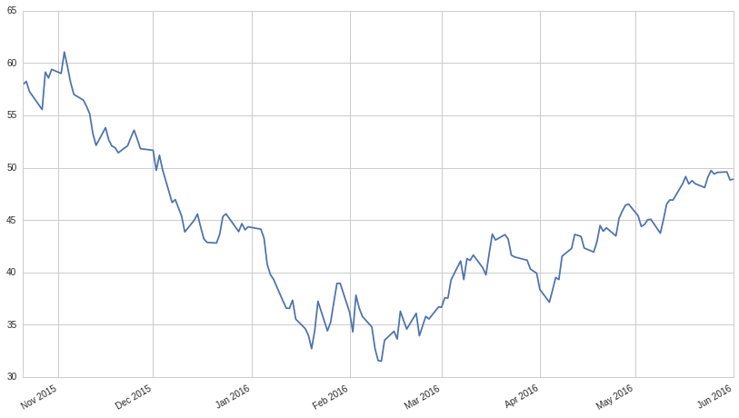
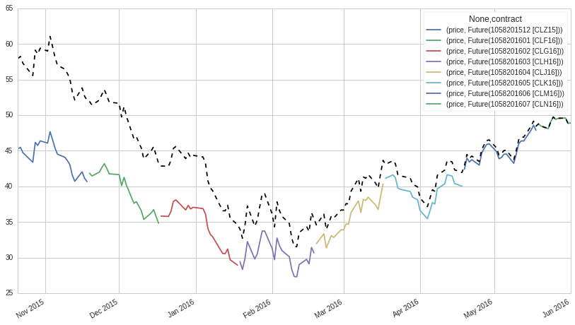

Continuous Futures
------------------

Continuous Futures are an abstraction of the chain of consecutive
contracts for the same underlying commodity or asset. Additionally, they
maintain an ongoing reference to the active contract on the chain.
Continuous futures make it much easier to maintain a dynamic reference
to contracts that you want to order, and get historical series of data.
In this lesson, we will explore some of the ways in which we can use
continuous futures to help us in our research.

In order to create an instance of a ``ContinuousFuture`` in Research, we
need to use the continuous_future function. Similar to history, we need
to import it from research’s experimental library:

.. code:: ipython2

    from quantopian.research.experimental import continuous_future, history

To create a continuous future, we just need to supply a root_symbol to
the ``continuous_future`` function. The following cell creates a
continuous future for Light Sweet Crude Oil.

.. code:: ipython2

    cl = continuous_future('CL')
    cl

.. parsed-literal::

    ContinuousFuture(90999980378095616, root_symbol='CL', offset=0, roll_style='volume', adjustment='mul')

Continuous Futures & ``history``
~~~~~~~~~~~~~~~~~~~~~~~~~~~~~~~~

We can use ``history`` to get pricing and volume data for a particular
``ContinuousFuture`` in the same way we do for ``Futures``.
Additionally, we can get the reference to its currently active
``Future`` contract by using the ``contract`` field.

Running the next cell will get pricing data for our CL continuous future
and plot it:

.. code:: ipython2

    # Pricing data for CL `ContinuousFuture`.
    cl_pricing = history(
        cl, 
        fields='price', 
        frequency='daily', 
        start='2015-10-21', 
        end='2016-06-01'
    )
    
    cl_pricing.plot()

.. parsed-literal::

    <matplotlib.axes._subplots.AxesSubplot at 0x7f2aee182c10>

To better understand the need for continuous futures, let’s use
``history`` to get pricing data for the chain of individual contracts we
looked at in the previous lesson and plot it.

.. code:: ipython2

    cl_contracts = symbols(['CLF16', 'CLG16', 'CLH16', 'CLJ16', 'CLK16', 'CLM16'])
    
    # Pricing data for our consecutive contracts from earlier.
    cl_consecutive_contract_pricing = history(
        cl_contracts, 
        fields='price', 
        frequency='daily', 
        start='2015-10-21', 
        end='2016-06-01'
    )
    
    cl_consecutive_contract_pricing.plot();

.. image:: notebook_files/notebook_11_0.png

The price difference between contracts at a given time is not considered
to be an increase in value in the future. Instead, it is associated with
the carrying cost and the opportunity cost of holding the underlying
commodity or asset prior to delivery. This concept is covered more in
depth in the Introduction to Futures Contracts lecture from our Lecture
Series.

Next, let’s look at the price history for active contracts separately.
We will notice that this difference in price creates discontinuities
when a contract expires and the reference moves to the next contract:

.. code:: ipython2

    # Pricing and contract data for unadjusted CL `ContinuousFuture`.
    # Adjustments are covered in the next section. 
    cl_unadjusted = continuous_future('CL', adjustment=None)
    
    cl_history = history(
        cl_unadjusted, 
        fields=['contract', 'price'], 
        frequency='daily', 
        start='2015-10-21', 
        end='2016-06-01'
    )
    
    cl_active_contract_pricing = cl_history.pivot(index=cl_history.index, columns='contract')
    cl_active_contract_pricing.plot();

.. image:: notebook_files/notebook_14_0.png

Part of the job of our continuous future abstraction is to account for
these discontinuities, as we will see next by plotting our CL continuous
future price against the price history for individual active contracts.

.. code:: ipython2

    cl_active_contract_pricing.plot()
    cl_pricing.plot(style='k--')

.. parsed-literal::

    <matplotlib.axes._subplots.AxesSubplot at 0x7f2ad0631650>

The above plot is adjusted for the price jumps that we see between
contracts. This allows us to get a price series that reflects the
changes in the price of the actual underlying commodity/asset.

In the next section, we will explore the options for adjusting
historical lookback windows of continuous futures.

Adjustment Styles
~~~~~~~~~~~~~~~~~

As we just saw, continuous future historical data series are adjusted to
account for price jumps between contracts by default. This can be
overridden by specifying an adjustment argument when creating the
continuous future. The adjustment argument has 3 options: ``'mul'``
(default), ``'add'``, and ``None``.

The ``'mul'`` option multiplies the prices series by the ratio of
consecutive contract prices. The effect from each jump is only applied
to prices further back in the lookback window.

Similarly, the ``'add'`` technique adjusts by the difference between
consecutive contract prices.

Finally, passing ``None`` means that no adjustments will be applied to
the lookback window.

Roll Styles
~~~~~~~~~~~

In the previous lesson we saw that trading activity jumps from one
contract in the chain to the next as they approach their delivery date.
A continuous future changes its reference from the active contract to
the next bassed on its roll attribute.

A ``'calendar'`` roll means that the continuous future will point to the
next contract in the chain when it reaches the ``auto_close_date`` of
the current active contract.

The ``volume`` roll (default) means that the continuous future will
begin pointing to the next contract when the trading volume of the next
contract surpasses the volume of the current contract. The idea is to
roll when the majority of traders have moved to the next contract. If
the volume swap doesn’t happen before the ``auto_close_date``, the
contract will roll at this date. Note: volume rolls will not occur
earlier than 7 trading days before the ``auto_close_date``.

Let’s get the volume history of our CL continuous future and plot it
against the individual contract volumes we saw before.

.. code:: ipython2

    cl_consecutive_contract_data = history(
        cl_contracts, 
        fields='volume', 
        frequency='daily', 
        start='2015-10-21', 
        end='2016-06-01'
    )
    
    cl_continuous_volume = history(
        cl, 
        fields='volume', 
        frequency='daily', 
        start='2015-10-21', 
        end='2016-06-01'
    )
    
    cl_consecutive_contract_data.plot()
    
    cl_continuous_volume.plot(style='k--');

.. image:: notebook_files/notebook_29_0.png

The volume for the CL ``ContinuousFuture`` is essentially the skyline of
the individual contract volumes. As the volume moves from one contract
to the next, the continuous future starts pointing to the next contract.
Note that there are some points where the volume does not exactly match,
most notably in the transition from ``CLK16`` to ``CLM16`` between April
and May. This is because the rolls are currently computed daily, using
only the previous day’s volume to avoid lookahead bias.

Offset
~~~~~~

The offset argument allows you to specify whether you want to maintain a
reference to the front contract or to a back contract. Setting offset=0
(default) maintains a reference to the front contract, or the contract
with the next soonest delivery. Setting offset=1 creates a continuous
reference to the contract with the second closest date of delivery, etc.

.. code:: ipython2

    print continuous_future.__doc__

.. parsed-literal::

    
        Create a specifier for a continuous contract.
    
        Parameters
        ----------
        root_symbol : str
            The root symbol for the continuous future.
    
        offset : int, optional
            The distance from the primary contract. Default is 0.
    
        roll : str, optional
            How rolls are determined. Options are 'volume' and 'calendar'. Default
            is 'volume'.
    
        adjustment : str
            Method for adjusting lookback prices between rolls. Options are
            'mul', 'add', and None. Default is 'mul'.
    
        Returns
        -------
        continuous_future : ContinuousFuture
            The continuous future specifier.
        

