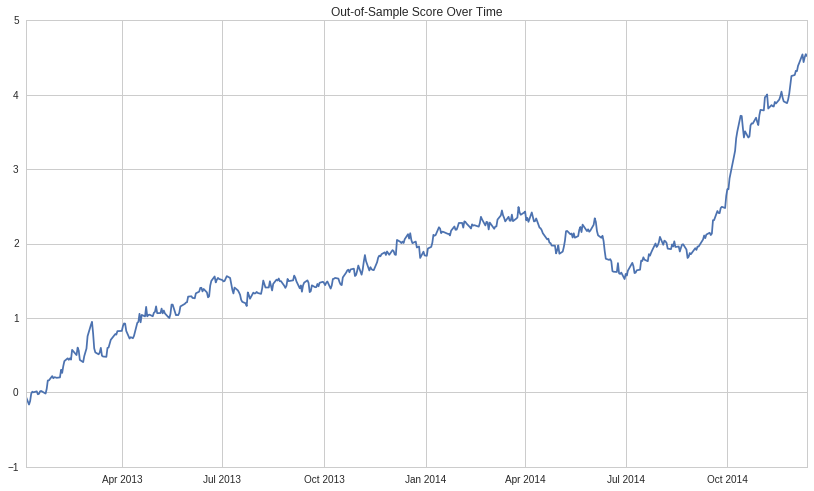
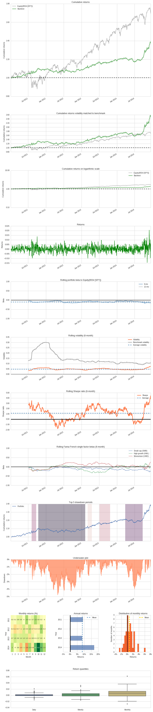
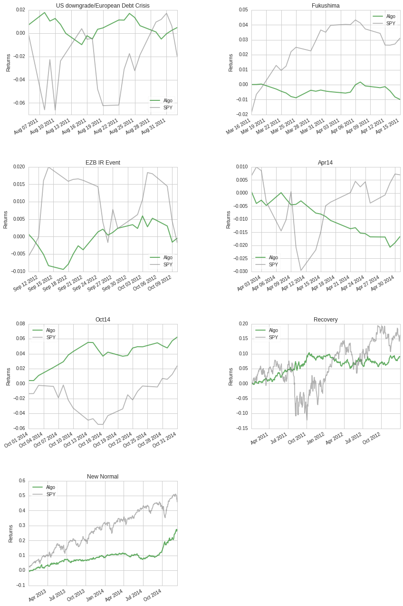
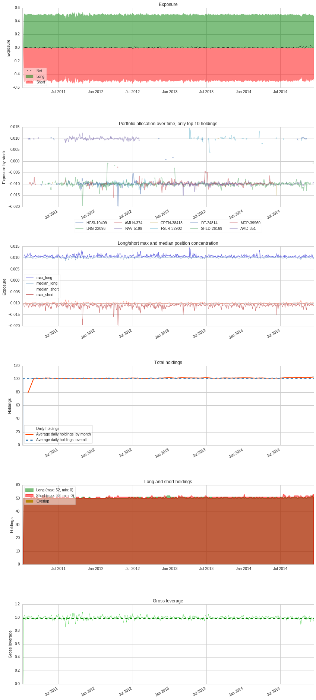
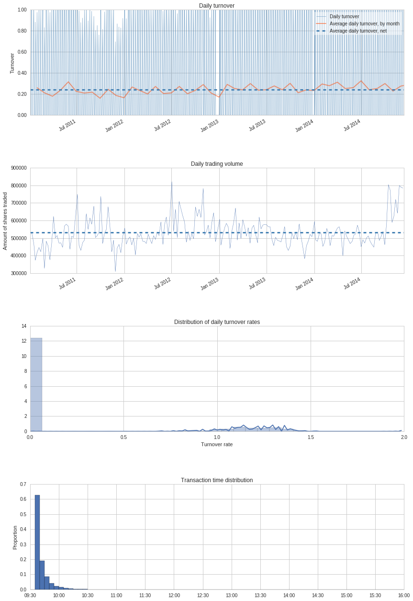
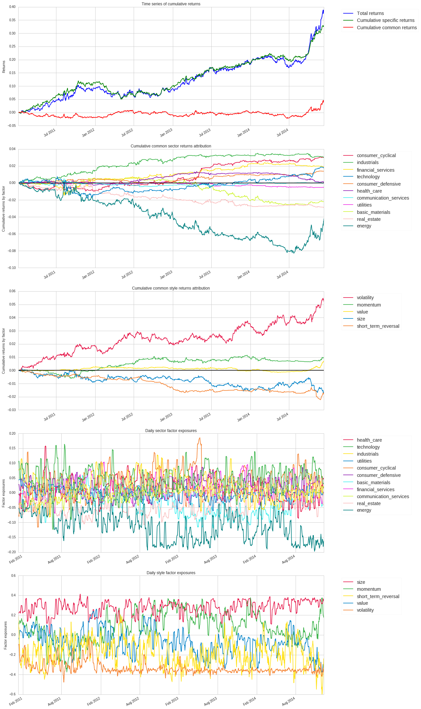

Enter your backtest ID.
-----------------------

Note: the backtest needs to be longer than 2 years in order to receive a
score.

.. code:: ipython2

    # Replace the string below with your backtest ID.
    bt = get_backtest('5a70ffcb0da48847ea9d6c6e')

.. parsed-literal::

    100% Time: 0:00:11|###########################################################|

.. code:: ipython2

    import empyrical as ep
    import pyfolio as pf
    import numpy as np
    import pandas as pd
    from matplotlib import pyplot as plt
    from quantopian.research import returns

.. code:: ipython2

    from quantopian.pipeline import Pipeline
    from quantopian.research import run_pipeline
    from quantopian.pipeline.filters import QTradableStocksUS
    
    def get_tradable_universe(start, end):
        """
        Gets the tradable universe in a format that can be compared to the positions
        of a backtest.
        """
        pipe = Pipeline(
            columns={'qtu':QTradableStocksUS()}
        )
        df = run_pipeline(pipe, start, end)
        df = df.unstack()
        df.columns = df.columns.droplevel()
        df = df.astype(float).replace(0, np.nan)
        return df

.. code:: ipython2

    def volatility_adjusted_daily_return(trailing_algorithm_returns):
        """
        Normalize the last daily return in `trailing_algorithm_returns` by the annualized
        volatility of `trailing_algorithm_returns`.
        """
        
        todays_return = trailing_algorithm_returns[-1]
        # Volatility is floored at 2%.
        volatility = max(ep.annual_volatility(trailing_algorithm_returns), 0.02)
        score = (todays_return / volatility)
        
        return score

.. code:: ipython2

    def compute_score(algorithm_returns):
        """
        Compute the score of a backtest from its algorithm_returns.
        """
        
        result = []
        
        cumulative_score = 0
        count = 0
        
        daily_scores = roll(
            algorithm_returns,
            function=volatility_adjusted_daily_return,
            window=63
        )
        
        cumulative_score = np.cumsum(daily_scores[441:])
        latest_score = cumulative_score[-1]
        
        print ''
        print 'Score computed between %s and %s.' % (cumulative_score.index[0].date(), daily_scores.index[-1].date())
        
        plt.plot(cumulative_score)
        plt.title('Out-of-Sample Score Over Time')
        print 'Cumulative Score: %f' % latest_score
        
        return cumulative_score

.. code:: ipython2

    # This code is copied from the empyrical repository.
    # Source: https://github.com/quantopian/empyrical/blob/master/empyrical/utils.py#L49
    # Includes a fix to the bug reported here: https://github.com/quantopian/empyrical/issues/79
    def roll(*args, **kwargs):
        """
        Calculates a given statistic across a rolling time period.
        Parameters
        ----------
        returns : pd.Series or np.ndarray
            Daily returns of the strategy, noncumulative.
            - See full explanation in :func:`~empyrical.stats.cum_returns`.
        factor_returns (optional): float / series
            Benchmark return to compare returns against.
        function:
            the function to run for each rolling window.
        window (keyword): int
            the number of periods included in each calculation.
        (other keywords): other keywords that are required to be passed to the
            function in the 'function' argument may also be passed in.
        Returns
        -------
        np.ndarray, pd.Series
            depends on input type
            ndarray(s) ==> ndarray
            Series(s) ==> pd.Series
            A Series or ndarray of the results of the stat across the rolling
            window.
        """
        func = kwargs.pop('function')
        window = kwargs.pop('window')
        if len(args) > 2:
            raise ValueError("Cannot pass more than 2 return sets")
    
        if len(args) == 2:
            if not isinstance(args[0], type(args[1])):
                raise ValueError("The two returns arguments are not the same.")
    
        if isinstance(args[0], np.ndarray):
            return _roll_numpy(func, window, *args, **kwargs)
        return _roll_pandas(func, window, *args, **kwargs)
    
    def _roll_ndarray(func, window, *args, **kwargs):
        data = []
        for i in range(window, len(args[0]) + 1):
            rets = [s[i-window:i] for s in args]
            data.append(func(*rets, **kwargs))
        return np.array(data)
    
    
    def _roll_pandas(func, window, *args, **kwargs):
        data = {}
        for i in range(window, len(args[0]) + 1):
            rets = [s.iloc[i-window:i] for s in args]
            data[args[0].index[i - 1]] = func(*rets, **kwargs)
        return pd.Series(data)

.. code:: ipython2

    SECTORS = [
        'basic_materials', 'consumer_cyclical', 'financial_services',
        'real_estate', 'consumer_defensive', 'health_care', 'utilities',
        'communication_services', 'energy', 'industrials', 'technology'
    ]
    
    STYLES = [
        'momentum', 'size', 'value', 'short_term_reversal', 'volatility'
    ]
    
    POSITION_CONCENTRATION_98TH_MAX = 0.05
    POSITION_CONCENTRATION_100TH_MAX = 0.1
    LEVERAGE_0TH_MIN = 0.7
    LEVERAGE_2ND_MIN = 0.8
    LEVERAGE_98TH_MAX = 1.1
    LEVERAGE_100TH_MAX = 1.2
    DAILY_TURNOVER_0TH_MIN = 0.03
    DAILY_TURNOVER_2ND_MIN = 0.05
    DAILY_TURNOVER_98TH_MAX = 0.65
    DAILY_TURNOVER_100TH_MAX = 0.8
    NET_EXPOSURE_LIMIT_98TH_MAX = 0.1
    NET_EXPOSURE_LIMIT_100TH_MAX = 0.2
    BETA_TO_SPY_98TH_MAX = 0.3
    BETA_TO_SPY_100TH_MAX = 0.4
    SECTOR_EXPOSURE_98TH_MAX = 0.2
    SECTOR_EXPOSURE_100TH_MAX = 0.25
    STYLE_EXPOSURE_98TH_MAX = 0.4
    STYLE_EXPOSURE_100TH_MAX = 0.5
    TRADABLE_UNIVERSE_0TH_MIN = 0.9
    TRADABLE_UNIVERSE_2ND_MIN = 0.95
    
    
    def check_constraints(positions, transactions, algorithm_returns, risk_exposures):
        
        sector_constraints = True
        style_constraints = True
        constraints_met = 0
        num_constraints = 9
        
        # Position Concentration Constraint
        print 'Checking positions concentration limit...'
        try:
            percent_allocations = pf.pos.get_percent_alloc(positions[5:])
            daily_absolute_percent_allocations = percent_allocations.abs().drop('cash', axis=1)
            daily_max_absolute_position = daily_absolute_percent_allocations.max(axis=1)
            
            position_concentration_98 = daily_max_absolute_position.quantile(0.98)
            position_concentration_100 = daily_max_absolute_position.max()
            
        except IndexError:
            position_concentration_98 = -1
            position_concentration_100 = -1
            
        if (position_concentration_98 > POSITION_CONCENTRATION_98TH_MAX):
            print 'FAIL: 98th percentile position concentration of %.2f > %.1f.' % (
            position_concentration_98*100,
            POSITION_CONCENTRATION_98TH_MAX*100
        )
        elif (position_concentration_100 > POSITION_CONCENTRATION_100TH_MAX):
            print 'FAIL: 100th percentile position concentration of %.2f > %.1f.' % (
            position_concentration_100*100,
            POSITION_CONCENTRATION_100TH_MAX*100
        )
        else:
            print 'PASS: Max position concentration of %.2f%% <= %.1f%%.' % (
                position_concentration_98*100,
                POSITION_CONCENTRATION_98TH_MAX*100
            )
            constraints_met += 1
    
            
        # Leverage Constraint
        print ''
        print 'Checking leverage limits...'
        leverage = pf.timeseries.gross_lev(positions[5:])
        leverage_0 = leverage.min()
        leverage_2 = leverage.quantile(0.02)
        leverage_98 = leverage.quantile(0.98)
        leverage_100 = leverage.max()
        leverage_passed = True
        
        if (leverage_0 < LEVERAGE_0TH_MIN):
            print 'FAIL: Minimum leverage of %.2fx is below %.1fx' % (
                leverage_0,
                LEVERAGE_0TH_MIN
            )
            leverage_passed = False
        if (leverage_2 < LEVERAGE_2ND_MIN):
            print 'FAIL: 2nd percentile leverage of %.2fx is below %.1fx' % (
                leverage_2,
                LEVERAGE_2ND_MIN
            )
            leverage_passed = False
        if (leverage_98 > LEVERAGE_98TH_MAX):
            print 'FAIL: 98th percentile leverage of %.2fx is above %.1fx' % (
                leverage_98,
                LEVERAGE_98TH_MAX
            )
            leverage_passed = False
        if (leverage_100 > LEVERAGE_100TH_MAX):
            print 'FAIL: Maximum leverage of %.2fx is above %.1fx' % (
                leverage_100,
                LEVERAGE_100TH_MAX
            )
            leverage_passed = False
        if leverage_passed:
            print 'PASS: Leverage range of %.2fx-%.2fx is between %.1fx-%.1fx.' % (
                leverage_2,
                leverage_98,
                LEVERAGE_2ND_MIN,
                LEVERAGE_98TH_MAX
            )
            constraints_met += 1
          
        # Turnover Constraint
        print ''
        print 'Checking turnover limits...'
        turnover = pf.txn.get_turnover(positions, transactions, denominator='portfolio_value')
        # Compute mean rolling 63 trading day turnover.
        rolling_mean_turnover = roll(
            turnover, 
            function=pd.Series.mean,
            window=63)[62:]
        rolling_mean_turnover_0 = rolling_mean_turnover.min()
        rolling_mean_turnover_2 = rolling_mean_turnover.quantile(0.02)
        rolling_mean_turnover_98 = rolling_mean_turnover.quantile(0.98)
        rolling_mean_turnover_100 = rolling_mean_turnover.max()  
        rolling_mean_turnover_passed = True
        
        if (rolling_mean_turnover_0 < DAILY_TURNOVER_0TH_MIN):
            print 'FAIL: Minimum turnover of %.2f%% is below %.1f%%.' % (
                rolling_mean_turnover_0*100,
                DAILY_TURNOVER_0TH_MIN*100
            )
            rolling_mean_turnover_passed = False
        if (rolling_mean_turnover_2 < DAILY_TURNOVER_2ND_MIN):
            print 'FAIL: 2nd percentile turnover of %.2f%% is below %.1fx' % (
                rolling_mean_turnover_2*100,
                DAILY_TURNOVER_2ND_MIN*100
            )
            rolling_mean_turnover_passed = False
        if (rolling_mean_turnover_98 > DAILY_TURNOVER_98TH_MAX):
            print 'FAIL: 98th percentile turnover of %.2f%% is above %.1fx' % (
                rolling_mean_turnover_98*100,
                DAILY_TURNOVER_98TH_MAX*100
            )
            rolling_mean_turnover_passed = False
        if (rolling_mean_turnover_100 > DAILY_TURNOVER_100TH_MAX):
            print 'FAIL: Maximum turnover of %.2f%% is above %.1fx' % (
                rolling_mean_turnover_100*100,
                DAILY_TURNOVER_100TH_MAX*100
            )
            rolling_mean_turnover_passed = False
        if rolling_mean_turnover_passed:
            print 'PASS: Mean turnover range of %.2f%%-%.2f%% is between %.1f%%-%.1f%%.' % (
                rolling_mean_turnover_2*100,
                rolling_mean_turnover_98*100,
                DAILY_TURNOVER_2ND_MIN*100,
                DAILY_TURNOVER_98TH_MAX*100
            )
            constraints_met += 1
    
            
        # Net Exposure Constraint
        print ''
        print 'Checking net exposure limit...'
        net_exposure = pf.pos.get_long_short_pos(positions[5:])['net exposure'].abs()
        net_exposure_98 = net_exposure.quantile(0.98)
        net_exposure_100 = net_exposure.max()
        
        if (net_exposure_98 > NET_EXPOSURE_LIMIT_98TH_MAX):
            print 'FAIL: 98th percentile net exposure (absolute value) of %.2f > %.1f.' % (
            net_exposure_98*100,
            NET_EXPOSURE_LIMIT_98TH_MAX*100
        )
        elif (net_exposure_100 > NET_EXPOSURE_LIMIT_100TH_MAX):
            print 'FAIL: 100th percentile net exposure (absolute value) of %.2f > %.1f.' % (
            net_exposure_100*100,
            NET_EXPOSURE_LIMIT_100TH_MAX*100
        )
        else:
            print 'PASS: Net exposure (absolute value) of %.2f%% <= %.1f%%.' % (
                net_exposure_98*100,
                NET_EXPOSURE_LIMIT_98TH_MAX*100
            )
            constraints_met += 1
        
            
        # Beta Constraint
        print ''
        print 'Checking beta-to-SPY limit...'
        spy_returns = returns(
            symbols('SPY'),
            algorithm_returns.index[0],
            algorithm_returns.index[-1],
        )
        beta = roll(
            algorithm_returns,
            spy_returns,
            function=ep.beta,
            window=126
        ).reindex_like(algorithm_returns).fillna(0).abs()
        beta_98 = beta.quantile(0.98)
        beta_100 = beta.max()
        if (beta_98 > BETA_TO_SPY_98TH_MAX):
                print 'FAIL: 98th percentile absolute beta of %.3f > %.1f.' % (
                beta_98,
                BETA_TO_SPY_98TH_MAX
            )
        elif (beta_100 > BETA_TO_SPY_100TH_MAX):
            print 'FAIL: 100th percentile absolute beta of %.3f > %.1f.' % (
                beta_100,
                BETA_TO_SPY_100TH_MAX
            )
        else:
            print 'PASS: Max absolute beta of %.3f <= %.1f.' % (
                beta_98,
                BETA_TO_SPY_98TH_MAX
            )
            constraints_met += 1
            
        # Risk Exposures
        rolling_mean_risk_exposures = risk_exposures.rolling(63, axis=0).mean()[62:].fillna(0)
        
        # Sector Exposures
        print ''
        print 'Checking sector exposure limits...'
        for sector in SECTORS:
            absolute_mean_sector_exposure = rolling_mean_risk_exposures[sector].abs()
            abs_mean_sector_exposure_98 = absolute_mean_sector_exposure.quantile(0.98)
            abs_mean_sector_exposure_100 = absolute_mean_sector_exposure.max()
            if (abs_mean_sector_exposure_98 > SECTOR_EXPOSURE_98TH_MAX):
                print 'FAIL: 98th percentile %s exposure of %.3f (absolute value) is greater than %.2f.' % (
                    sector,
                    abs_mean_sector_exposure_98,
                    SECTOR_EXPOSURE_98TH_MAX
                )
                sector_constraints = False
            elif (abs_mean_sector_exposure_100 > SECTOR_EXPOSURE_100TH_MAX):
                max_sector_exposure_day = absolute_mean_sector_exposure.idxmax()
                print 'FAIL: Max %s exposure of %.3f (absolute value) on %s is greater than %.2f.' % (
                    sector,
                    abs_mean_sector_exposure_100,
                    max_sector_exposure_day,
                    SECTOR_EXPOSURE_100TH_MAX
                )
                sector_constraints = False
        if sector_constraints:
            print 'PASS: All sector exposures were between +/-%.2f.' % SECTOR_EXPOSURE_98TH_MAX
            constraints_met += 1
            
        # Style Exposures
        print ''
        print 'Checking style exposure limits...'
        for style in STYLES:
            absolute_mean_style_exposure = rolling_mean_risk_exposures[style].abs()
            abs_mean_style_exposure_98 = absolute_mean_style_exposure.quantile(0.98)
            abs_mean_style_exposure_100 = absolute_mean_style_exposure.max()
            if (abs_mean_style_exposure_98 > STYLE_EXPOSURE_98TH_MAX):
                print 'FAIL: 98th percentile %s exposure of %.3f (absolute value) is greater than %.2f.' % (
                    style, 
                    abs_mean_style_exposure_98, 
                    STYLE_EXPOSURE_98TH_MAX
                )
                style_constraints = False
            elif (abs_mean_style_exposure_100 > STYLE_EXPOSURE_100TH_MAX):
                max_style_exposure_day = absolute_mean_style_exposure.idxmax()
                print 'FAIL: Max %s exposure of %.3f (absolute value) on %s is greater than %.2f.' % (
                    style, 
                    abs_mean_style_exposure_100, 
                    max_style_exposure_day.date(),
                    STYLE_EXPOSURE_100TH_MAX
                )
                style_constraints = False
        if style_constraints:
            print 'PASS: All style exposures were between +/-%.2f.' % STYLE_EXPOSURE_98TH_MAX
            constraints_met += 1
        
        
        # Tradable Universe
        print ''
        print 'Checking investment in tradable universe...'
        positions_wo_cash = positions.drop('cash', axis=1)
        positions_wo_cash = positions_wo_cash.abs()
        total_investment = positions_wo_cash.fillna(0).sum(axis=1)
        daily_qtu_investment = universe.multiply(positions_wo_cash).fillna(0).sum(axis=1)
        percent_in_qtu = daily_qtu_investment / total_investment
        percent_in_qtu = percent_in_qtu[5:].fillna(0)
        
        percent_in_qtu_0 = percent_in_qtu.min()
        percent_in_qtu_2 = percent_in_qtu.quantile(0.02)
            
        if percent_in_qtu_0 < TRADABLE_UNIVERSE_0TH_MIN:
            min_percent_in_qtu_date = percent_in_qtu.argmin()
            print 'FAIL: Minimum investment in QTradableStocksUS of %.2f%% on %s is < %.1f%%.' % (
                percent_in_qtu_0*100, 
                min_percent_in_qtu_date.date(),
                TRADABLE_UNIVERSE_0TH_MIN*100
            )
        elif percent_in_qtu_2 < TRADABLE_UNIVERSE_2ND_MIN:
            print 'FAIL: Investment in QTradableStocksUS (2nd percentile) of %.2f%% is < %.1f%%.' % (
                percent_in_qtu_2*100, 
                TRADABLE_UNIVERSE_2ND_MIN*100
            )
        else:
            print 'PASS: Investment in QTradableStocksUS is >= %.1f%%.' % (
                TRADABLE_UNIVERSE_2ND_MIN*100
            )
            constraints_met += 1
            
            
        # Total algorithm_returns Constraint
        print ''
        print 'Checking that algorithm has positive algorithm_returns...'
        cumulative_algorithm_returns = ep.cum_returns_final(algorithm_returns)
        if (cumulative_algorithm_returns > 0):
            print 'PASS: Cumulative algorithm_returns of %.2f is positive.' % (
                cumulative_algorithm_returns
            )
            constraints_met += 1
        else:
            print 'FAIL: Cumulative algorithm_returns of %.2f is negative.' % (
                cumulative_algorithm_returns
            )
        
        print ''
        print 'Results:'
        if constraints_met == num_constraints:
            print 'All constraints met!'
        else:
            print '%d/%d tests passed.' % (constraints_met, num_constraints)

.. code:: ipython2

    def evaluate_backtest(positions, transactions, algorithm_returns, risk_exposures):
        if len(positions.index) > 504:
            check_constraints(positions, transactions, algorithm_returns, risk_exposures)
            score = compute_score(algorithm_returns[start:end])
        else:
            print 'ERROR: Backtest must be longer than 2 years to be evaluated.'

Transform some of the data.
^^^^^^^^^^^^^^^^^^^^^^^^^^^

.. code:: ipython2

    positions = bt.pyfolio_positions
    transactions = bt.pyfolio_transactions
    algorithm_returns = bt.daily_performance.returns
    factor_exposures = bt.factor_exposures
    
    start = positions.index[0]
    end = positions.index[-1]
    universe = get_tradable_universe(start, end)
    universe.columns = universe.columns.map(lambda x: '%s-%s' % (x.symbol, x.sid))

Run this to evaluate your algorithm. Note that the new contest will require all filters to pass before a submission is eligible to participate.
^^^^^^^^^^^^^^^^^^^^^^^^^^^^^^^^^^^^^^^^^^^^^^^^^^^^^^^^^^^^^^^^^^^^^^^^^^^^^^^^^^^^^^^^^^^^^^^^^^^^^^^^^^^^^^^^^^^^^^^^^^^^^^^^^^^^^^^^^^^^^^^

.. code:: ipython2

    evaluate_backtest(positions, transactions, algorithm_returns, factor_exposures)

.. parsed-literal::

    Checking positions concentration limit...
    PASS: Max position concentration of 1.34% <= 5.0%.
    
    Checking leverage limits...
    PASS: Leverage range of 0.95x-1.05x is between 0.8x-1.1x.
    
    Checking turnover limits...
    PASS: Mean turnover range of 19.15%-28.04% is between 5.0%-65.0%.
    
    Checking net exposure limit...
    PASS: Net exposure (absolute value) of 1.29% <= 10.0%.
    
    Checking beta-to-SPY limit...
    PASS: Max absolute beta of 0.151 <= 0.3.
    
    Checking sector exposure limits...
    PASS: All sector exposures were between +/-0.20.
    
    Checking style exposure limits...
    PASS: All style exposures were between +/-0.40.
    
    Checking investment in tradable universe...
    PASS: Investment in QTradableStocksUS is >= 95.0%.
    
    Checking that algorithm has positive algorithm_returns...
    PASS: Cumulative algorithm_returns of 0.38 is positive.
    
    Results:
    All constraints met!
    
    Score computed between 2013-01-04 and 2014-12-12.
    Cumulative Score: 4.520568

.. code:: ipython2

    bt.create_full_tear_sheet()

.. raw:: html

    <table border="1" class="dataframe">
      <thead>
        <tr style="text-align: right;"><th>Start date</th><td colspan=2>2011-01-05</td></tr>
        <tr style="text-align: right;"><th>End date</th><td colspan=2>2014-12-12</td></tr>
        <tr style="text-align: right;"><th>Total months</th><td colspan=2>47</td></tr>
        <tr style="text-align: right;">
          <th></th>
          <th>Backtest</th>
        </tr>
      </thead>
      <tbody>
        <tr>
          <th>Annual return</th>
          <td>8.6%</td>
        </tr>
        <tr>
          <th>Cumulative returns</th>
          <td>38.5%</td>
        </tr>
        <tr>
          <th>Annual volatility</th>
          <td>5.1%</td>
        </tr>
        <tr>
          <th>Sharpe ratio</th>
          <td>1.63</td>
        </tr>
        <tr>
          <th>Calmar ratio</th>
          <td>1.80</td>
        </tr>
        <tr>
          <th>Stability</th>
          <td>0.87</td>
        </tr>
        <tr>
          <th>Max drawdown</th>
          <td>-4.8%</td>
        </tr>
        <tr>
          <th>Omega ratio</th>
          <td>1.32</td>
        </tr>
        <tr>
          <th>Sortino ratio</th>
          <td>2.58</td>
        </tr>
        <tr>
          <th>Skew</th>
          <td>0.32</td>
        </tr>
        <tr>
          <th>Kurtosis</th>
          <td>2.54</td>
        </tr>
        <tr>
          <th>Tail ratio</th>
          <td>1.13</td>
        </tr>
        <tr>
          <th>Daily value at risk</th>
          <td>-0.6%</td>
        </tr>
        <tr>
          <th>Gross leverage</th>
          <td>0.99</td>
        </tr>
        <tr>
          <th>Daily turnover</th>
          <td>24.4%</td>
        </tr>
        <tr>
          <th>Alpha</th>
          <td>0.10</td>
        </tr>
        <tr>
          <th>Beta</th>
          <td>-0.09</td>
        </tr>
      </tbody>
    </table>

.. raw:: html

    <table border="1" class="dataframe">
      <thead>
        <tr style="text-align: right;">
          <th>Worst drawdown periods</th>
          <th>Net drawdown in %</th>
          <th>Peak date</th>
          <th>Valley date</th>
          <th>Recovery date</th>
          <th>Duration</th>
        </tr>
      </thead>
      <tbody>
        <tr>
          <th>0</th>
          <td>4.79</td>
          <td>2011-10-14</td>
          <td>2012-05-01</td>
          <td>2013-02-07</td>
          <td>345</td>
        </tr>
        <tr>
          <th>1</th>
          <td>3.98</td>
          <td>2014-03-26</td>
          <td>2014-06-30</td>
          <td>2014-09-22</td>
          <td>129</td>
        </tr>
        <tr>
          <th>2</th>
          <td>2.72</td>
          <td>2011-08-08</td>
          <td>2011-08-15</td>
          <td>2011-09-23</td>
          <td>35</td>
        </tr>
        <tr>
          <th>3</th>
          <td>2.20</td>
          <td>2013-07-05</td>
          <td>2013-07-23</td>
          <td>2013-10-21</td>
          <td>77</td>
        </tr>
        <tr>
          <th>4</th>
          <td>2.19</td>
          <td>2013-03-05</td>
          <td>2013-03-18</td>
          <td>2013-04-16</td>
          <td>31</td>
        </tr>
      </tbody>
    </table>

.. parsed-literal::

    /usr/local/lib/python2.7/dist-packages/numpy/lib/function_base.py:3834: RuntimeWarning: Invalid value encountered in percentile
      RuntimeWarning)

.. raw:: html

    <table border="1" class="dataframe">
      <thead>
        <tr style="text-align: right;">
          <th>Stress Events</th>
          <th>mean</th>
          <th>min</th>
          <th>max</th>
        </tr>
      </thead>
      <tbody>
        <tr>
          <th>US downgrade/European Debt Crisis</th>
          <td>0.02%</td>
          <td>-0.97%</td>
          <td>1.05%</td>
        </tr>
        <tr>
          <th>Fukushima</th>
          <td>-0.04%</td>
          <td>-0.41%</td>
          <td>0.51%</td>
        </tr>
        <tr>
          <th>EZB IR Event</th>
          <td>-0.00%</td>
          <td>-0.46%</td>
          <td>0.51%</td>
        </tr>
        <tr>
          <th>Apr14</th>
          <td>-0.08%</td>
          <td>-0.47%</td>
          <td>0.49%</td>
        </tr>
        <tr>
          <th>Oct14</th>
          <td>0.26%</td>
          <td>-0.89%</td>
          <td>1.17%</td>
        </tr>
        <tr>
          <th>Recovery</th>
          <td>0.02%</td>
          <td>-0.97%</td>
          <td>1.36%</td>
        </tr>
        <tr>
          <th>New Normal</th>
          <td>0.05%</td>
          <td>-1.45%</td>
          <td>2.06%</td>
        </tr>
      </tbody>
    </table>

.. raw:: html

    <table border="1" class="dataframe">
      <thead>
        <tr style="text-align: right;">
          <th>Top 10 long positions of all time</th>
          <th>max</th>
        </tr>
      </thead>
      <tbody>
        <tr>
          <th>FSLR-32902</th>
          <td>1.45%</td>
        </tr>
        <tr>
          <th>STX-24518</th>
          <td>1.33%</td>
        </tr>
        <tr>
          <th>RBN-6529</th>
          <td>1.29%</td>
        </tr>
        <tr>
          <th>GTAT-36628</th>
          <td>1.27%</td>
        </tr>
        <tr>
          <th>WDC-8132</th>
          <td>1.26%</td>
        </tr>
        <tr>
          <th>AMD-351</th>
          <td>1.24%</td>
        </tr>
        <tr>
          <th>AOL-38989</th>
          <td>1.24%</td>
        </tr>
        <tr>
          <th>BIG-22657</th>
          <td>1.23%</td>
        </tr>
        <tr>
          <th>CRUS-1882</th>
          <td>1.22%</td>
        </tr>
        <tr>
          <th>CAB-26412</th>
          <td>1.22%</td>
        </tr>
      </tbody>
    </table>

.. raw:: html

    <table border="1" class="dataframe">
      <thead>
        <tr style="text-align: right;">
          <th>Top 10 short positions of all time</th>
          <th>max</th>
        </tr>
      </thead>
      <tbody>
        <tr>
          <th>HGSI-10409</th>
          <td>-1.98%</td>
        </tr>
        <tr>
          <th>LNG-22096</th>
          <td>-1.95%</td>
        </tr>
        <tr>
          <th>AMLN-374</th>
          <td>-1.60%</td>
        </tr>
        <tr>
          <th>NAV-5199</th>
          <td>-1.51%</td>
        </tr>
        <tr>
          <th>OPEN-38418</th>
          <td>-1.50%</td>
        </tr>
        <tr>
          <th>DF-24814</th>
          <td>-1.44%</td>
        </tr>
        <tr>
          <th>SHLD-26169</th>
          <td>-1.43%</td>
        </tr>
        <tr>
          <th>MCP-39960</th>
          <td>-1.39%</td>
        </tr>
        <tr>
          <th>AMD-351</th>
          <td>-1.34%</td>
        </tr>
        <tr>
          <th>REGN-6413</th>
          <td>-1.34%</td>
        </tr>
      </tbody>
    </table>

.. raw:: html

    <table border="1" class="dataframe">
      <thead>
        <tr style="text-align: right;">
          <th>Top 10 positions of all time</th>
          <th>max</th>
        </tr>
      </thead>
      <tbody>
        <tr>
          <th>HGSI-10409</th>
          <td>1.98%</td>
        </tr>
        <tr>
          <th>LNG-22096</th>
          <td>1.95%</td>
        </tr>
        <tr>
          <th>AMLN-374</th>
          <td>1.60%</td>
        </tr>
        <tr>
          <th>NAV-5199</th>
          <td>1.51%</td>
        </tr>
        <tr>
          <th>OPEN-38418</th>
          <td>1.50%</td>
        </tr>
        <tr>
          <th>FSLR-32902</th>
          <td>1.45%</td>
        </tr>
        <tr>
          <th>DF-24814</th>
          <td>1.44%</td>
        </tr>
        <tr>
          <th>SHLD-26169</th>
          <td>1.43%</td>
        </tr>
        <tr>
          <th>MCP-39960</th>
          <td>1.39%</td>
        </tr>
        <tr>
          <th>AMD-351</th>
          <td>1.34%</td>
        </tr>
      </tbody>
    </table>

.. raw:: html

    <table border="1" class="dataframe">
      <thead>
        <tr style="text-align: right;">
          <th>All positions ever held</th>
          <th>max</th>
        </tr>
      </thead>
      <tbody>
        <tr>
          <th>HGSI-10409</th>
          <td>1.98%</td>
        </tr>
        <tr>
          <th>LNG-22096</th>
          <td>1.95%</td>
        </tr>
        <tr>
          <th>AMLN-374</th>
          <td>1.60%</td>
        </tr>
        <tr>
          <th>NAV-5199</th>
          <td>1.51%</td>
        </tr>
        <tr>
          <th>OPEN-38418</th>
          <td>1.50%</td>
        </tr>
        <tr>
          <th>FSLR-32902</th>
          <td>1.45%</td>
        </tr>
        <tr>
          <th>DF-24814</th>
          <td>1.44%</td>
        </tr>
        <tr>
          <th>SHLD-26169</th>
          <td>1.43%</td>
        </tr>
        <tr>
          <th>MCP-39960</th>
          <td>1.39%</td>
        </tr>
        <tr>
          <th>AMD-351</th>
          <td>1.34%</td>
        </tr>
        <tr>
          <th>REGN-6413</th>
          <td>1.34%</td>
        </tr>
        <tr>
          <th>JCP-4118</th>
          <td>1.33%</td>
        </tr>
        <tr>
          <th>STX-24518</th>
          <td>1.33%</td>
        </tr>
        <tr>
          <th>SVU-7233</th>
          <td>1.32%</td>
        </tr>
        <tr>
          <th>CAR-17991</th>
          <td>1.30%</td>
        </tr>
        <tr>
          <th>RBN-6529</th>
          <td>1.29%</td>
        </tr>
        <tr>
          <th>BBG-26865</th>
          <td>1.29%</td>
        </tr>
        <tr>
          <th>MWW-24923</th>
          <td>1.28%</td>
        </tr>
        <tr>
          <th>DRYS-26994</th>
          <td>1.27%</td>
        </tr>
        <tr>
          <th>CSC-1898</th>
          <td>1.27%</td>
        </tr>
        <tr>
          <th>GTAT-36628</th>
          <td>1.27%</td>
        </tr>
        <tr>
          <th>WDC-8132</th>
          <td>1.26%</td>
        </tr>
        <tr>
          <th>ODP-5583</th>
          <td>1.26%</td>
        </tr>
        <tr>
          <th>KCG-19127</th>
          <td>1.26%</td>
        </tr>
        <tr>
          <th>IOC-26617</th>
          <td>1.26%</td>
        </tr>
        <tr>
          <th>BB-19831</th>
          <td>1.25%</td>
        </tr>
        <tr>
          <th>FRO-22983</th>
          <td>1.25%</td>
        </tr>
        <tr>
          <th>VRUS-33752</th>
          <td>1.25%</td>
        </tr>
        <tr>
          <th>SD-35006</th>
          <td>1.25%</td>
        </tr>
        <tr>
          <th>AOL-38989</th>
          <td>1.24%</td>
        </tr>
        <tr>
          <th>OPK-23120</th>
          <td>1.24%</td>
        </tr>
        <tr>
          <th>NG-25781</th>
          <td>1.24%</td>
        </tr>
        <tr>
          <th>RMBS-16945</th>
          <td>1.23%</td>
        </tr>
        <tr>
          <th>KBH-4199</th>
          <td>1.23%</td>
        </tr>
        <tr>
          <th>TRQ-25660</th>
          <td>1.23%</td>
        </tr>
        <tr>
          <th>USG-7844</th>
          <td>1.23%</td>
        </tr>
        <tr>
          <th>WLT-13771</th>
          <td>1.23%</td>
        </tr>
        <tr>
          <th>URI-18113</th>
          <td>1.23%</td>
        </tr>
        <tr>
          <th>CRK-1663</th>
          <td>1.23%</td>
        </tr>
        <tr>
          <th>BIG-22657</th>
          <td>1.23%</td>
        </tr>
        <tr>
          <th>ALR-15575</th>
          <td>1.22%</td>
        </tr>
        <tr>
          <th>LEAP-27411</th>
          <td>1.22%</td>
        </tr>
        <tr>
          <th>CRUS-1882</th>
          <td>1.22%</td>
        </tr>
        <tr>
          <th>ANV-33832</th>
          <td>1.22%</td>
        </tr>
        <tr>
          <th>SINA-21448</th>
          <td>1.22%</td>
        </tr>
        <tr>
          <th>CAB-26412</th>
          <td>1.22%</td>
        </tr>
        <tr>
          <th>CLF-1595</th>
          <td>1.21%</td>
        </tr>
        <tr>
          <th>TSLA-39840</th>
          <td>1.21%</td>
        </tr>
        <tr>
          <th>WYNN-24124</th>
          <td>1.21%</td>
        </tr>
        <tr>
          <th>PVAC-6258</th>
          <td>1.21%</td>
        </tr>
        <tr>
          <th>CRZO-17358</th>
          <td>1.20%</td>
        </tr>
        <tr>
          <th>AKS-10897</th>
          <td>1.20%</td>
        </tr>
        <tr>
          <th>CIEN-16453</th>
          <td>1.20%</td>
        </tr>
        <tr>
          <th>BBY-754</th>
          <td>1.20%</td>
        </tr>
        <tr>
          <th>XCO-28083</th>
          <td>1.20%</td>
        </tr>
        <tr>
          <th>ACI-88</th>
          <td>1.20%</td>
        </tr>
        <tr>
          <th>CYH-21608</th>
          <td>1.20%</td>
        </tr>
        <tr>
          <th>LCC-27653</th>
          <td>1.20%</td>
        </tr>
        <tr>
          <th>UAL-28051</th>
          <td>1.20%</td>
        </tr>
        <tr>
          <th>CLWR-33480</th>
          <td>1.20%</td>
        </tr>
        <tr>
          <th>GRPN-42118</th>
          <td>1.20%</td>
        </tr>
        <tr>
          <th>BTU-22660</th>
          <td>1.20%</td>
        </tr>
        <tr>
          <th>BYD-9888</th>
          <td>1.20%</td>
        </tr>
        <tr>
          <th>SFY-6825</th>
          <td>1.20%</td>
        </tr>
        <tr>
          <th>ARIA-11880</th>
          <td>1.20%</td>
        </tr>
        <tr>
          <th>CTB-1942</th>
          <td>1.19%</td>
        </tr>
        <tr>
          <th>CF-27558</th>
          <td>1.19%</td>
        </tr>
        <tr>
          <th>FST-2935</th>
          <td>1.19%</td>
        </tr>
        <tr>
          <th>COL-22880</th>
          <td>1.19%</td>
        </tr>
        <tr>
          <th>NRF-26740</th>
          <td>1.19%</td>
        </tr>
        <tr>
          <th>EXPR-39626</th>
          <td>1.19%</td>
        </tr>
        <tr>
          <th>LINE-27993</th>
          <td>1.19%</td>
        </tr>
        <tr>
          <th>CHK-8461</th>
          <td>1.18%</td>
        </tr>
        <tr>
          <th>TER-7401</th>
          <td>1.18%</td>
        </tr>
        <tr>
          <th>TSCO-10869</th>
          <td>1.18%</td>
        </tr>
        <tr>
          <th>MYGN-13698</th>
          <td>1.18%</td>
        </tr>
        <tr>
          <th>AMSC-393</th>
          <td>1.18%</td>
        </tr>
        <tr>
          <th>TECK-31886</th>
          <td>1.18%</td>
        </tr>
        <tr>
          <th>CJES-41770</th>
          <td>1.18%</td>
        </tr>
        <tr>
          <th>LVLT-18587</th>
          <td>1.18%</td>
        </tr>
        <tr>
          <th>WCRX-32619</th>
          <td>1.18%</td>
        </tr>
        <tr>
          <th>ITMN-21284</th>
          <td>1.18%</td>
        </tr>
        <tr>
          <th>DAN-35359</th>
          <td>1.18%</td>
        </tr>
        <tr>
          <th>TC-35140</th>
          <td>1.18%</td>
        </tr>
        <tr>
          <th>TEX-7408</th>
          <td>1.18%</td>
        </tr>
        <tr>
          <th>INCY-10187</th>
          <td>1.18%</td>
        </tr>
        <tr>
          <th>TTWO-16820</th>
          <td>1.18%</td>
        </tr>
        <tr>
          <th>EXK-33236</th>
          <td>1.18%</td>
        </tr>
        <tr>
          <th>PHM-5969</th>
          <td>1.18%</td>
        </tr>
        <tr>
          <th>SIG-9774</th>
          <td>1.18%</td>
        </tr>
        <tr>
          <th>HOS-26150</th>
          <td>1.18%</td>
        </tr>
        <tr>
          <th>IPG-3990</th>
          <td>1.18%</td>
        </tr>
        <tr>
          <th>OAS-39797</th>
          <td>1.18%</td>
        </tr>
        <tr>
          <th>LPS-36448</th>
          <td>1.18%</td>
        </tr>
        <tr>
          <th>LPX-4531</th>
          <td>1.18%</td>
        </tr>
        <tr>
          <th>AEM-154</th>
          <td>1.18%</td>
        </tr>
        <tr>
          <th>NXPI-39994</th>
          <td>1.18%</td>
        </tr>
        <tr>
          <th>CAVM-33776</th>
          <td>1.17%</td>
        </tr>
        <tr>
          <th>VLO-7990</th>
          <td>1.17%</td>
        </tr>
        <tr>
          <th>CSIQ-32856</th>
          <td>1.17%</td>
        </tr>
        <tr>
          <th>PBI-5773</th>
          <td>1.17%</td>
        </tr>
        <tr>
          <th>SFSF-35114</th>
          <td>1.17%</td>
        </tr>
        <tr>
          <th>MMR-19497</th>
          <td>1.17%</td>
        </tr>
        <tr>
          <th>MNKD-26524</th>
          <td>1.17%</td>
        </tr>
        <tr>
          <th>GNC-41182</th>
          <td>1.17%</td>
        </tr>
        <tr>
          <th>BC-755</th>
          <td>1.17%</td>
        </tr>
        <tr>
          <th>AABA-14848</th>
          <td>1.17%</td>
        </tr>
        <tr>
          <th>VVUS-11224</th>
          <td>1.17%</td>
        </tr>
        <tr>
          <th>ARUN-33588</th>
          <td>1.17%</td>
        </tr>
        <tr>
          <th>MHR-32541</th>
          <td>1.17%</td>
        </tr>
        <tr>
          <th>WNR-27997</th>
          <td>1.16%</td>
        </tr>
        <tr>
          <th>QCOR-20914</th>
          <td>1.16%</td>
        </tr>
        <tr>
          <th>ZNGA-42277</th>
          <td>1.16%</td>
        </tr>
        <tr>
          <th>MGM-4831</th>
          <td>1.16%</td>
        </tr>
        <tr>
          <th>OSK-5719</th>
          <td>1.16%</td>
        </tr>
        <tr>
          <th>BAS-27886</th>
          <td>1.16%</td>
        </tr>
        <tr>
          <th>BRE-1082</th>
          <td>1.16%</td>
        </tr>
        <tr>
          <th>RVBD-32618</th>
          <td>1.16%</td>
        </tr>
        <tr>
          <th>OTEX-14277</th>
          <td>1.16%</td>
        </tr>
        <tr>
          <th>HOT-3642</th>
          <td>1.16%</td>
        </tr>
        <tr>
          <th>KGC-9189</th>
          <td>1.16%</td>
        </tr>
        <tr>
          <th>ENTR-35230</th>
          <td>1.16%</td>
        </tr>
        <tr>
          <th>FFIV-20208</th>
          <td>1.16%</td>
        </tr>
        <tr>
          <th>NSM-42611</th>
          <td>1.16%</td>
        </tr>
        <tr>
          <th>PPC-39111</th>
          <td>1.16%</td>
        </tr>
        <tr>
          <th>VMED-26491</th>
          <td>1.16%</td>
        </tr>
        <tr>
          <th>WPX-42251</th>
          <td>1.16%</td>
        </tr>
        <tr>
          <th>ASH-559</th>
          <td>1.15%</td>
        </tr>
        <tr>
          <th>JBL-8831</th>
          <td>1.15%</td>
        </tr>
        <tr>
          <th>HFC-3620</th>
          <td>1.15%</td>
        </tr>
        <tr>
          <th>BZH-10728</th>
          <td>1.15%</td>
        </tr>
        <tr>
          <th>ONXX-14986</th>
          <td>1.15%</td>
        </tr>
        <tr>
          <th>WCG-26440</th>
          <td>1.15%</td>
        </tr>
        <tr>
          <th>NRG-26143</th>
          <td>1.15%</td>
        </tr>
        <tr>
          <th>ULTA-34953</th>
          <td>1.15%</td>
        </tr>
        <tr>
          <th>WCC-20163</th>
          <td>1.15%</td>
        </tr>
        <tr>
          <th>GDP-13363</th>
          <td>1.15%</td>
        </tr>
        <tr>
          <th>WTW-23269</th>
          <td>1.15%</td>
        </tr>
        <tr>
          <th>VRTX-8045</th>
          <td>1.15%</td>
        </tr>
        <tr>
          <th>ATVI-9883</th>
          <td>1.15%</td>
        </tr>
        <tr>
          <th>SNDK-13940</th>
          <td>1.15%</td>
        </tr>
        <tr>
          <th>CRR-14700</th>
          <td>1.15%</td>
        </tr>
        <tr>
          <th>IGT-3840</th>
          <td>1.15%</td>
        </tr>
        <tr>
          <th>MDRX-20394</th>
          <td>1.15%</td>
        </tr>
        <tr>
          <th>VSH-8050</th>
          <td>1.15%</td>
        </tr>
        <tr>
          <th>AVNR-19445</th>
          <td>1.15%</td>
        </tr>
        <tr>
          <th>WBC-34226</th>
          <td>1.15%</td>
        </tr>
        <tr>
          <th>HPQ-3735</th>
          <td>1.15%</td>
        </tr>
        <tr>
          <th>CZR-42461</th>
          <td>1.15%</td>
        </tr>
        <tr>
          <th>NDAQ-27026</th>
          <td>1.14%</td>
        </tr>
        <tr>
          <th>UPL-22406</th>
          <td>1.14%</td>
        </tr>
        <tr>
          <th>MDR-4752</th>
          <td>1.14%</td>
        </tr>
        <tr>
          <th>CBST-15769</th>
          <td>1.14%</td>
        </tr>
        <tr>
          <th>UBNT-42027</th>
          <td>1.14%</td>
        </tr>
        <tr>
          <th>CVI-22766</th>
          <td>1.14%</td>
        </tr>
        <tr>
          <th>VAR-7904</th>
          <td>1.14%</td>
        </tr>
        <tr>
          <th>EXXI-34443</th>
          <td>1.14%</td>
        </tr>
        <tr>
          <th>INFA-19990</th>
          <td>1.14%</td>
        </tr>
        <tr>
          <th>HBI-32497</th>
          <td>1.14%</td>
        </tr>
        <tr>
          <th>MAS-4665</th>
          <td>1.14%</td>
        </tr>
        <tr>
          <th>CLD-38971</th>
          <td>1.14%</td>
        </tr>
        <tr>
          <th>SIRI-11901</th>
          <td>1.14%</td>
        </tr>
        <tr>
          <th>SGY-9458</th>
          <td>1.14%</td>
        </tr>
        <tr>
          <th>EW-21382</th>
          <td>1.14%</td>
        </tr>
        <tr>
          <th>IAC-26470</th>
          <td>1.14%</td>
        </tr>
        <tr>
          <th>PTEN-10254</th>
          <td>1.14%</td>
        </tr>
        <tr>
          <th>CBI-1287</th>
          <td>1.14%</td>
        </tr>
        <tr>
          <th>ROC-27572</th>
          <td>1.14%</td>
        </tr>
        <tr>
          <th>ROSE-28091</th>
          <td>1.14%</td>
        </tr>
        <tr>
          <th>ALK-300</th>
          <td>1.14%</td>
        </tr>
        <tr>
          <th>DDS-2126</th>
          <td>1.14%</td>
        </tr>
        <tr>
          <th>GS-20088</th>
          <td>1.14%</td>
        </tr>
        <tr>
          <th>WAC-18431</th>
          <td>1.14%</td>
        </tr>
        <tr>
          <th>UHS-7749</th>
          <td>1.14%</td>
        </tr>
        <tr>
          <th>PPO-34117</th>
          <td>1.14%</td>
        </tr>
        <tr>
          <th>ANDV-7612</th>
          <td>1.14%</td>
        </tr>
        <tr>
          <th>GT-3384</th>
          <td>1.14%</td>
        </tr>
        <tr>
          <th>CNQR-19575</th>
          <td>1.14%</td>
        </tr>
        <tr>
          <th>GMCR-9736</th>
          <td>1.14%</td>
        </tr>
        <tr>
          <th>CERN-1419</th>
          <td>1.14%</td>
        </tr>
        <tr>
          <th>TMUS-33698</th>
          <td>1.14%</td>
        </tr>
        <tr>
          <th>RIG-9038</th>
          <td>1.13%</td>
        </tr>
        <tr>
          <th>GME-23438</th>
          <td>1.13%</td>
        </tr>
        <tr>
          <th>GLNG-24489</th>
          <td>1.13%</td>
        </tr>
        <tr>
          <th>RAD-6330</th>
          <td>1.13%</td>
        </tr>
        <tr>
          <th>ESS-11465</th>
          <td>1.13%</td>
        </tr>
        <tr>
          <th>HLX-17180</th>
          <td>1.13%</td>
        </tr>
        <tr>
          <th>WYN-32393</th>
          <td>1.13%</td>
        </tr>
        <tr>
          <th>CIE-39073</th>
          <td>1.13%</td>
        </tr>
        <tr>
          <th>ATGE-2371</th>
          <td>1.13%</td>
        </tr>
        <tr>
          <th>NOG-35961</th>
          <td>1.13%</td>
        </tr>
        <tr>
          <th>BID-869</th>
          <td>1.13%</td>
        </tr>
        <tr>
          <th>MU-5121</th>
          <td>1.13%</td>
        </tr>
        <tr>
          <th>ICPT-43505</th>
          <td>1.13%</td>
        </tr>
        <tr>
          <th>VECO-12267</th>
          <td>1.13%</td>
        </tr>
        <tr>
          <th>AXL-19672</th>
          <td>1.13%</td>
        </tr>
        <tr>
          <th>KLAC-4246</th>
          <td>1.13%</td>
        </tr>
        <tr>
          <th>AGN-8572</th>
          <td>1.13%</td>
        </tr>
        <tr>
          <th>DAL-33729</th>
          <td>1.13%</td>
        </tr>
        <tr>
          <th>JNS-24556</th>
          <td>1.13%</td>
        </tr>
        <tr>
          <th>FANG-43512</th>
          <td>1.13%</td>
        </tr>
        <tr>
          <th>FCX-13197</th>
          <td>1.13%</td>
        </tr>
        <tr>
          <th>MNST-3450</th>
          <td>1.13%</td>
        </tr>
        <tr>
          <th>HMA-3596</th>
          <td>1.13%</td>
        </tr>
        <tr>
          <th>ESI-24831</th>
          <td>1.13%</td>
        </tr>
        <tr>
          <th>FLIR-9156</th>
          <td>1.13%</td>
        </tr>
        <tr>
          <th>SFD-6803</th>
          <td>1.13%</td>
        </tr>
        <tr>
          <th>DSW-27409</th>
          <td>1.13%</td>
        </tr>
        <tr>
          <th>EWBC-19787</th>
          <td>1.13%</td>
        </tr>
        <tr>
          <th>NBR-5214</th>
          <td>1.13%</td>
        </tr>
        <tr>
          <th>HOLX-3629</th>
          <td>1.13%</td>
        </tr>
        <tr>
          <th>IAG-24491</th>
          <td>1.13%</td>
        </tr>
        <tr>
          <th>BKS-9693</th>
          <td>1.13%</td>
        </tr>
        <tr>
          <th>ARO-23650</th>
          <td>1.12%</td>
        </tr>
        <tr>
          <th>PENN-11361</th>
          <td>1.12%</td>
        </tr>
        <tr>
          <th>SLXP-22269</th>
          <td>1.12%</td>
        </tr>
        <tr>
          <th>APKT-32724</th>
          <td>1.12%</td>
        </tr>
        <tr>
          <th>JAZZ-33959</th>
          <td>1.12%</td>
        </tr>
        <tr>
          <th>IVR-38531</th>
          <td>1.12%</td>
        </tr>
        <tr>
          <th>FHN-26204</th>
          <td>1.12%</td>
        </tr>
        <tr>
          <th>SEE-6769</th>
          <td>1.12%</td>
        </tr>
        <tr>
          <th>CDNS-1385</th>
          <td>1.12%</td>
        </tr>
        <tr>
          <th>HCBK-20374</th>
          <td>1.12%</td>
        </tr>
        <tr>
          <th>HERO-27747</th>
          <td>1.12%</td>
        </tr>
        <tr>
          <th>FNSR-20866</th>
          <td>1.12%</td>
        </tr>
        <tr>
          <th>TOL-7530</th>
          <td>1.12%</td>
        </tr>
        <tr>
          <th>WPRT-36763</th>
          <td>1.12%</td>
        </tr>
        <tr>
          <th>HRI-32887</th>
          <td>1.12%</td>
        </tr>
        <tr>
          <th>TRN-7583</th>
          <td>1.12%</td>
        </tr>
        <tr>
          <th>CIT-39053</th>
          <td>1.12%</td>
        </tr>
        <tr>
          <th>HK-31032</th>
          <td>1.12%</td>
        </tr>
        <tr>
          <th>JOY-22996</th>
          <td>1.12%</td>
        </tr>
        <tr>
          <th>CROX-28078</th>
          <td>1.12%</td>
        </tr>
        <tr>
          <th>NUS-16059</th>
          <td>1.12%</td>
        </tr>
        <tr>
          <th>TRW-25948</th>
          <td>1.12%</td>
        </tr>
        <tr>
          <th>MOH-25349</th>
          <td>1.12%</td>
        </tr>
        <tr>
          <th>JEC-4120</th>
          <td>1.12%</td>
        </tr>
        <tr>
          <th>SPWR-27817</th>
          <td>1.12%</td>
        </tr>
        <tr>
          <th>XEC-24125</th>
          <td>1.12%</td>
        </tr>
        <tr>
          <th>VMW-34545</th>
          <td>1.12%</td>
        </tr>
        <tr>
          <th>HAL-3443</th>
          <td>1.12%</td>
        </tr>
        <tr>
          <th>BSX-1131</th>
          <td>1.12%</td>
        </tr>
        <tr>
          <th>PDCE-5907</th>
          <td>1.12%</td>
        </tr>
        <tr>
          <th>THC-5343</th>
          <td>1.12%</td>
        </tr>
        <tr>
          <th>EOG-2564</th>
          <td>1.12%</td>
        </tr>
        <tr>
          <th>TFM-40376</th>
          <td>1.12%</td>
        </tr>
        <tr>
          <th>HZNP-41766</th>
          <td>1.12%</td>
        </tr>
        <tr>
          <th>ARCO-41242</th>
          <td>1.12%</td>
        </tr>
        <tr>
          <th>KOG-32283</th>
          <td>1.12%</td>
        </tr>
        <tr>
          <th>HLF-26892</th>
          <td>1.12%</td>
        </tr>
        <tr>
          <th>PBF-43713</th>
          <td>1.12%</td>
        </tr>
        <tr>
          <th>CPX-28340</th>
          <td>1.12%</td>
        </tr>
        <tr>
          <th>ABX-64</th>
          <td>1.12%</td>
        </tr>
        <tr>
          <th>JLL-19898</th>
          <td>1.12%</td>
        </tr>
        <tr>
          <th>CAA-7050</th>
          <td>1.12%</td>
        </tr>
        <tr>
          <th>DISH-13017</th>
          <td>1.12%</td>
        </tr>
        <tr>
          <th>LXK-13891</th>
          <td>1.12%</td>
        </tr>
        <tr>
          <th>TQNT-10545</th>
          <td>1.12%</td>
        </tr>
        <tr>
          <th>VC-40159</th>
          <td>1.12%</td>
        </tr>
        <tr>
          <th>OXY-5729</th>
          <td>1.11%</td>
        </tr>
        <tr>
          <th>UTHR-20306</th>
          <td>1.11%</td>
        </tr>
        <tr>
          <th>URS-7828</th>
          <td>1.11%</td>
        </tr>
        <tr>
          <th>EHC-3661</th>
          <td>1.11%</td>
        </tr>
        <tr>
          <th>SWC-12362</th>
          <td>1.11%</td>
        </tr>
        <tr>
          <th>CVC-2000</th>
          <td>1.11%</td>
        </tr>
        <tr>
          <th>PDS-5855</th>
          <td>1.11%</td>
        </tr>
        <tr>
          <th>CYS-38477</th>
          <td>1.11%</td>
        </tr>
        <tr>
          <th>DHI-2298</th>
          <td>1.11%</td>
        </tr>
        <tr>
          <th>ANF-15622</th>
          <td>1.11%</td>
        </tr>
        <tr>
          <th>PSS-15005</th>
          <td>1.11%</td>
        </tr>
        <tr>
          <th>WPM-27437</th>
          <td>1.11%</td>
        </tr>
        <tr>
          <th>SPR-32921</th>
          <td>1.11%</td>
        </tr>
        <tr>
          <th>CPA-27908</th>
          <td>1.11%</td>
        </tr>
        <tr>
          <th>EAT-2404</th>
          <td>1.11%</td>
        </tr>
        <tr>
          <th>CSOD-41098</th>
          <td>1.11%</td>
        </tr>
        <tr>
          <th>TZOO-25805</th>
          <td>1.11%</td>
        </tr>
        <tr>
          <th>IPGP-33033</th>
          <td>1.11%</td>
        </tr>
        <tr>
          <th>PNR-6082</th>
          <td>1.11%</td>
        </tr>
        <tr>
          <th>MPC-41636</th>
          <td>1.11%</td>
        </tr>
        <tr>
          <th>RGLD-6455</th>
          <td>1.11%</td>
        </tr>
        <tr>
          <th>OVTI-21799</th>
          <td>1.11%</td>
        </tr>
        <tr>
          <th>IP-3971</th>
          <td>1.11%</td>
        </tr>
        <tr>
          <th>PSA-24962</th>
          <td>1.11%</td>
        </tr>
        <tr>
          <th>HCA-41047</th>
          <td>1.11%</td>
        </tr>
        <tr>
          <th>FLR-24833</th>
          <td>1.11%</td>
        </tr>
        <tr>
          <th>DB-23113</th>
          <td>1.11%</td>
        </tr>
        <tr>
          <th>ARNC-2</th>
          <td>1.11%</td>
        </tr>
        <tr>
          <th>EGO-24547</th>
          <td>1.11%</td>
        </tr>
        <tr>
          <th>ARNA-21724</th>
          <td>1.11%</td>
        </tr>
        <tr>
          <th>SNBR-19559</th>
          <td>1.11%</td>
        </tr>
        <tr>
          <th>HST-9947</th>
          <td>1.11%</td>
        </tr>
        <tr>
          <th>CNC-23283</th>
          <td>1.11%</td>
        </tr>
        <tr>
          <th>KEY-4221</th>
          <td>1.11%</td>
        </tr>
        <tr>
          <th>BYI-19759</th>
          <td>1.11%</td>
        </tr>
        <tr>
          <th>LUK-4580</th>
          <td>1.11%</td>
        </tr>
        <tr>
          <th>RRD-2248</th>
          <td>1.11%</td>
        </tr>
        <tr>
          <th>SGEN-22563</th>
          <td>1.11%</td>
        </tr>
        <tr>
          <th>NVLS-5509</th>
          <td>1.11%</td>
        </tr>
        <tr>
          <th>QLIK-39921</th>
          <td>1.11%</td>
        </tr>
        <tr>
          <th>SM-4664</th>
          <td>1.11%</td>
        </tr>
        <tr>
          <th>GDI-11130</th>
          <td>1.11%</td>
        </tr>
        <tr>
          <th>NFX-10231</th>
          <td>1.11%</td>
        </tr>
        <tr>
          <th>AEO-11086</th>
          <td>1.11%</td>
        </tr>
        <tr>
          <th>NVDA-19725</th>
          <td>1.11%</td>
        </tr>
        <tr>
          <th>RRC-19249</th>
          <td>1.11%</td>
        </tr>
        <tr>
          <th>CLH-1597</th>
          <td>1.11%</td>
        </tr>
        <tr>
          <th>NFLX-23709</th>
          <td>1.11%</td>
        </tr>
        <tr>
          <th>THOR-15228</th>
          <td>1.11%</td>
        </tr>
        <tr>
          <th>CRI-25576</th>
          <td>1.11%</td>
        </tr>
        <tr>
          <th>VHC-30464</th>
          <td>1.11%</td>
        </tr>
        <tr>
          <th>CHS-8612</th>
          <td>1.11%</td>
        </tr>
        <tr>
          <th>MON-22140</th>
          <td>1.11%</td>
        </tr>
        <tr>
          <th>FL-8383</th>
          <td>1.11%</td>
        </tr>
        <tr>
          <th>ZION-8399</th>
          <td>1.11%</td>
        </tr>
        <tr>
          <th>STEC-7145</th>
          <td>1.11%</td>
        </tr>
        <tr>
          <th>ACC-26553</th>
          <td>1.10%</td>
        </tr>
        <tr>
          <th>SYNA-23398</th>
          <td>1.10%</td>
        </tr>
        <tr>
          <th>DTV-26111</th>
          <td>1.10%</td>
        </tr>
        <tr>
          <th>CLNE-33924</th>
          <td>1.10%</td>
        </tr>
        <tr>
          <th>KBR-32880</th>
          <td>1.10%</td>
        </tr>
        <tr>
          <th>ILMN-21774</th>
          <td>1.10%</td>
        </tr>
        <tr>
          <th>APOL-24829</th>
          <td>1.10%</td>
        </tr>
        <tr>
          <th>RGC-23722</th>
          <td>1.10%</td>
        </tr>
        <tr>
          <th>PCYC-13711</th>
          <td>1.10%</td>
        </tr>
        <tr>
          <th>LYB-39546</th>
          <td>1.10%</td>
        </tr>
        <tr>
          <th>ETFC-15474</th>
          <td>1.10%</td>
        </tr>
        <tr>
          <th>DEI-32770</th>
          <td>1.10%</td>
        </tr>
        <tr>
          <th>SN-42264</th>
          <td>1.10%</td>
        </tr>
        <tr>
          <th>AGNC-36243</th>
          <td>1.10%</td>
        </tr>
        <tr>
          <th>SCCO-14284</th>
          <td>1.10%</td>
        </tr>
        <tr>
          <th>BCEI-42272</th>
          <td>1.10%</td>
        </tr>
        <tr>
          <th>OC-32608</th>
          <td>1.10%</td>
        </tr>
        <tr>
          <th>LAZ-27223</th>
          <td>1.10%</td>
        </tr>
        <tr>
          <th>GLOG-42746</th>
          <td>1.10%</td>
        </tr>
        <tr>
          <th>GM-40430</th>
          <td>1.10%</td>
        </tr>
        <tr>
          <th>SHAW-10509</th>
          <td>1.10%</td>
        </tr>
        <tr>
          <th>ENDP-21750</th>
          <td>1.10%</td>
        </tr>
        <tr>
          <th>PSX-42788</th>
          <td>1.10%</td>
        </tr>
        <tr>
          <th>FLS-17207</th>
          <td>1.10%</td>
        </tr>
        <tr>
          <th>HTS-36111</th>
          <td>1.10%</td>
        </tr>
        <tr>
          <th>CSTM-44780</th>
          <td>1.10%</td>
        </tr>
        <tr>
          <th>BAC-700</th>
          <td>1.10%</td>
        </tr>
        <tr>
          <th>PLCM-14784</th>
          <td>1.10%</td>
        </tr>
        <tr>
          <th>MAKO-35763</th>
          <td>1.10%</td>
        </tr>
        <tr>
          <th>GNTX-3286</th>
          <td>1.10%</td>
        </tr>
        <tr>
          <th>HRB-3660</th>
          <td>1.10%</td>
        </tr>
        <tr>
          <th>CXO-34440</th>
          <td>1.10%</td>
        </tr>
        <tr>
          <th>CHKP-15101</th>
          <td>1.10%</td>
        </tr>
        <tr>
          <th>WLK-26563</th>
          <td>1.10%</td>
        </tr>
        <tr>
          <th>LNCR-4501</th>
          <td>1.10%</td>
        </tr>
        <tr>
          <th>SSRM-15591</th>
          <td>1.10%</td>
        </tr>
        <tr>
          <th>SWY-7254</th>
          <td>1.10%</td>
        </tr>
        <tr>
          <th>MSFT-5061</th>
          <td>1.10%</td>
        </tr>
        <tr>
          <th>HBAN-3472</th>
          <td>1.10%</td>
        </tr>
        <tr>
          <th>SKX-20284</th>
          <td>1.10%</td>
        </tr>
        <tr>
          <th>GES-24811</th>
          <td>1.10%</td>
        </tr>
        <tr>
          <th>SWN-7244</th>
          <td>1.10%</td>
        </tr>
        <tr>
          <th>PAY-27206</th>
          <td>1.10%</td>
        </tr>
        <tr>
          <th>BRY-1103</th>
          <td>1.10%</td>
        </tr>
        <tr>
          <th>EMN-10594</th>
          <td>1.10%</td>
        </tr>
        <tr>
          <th>GOGO-44965</th>
          <td>1.10%</td>
        </tr>
        <tr>
          <th>CTRX-32301</th>
          <td>1.10%</td>
        </tr>
        <tr>
          <th>SOA-35174</th>
          <td>1.10%</td>
        </tr>
        <tr>
          <th>SU-10533</th>
          <td>1.10%</td>
        </tr>
        <tr>
          <th>STRZ_A-32045</th>
          <td>1.10%</td>
        </tr>
        <tr>
          <th>AVB-18834</th>
          <td>1.10%</td>
        </tr>
        <tr>
          <th>OBE-32293</th>
          <td>1.10%</td>
        </tr>
        <tr>
          <th>RHI-6465</th>
          <td>1.10%</td>
        </tr>
        <tr>
          <th>AGU-12856</th>
          <td>1.10%</td>
        </tr>
        <tr>
          <th>JPM-25006</th>
          <td>1.10%</td>
        </tr>
        <tr>
          <th>NEM-5261</th>
          <td>1.10%</td>
        </tr>
        <tr>
          <th>FAST-2696</th>
          <td>1.10%</td>
        </tr>
        <tr>
          <th>OIS-22464</th>
          <td>1.10%</td>
        </tr>
        <tr>
          <th>ROK-6536</th>
          <td>1.10%</td>
        </tr>
        <tr>
          <th>MRO-5035</th>
          <td>1.10%</td>
        </tr>
        <tr>
          <th>WFT-19336</th>
          <td>1.10%</td>
        </tr>
        <tr>
          <th>QEP-39778</th>
          <td>1.09%</td>
        </tr>
        <tr>
          <th>DS-24099</th>
          <td>1.09%</td>
        </tr>
        <tr>
          <th>GWW-3421</th>
          <td>1.09%</td>
        </tr>
        <tr>
          <th>SWKS-23821</th>
          <td>1.09%</td>
        </tr>
        <tr>
          <th>CRM-26401</th>
          <td>1.09%</td>
        </tr>
        <tr>
          <th>ACM-33831</th>
          <td>1.09%</td>
        </tr>
        <tr>
          <th>ERF-22215</th>
          <td>1.09%</td>
        </tr>
        <tr>
          <th>TDW-7364</th>
          <td>1.09%</td>
        </tr>
        <tr>
          <th>ORCL-5692</th>
          <td>1.09%</td>
        </tr>
        <tr>
          <th>MDC-4736</th>
          <td>1.09%</td>
        </tr>
        <tr>
          <th>TSN-7684</th>
          <td>1.09%</td>
        </tr>
        <tr>
          <th>HAS-3460</th>
          <td>1.09%</td>
        </tr>
        <tr>
          <th>ATML-607</th>
          <td>1.09%</td>
        </tr>
        <tr>
          <th>LEA-38921</th>
          <td>1.09%</td>
        </tr>
        <tr>
          <th>CLR-33856</th>
          <td>1.09%</td>
        </tr>
        <tr>
          <th>TMO-7493</th>
          <td>1.09%</td>
        </tr>
        <tr>
          <th>PKI-20774</th>
          <td>1.09%</td>
        </tr>
        <tr>
          <th>DWA-26750</th>
          <td>1.09%</td>
        </tr>
        <tr>
          <th>RF-34913</th>
          <td>1.09%</td>
        </tr>
        <tr>
          <th>RYL-6612</th>
          <td>1.09%</td>
        </tr>
        <tr>
          <th>CP-1792</th>
          <td>1.09%</td>
        </tr>
        <tr>
          <th>CDE-1374</th>
          <td>1.09%</td>
        </tr>
        <tr>
          <th>SOHU-21813</th>
          <td>1.09%</td>
        </tr>
        <tr>
          <th>FBHS-41928</th>
          <td>1.09%</td>
        </tr>
        <tr>
          <th>COCO-19773</th>
          <td>1.09%</td>
        </tr>
        <tr>
          <th>SDRL-39495</th>
          <td>1.09%</td>
        </tr>
        <tr>
          <th>SPPI-24517</th>
          <td>1.09%</td>
        </tr>
        <tr>
          <th>WBA-8089</th>
          <td>1.09%</td>
        </tr>
        <tr>
          <th>PAAS-13083</th>
          <td>1.09%</td>
        </tr>
        <tr>
          <th>UFS-2329</th>
          <td>1.09%</td>
        </tr>
        <tr>
          <th>LIFE-19800</th>
          <td>1.09%</td>
        </tr>
        <tr>
          <th>COF-12160</th>
          <td>1.09%</td>
        </tr>
        <tr>
          <th>SUN-7211</th>
          <td>1.09%</td>
        </tr>
        <tr>
          <th>MTH-16385</th>
          <td>1.09%</td>
        </tr>
        <tr>
          <th>UNH-7792</th>
          <td>1.09%</td>
        </tr>
        <tr>
          <th>JCI-4117</th>
          <td>1.09%</td>
        </tr>
        <tr>
          <th>DRIV-19209</th>
          <td>1.09%</td>
        </tr>
        <tr>
          <th>AMT-24760</th>
          <td>1.09%</td>
        </tr>
        <tr>
          <th>LEN-4417</th>
          <td>1.09%</td>
        </tr>
        <tr>
          <th>AUY-25714</th>
          <td>1.09%</td>
        </tr>
        <tr>
          <th>CVH-2010</th>
          <td>1.09%</td>
        </tr>
        <tr>
          <th>PLUG-20776</th>
          <td>1.09%</td>
        </tr>
        <tr>
          <th>DECK-9909</th>
          <td>1.09%</td>
        </tr>
        <tr>
          <th>WRC-24631</th>
          <td>1.09%</td>
        </tr>
        <tr>
          <th>TIVO-20662</th>
          <td>1.09%</td>
        </tr>
        <tr>
          <th>TPX-25802</th>
          <td>1.09%</td>
        </tr>
        <tr>
          <th>CVE-38896</th>
          <td>1.09%</td>
        </tr>
        <tr>
          <th>RFMD-17107</th>
          <td>1.09%</td>
        </tr>
        <tr>
          <th>SIVB-6897</th>
          <td>1.09%</td>
        </tr>
        <tr>
          <th>WTI-26986</th>
          <td>1.09%</td>
        </tr>
        <tr>
          <th>VPHM-16140</th>
          <td>1.09%</td>
        </tr>
        <tr>
          <th>NUE-5488</th>
          <td>1.09%</td>
        </tr>
        <tr>
          <th>PRGO-6161</th>
          <td>1.09%</td>
        </tr>
        <tr>
          <th>ARBA-20171</th>
          <td>1.09%</td>
        </tr>
        <tr>
          <th>EBIX-18693</th>
          <td>1.09%</td>
        </tr>
        <tr>
          <th>TWTC-20160</th>
          <td>1.09%</td>
        </tr>
        <tr>
          <th>TLRD-7203</th>
          <td>1.09%</td>
        </tr>
        <tr>
          <th>AMG-17800</th>
          <td>1.09%</td>
        </tr>
        <tr>
          <th>STJ-7156</th>
          <td>1.09%</td>
        </tr>
        <tr>
          <th>MXIM-5149</th>
          <td>1.09%</td>
        </tr>
        <tr>
          <th>TKR-7467</th>
          <td>1.09%</td>
        </tr>
        <tr>
          <th>EXPE-27543</th>
          <td>1.08%</td>
        </tr>
        <tr>
          <th>WP-42699</th>
          <td>1.08%</td>
        </tr>
        <tr>
          <th>TCF-7334</th>
          <td>1.08%</td>
        </tr>
        <tr>
          <th>FCS-20486</th>
          <td>1.08%</td>
        </tr>
        <tr>
          <th>MDVN-28160</th>
          <td>1.08%</td>
        </tr>
        <tr>
          <th>ALV-16838</th>
          <td>1.08%</td>
        </tr>
        <tr>
          <th>DRE-2293</th>
          <td>1.08%</td>
        </tr>
        <tr>
          <th>APC-455</th>
          <td>1.08%</td>
        </tr>
        <tr>
          <th>KMT-4271</th>
          <td>1.08%</td>
        </tr>
        <tr>
          <th>SAVE-41498</th>
          <td>1.08%</td>
        </tr>
        <tr>
          <th>UNP-7800</th>
          <td>1.08%</td>
        </tr>
        <tr>
          <th>DELL-25317</th>
          <td>1.08%</td>
        </tr>
        <tr>
          <th>AMZN-16841</th>
          <td>1.08%</td>
        </tr>
        <tr>
          <th>IONS-4031</th>
          <td>1.08%</td>
        </tr>
        <tr>
          <th>RDC-6392</th>
          <td>1.08%</td>
        </tr>
        <tr>
          <th>PMT-38630</th>
          <td>1.08%</td>
        </tr>
        <tr>
          <th>LO-36346</th>
          <td>1.08%</td>
        </tr>
        <tr>
          <th>HUN-27030</th>
          <td>1.08%</td>
        </tr>
        <tr>
          <th>JOE-6904</th>
          <td>1.08%</td>
        </tr>
        <tr>
          <th>KNX-40606</th>
          <td>1.08%</td>
        </tr>
        <tr>
          <th>STLD-16108</th>
          <td>1.08%</td>
        </tr>
        <tr>
          <th>WY-8326</th>
          <td>1.08%</td>
        </tr>
        <tr>
          <th>HCN-3488</th>
          <td>1.08%</td>
        </tr>
        <tr>
          <th>KSS-4313</th>
          <td>1.08%</td>
        </tr>
        <tr>
          <th>BLOX-42821</th>
          <td>1.08%</td>
        </tr>
        <tr>
          <th>ADT-43399</th>
          <td>1.08%</td>
        </tr>
        <tr>
          <th>EA-2602</th>
          <td>1.08%</td>
        </tr>
        <tr>
          <th>AGP-23179</th>
          <td>1.08%</td>
        </tr>
        <tr>
          <th>DO-13635</th>
          <td>1.08%</td>
        </tr>
        <tr>
          <th>FLEX-10953</th>
          <td>1.08%</td>
        </tr>
        <tr>
          <th>KMX-16511</th>
          <td>1.08%</td>
        </tr>
        <tr>
          <th>SRPT-16999</th>
          <td>1.08%</td>
        </tr>
        <tr>
          <th>TW-22183</th>
          <td>1.08%</td>
        </tr>
        <tr>
          <th>NCLH-43981</th>
          <td>1.08%</td>
        </tr>
        <tr>
          <th>FCEL-24853</th>
          <td>1.08%</td>
        </tr>
        <tr>
          <th>HCP-3490</th>
          <td>1.08%</td>
        </tr>
        <tr>
          <th>BEN-812</th>
          <td>1.08%</td>
        </tr>
        <tr>
          <th>ETN-2633</th>
          <td>1.08%</td>
        </tr>
        <tr>
          <th>DFS-34011</th>
          <td>1.08%</td>
        </tr>
        <tr>
          <th>VCI-7921</th>
          <td>1.08%</td>
        </tr>
        <tr>
          <th>RHT-20541</th>
          <td>1.08%</td>
        </tr>
        <tr>
          <th>PBYI-42689</th>
          <td>1.08%</td>
        </tr>
        <tr>
          <th>AXE-13500</th>
          <td>1.08%</td>
        </tr>
        <tr>
          <th>PH-5956</th>
          <td>1.08%</td>
        </tr>
        <tr>
          <th>UIS-7761</th>
          <td>1.08%</td>
        </tr>
        <tr>
          <th>CSCO-1900</th>
          <td>1.08%</td>
        </tr>
        <tr>
          <th>ITT-14081</th>
          <td>1.08%</td>
        </tr>
        <tr>
          <th>AVGO-38650</th>
          <td>1.08%</td>
        </tr>
        <tr>
          <th>LULU-34395</th>
          <td>1.08%</td>
        </tr>
        <tr>
          <th>DOW-2263</th>
          <td>1.08%</td>
        </tr>
        <tr>
          <th>FRAN-41737</th>
          <td>1.08%</td>
        </tr>
        <tr>
          <th>FIRE-33490</th>
          <td>1.08%</td>
        </tr>
        <tr>
          <th>MIPS-18940</th>
          <td>1.08%</td>
        </tr>
        <tr>
          <th>SBGI-13098</th>
          <td>1.08%</td>
        </tr>
        <tr>
          <th>TRMB-7580</th>
          <td>1.08%</td>
        </tr>
        <tr>
          <th>CBS-7962</th>
          <td>1.08%</td>
        </tr>
        <tr>
          <th>CLVS-42166</th>
          <td>1.08%</td>
        </tr>
        <tr>
          <th>AET-168</th>
          <td>1.08%</td>
        </tr>
        <tr>
          <th>COP-23998</th>
          <td>1.08%</td>
        </tr>
        <tr>
          <th>MGA-4823</th>
          <td>1.08%</td>
        </tr>
        <tr>
          <th>LL-35036</th>
          <td>1.08%</td>
        </tr>
        <tr>
          <th>DFT-34886</th>
          <td>1.08%</td>
        </tr>
        <tr>
          <th>CTXS-14014</th>
          <td>1.08%</td>
        </tr>
        <tr>
          <th>MCO-22139</th>
          <td>1.08%</td>
        </tr>
        <tr>
          <th>SYMC-7272</th>
          <td>1.08%</td>
        </tr>
        <tr>
          <th>ECA-23021</th>
          <td>1.08%</td>
        </tr>
        <tr>
          <th>PWER-17735</th>
          <td>1.08%</td>
        </tr>
        <tr>
          <th>EGN-2470</th>
          <td>1.08%</td>
        </tr>
        <tr>
          <th>GRMN-22316</th>
          <td>1.08%</td>
        </tr>
        <tr>
          <th>CPHD-21603</th>
          <td>1.08%</td>
        </tr>
        <tr>
          <th>PXD-17436</th>
          <td>1.08%</td>
        </tr>
        <tr>
          <th>BCE-766</th>
          <td>1.08%</td>
        </tr>
        <tr>
          <th>ROST-6546</th>
          <td>1.08%</td>
        </tr>
        <tr>
          <th>XPO-26287</th>
          <td>1.08%</td>
        </tr>
        <tr>
          <th>SSYS-12107</th>
          <td>1.08%</td>
        </tr>
        <tr>
          <th>CME-24475</th>
          <td>1.08%</td>
        </tr>
        <tr>
          <th>BPOP-1062</th>
          <td>1.08%</td>
        </tr>
        <tr>
          <th>SBAC-20281</th>
          <td>1.08%</td>
        </tr>
        <tr>
          <th>CVLT-32622</th>
          <td>1.08%</td>
        </tr>
        <tr>
          <th>ATI-24840</th>
          <td>1.08%</td>
        </tr>
        <tr>
          <th>AMCX-41594</th>
          <td>1.08%</td>
        </tr>
        <tr>
          <th>STI-7152</th>
          <td>1.08%</td>
        </tr>
        <tr>
          <th>SRCL-15581</th>
          <td>1.08%</td>
        </tr>
        <tr>
          <th>AL-41280</th>
          <td>1.08%</td>
        </tr>
        <tr>
          <th>ARW-538</th>
          <td>1.08%</td>
        </tr>
        <tr>
          <th>EQT-2587</th>
          <td>1.08%</td>
        </tr>
        <tr>
          <th>CNX-24758</th>
          <td>1.08%</td>
        </tr>
        <tr>
          <th>CE-26960</th>
          <td>1.08%</td>
        </tr>
        <tr>
          <th>PII-6992</th>
          <td>1.08%</td>
        </tr>
        <tr>
          <th>LII-24767</th>
          <td>1.08%</td>
        </tr>
        <tr>
          <th>ANN-430</th>
          <td>1.07%</td>
        </tr>
        <tr>
          <th>CACI-1218</th>
          <td>1.07%</td>
        </tr>
        <tr>
          <th>BWA-9514</th>
          <td>1.07%</td>
        </tr>
        <tr>
          <th>FNFG-24551</th>
          <td>1.07%</td>
        </tr>
        <tr>
          <th>NLY-17702</th>
          <td>1.07%</td>
        </tr>
        <tr>
          <th>MRX-13692</th>
          <td>1.07%</td>
        </tr>
        <tr>
          <th>LSI-4553</th>
          <td>1.07%</td>
        </tr>
        <tr>
          <th>PNRA-20133</th>
          <td>1.07%</td>
        </tr>
        <tr>
          <th>KR-4297</th>
          <td>1.07%</td>
        </tr>
        <tr>
          <th>RES-6426</th>
          <td>1.07%</td>
        </tr>
        <tr>
          <th>EQR-9540</th>
          <td>1.07%</td>
        </tr>
        <tr>
          <th>OFC-18404</th>
          <td>1.07%</td>
        </tr>
        <tr>
          <th>MPW-27443</th>
          <td>1.07%</td>
        </tr>
        <tr>
          <th>JWN-5382</th>
          <td>1.07%</td>
        </tr>
        <tr>
          <th>HP-3647</th>
          <td>1.07%</td>
        </tr>
        <tr>
          <th>ADS-22747</th>
          <td>1.07%</td>
        </tr>
        <tr>
          <th>LVS-26882</th>
          <td>1.07%</td>
        </tr>
        <tr>
          <th>INTC-3951</th>
          <td>1.07%</td>
        </tr>
        <tr>
          <th>BRCM-18529</th>
          <td>1.07%</td>
        </tr>
        <tr>
          <th>INTU-8655</th>
          <td>1.07%</td>
        </tr>
        <tr>
          <th>DNR-15789</th>
          <td>1.07%</td>
        </tr>
        <tr>
          <th>ALNY-26335</th>
          <td>1.07%</td>
        </tr>
        <tr>
          <th>CMC-1636</th>
          <td>1.07%</td>
        </tr>
        <tr>
          <th>CBG-26367</th>
          <td>1.07%</td>
        </tr>
        <tr>
          <th>AGCO-197</th>
          <td>1.07%</td>
        </tr>
        <tr>
          <th>JBHT-4108</th>
          <td>1.07%</td>
        </tr>
        <tr>
          <th>ALB-10898</th>
          <td>1.07%</td>
        </tr>
        <tr>
          <th>QGEN-15206</th>
          <td>1.07%</td>
        </tr>
        <tr>
          <th>AMAT-337</th>
          <td>1.07%</td>
        </tr>
        <tr>
          <th>ADSK-67</th>
          <td>1.07%</td>
        </tr>
        <tr>
          <th>MAN-4654</th>
          <td>1.07%</td>
        </tr>
        <tr>
          <th>APA-448</th>
          <td>1.07%</td>
        </tr>
        <tr>
          <th>SPLS-7061</th>
          <td>1.07%</td>
        </tr>
        <tr>
          <th>BAX-734</th>
          <td>1.07%</td>
        </tr>
        <tr>
          <th>SYK-7178</th>
          <td>1.07%</td>
        </tr>
        <tr>
          <th>OCLR-21366</th>
          <td>1.07%</td>
        </tr>
        <tr>
          <th>STRA-15397</th>
          <td>1.07%</td>
        </tr>
        <tr>
          <th>PEG-5862</th>
          <td>1.07%</td>
        </tr>
        <tr>
          <th>BMRN-20330</th>
          <td>1.07%</td>
        </tr>
        <tr>
          <th>JNPR-20239</th>
          <td>1.07%</td>
        </tr>
        <tr>
          <th>GD-3136</th>
          <td>1.07%</td>
        </tr>
        <tr>
          <th>ALXN-14328</th>
          <td>1.07%</td>
        </tr>
        <tr>
          <th>HSP-26243</th>
          <td>1.07%</td>
        </tr>
        <tr>
          <th>MTZ-4667</th>
          <td>1.07%</td>
        </tr>
        <tr>
          <th>MTW-4656</th>
          <td>1.07%</td>
        </tr>
        <tr>
          <th>BKD-27830</th>
          <td>1.07%</td>
        </tr>
        <tr>
          <th>LM-4488</th>
          <td>1.07%</td>
        </tr>
        <tr>
          <th>TEN-7422</th>
          <td>1.07%</td>
        </tr>
        <tr>
          <th>RYN-11044</th>
          <td>1.07%</td>
        </tr>
        <tr>
          <th>TROX-40530</th>
          <td>1.07%</td>
        </tr>
        <tr>
          <th>POT-6109</th>
          <td>1.07%</td>
        </tr>
        <tr>
          <th>IDTI-3808</th>
          <td>1.07%</td>
        </tr>
        <tr>
          <th>SLM-6935</th>
          <td>1.07%</td>
        </tr>
        <tr>
          <th>RSH-21550</th>
          <td>1.07%</td>
        </tr>
        <tr>
          <th>TXN-7671</th>
          <td>1.07%</td>
        </tr>
        <tr>
          <th>NSR-27413</th>
          <td>1.07%</td>
        </tr>
        <tr>
          <th>SODA-40353</th>
          <td>1.07%</td>
        </tr>
        <tr>
          <th>BAP-13612</th>
          <td>1.07%</td>
        </tr>
        <tr>
          <th>MRVL-21666</th>
          <td>1.07%</td>
        </tr>
        <tr>
          <th>RKT-11042</th>
          <td>1.07%</td>
        </tr>
        <tr>
          <th>AN-410</th>
          <td>1.07%</td>
        </tr>
        <tr>
          <th>LNCO-43513</th>
          <td>1.07%</td>
        </tr>
        <tr>
          <th>BMR-26548</th>
          <td>1.07%</td>
        </tr>
        <tr>
          <th>RS-11955</th>
          <td>1.07%</td>
        </tr>
        <tr>
          <th>CLB-13508</th>
          <td>1.07%</td>
        </tr>
        <tr>
          <th>AER-32916</th>
          <td>1.07%</td>
        </tr>
        <tr>
          <th>BBT-16850</th>
          <td>1.07%</td>
        </tr>
        <tr>
          <th>GNRC-39208</th>
          <td>1.07%</td>
        </tr>
        <tr>
          <th>ATHN-34692</th>
          <td>1.07%</td>
        </tr>
        <tr>
          <th>TUP-15041</th>
          <td>1.07%</td>
        </tr>
        <tr>
          <th>PWR-6269</th>
          <td>1.07%</td>
        </tr>
        <tr>
          <th>MAC-10984</th>
          <td>1.07%</td>
        </tr>
        <tr>
          <th>CCJ-14479</th>
          <td>1.07%</td>
        </tr>
        <tr>
          <th>WBMD-27669</th>
          <td>1.07%</td>
        </tr>
        <tr>
          <th>CMI-1985</th>
          <td>1.07%</td>
        </tr>
        <tr>
          <th>XLNX-8344</th>
          <td>1.07%</td>
        </tr>
        <tr>
          <th>SBUX-6683</th>
          <td>1.07%</td>
        </tr>
        <tr>
          <th>TWX-357</th>
          <td>1.07%</td>
        </tr>
        <tr>
          <th>PIR-6000</th>
          <td>1.07%</td>
        </tr>
        <tr>
          <th>LGF-19491</th>
          <td>1.07%</td>
        </tr>
        <tr>
          <th>AMBA-43495</th>
          <td>1.07%</td>
        </tr>
        <tr>
          <th>FINL-2845</th>
          <td>1.07%</td>
        </tr>
        <tr>
          <th>SPN-14141</th>
          <td>1.07%</td>
        </tr>
        <tr>
          <th>LLY-4487</th>
          <td>1.07%</td>
        </tr>
        <tr>
          <th>ABBV-43694</th>
          <td>1.07%</td>
        </tr>
        <tr>
          <th>IDCC-3801</th>
          <td>1.07%</td>
        </tr>
        <tr>
          <th>LH-12909</th>
          <td>1.07%</td>
        </tr>
        <tr>
          <th>WHR-8178</th>
          <td>1.06%</td>
        </tr>
        <tr>
          <th>FITB-2855</th>
          <td>1.06%</td>
        </tr>
        <tr>
          <th>BRCD-20061</th>
          <td>1.06%</td>
        </tr>
        <tr>
          <th>HOG-3499</th>
          <td>1.06%</td>
        </tr>
        <tr>
          <th>MTD-17895</th>
          <td>1.06%</td>
        </tr>
        <tr>
          <th>HIW-11492</th>
          <td>1.06%</td>
        </tr>
        <tr>
          <th>WDAY-43510</th>
          <td>1.06%</td>
        </tr>
        <tr>
          <th>FOXA-12213</th>
          <td>1.06%</td>
        </tr>
        <tr>
          <th>AES-166</th>
          <td>1.06%</td>
        </tr>
        <tr>
          <th>VNO-8014</th>
          <td>1.06%</td>
        </tr>
        <tr>
          <th>MDT-4758</th>
          <td>1.06%</td>
        </tr>
        <tr>
          <th>PNW-6090</th>
          <td>1.06%</td>
        </tr>
        <tr>
          <th>INT-3950</th>
          <td>1.06%</td>
        </tr>
        <tr>
          <th>BLK-20689</th>
          <td>1.06%</td>
        </tr>
        <tr>
          <th>SNH-20799</th>
          <td>1.06%</td>
        </tr>
        <tr>
          <th>USB-25010</th>
          <td>1.06%</td>
        </tr>
        <tr>
          <th>ACN-25555</th>
          <td>1.06%</td>
        </tr>
        <tr>
          <th>FOSL-8816</th>
          <td>1.06%</td>
        </tr>
        <tr>
          <th>BCR-779</th>
          <td>1.06%</td>
        </tr>
        <tr>
          <th>IR-4010</th>
          <td>1.06%</td>
        </tr>
        <tr>
          <th>DGX-16348</th>
          <td>1.06%</td>
        </tr>
        <tr>
          <th>LEG-4415</th>
          <td>1.06%</td>
        </tr>
        <tr>
          <th>NGD-27323</th>
          <td>1.06%</td>
        </tr>
        <tr>
          <th>ICE-27809</th>
          <td>1.06%</td>
        </tr>
        <tr>
          <th>RL-24832</th>
          <td>1.06%</td>
        </tr>
        <tr>
          <th>CTSH-18870</th>
          <td>1.06%</td>
        </tr>
        <tr>
          <th>LLL-18738</th>
          <td>1.06%</td>
        </tr>
        <tr>
          <th>MUR-5126</th>
          <td>1.06%</td>
        </tr>
        <tr>
          <th>NCR-16389</th>
          <td>1.06%</td>
        </tr>
        <tr>
          <th>SAFM-6624</th>
          <td>1.06%</td>
        </tr>
        <tr>
          <th>VRX-10908</th>
          <td>1.06%</td>
        </tr>
        <tr>
          <th>HS-28057</th>
          <td>1.06%</td>
        </tr>
        <tr>
          <th>RH-43599</th>
          <td>1.06%</td>
        </tr>
        <tr>
          <th>DPZ-26466</th>
          <td>1.06%</td>
        </tr>
        <tr>
          <th>NTRS-5479</th>
          <td>1.06%</td>
        </tr>
        <tr>
          <th>OI-5626</th>
          <td>1.06%</td>
        </tr>
        <tr>
          <th>NVR-5513</th>
          <td>1.06%</td>
        </tr>
        <tr>
          <th>IM-16022</th>
          <td>1.06%</td>
        </tr>
        <tr>
          <th>FWLT-3076</th>
          <td>1.06%</td>
        </tr>
        <tr>
          <th>NUAN-19926</th>
          <td>1.06%</td>
        </tr>
        <tr>
          <th>EQIX-24482</th>
          <td>1.06%</td>
        </tr>
        <tr>
          <th>MELI-34525</th>
          <td>1.06%</td>
        </tr>
        <tr>
          <th>PETM-9435</th>
          <td>1.06%</td>
        </tr>
        <tr>
          <th>NWL-5520</th>
          <td>1.06%</td>
        </tr>
        <tr>
          <th>AVT-661</th>
          <td>1.06%</td>
        </tr>
        <tr>
          <th>MWV-23380</th>
          <td>1.06%</td>
        </tr>
        <tr>
          <th>INVN-42165</th>
          <td>1.06%</td>
        </tr>
        <tr>
          <th>SIX-39612</th>
          <td>1.06%</td>
        </tr>
        <tr>
          <th>STZ-24873</th>
          <td>1.06%</td>
        </tr>
        <tr>
          <th>OMX-764</th>
          <td>1.06%</td>
        </tr>
        <tr>
          <th>SWK-7242</th>
          <td>1.06%</td>
        </tr>
        <tr>
          <th>PVH-6257</th>
          <td>1.06%</td>
        </tr>
        <tr>
          <th>VAL-7895</th>
          <td>1.06%</td>
        </tr>
        <tr>
          <th>LUV-4589</th>
          <td>1.06%</td>
        </tr>
        <tr>
          <th>BIIB-3806</th>
          <td>1.06%</td>
        </tr>
        <tr>
          <th>GPOR-28116</th>
          <td>1.06%</td>
        </tr>
        <tr>
          <th>OLN-5643</th>
          <td>1.06%</td>
        </tr>
        <tr>
          <th>KEG-29964</th>
          <td>1.06%</td>
        </tr>
        <tr>
          <th>BA-698</th>
          <td>1.06%</td>
        </tr>
        <tr>
          <th>VIAB-27872</th>
          <td>1.06%</td>
        </tr>
        <tr>
          <th>JCI-7679</th>
          <td>1.06%</td>
        </tr>
        <tr>
          <th>AUXL-26500</th>
          <td>1.06%</td>
        </tr>
        <tr>
          <th>DCT-33026</th>
          <td>1.06%</td>
        </tr>
        <tr>
          <th>IBM-3766</th>
          <td>1.06%</td>
        </tr>
        <tr>
          <th>ORLY-8857</th>
          <td>1.06%</td>
        </tr>
        <tr>
          <th>CBL-9890</th>
          <td>1.06%</td>
        </tr>
        <tr>
          <th>IL-39990</th>
          <td>1.06%</td>
        </tr>
        <tr>
          <th>RGR-6458</th>
          <td>1.06%</td>
        </tr>
        <tr>
          <th>GGP-8817</th>
          <td>1.06%</td>
        </tr>
        <tr>
          <th>KRC-16374</th>
          <td>1.06%</td>
        </tr>
        <tr>
          <th>SFLY-32660</th>
          <td>1.06%</td>
        </tr>
        <tr>
          <th>DLR-26758</th>
          <td>1.06%</td>
        </tr>
        <tr>
          <th>TWI-9066</th>
          <td>1.06%</td>
        </tr>
        <tr>
          <th>AVY-663</th>
          <td>1.06%</td>
        </tr>
        <tr>
          <th>PX-6272</th>
          <td>1.06%</td>
        </tr>
        <tr>
          <th>MCHP-8677</th>
          <td>1.06%</td>
        </tr>
        <tr>
          <th>BWLD-25642</th>
          <td>1.06%</td>
        </tr>
        <tr>
          <th>MRC-42786</th>
          <td>1.06%</td>
        </tr>
        <tr>
          <th>MLM-10796</th>
          <td>1.06%</td>
        </tr>
        <tr>
          <th>ADBE-114</th>
          <td>1.06%</td>
        </tr>
        <tr>
          <th>TD-15596</th>
          <td>1.06%</td>
        </tr>
        <tr>
          <th>GLW-3241</th>
          <td>1.06%</td>
        </tr>
        <tr>
          <th>CAH-1376</th>
          <td>1.06%</td>
        </tr>
        <tr>
          <th>WLL-25707</th>
          <td>1.06%</td>
        </tr>
        <tr>
          <th>TDG-28161</th>
          <td>1.06%</td>
        </tr>
        <tr>
          <th>KSU-4315</th>
          <td>1.06%</td>
        </tr>
        <tr>
          <th>GE-3149</th>
          <td>1.06%</td>
        </tr>
        <tr>
          <th>CMG-28016</th>
          <td>1.06%</td>
        </tr>
        <tr>
          <th>AEP-161</th>
          <td>1.06%</td>
        </tr>
        <tr>
          <th>MEOH-4795</th>
          <td>1.06%</td>
        </tr>
        <tr>
          <th>AUQ-25510</th>
          <td>1.06%</td>
        </tr>
        <tr>
          <th>KEX-4220</th>
          <td>1.06%</td>
        </tr>
        <tr>
          <th>TLM-17767</th>
          <td>1.06%</td>
        </tr>
        <tr>
          <th>GPC-3306</th>
          <td>1.06%</td>
        </tr>
        <tr>
          <th>SBH-32866</th>
          <td>1.06%</td>
        </tr>
        <tr>
          <th>SCHW-6704</th>
          <td>1.06%</td>
        </tr>
        <tr>
          <th>CODE-39640</th>
          <td>1.06%</td>
        </tr>
        <tr>
          <th>AIV-11598</th>
          <td>1.06%</td>
        </tr>
        <tr>
          <th>ES-5484</th>
          <td>1.06%</td>
        </tr>
        <tr>
          <th>TIF-7447</th>
          <td>1.06%</td>
        </tr>
        <tr>
          <th>KMR-22697</th>
          <td>1.06%</td>
        </tr>
        <tr>
          <th>HNT-22231</th>
          <td>1.06%</td>
        </tr>
        <tr>
          <th>VFC-7949</th>
          <td>1.06%</td>
        </tr>
        <tr>
          <th>PXP-24112</th>
          <td>1.06%</td>
        </tr>
        <tr>
          <th>GPRE-28159</th>
          <td>1.06%</td>
        </tr>
        <tr>
          <th>PEP-5885</th>
          <td>1.06%</td>
        </tr>
        <tr>
          <th>CHD-1482</th>
          <td>1.06%</td>
        </tr>
        <tr>
          <th>FTNT-38965</th>
          <td>1.06%</td>
        </tr>
        <tr>
          <th>HII-41111</th>
          <td>1.06%</td>
        </tr>
        <tr>
          <th>FDO-2760</th>
          <td>1.06%</td>
        </tr>
        <tr>
          <th>NXST-25679</th>
          <td>1.06%</td>
        </tr>
        <tr>
          <th>DOV-2262</th>
          <td>1.06%</td>
        </tr>
        <tr>
          <th>EL-13841</th>
          <td>1.06%</td>
        </tr>
        <tr>
          <th>MSCI-35078</th>
          <td>1.06%</td>
        </tr>
        <tr>
          <th>UDR-7715</th>
          <td>1.06%</td>
        </tr>
        <tr>
          <th>SNA-6976</th>
          <td>1.06%</td>
        </tr>
        <tr>
          <th>BXP-17009</th>
          <td>1.05%</td>
        </tr>
        <tr>
          <th>ACOM-38912</th>
          <td>1.05%</td>
        </tr>
        <tr>
          <th>KATE-4479</th>
          <td>1.05%</td>
        </tr>
        <tr>
          <th>OUTR-24791</th>
          <td>1.05%</td>
        </tr>
        <tr>
          <th>ISRG-25339</th>
          <td>1.05%</td>
        </tr>
        <tr>
          <th>RCL-8863</th>
          <td>1.05%</td>
        </tr>
        <tr>
          <th>PM-35902</th>
          <td>1.05%</td>
        </tr>
        <tr>
          <th>LPNT-20105</th>
          <td>1.05%</td>
        </tr>
        <tr>
          <th>OII-5629</th>
          <td>1.05%</td>
        </tr>
        <tr>
          <th>BF_B-822</th>
          <td>1.05%</td>
        </tr>
        <tr>
          <th>DISC_A-36930</th>
          <td>1.05%</td>
        </tr>
        <tr>
          <th>MTOR-21723</th>
          <td>1.05%</td>
        </tr>
        <tr>
          <th>NI-5310</th>
          <td>1.05%</td>
        </tr>
        <tr>
          <th>EMR-2530</th>
          <td>1.05%</td>
        </tr>
        <tr>
          <th>APTV-42173</th>
          <td>1.05%</td>
        </tr>
        <tr>
          <th>GPS-3321</th>
          <td>1.05%</td>
        </tr>
        <tr>
          <th>SNPS-6994</th>
          <td>1.05%</td>
        </tr>
        <tr>
          <th>CCI-19258</th>
          <td>1.05%</td>
        </tr>
        <tr>
          <th>BPO-20177</th>
          <td>1.05%</td>
        </tr>
        <tr>
          <th>SLCA-42436</th>
          <td>1.05%</td>
        </tr>
        <tr>
          <th>WDR-18508</th>
          <td>1.05%</td>
        </tr>
        <tr>
          <th>CNP-24064</th>
          <td>1.05%</td>
        </tr>
        <tr>
          <th>TECD-7372</th>
          <td>1.05%</td>
        </tr>
        <tr>
          <th>NOV-24809</th>
          <td>1.05%</td>
        </tr>
        <tr>
          <th>ALTR-328</th>
          <td>1.05%</td>
        </tr>
        <tr>
          <th>TBL-7323</th>
          <td>1.05%</td>
        </tr>
        <tr>
          <th>ROP-6543</th>
          <td>1.05%</td>
        </tr>
        <tr>
          <th>MO-4954</th>
          <td>1.05%</td>
        </tr>
        <tr>
          <th>XOM-8347</th>
          <td>1.05%</td>
        </tr>
        <tr>
          <th>ITW-4080</th>
          <td>1.05%</td>
        </tr>
        <tr>
          <th>NUVA-26291</th>
          <td>1.05%</td>
        </tr>
        <tr>
          <th>KCI-26003</th>
          <td>1.05%</td>
        </tr>
        <tr>
          <th>WU-32603</th>
          <td>1.05%</td>
        </tr>
        <tr>
          <th>TROW-7590</th>
          <td>1.05%</td>
        </tr>
        <tr>
          <th>PCAR-5787</th>
          <td>1.05%</td>
        </tr>
        <tr>
          <th>GG-22226</th>
          <td>1.05%</td>
        </tr>
        <tr>
          <th>CCL-24692</th>
          <td>1.05%</td>
        </tr>
        <tr>
          <th>SRE-24778</th>
          <td>1.05%</td>
        </tr>
        <tr>
          <th>NFG-5284</th>
          <td>1.05%</td>
        </tr>
        <tr>
          <th>LHO-18582</th>
          <td>1.05%</td>
        </tr>
        <tr>
          <th>MHS-25445</th>
          <td>1.05%</td>
        </tr>
        <tr>
          <th>LMCA-43919</th>
          <td>1.05%</td>
        </tr>
        <tr>
          <th>AYI-23276</th>
          <td>1.05%</td>
        </tr>
        <tr>
          <th>BMO-12002</th>
          <td>1.05%</td>
        </tr>
        <tr>
          <th>LRCX-4537</th>
          <td>1.05%</td>
        </tr>
        <tr>
          <th>CNI-16178</th>
          <td>1.05%</td>
        </tr>
        <tr>
          <th>CRL-21605</th>
          <td>1.05%</td>
        </tr>
        <tr>
          <th>SPXC-7086</th>
          <td>1.05%</td>
        </tr>
        <tr>
          <th>ZBRA-8388</th>
          <td>1.05%</td>
        </tr>
        <tr>
          <th>DK-32042</th>
          <td>1.05%</td>
        </tr>
        <tr>
          <th>ZTS-44060</th>
          <td>1.05%</td>
        </tr>
        <tr>
          <th>DE-2127</th>
          <td>1.05%</td>
        </tr>
        <tr>
          <th>ISBC-27703</th>
          <td>1.05%</td>
        </tr>
        <tr>
          <th>INVA-26676</th>
          <td>1.05%</td>
        </tr>
        <tr>
          <th>TLAB-7468</th>
          <td>1.05%</td>
        </tr>
        <tr>
          <th>DHR-2170</th>
          <td>1.05%</td>
        </tr>
        <tr>
          <th>STT-7139</th>
          <td>1.05%</td>
        </tr>
        <tr>
          <th>ADM-128</th>
          <td>1.05%</td>
        </tr>
        <tr>
          <th>NE-5249</th>
          <td>1.05%</td>
        </tr>
        <tr>
          <th>FISV-2853</th>
          <td>1.05%</td>
        </tr>
        <tr>
          <th>MSI-4974</th>
          <td>1.05%</td>
        </tr>
        <tr>
          <th>MTB-5117</th>
          <td>1.05%</td>
        </tr>
        <tr>
          <th>PLCE-24789</th>
          <td>1.05%</td>
        </tr>
        <tr>
          <th>ESV-2621</th>
          <td>1.05%</td>
        </tr>
        <tr>
          <th>IPI-36093</th>
          <td>1.05%</td>
        </tr>
        <tr>
          <th>COG-1746</th>
          <td>1.05%</td>
        </tr>
        <tr>
          <th>HES-216</th>
          <td>1.05%</td>
        </tr>
        <tr>
          <th>NOC-5387</th>
          <td>1.05%</td>
        </tr>
        <tr>
          <th>BNS-1010</th>
          <td>1.05%</td>
        </tr>
        <tr>
          <th>PAL-10245</th>
          <td>1.05%</td>
        </tr>
        <tr>
          <th>XRX-8354</th>
          <td>1.05%</td>
        </tr>
        <tr>
          <th>PFE-5923</th>
          <td>1.05%</td>
        </tr>
        <tr>
          <th>PAYX-5767</th>
          <td>1.05%</td>
        </tr>
        <tr>
          <th>HRS-3676</th>
          <td>1.05%</td>
        </tr>
        <tr>
          <th>BK-903</th>
          <td>1.05%</td>
        </tr>
        <tr>
          <th>WIN-27019</th>
          <td>1.05%</td>
        </tr>
        <tr>
          <th>CAKE-1234</th>
          <td>1.05%</td>
        </tr>
        <tr>
          <th>MCK-12350</th>
          <td>1.05%</td>
        </tr>
        <tr>
          <th>IVZ-16589</th>
          <td>1.05%</td>
        </tr>
        <tr>
          <th>IRBT-27780</th>
          <td>1.05%</td>
        </tr>
        <tr>
          <th>PLL-6030</th>
          <td>1.05%</td>
        </tr>
        <tr>
          <th>DDR-8468</th>
          <td>1.05%</td>
        </tr>
        <tr>
          <th>DRC-27534</th>
          <td>1.05%</td>
        </tr>
        <tr>
          <th>WMT-8229</th>
          <td>1.05%</td>
        </tr>
        <tr>
          <th>CCK-1343</th>
          <td>1.05%</td>
        </tr>
        <tr>
          <th>ST-39347</th>
          <td>1.05%</td>
        </tr>
        <tr>
          <th>AOBC-24519</th>
          <td>1.05%</td>
        </tr>
        <tr>
          <th>SIAL-6872</th>
          <td>1.05%</td>
        </tr>
        <tr>
          <th>FIO-41554</th>
          <td>1.05%</td>
        </tr>
        <tr>
          <th>UAA-27822</th>
          <td>1.05%</td>
        </tr>
        <tr>
          <th>CMA-1620</th>
          <td>1.05%</td>
        </tr>
        <tr>
          <th>DVN-2368</th>
          <td>1.05%</td>
        </tr>
        <tr>
          <th>PHH-26956</th>
          <td>1.05%</td>
        </tr>
        <tr>
          <th>LPI-42263</th>
          <td>1.05%</td>
        </tr>
        <tr>
          <th>ACAD-26322</th>
          <td>1.05%</td>
        </tr>
        <tr>
          <th>DLTR-12652</th>
          <td>1.05%</td>
        </tr>
        <tr>
          <th>VTR-18821</th>
          <td>1.05%</td>
        </tr>
        <tr>
          <th>NWSA-44931</th>
          <td>1.05%</td>
        </tr>
        <tr>
          <th>CMCS_A-1637</th>
          <td>1.05%</td>
        </tr>
        <tr>
          <th>GAS-595</th>
          <td>1.05%</td>
        </tr>
        <tr>
          <th>SO-7011</th>
          <td>1.05%</td>
        </tr>
        <tr>
          <th>FE-17850</th>
          <td>1.05%</td>
        </tr>
        <tr>
          <th>PPS-9438</th>
          <td>1.05%</td>
        </tr>
        <tr>
          <th>WFM-8158</th>
          <td>1.05%</td>
        </tr>
        <tr>
          <th>BG-22959</th>
          <td>1.05%</td>
        </tr>
        <tr>
          <th>RTN-6583</th>
          <td>1.05%</td>
        </tr>
        <tr>
          <th>WFC-8151</th>
          <td>1.05%</td>
        </tr>
        <tr>
          <th>MAT-4668</th>
          <td>1.05%</td>
        </tr>
        <tr>
          <th>TIE-15230</th>
          <td>1.05%</td>
        </tr>
        <tr>
          <th>EXR-26566</th>
          <td>1.05%</td>
        </tr>
        <tr>
          <th>UGI-7739</th>
          <td>1.05%</td>
        </tr>
        <tr>
          <th>CVX-23112</th>
          <td>1.05%</td>
        </tr>
        <tr>
          <th>CCE-1332</th>
          <td>1.05%</td>
        </tr>
        <tr>
          <th>EXPD-2663</th>
          <td>1.05%</td>
        </tr>
        <tr>
          <th>MCRS-4727</th>
          <td>1.05%</td>
        </tr>
        <tr>
          <th>NYX-28145</th>
          <td>1.05%</td>
        </tr>
        <tr>
          <th>DXCM-27173</th>
          <td>1.05%</td>
        </tr>
        <tr>
          <th>JBLU-23599</th>
          <td>1.05%</td>
        </tr>
        <tr>
          <th>WMB-8214</th>
          <td>1.05%</td>
        </tr>
        <tr>
          <th>WRI-8267</th>
          <td>1.05%</td>
        </tr>
        <tr>
          <th>EFX-2465</th>
          <td>1.05%</td>
        </tr>
        <tr>
          <th>ABC-22954</th>
          <td>1.05%</td>
        </tr>
        <tr>
          <th>AXP-679</th>
          <td>1.05%</td>
        </tr>
        <tr>
          <th>ADTN-11718</th>
          <td>1.05%</td>
        </tr>
        <tr>
          <th>EBAY-24819</th>
          <td>1.05%</td>
        </tr>
        <tr>
          <th>DKS-24070</th>
          <td>1.05%</td>
        </tr>
        <tr>
          <th>CNH-28276</th>
          <td>1.05%</td>
        </tr>
        <tr>
          <th>LBTY_K-27608</th>
          <td>1.05%</td>
        </tr>
        <tr>
          <th>ATU-484</th>
          <td>1.05%</td>
        </tr>
        <tr>
          <th>CHRW-17632</th>
          <td>1.05%</td>
        </tr>
        <tr>
          <th>WEN-10293</th>
          <td>1.05%</td>
        </tr>
        <tr>
          <th>REG-10027</th>
          <td>1.05%</td>
        </tr>
        <tr>
          <th>BDX-794</th>
          <td>1.05%</td>
        </tr>
        <tr>
          <th>DRQ-17646</th>
          <td>1.05%</td>
        </tr>
        <tr>
          <th>PLD-24785</th>
          <td>1.05%</td>
        </tr>
        <tr>
          <th>RLGY-43500</th>
          <td>1.05%</td>
        </tr>
        <tr>
          <th>TDC-34661</th>
          <td>1.05%</td>
        </tr>
        <tr>
          <th>DPS-36118</th>
          <td>1.04%</td>
        </tr>
        <tr>
          <th>ADP-630</th>
          <td>1.04%</td>
        </tr>
        <tr>
          <th>CKH-1581</th>
          <td>1.04%</td>
        </tr>
        <tr>
          <th>FIS-22876</th>
          <td>1.04%</td>
        </tr>
        <tr>
          <th>RBC-6352</th>
          <td>1.04%</td>
        </tr>
        <tr>
          <th>LOW-4521</th>
          <td>1.04%</td>
        </tr>
        <tr>
          <th>CAM-13176</th>
          <td>1.04%</td>
        </tr>
        <tr>
          <th>SLB-6928</th>
          <td>1.04%</td>
        </tr>
        <tr>
          <th>ASNA-2105</th>
          <td>1.04%</td>
        </tr>
        <tr>
          <th>WAT-13962</th>
          <td>1.04%</td>
        </tr>
        <tr>
          <th>DLB-27046</th>
          <td>1.04%</td>
        </tr>
        <tr>
          <th>NBL-5213</th>
          <td>1.04%</td>
        </tr>
        <tr>
          <th>JEF-25093</th>
          <td>1.04%</td>
        </tr>
        <tr>
          <th>FRC-40573</th>
          <td>1.04%</td>
        </tr>
        <tr>
          <th>CBE-1283</th>
          <td>1.04%</td>
        </tr>
        <tr>
          <th>ED-2434</th>
          <td>1.04%</td>
        </tr>
        <tr>
          <th>CAG-1228</th>
          <td>1.04%</td>
        </tr>
        <tr>
          <th>MJN-38084</th>
          <td>1.04%</td>
        </tr>
        <tr>
          <th>EMC-2518</th>
          <td>1.04%</td>
        </tr>
        <tr>
          <th>BEAV-799</th>
          <td>1.04%</td>
        </tr>
        <tr>
          <th>AMGN-368</th>
          <td>1.04%</td>
        </tr>
        <tr>
          <th>ICO-27824</th>
          <td>1.04%</td>
        </tr>
        <tr>
          <th>TGI-15905</th>
          <td>1.04%</td>
        </tr>
        <tr>
          <th>PACW-21624</th>
          <td>1.04%</td>
        </tr>
        <tr>
          <th>DVA-22110</th>
          <td>1.04%</td>
        </tr>
        <tr>
          <th>IRM-14388</th>
          <td>1.04%</td>
        </tr>
        <tr>
          <th>OMC-5651</th>
          <td>1.04%</td>
        </tr>
        <tr>
          <th>VZ-21839</th>
          <td>1.04%</td>
        </tr>
        <tr>
          <th>OGE-5607</th>
          <td>1.04%</td>
        </tr>
        <tr>
          <th>BBBY-739</th>
          <td>1.04%</td>
        </tr>
        <tr>
          <th>FRX-3014</th>
          <td>1.04%</td>
        </tr>
        <tr>
          <th>JAH-23784</th>
          <td>1.04%</td>
        </tr>
        <tr>
          <th>FTR-2069</th>
          <td>1.04%</td>
        </tr>
        <tr>
          <th>MS-17080</th>
          <td>1.04%</td>
        </tr>
        <tr>
          <th>ABT-62</th>
          <td>1.04%</td>
        </tr>
        <tr>
          <th>LKQ-25598</th>
          <td>1.04%</td>
        </tr>
        <tr>
          <th>LUFK-4579</th>
          <td>1.04%</td>
        </tr>
        <tr>
          <th>ALSN-42637</th>
          <td>1.04%</td>
        </tr>
        <tr>
          <th>GIS-3214</th>
          <td>1.04%</td>
        </tr>
        <tr>
          <th>CY-2043</th>
          <td>1.04%</td>
        </tr>
        <tr>
          <th>TPH-44053</th>
          <td>1.04%</td>
        </tr>
        <tr>
          <th>SHW-6868</th>
          <td>1.04%</td>
        </tr>
        <tr>
          <th>CPT-9348</th>
          <td>1.04%</td>
        </tr>
        <tr>
          <th>TJX-7457</th>
          <td>1.04%</td>
        </tr>
        <tr>
          <th>PMCS-17098</th>
          <td>1.04%</td>
        </tr>
        <tr>
          <th>NVE-7107</th>
          <td>1.04%</td>
        </tr>
        <tr>
          <th>TXT-7674</th>
          <td>1.04%</td>
        </tr>
        <tr>
          <th>BRO-1097</th>
          <td>1.04%</td>
        </tr>
        <tr>
          <th>RJF-6482</th>
          <td>1.04%</td>
        </tr>
        <tr>
          <th>BHI-858</th>
          <td>1.04%</td>
        </tr>
        <tr>
          <th>EXC-22114</th>
          <td>1.04%</td>
        </tr>
        <tr>
          <th>SEAS-44541</th>
          <td>1.04%</td>
        </tr>
        <tr>
          <th>TSS-7616</th>
          <td>1.04%</td>
        </tr>
        <tr>
          <th>CLX-1616</th>
          <td>1.04%</td>
        </tr>
        <tr>
          <th>DRI-12882</th>
          <td>1.04%</td>
        </tr>
        <tr>
          <th>WAB-13135</th>
          <td>1.04%</td>
        </tr>
        <tr>
          <th>HL-3585</th>
          <td>1.04%</td>
        </tr>
        <tr>
          <th>PCP-5822</th>
          <td>1.04%</td>
        </tr>
        <tr>
          <th>ITC-27492</th>
          <td>1.04%</td>
        </tr>
        <tr>
          <th>GCO-3131</th>
          <td>1.04%</td>
        </tr>
        <tr>
          <th>WM-19181</th>
          <td>1.04%</td>
        </tr>
        <tr>
          <th>QLGC-10829</th>
          <td>1.04%</td>
        </tr>
        <tr>
          <th>IT-9930</th>
          <td>1.04%</td>
        </tr>
        <tr>
          <th>CSE-25410</th>
          <td>1.04%</td>
        </tr>
        <tr>
          <th>TEL-34014</th>
          <td>1.04%</td>
        </tr>
        <tr>
          <th>GLPI-45656</th>
          <td>1.04%</td>
        </tr>
        <tr>
          <th>DOX-18875</th>
          <td>1.04%</td>
        </tr>
        <tr>
          <th>REE-40037</th>
          <td>1.04%</td>
        </tr>
        <tr>
          <th>ALKS-301</th>
          <td>1.04%</td>
        </tr>
        <tr>
          <th>URBN-10303</th>
          <td>1.04%</td>
        </tr>
        <tr>
          <th>SCG-6701</th>
          <td>1.04%</td>
        </tr>
        <tr>
          <th>RMD-13089</th>
          <td>1.04%</td>
        </tr>
        <tr>
          <th>CPB-1795</th>
          <td>1.04%</td>
        </tr>
        <tr>
          <th>FDX-2765</th>
          <td>1.04%</td>
        </tr>
        <tr>
          <th>INGR-18142</th>
          <td>1.04%</td>
        </tr>
        <tr>
          <th>EIX-14372</th>
          <td>1.04%</td>
        </tr>
        <tr>
          <th>PDCO-26437</th>
          <td>1.04%</td>
        </tr>
        <tr>
          <th>PPG-6116</th>
          <td>1.04%</td>
        </tr>
        <tr>
          <th>TPR-22099</th>
          <td>1.04%</td>
        </tr>
        <tr>
          <th>EXEL-21383</th>
          <td>1.04%</td>
        </tr>
        <tr>
          <th>DD-2119</th>
          <td>1.04%</td>
        </tr>
        <tr>
          <th>GPN-22443</th>
          <td>1.04%</td>
        </tr>
        <tr>
          <th>SPG-10528</th>
          <td>1.04%</td>
        </tr>
        <tr>
          <th>OHI-5621</th>
          <td>1.04%</td>
        </tr>
        <tr>
          <th>ISIL-21166</th>
          <td>1.04%</td>
        </tr>
        <tr>
          <th>NXY-22247</th>
          <td>1.04%</td>
        </tr>
        <tr>
          <th>LMT-12691</th>
          <td>1.04%</td>
        </tr>
        <tr>
          <th>IMAX-11498</th>
          <td>1.04%</td>
        </tr>
        <tr>
          <th>MSM-5066</th>
          <td>1.04%</td>
        </tr>
        <tr>
          <th>RAX-36714</th>
          <td>1.04%</td>
        </tr>
        <tr>
          <th>CREE-8459</th>
          <td>1.04%</td>
        </tr>
        <tr>
          <th>CNW-1696</th>
          <td>1.04%</td>
        </tr>
        <tr>
          <th>STWD-38668</th>
          <td>1.04%</td>
        </tr>
        <tr>
          <th>NKE-5328</th>
          <td>1.04%</td>
        </tr>
        <tr>
          <th>IHS-27791</th>
          <td>1.04%</td>
        </tr>
        <tr>
          <th>SNI-36372</th>
          <td>1.04%</td>
        </tr>
        <tr>
          <th>POM-6098</th>
          <td>1.04%</td>
        </tr>
        <tr>
          <th>RESI-43712</th>
          <td>1.04%</td>
        </tr>
        <tr>
          <th>HSY-3695</th>
          <td>1.04%</td>
        </tr>
        <tr>
          <th>HAIN-10649</th>
          <td>1.04%</td>
        </tr>
        <tr>
          <th>SYY-7285</th>
          <td>1.04%</td>
        </tr>
        <tr>
          <th>ETR-2637</th>
          <td>1.04%</td>
        </tr>
        <tr>
          <th>CAT-1267</th>
          <td>1.04%</td>
        </tr>
        <tr>
          <th>AME-353</th>
          <td>1.04%</td>
        </tr>
        <tr>
          <th>BSFT-39782</th>
          <td>1.04%</td>
        </tr>
        <tr>
          <th>TGT-21090</th>
          <td>1.04%</td>
        </tr>
        <tr>
          <th>FSL-41491</th>
          <td>1.04%</td>
        </tr>
        <tr>
          <th>AROC-34575</th>
          <td>1.04%</td>
        </tr>
        <tr>
          <th>MCD-4707</th>
          <td>1.04%</td>
        </tr>
        <tr>
          <th>PRXL-13918</th>
          <td>1.04%</td>
        </tr>
        <tr>
          <th>UTX-7883</th>
          <td>1.04%</td>
        </tr>
        <tr>
          <th>TE-7369</th>
          <td>1.04%</td>
        </tr>
        <tr>
          <th>MOS-41462</th>
          <td>1.04%</td>
        </tr>
        <tr>
          <th>COO-1769</th>
          <td>1.04%</td>
        </tr>
        <tr>
          <th>BLL-939</th>
          <td>1.04%</td>
        </tr>
        <tr>
          <th>FTI-22784</th>
          <td>1.04%</td>
        </tr>
        <tr>
          <th>DNKN-41759</th>
          <td>1.04%</td>
        </tr>
        <tr>
          <th>MD-13557</th>
          <td>1.04%</td>
        </tr>
        <tr>
          <th>ADI-122</th>
          <td>1.04%</td>
        </tr>
        <tr>
          <th>CVS-4799</th>
          <td>1.04%</td>
        </tr>
        <tr>
          <th>DMND-27474</th>
          <td>1.04%</td>
        </tr>
        <tr>
          <th>OCR-5575</th>
          <td>1.04%</td>
        </tr>
        <tr>
          <th>HSIC-13862</th>
          <td>1.04%</td>
        </tr>
        <tr>
          <th>PNC-6068</th>
          <td>1.04%</td>
        </tr>
        <tr>
          <th>AKAM-20680</th>
          <td>1.04%</td>
        </tr>
        <tr>
          <th>CFR-1427</th>
          <td>1.03%</td>
        </tr>
        <tr>
          <th>LQDT-28107</th>
          <td>1.03%</td>
        </tr>
        <tr>
          <th>FMER-12662</th>
          <td>1.03%</td>
        </tr>
        <tr>
          <th>MFA-18590</th>
          <td>1.03%</td>
        </tr>
        <tr>
          <th>XRAY-8352</th>
          <td>1.03%</td>
        </tr>
        <tr>
          <th>GILD-3212</th>
          <td>1.03%</td>
        </tr>
        <tr>
          <th>PBCT-5769</th>
          <td>1.03%</td>
        </tr>
        <tr>
          <th>EXP-11120</th>
          <td>1.03%</td>
        </tr>
        <tr>
          <th>MA-32146</th>
          <td>1.03%</td>
        </tr>
        <tr>
          <th>CONN-25646</th>
          <td>1.03%</td>
        </tr>
        <tr>
          <th>COV-34010</th>
          <td>1.03%</td>
        </tr>
        <tr>
          <th>CL-1582</th>
          <td>1.03%</td>
        </tr>
        <tr>
          <th>AVP-660</th>
          <td>1.03%</td>
        </tr>
        <tr>
          <th>KIM-4238</th>
          <td>1.03%</td>
        </tr>
        <tr>
          <th>LAMR-15516</th>
          <td>1.03%</td>
        </tr>
        <tr>
          <th>VMC-7998</th>
          <td>1.03%</td>
        </tr>
        <tr>
          <th>SWI-38388</th>
          <td>1.03%</td>
        </tr>
        <tr>
          <th>CHSI-20984</th>
          <td>1.03%</td>
        </tr>
        <tr>
          <th>TAP-76</th>
          <td>1.03%</td>
        </tr>
        <tr>
          <th>KMI-40852</th>
          <td>1.03%</td>
        </tr>
        <tr>
          <th>UMPQ-18634</th>
          <td>1.03%</td>
        </tr>
        <tr>
          <th>YNDX-41484</th>
          <td>1.03%</td>
        </tr>
        <tr>
          <th>PCG-5792</th>
          <td>1.03%</td>
        </tr>
        <tr>
          <th>IDXX-3810</th>
          <td>1.03%</td>
        </tr>
        <tr>
          <th>ENB-19374</th>
          <td>1.03%</td>
        </tr>
        <tr>
          <th>CFFN-19962</th>
          <td>1.03%</td>
        </tr>
        <tr>
          <th>MYL-5166</th>
          <td>1.03%</td>
        </tr>
        <tr>
          <th>CPN-35531</th>
          <td>1.03%</td>
        </tr>
        <tr>
          <th>NTAP-13905</th>
          <td>1.03%</td>
        </tr>
        <tr>
          <th>NSC-5442</th>
          <td>1.03%</td>
        </tr>
        <tr>
          <th>PDE-6151</th>
          <td>1.03%</td>
        </tr>
        <tr>
          <th>MLNX-33316</th>
          <td>1.03%</td>
        </tr>
        <tr>
          <th>MSTR-23889</th>
          <td>1.03%</td>
        </tr>
        <tr>
          <th>LLTC-4485</th>
          <td>1.03%</td>
        </tr>
        <tr>
          <th>CFN-38691</th>
          <td>1.03%</td>
        </tr>
        <tr>
          <th>ODFL-5582</th>
          <td>1.03%</td>
        </tr>
        <tr>
          <th>AAN-523</th>
          <td>1.03%</td>
        </tr>
        <tr>
          <th>APD-460</th>
          <td>1.03%</td>
        </tr>
        <tr>
          <th>SE-33030</th>
          <td>1.03%</td>
        </tr>
        <tr>
          <th>CVD-25396</th>
          <td>1.03%</td>
        </tr>
        <tr>
          <th>MAR-25920</th>
          <td>1.03%</td>
        </tr>
        <tr>
          <th>TIBX-20438</th>
          <td>1.03%</td>
        </tr>
        <tr>
          <th>LDOS-32714</th>
          <td>1.03%</td>
        </tr>
        <tr>
          <th>RAH-11189</th>
          <td>1.03%</td>
        </tr>
        <tr>
          <th>ARRS-25134</th>
          <td>1.03%</td>
        </tr>
        <tr>
          <th>CA-1209</th>
          <td>1.03%</td>
        </tr>
        <tr>
          <th>DTE-2330</th>
          <td>1.03%</td>
        </tr>
        <tr>
          <th>RSG-19147</th>
          <td>1.03%</td>
        </tr>
        <tr>
          <th>KNX-12067</th>
          <td>1.03%</td>
        </tr>
        <tr>
          <th>RAI-20277</th>
          <td>1.03%</td>
        </tr>
        <tr>
          <th>CNK-33716</th>
          <td>1.03%</td>
        </tr>
        <tr>
          <th>AEE-24783</th>
          <td>1.03%</td>
        </tr>
        <tr>
          <th>MDLZ-22802</th>
          <td>1.03%</td>
        </tr>
        <tr>
          <th>TWC-33133</th>
          <td>1.03%</td>
        </tr>
        <tr>
          <th>CSX-1937</th>
          <td>1.03%</td>
        </tr>
        <tr>
          <th>TK-13289</th>
          <td>1.03%</td>
        </tr>
        <tr>
          <th>CXW-22102</th>
          <td>1.03%</td>
        </tr>
        <tr>
          <th>CELG-1406</th>
          <td>1.03%</td>
        </tr>
        <tr>
          <th>FMC-2893</th>
          <td>1.03%</td>
        </tr>
        <tr>
          <th>CMS-1665</th>
          <td>1.03%</td>
        </tr>
        <tr>
          <th>PDLI-5847</th>
          <td>1.03%</td>
        </tr>
        <tr>
          <th>KS-30759</th>
          <td>1.03%</td>
        </tr>
        <tr>
          <th>BLMN-43283</th>
          <td>1.03%</td>
        </tr>
        <tr>
          <th>ITRI-10192</th>
          <td>1.03%</td>
        </tr>
        <tr>
          <th>NST-20642</th>
          <td>1.03%</td>
        </tr>
        <tr>
          <th>RCII-24827</th>
          <td>1.03%</td>
        </tr>
        <tr>
          <th>LZ-4620</th>
          <td>1.03%</td>
        </tr>
        <tr>
          <th>KRG-26562</th>
          <td>1.03%</td>
        </tr>
        <tr>
          <th>AWK-36098</th>
          <td>1.03%</td>
        </tr>
        <tr>
          <th>ESRX-2618</th>
          <td>1.03%</td>
        </tr>
        <tr>
          <th>CTL-1960</th>
          <td>1.03%</td>
        </tr>
        <tr>
          <th>QCOM-6295</th>
          <td>1.03%</td>
        </tr>
        <tr>
          <th>PCLN-19917</th>
          <td>1.03%</td>
        </tr>
        <tr>
          <th>MAA-10639</th>
          <td>1.03%</td>
        </tr>
        <tr>
          <th>RDWR-20658</th>
          <td>1.03%</td>
        </tr>
        <tr>
          <th>AZO-693</th>
          <td>1.03%</td>
        </tr>
        <tr>
          <th>JNJ-4151</th>
          <td>1.03%</td>
        </tr>
        <tr>
          <th>IFF-3822</th>
          <td>1.03%</td>
        </tr>
        <tr>
          <th>KRFT-43405</th>
          <td>1.03%</td>
        </tr>
        <tr>
          <th>SNV-7007</th>
          <td>1.03%</td>
        </tr>
        <tr>
          <th>ZAGG-32502</th>
          <td>1.03%</td>
        </tr>
        <tr>
          <th>GXP-23126</th>
          <td>1.03%</td>
        </tr>
        <tr>
          <th>RY-13732</th>
          <td>1.03%</td>
        </tr>
        <tr>
          <th>HXL-3738</th>
          <td>1.03%</td>
        </tr>
        <tr>
          <th>MOLX-4965</th>
          <td>1.03%</td>
        </tr>
        <tr>
          <th>EP-2568</th>
          <td>1.03%</td>
        </tr>
        <tr>
          <th>HD-3496</th>
          <td>1.03%</td>
        </tr>
        <tr>
          <th>QSFT-20539</th>
          <td>1.03%</td>
        </tr>
        <tr>
          <th>STR-7171</th>
          <td>1.03%</td>
        </tr>
        <tr>
          <th>HOV-3645</th>
          <td>1.03%</td>
        </tr>
        <tr>
          <th>OKE-5634</th>
          <td>1.03%</td>
        </tr>
        <tr>
          <th>KMB-4263</th>
          <td>1.03%</td>
        </tr>
        <tr>
          <th>KKD-21410</th>
          <td>1.03%</td>
        </tr>
        <tr>
          <th>SJM-21935</th>
          <td>1.03%</td>
        </tr>
        <tr>
          <th>AOS-6949</th>
          <td>1.03%</td>
        </tr>
        <tr>
          <th>APH-465</th>
          <td>1.03%</td>
        </tr>
        <tr>
          <th>FRT-3010</th>
          <td>1.03%</td>
        </tr>
        <tr>
          <th>DPL-2270</th>
          <td>1.03%</td>
        </tr>
        <tr>
          <th>BR-33562</th>
          <td>1.03%</td>
        </tr>
        <tr>
          <th>AJG-266</th>
          <td>1.03%</td>
        </tr>
        <tr>
          <th>NNN-5376</th>
          <td>1.03%</td>
        </tr>
        <tr>
          <th>WERN-8147</th>
          <td>1.03%</td>
        </tr>
        <tr>
          <th>AON-438</th>
          <td>1.03%</td>
        </tr>
        <tr>
          <th>SCI-7110</th>
          <td>1.03%</td>
        </tr>
        <tr>
          <th>WETF-31288</th>
          <td>1.03%</td>
        </tr>
        <tr>
          <th>CST-44508</th>
          <td>1.03%</td>
        </tr>
        <tr>
          <th>DGI-38374</th>
          <td>1.03%</td>
        </tr>
        <tr>
          <th>MMC-4914</th>
          <td>1.03%</td>
        </tr>
        <tr>
          <th>ATHL-45211</th>
          <td>1.03%</td>
        </tr>
        <tr>
          <th>CNVR-21346</th>
          <td>1.03%</td>
        </tr>
        <tr>
          <th>EV-2407</th>
          <td>1.03%</td>
        </tr>
        <tr>
          <th>MKC-4705</th>
          <td>1.02%</td>
        </tr>
        <tr>
          <th>LNKD-41451</th>
          <td>1.02%</td>
        </tr>
        <tr>
          <th>CNQ-21735</th>
          <td>1.02%</td>
        </tr>
        <tr>
          <th>XEL-21964</th>
          <td>1.02%</td>
        </tr>
        <tr>
          <th>BMY-980</th>
          <td>1.02%</td>
        </tr>
        <tr>
          <th>WSM-8284</th>
          <td>1.02%</td>
        </tr>
        <tr>
          <th>YUM-17787</th>
          <td>1.02%</td>
        </tr>
        <tr>
          <th>HME-11654</th>
          <td>1.02%</td>
        </tr>
        <tr>
          <th>CVA-2169</th>
          <td>1.02%</td>
        </tr>
        <tr>
          <th>NLSN-40755</th>
          <td>1.02%</td>
        </tr>
        <tr>
          <th>SRC-43414</th>
          <td>1.02%</td>
        </tr>
        <tr>
          <th>PCL-5813</th>
          <td>1.02%</td>
        </tr>
        <tr>
          <th>PPL-6119</th>
          <td>1.02%</td>
        </tr>
        <tr>
          <th>ATW-624</th>
          <td>1.02%</td>
        </tr>
        <tr>
          <th>VRSN-18221</th>
          <td>1.02%</td>
        </tr>
        <tr>
          <th>DIS-2190</th>
          <td>1.02%</td>
        </tr>
        <tr>
          <th>GWRE-42402</th>
          <td>1.02%</td>
        </tr>
        <tr>
          <th>TIVO-16661</th>
          <td>1.02%</td>
        </tr>
        <tr>
          <th>COST-1787</th>
          <td>1.02%</td>
        </tr>
        <tr>
          <th>CFX-36176</th>
          <td>1.02%</td>
        </tr>
        <tr>
          <th>BAM-21475</th>
          <td>1.02%</td>
        </tr>
        <tr>
          <th>MRK-5029</th>
          <td>1.02%</td>
        </tr>
        <tr>
          <th>PF-44375</th>
          <td>1.02%</td>
        </tr>
        <tr>
          <th>WSO-8288</th>
          <td>1.02%</td>
        </tr>
        <tr>
          <th>SBNY-26132</th>
          <td>1.02%</td>
        </tr>
        <tr>
          <th>CPRT-10931</th>
          <td>1.02%</td>
        </tr>
        <tr>
          <th>TMH-39076</th>
          <td>1.02%</td>
        </tr>
        <tr>
          <th>WEC-8140</th>
          <td>1.02%</td>
        </tr>
        <tr>
          <th>CEPH-1416</th>
          <td>1.02%</td>
        </tr>
        <tr>
          <th>RCI-14298</th>
          <td>1.02%</td>
        </tr>
        <tr>
          <th>HPT-13373</th>
          <td>1.02%</td>
        </tr>
        <tr>
          <th>DUK-2351</th>
          <td>1.02%</td>
        </tr>
        <tr>
          <th>HRL-3668</th>
          <td>1.02%</td>
        </tr>
        <tr>
          <th>WLTW-22857</th>
          <td>1.02%</td>
        </tr>
        <tr>
          <th>DG-38936</th>
          <td>1.02%</td>
        </tr>
        <tr>
          <th>FLO-2876</th>
          <td>1.02%</td>
        </tr>
        <tr>
          <th>BEE-26410</th>
          <td>1.02%</td>
        </tr>
        <tr>
          <th>AAPL-24</th>
          <td>1.02%</td>
        </tr>
        <tr>
          <th>VMI-7897</th>
          <td>1.02%</td>
        </tr>
        <tr>
          <th>BKE-915</th>
          <td>1.02%</td>
        </tr>
        <tr>
          <th>VRSK-38817</th>
          <td>1.02%</td>
        </tr>
        <tr>
          <th>BEAM-338</th>
          <td>1.02%</td>
        </tr>
        <tr>
          <th>PRAA-24440</th>
          <td>1.02%</td>
        </tr>
        <tr>
          <th>GPRO-24003</th>
          <td>1.02%</td>
        </tr>
        <tr>
          <th>BMS-975</th>
          <td>1.02%</td>
        </tr>
        <tr>
          <th>FNV-41886</th>
          <td>1.02%</td>
        </tr>
        <tr>
          <th>PKG-20773</th>
          <td>1.02%</td>
        </tr>
        <tr>
          <th>SANM-8869</th>
          <td>1.02%</td>
        </tr>
        <tr>
          <th>BJ-17167</th>
          <td>1.02%</td>
        </tr>
        <tr>
          <th>ALGN-22355</th>
          <td>1.02%</td>
        </tr>
        <tr>
          <th>SIRO-17289</th>
          <td>1.02%</td>
        </tr>
        <tr>
          <th>CBOE-39773</th>
          <td>1.02%</td>
        </tr>
        <tr>
          <th>AMTD-16586</th>
          <td>1.02%</td>
        </tr>
        <tr>
          <th>HRC-3471</th>
          <td>1.02%</td>
        </tr>
        <tr>
          <th>SFM-45199</th>
          <td>1.02%</td>
        </tr>
        <tr>
          <th>WPC-21713</th>
          <td>1.02%</td>
        </tr>
        <tr>
          <th>TEG-8264</th>
          <td>1.02%</td>
        </tr>
        <tr>
          <th>IEX-3816</th>
          <td>1.02%</td>
        </tr>
        <tr>
          <th>FDS-15129</th>
          <td>1.02%</td>
        </tr>
        <tr>
          <th>WOOF-23267</th>
          <td>1.02%</td>
        </tr>
        <tr>
          <th>XYL-42023</th>
          <td>1.02%</td>
        </tr>
        <tr>
          <th>CZZ-34560</th>
          <td>1.02%</td>
        </tr>
        <tr>
          <th>SKS-15019</th>
          <td>1.02%</td>
        </tr>
        <tr>
          <th>HSH-6930</th>
          <td>1.02%</td>
        </tr>
        <tr>
          <th>BEXP-16853</th>
          <td>1.02%</td>
        </tr>
        <tr>
          <th>ACOR-28077</th>
          <td>1.02%</td>
        </tr>
        <tr>
          <th>ARE-16843</th>
          <td>1.02%</td>
        </tr>
        <tr>
          <th>ECL-2427</th>
          <td>1.02%</td>
        </tr>
        <tr>
          <th>AWI-32690</th>
          <td>1.02%</td>
        </tr>
        <tr>
          <th>KO-4283</th>
          <td>1.01%</td>
        </tr>
        <tr>
          <th>VSI-38882</th>
          <td>1.01%</td>
        </tr>
        <tr>
          <th>MMM-4922</th>
          <td>1.01%</td>
        </tr>
        <tr>
          <th>TRI-23825</th>
          <td>1.01%</td>
        </tr>
        <tr>
          <th>GRA-3328</th>
          <td>1.01%</td>
        </tr>
        <tr>
          <th>LOGI-16649</th>
          <td>1.01%</td>
        </tr>
        <tr>
          <th>WWAV-43572</th>
          <td>1.01%</td>
        </tr>
        <tr>
          <th>UPS-20940</th>
          <td>1.01%</td>
        </tr>
        <tr>
          <th>POST-42407</th>
          <td>1.01%</td>
        </tr>
        <tr>
          <th>CHTR-39095</th>
          <td>1.01%</td>
        </tr>
        <tr>
          <th>HNZ-3617</th>
          <td>1.01%</td>
        </tr>
        <tr>
          <th>PSEC-26517</th>
          <td>1.01%</td>
        </tr>
        <tr>
          <th>HMSY-3607</th>
          <td>1.01%</td>
        </tr>
        <tr>
          <th>PG-5938</th>
          <td>1.01%</td>
        </tr>
        <tr>
          <th>RHP-3175</th>
          <td>1.01%</td>
        </tr>
        <tr>
          <th>THO-7433</th>
          <td>1.01%</td>
        </tr>
        <tr>
          <th>SLG-17448</th>
          <td>1.01%</td>
        </tr>
        <tr>
          <th>CYT-10590</th>
          <td>1.01%</td>
        </tr>
        <tr>
          <th>LBTY_A-27357</th>
          <td>1.01%</td>
        </tr>
        <tr>
          <th>MIC-26898</th>
          <td>1.01%</td>
        </tr>
        <tr>
          <th>SKT-9052</th>
          <td>1.01%</td>
        </tr>
        <tr>
          <th>AMH-45197</th>
          <td>1.01%</td>
        </tr>
        <tr>
          <th>GHL-26265</th>
          <td>1.01%</td>
        </tr>
        <tr>
          <th>DNB-2237</th>
          <td>1.01%</td>
        </tr>
        <tr>
          <th>NEE-2968</th>
          <td>1.01%</td>
        </tr>
        <tr>
          <th>CTAS-1941</th>
          <td>1.01%</td>
        </tr>
        <tr>
          <th>ANSS-15071</th>
          <td>1.01%</td>
        </tr>
        <tr>
          <th>MHK-4963</th>
          <td>1.01%</td>
        </tr>
        <tr>
          <th>WCN-18822</th>
          <td>1.01%</td>
        </tr>
        <tr>
          <th>TRIP-42230</th>
          <td>1.01%</td>
        </tr>
        <tr>
          <th>HON-25090</th>
          <td>1.01%</td>
        </tr>
        <tr>
          <th>ASIA-21237</th>
          <td>1.01%</td>
        </tr>
        <tr>
          <th>ASPS-38633</th>
          <td>1.00%</td>
        </tr>
        <tr>
          <th>GTI-23687</th>
          <td>1.00%</td>
        </tr>
        <tr>
          <th>ARCC-26672</th>
          <td>1.00%</td>
        </tr>
        <tr>
          <th>CENX-14484</th>
          <td>1.00%</td>
        </tr>
        <tr>
          <th>CLNY-38760</th>
          <td>1.00%</td>
        </tr>
        <tr>
          <th>JOSB-11321</th>
          <td>1.00%</td>
        </tr>
        <tr>
          <th>TCBI-25467</th>
          <td>1.00%</td>
        </tr>
        <tr>
          <th>WR-8265</th>
          <td>1.00%</td>
        </tr>
        <tr>
          <th>BEC-801</th>
          <td>1.00%</td>
        </tr>
        <tr>
          <th>ELS-8516</th>
          <td>1.00%</td>
        </tr>
        <tr>
          <th>AAL-45971</th>
          <td>1.00%</td>
        </tr>
        <tr>
          <th>GEO-11710</th>
          <td>1.00%</td>
        </tr>
        <tr>
          <th>THRM-19666</th>
          <td>1.00%</td>
        </tr>
        <tr>
          <th>GTLS-32433</th>
          <td>1.00%</td>
        </tr>
        <tr>
          <th>TGB-7465</th>
          <td>1.00%</td>
        </tr>
        <tr>
          <th>DGIT-14363</th>
          <td>1.00%</td>
        </tr>
        <tr>
          <th>MDP-4751</th>
          <td>1.00%</td>
        </tr>
        <tr>
          <th>DBD-2100</th>
          <td>1.00%</td>
        </tr>
        <tr>
          <th>GWR-15139</th>
          <td>1.00%</td>
        </tr>
        <tr>
          <th>PRLB-42546</th>
          <td>1.00%</td>
        </tr>
        <tr>
          <th>DCI-2109</th>
          <td>1.00%</td>
        </tr>
        <tr>
          <th>SNTS-26164</th>
          <td>1.00%</td>
        </tr>
        <tr>
          <th>CRS-1874</th>
          <td>1.00%</td>
        </tr>
        <tr>
          <th>MSGN-39171</th>
          <td>1.00%</td>
        </tr>
        <tr>
          <th>PFCB-19614</th>
          <td>1.00%</td>
        </tr>
        <tr>
          <th>LNT-18584</th>
          <td>1.00%</td>
        </tr>
        <tr>
          <th>GIL-18902</th>
          <td>1.00%</td>
        </tr>
        <tr>
          <th>SMG-6736</th>
          <td>1.00%</td>
        </tr>
        <tr>
          <th>LCI-23602</th>
          <td>1.00%</td>
        </tr>
        <tr>
          <th>RPM-6557</th>
          <td>1.00%</td>
        </tr>
        <tr>
          <th>TRGP-40547</th>
          <td>0.99%</td>
        </tr>
        <tr>
          <th>BGC-3129</th>
          <td>0.99%</td>
        </tr>
        <tr>
          <th>DDD-12959</th>
          <td>0.99%</td>
        </tr>
        <tr>
          <th>GPK-25429</th>
          <td>0.99%</td>
        </tr>
        <tr>
          <th>ALLE-45874</th>
          <td>0.99%</td>
        </tr>
        <tr>
          <th>WWW-8321</th>
          <td>0.99%</td>
        </tr>
        <tr>
          <th>FLT-40597</th>
          <td>0.99%</td>
        </tr>
        <tr>
          <th>FTO-18561</th>
          <td>0.99%</td>
        </tr>
        <tr>
          <th>MNK-44917</th>
          <td>0.99%</td>
        </tr>
        <tr>
          <th>KERX-21789</th>
          <td>0.99%</td>
        </tr>
        <tr>
          <th>GOOG_L-26578</th>
          <td>0.99%</td>
        </tr>
        <tr>
          <th>SVM-36964</th>
          <td>0.98%</td>
        </tr>
        <tr>
          <th>OREX-33742</th>
          <td>0.98%</td>
        </tr>
        <tr>
          <th>XLS-42021</th>
          <td>0.98%</td>
        </tr>
        <tr>
          <th>KORS-42270</th>
          <td>0.97%</td>
        </tr>
        <tr>
          <th>GSIC-23686</th>
          <td>0.97%</td>
        </tr>
        <tr>
          <th>DYN-43462</th>
          <td>0.97%</td>
        </tr>
        <tr>
          <th>GBX-11645</th>
          <td>0.97%</td>
        </tr>
        <tr>
          <th>BDN-9096</th>
          <td>0.97%</td>
        </tr>
        <tr>
          <th>RLD-39918</th>
          <td>0.97%</td>
        </tr>
        <tr>
          <th>JNY-4152</th>
          <td>0.94%</td>
        </tr>
        <tr>
          <th>ACTG-24465</th>
          <td>0.92%</td>
        </tr>
        <tr>
          <th>INFI-21744</th>
          <td>0.80%</td>
        </tr>
        <tr>
          <th>EVHC-45269</th>
          <td>0.69%</td>
        </tr>
        <tr>
          <th>SALE-45114</th>
          <td>0.58%</td>
        </tr>
        <tr>
          <th>AAXN-22846</th>
          <td>0.55%</td>
        </tr>
        <tr>
          <th>IDIX-26502</th>
          <td>0.54%</td>
        </tr>
        <tr>
          <th>MIDD-4695</th>
          <td>0.50%</td>
        </tr>
        <tr>
          <th>NOW-43127</th>
          <td>0.49%</td>
        </tr>
        <tr>
          <th>LLNW-33989</th>
          <td>0.48%</td>
        </tr>
        <tr>
          <th>CLDX-19187</th>
          <td>0.36%</td>
        </tr>
        <tr>
          <th>CLI-11752</th>
          <td>0.30%</td>
        </tr>
        <tr>
          <th>FIVE-43201</th>
          <td>0.18%</td>
        </tr>
        <tr>
          <th>OLED-14774</th>
          <td>0.04%</td>
        </tr>
      </tbody>
    </table>

Performance Relative to Common Risk Factors
-------------------------------------------

.. raw:: html

    <table border="1" class="dataframe">
      <thead>
        <tr style="text-align: right;">
          <th>Summary Statistics</th>
          <th></th>
        </tr>
      </thead>
      <tbody>
        <tr>
          <th>Annualized Specific Return</th>
          <td>7.40%</td>
        </tr>
        <tr>
          <th>Annualized Common Return</th>
          <td>1.15%</td>
        </tr>
        <tr>
          <th>Annualized Total Return</th>
          <td>8.62%</td>
        </tr>
        <tr>
          <th>Specific Sharpe Ratio</th>
          <td>1.83</td>
        </tr>
      </tbody>
    </table>

.. raw:: html

    <table border="1" class="dataframe">
      <thead>
        <tr style="text-align: right;">
          <th>Exposures Summary</th>
          <th>Average Risk Factor Exposure</th>
          <th>Annualized Return</th>
          <th>Cumulative Return</th>
        </tr>
      </thead>
      <tbody>
        <tr>
          <th>basic_materials</th>
          <td>-0.03</td>
          <td>-0.56%</td>
          <td>-2.20%</td>
        </tr>
        <tr>
          <th>consumer_cyclical</th>
          <td>0.04</td>
          <td>0.75%</td>
          <td>3.00%</td>
        </tr>
        <tr>
          <th>financial_services</th>
          <td>0.02</td>
          <td>0.48%</td>
          <td>1.90%</td>
        </tr>
        <tr>
          <th>real_estate</th>
          <td>-0.04</td>
          <td>-0.73%</td>
          <td>-2.83%</td>
        </tr>
        <tr>
          <th>consumer_defensive</th>
          <td>0.02</td>
          <td>0.35%</td>
          <td>1.39%</td>
        </tr>
        <tr>
          <th>health_care</th>
          <td>0.01</td>
          <td>0.01%</td>
          <td>0.02%</td>
        </tr>
        <tr>
          <th>utilities</th>
          <td>-0.00</td>
          <td>-0.13%</td>
          <td>-0.52%</td>
        </tr>
        <tr>
          <th>communication_services</th>
          <td>-0.00</td>
          <td>-0.00%</td>
          <td>-0.01%</td>
        </tr>
        <tr>
          <th>energy</th>
          <td>-0.11</td>
          <td>-1.09%</td>
          <td>-4.21%</td>
        </tr>
        <tr>
          <th>industrials</th>
          <td>0.02</td>
          <td>0.75%</td>
          <td>3.00%</td>
        </tr>
        <tr>
          <th>technology</th>
          <td>0.05</td>
          <td>0.44%</td>
          <td>1.75%</td>
        </tr>
        <tr>
          <th>momentum</th>
          <td>0.08</td>
          <td>0.25%</td>
          <td>0.97%</td>
        </tr>
        <tr>
          <th>size</th>
          <td>0.28</td>
          <td>-0.42%</td>
          <td>-1.66%</td>
        </tr>
        <tr>
          <th>value</th>
          <td>-0.07</td>
          <td>0.18%</td>
          <td>0.71%</td>
        </tr>
        <tr>
          <th>short_term_reversal</th>
          <td>-0.18</td>
          <td>-0.43%</td>
          <td>-1.69%</td>
        </tr>
        <tr>
          <th>volatility</th>
          <td>-0.34</td>
          <td>1.30%</td>
          <td>5.21%</td>
        </tr>
      </tbody>
    </table>

